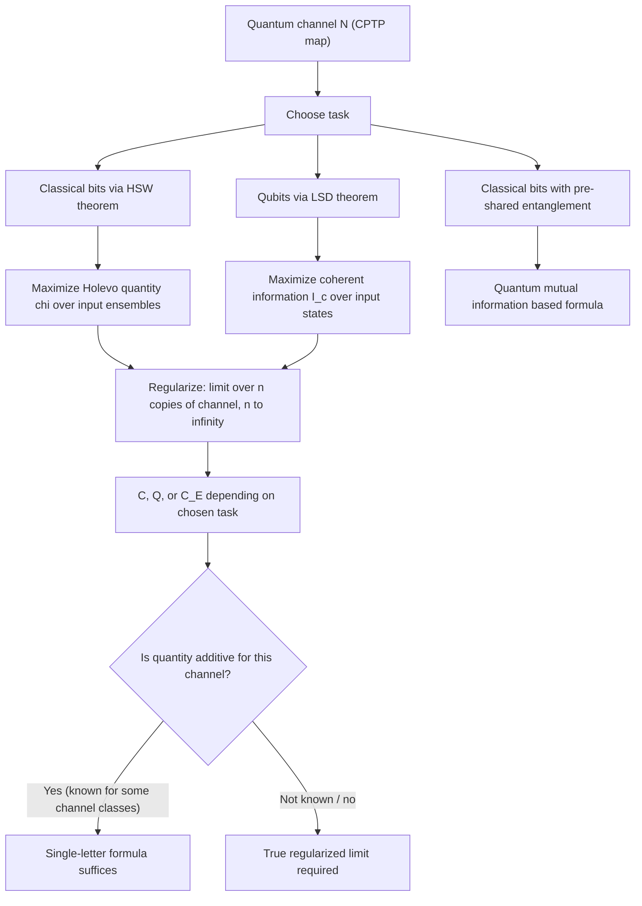

## Quantum Channel Capacity

### Overview

Quantum channel capacity generalizes Shannon's classical channel capacity theorem to channels that transmit quantum states rather than classical symbols. Because quantum channels can carry different *kinds* of information — classical bits, quantum bits, or entanglement — "capacity" is not a single number but a family of related quantities, each answering a different operational question about what a noisy quantum channel can reliably transmit and at what rate.

### The Quantum Channel Model

A quantum channel $\mathcal{N}$ is formally a completely positive, trace-preserving (CPTP) map acting on density matrices:

$$\mathcal{N}: \rho \rightarrow \mathcal{N}(\rho)$$

This is the quantum generalization of a classical noisy channel's transition probability matrix $P(Y|X)$. CPTP maps account for arbitrary physical noise processes — decoherence, loss, depolarization — while ensuring the output remains a valid density matrix (Hermitian, positive semi-definite, unit trace).

A standard mathematical representation is the **Kraus operator (operator-sum) representation**:

$$\mathcal{N}(\rho) = \sum_k E_k \rho E_k^\dagger, \qquad \sum_k E_k^\dagger E_k = I$$

Where $\{E_k\}$ are Kraus operators satisfying the completeness relation, ensuring trace preservation.

### Three Distinct Capacities

**Key Points**
- **Classical capacity** $C$: the maximum rate at which classical bits can be reliably transmitted by encoding them into quantum states and sending them through $\mathcal{N}$.
- **Quantum capacity** $Q$: the maximum rate at which qubits themselves (arbitrary quantum states, including superpositions) can be reliably transmitted through $\mathcal{N}$, preserving quantum coherence — a strictly harder task than classical transmission in general.
- **Entanglement-assisted classical capacity** $C_E$: the classical capacity achievable when Alice and Bob pre-share unlimited entanglement before transmission begins, which can exceed the unassisted classical capacity $C$.

These generally satisfy $Q \leq C \leq C_E$, reflecting that preserving full quantum information is at least as demanding as transmitting classical information, and that pre-shared entanglement can only help (never hurt) classical transmission rates.

### Classical Capacity: The HSW Theorem

The classical capacity of a quantum channel is given by the Holevo-Schumacher-Westmoreland (HSW) theorem:

$$C = \lim_{n \to \infty} \frac{1}{n} \chi(\mathcal{N}^{\otimes n})$$

Where $\chi(\mathcal{N}^{\otimes n})$ is the Holevo quantity maximized over input ensembles for $n$ uses of the channel:

$$\chi(\mathcal{N}) = \max_{\{p_x, \rho_x\}} \left[ S\left(\mathcal{N}\left(\sum_x p_x \rho_x\right)\right) - \sum_x p_x S(\mathcal{N}(\rho_x)) \right]$$

**Additivity subtlety:** Unlike Shannon's classical channel capacity, where a single-letter formula ($\max_{P(X)} I(X;Y)$ for one channel use) is always sufficient, the quantum HSW formula in general requires the limit over unboundedly many channel uses $n \to \infty$, because $\chi$ is not always additive — that is, $\chi(\mathcal{N}^{\otimes 2})$ can, for certain channels, exceed $2\chi(\mathcal{N})$. [Unverified] Whether specific channel classes admit exceptions to this — additive single-letter formulas — is channel-dependent and was historically an open question broadly (the general additivity conjecture for quantum channel capacities was shown false via specific counterexamples), so the safe general statement is that the regularized (limiting) formula is required in general, not the single-use formula, though many specific well-studied channels are known to be additive individually.

### Quantum Capacity: The Quantum Coding Theorem

The quantum capacity, established through work by Lloyd, Shor, and Devetak (the **LSD theorem**), is given in terms of **coherent information**:

$$Q = \lim_{n \to \infty} \frac{1}{n} \max_{\rho} I_c(\rho, \mathcal{N}^{\otimes n})$$

Where coherent information is defined as:

$$I_c(\rho, \mathcal{N}) = S(\mathcal{N}(\rho)) - S(\mathcal{N}_E(\rho))$$

Here $\mathcal{N}(\rho)$ is the channel output state and $\mathcal{N}_E(\rho)$ is the state delivered to the channel's "environment" (via the Stinespring dilation of $\mathcal{N}$ into a unitary interaction with an ancilla, then tracing out the receiver's system instead of the environment's). Coherent information can be negative for some channels and input states, unlike classical mutual information; the max in the formula effectively excludes negative contributions from limiting the achievable rate, since negative coherent information for a given input simply means that input is unhelpful for quantum transmission.

As with the classical case, coherent information is not generally additive across channel uses, so the regularization $n \to \infty$ is generally required for the exact quantum capacity formula, again with the caveat that specific channel classes are individually known to be additive.

### Diagram: Capacity Types and Their Relationships

<svg viewBox="0 0 720 300" xmlns="http://www.w3.org/2000/svg">
\<style\>
  .lbl { font-family: sans-serif; font-size: 13px; fill: #222; }
  .small { font-family: sans-serif; font-size: 11px; fill: #555; }
  .title { font-family: sans-serif; font-size: 14px; fill: #111; font-weight: bold; }
  .box { fill: #eef3fb; stroke: #1a5fb4; stroke-width: 1.5; }
  .arrow { stroke: #333; stroke-width: 1.6; marker-end: url(#arrowhead5); fill: none; }
\</style\>
<defs>
  <marker id="arrowhead5" markerWidth="8" markerHeight="8" refX="6" refY="3" orient="auto">
    <path d="M0,0 L6,3 L0,6 Z" fill="#333"/>
  </marker>
</defs>
<text x="20" y="24" class="title">Quantum Channel Capacities (svg_diagram)</text>

<rect x="40" y="60" width="180" height="60" rx="4" class="box"/>
<text x="55" y="85" class="lbl">Quantum capacity Q</text>
<text x="55" y="103" class="small">Preserve superposition</text>

<rect x="270" y="60" width="180" height="60" rx="4" class="box"/>
<text x="285" y="85" class="lbl">Classical capacity C</text>
<text x="285" y="103" class="small">Classical bits via qubits</text>

<rect x="500" y="60" width="180" height="60" rx="4" class="box"/>
<text x="510" y="85" class="lbl">Entanglement-assisted C_E</text>
<text x="510" y="103" class="small">With pre-shared entanglement</text>

<path d="M220 90 L270 90" class="arrow"/>
<text x="225" y="80" class="small">&lt;=</text>
<path d="M450 90 L500 90" class="arrow"/>
<text x="465" y="80" class="small">&lt;=</text>

<text x="80" y="180" class="small">Q <= C <= C_E for a given channel N</text>
<text x="80" y="205" class="small">Each defined by a distinct operational task and coding theorem</text>
</svg>

### Worked Example: Depolarizing Channel

The depolarizing channel is a standard test case, replacing a qubit with the maximally mixed state with probability $p$:

$$\mathcal{N}(\rho) = (1-p)\rho + p\frac{I}{2}$$

- At $p = 0$: no noise, $Q = C = 1$ qubit/bit per channel use.
- As $p$ increases, both $Q$ and $C$ decrease.
- At $p = 3/4$ (fully depolarizing, output is always $I/2$ regardless of input): $Q = 0$ — no quantum information whatsoever can be reliably transmitted, since the channel destroys all input-dependence.
- [Unverified] The exact threshold value of $p$ at which $Q$ reaches zero, and the precise closed-form expressions for $Q(p)$ and $C(p)$ across the full range of $p$, depend on the specific depolarizing channel convention used in a given source (conventions for parameterizing $p$ vary across textbooks), so specific numeric capacity values for intermediate $p$ should be checked against the exact convention in use rather than assumed universal.

### The "No-Cloning" Connection

**Key Points**
- Quantum capacity $Q$ can be zero even when classical capacity $C$ is strictly positive for the same channel — a channel can be entirely useless for quantum communication while still supporting some classical communication, since classical information (Holevo quantity) is a weaker/different requirement than preserving full quantum coherence.
- This asymmetry ($Q$ can vanish while $C$ does not) has no analog in classical information theory, where there is only one kind of "capacity" to speak of; it is a direct structural consequence of quantum mechanics distinguishing between transmitting classical distinguishability and transmitting genuine quantum superposition/coherence.
- The quantum capacity's connection to entanglement generation is direct: a channel with $Q > 0$ can, in the asymptotic limit, be used to generate entanglement between sender and receiver at rate $Q$, and conversely; this is part of why quantum capacity is sometimes framed as "entanglement generation capacity."

### Diagram: Determining Quantum Channel Capacity

### Applications and Significance

- **Quantum repeaters and networking**: Quantum capacity directly informs the design of quantum communication infrastructure, since it bounds the rate at which entanglement or quantum states can be distributed over noisy quantum links.
- **Quantum error correction**: The relationship between channel capacity and the existence of good quantum error-correcting codes is foundational — the quantum capacity essentially characterizes the ultimate limit that quantum error correction schemes attempt to approach.
- **Benchmarking physical quantum channels**: [Inference] Experimental quantum communication systems (fiber-optic and free-space quantum links) are often characterized in practice using capacity-related or capacity-adjacent metrics, though real experimental benchmarking typically also involves practical figures of merit (e.g., achievable key rates in QKD) that are related to but not identical to the strict asymptotic capacity formulas discussed here.

### Limitations and Scope Notes

- The regularized (limit-based) formulas for $C$ and $Q$ are generally not computable in closed form for arbitrary channels; explicit values are known primarily for specific, well-studied channel families (depolarizing, erasure, amplitude damping, etc.) under specific parameter regimes.
- This treatment addresses capacity definitions and their qualitative relationships; specific channel capacity formulas, additivity results for particular channel classes, and the historical resolution of general additivity questions are each substantially more detailed subtopics.
- Entanglement-assisted capacity $C_E$ has a known single-letter formula (unlike $C$ and $Q$ in general) via the quantum mutual information of the channel, a distinguishing feature not elaborated in full here.

**Related Topics**
- Holevo-Schumacher-Westmoreland (HSW) theorem
- LSD theorem and coherent information
- Quantum error correction and the quantum Singleton bound
- Additivity conjecture and its counterexamples
- Entanglement-assisted classical capacity formula
- Specific channel models: depolarizing, erasure, amplitude damping channels