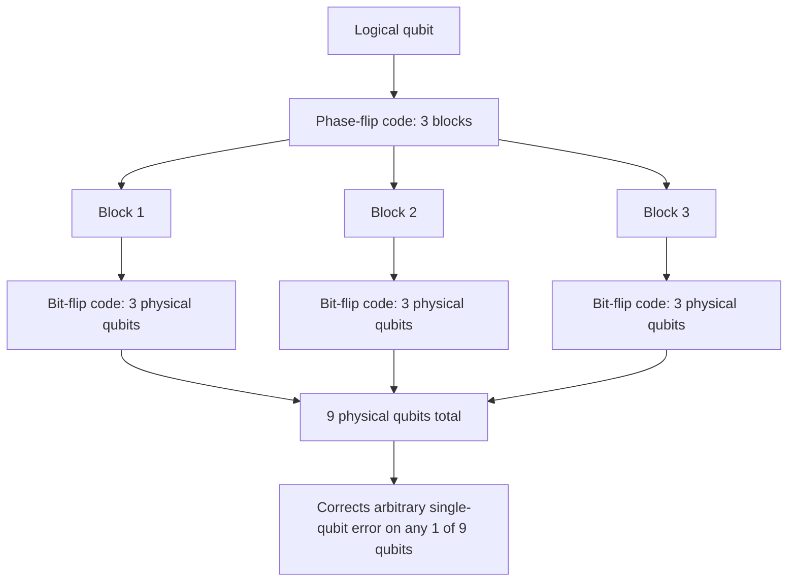

## Quantum Error Correction Basics

### Overview

Quantum error correction (QEC) addresses how to protect fragile quantum information from noise — decoherence, gate imperfections, and environmental coupling — despite two obstacles that have no classical counterpart: the no-cloning theorem (arbitrary quantum states cannot be copied to create redundant backups) and the fact that measurement generally destroys superposition. QEC resolves both by encoding logical qubits into entangled states of multiple physical qubits, detecting errors indirectly without ever directly measuring the protected quantum information itself.

### Why Classical Error Correction Doesn't Directly Transfer

Classical error correction relies on redundancy: encode a bit as multiple copies (e.g., 0 → 000) and use majority voting to correct bit flips. Two features of quantum mechanics block a naive analog:

- **No-cloning theorem**: An unknown quantum state $|\psi\rangle$ cannot be copied to produce $|\psi\rangle|\psi\rangle$ exactly, since cloning is not a valid linear (unitary) quantum operation for arbitrary unknown states — ruling out simple repetition of the *quantum* state itself.
- **Continuous error types**: Classical bits suffer only bit-flip errors ($0 \leftrightarrow 1$). Qubits can suffer bit-flip errors, phase-flip errors, or arbitrary combinations/continuous rotations away from the intended state — a seemingly much larger space of possible errors to correct against.
- **Measurement collapse**: Directly measuring a qubit to "check" its value would collapse any superposition, destroying the very quantum information QEC is meant to protect.

QEC resolves these through **encoding into entangled subspaces** and **syndrome measurement** — extracting information about *what error occurred* without extracting information about the *protected state itself*.

### The Bit-Flip Code (3-Qubit Repetition Code)

The simplest quantum error-correcting code protects against bit-flip errors ($X$ errors, where $X$ is the Pauli-X operator) by encoding one logical qubit into three physical qubits:

$$|0\rangle_L = |000\rangle, \qquad |1\rangle_L = |111\rangle$$

An arbitrary logical state $|\psi\rangle_L = \alpha|0\rangle_L + \beta|1\rangle_L = \alpha|000\rangle + \beta|111\rangle$ is encoded via two CNOT gates applied to two ancilla qubits initialized in $|0\rangle$, controlled by the original qubit.

**Syndrome measurement**: Rather than measuring the individual qubits (which would collapse superposition), Bob measures the **parity** between qubit pairs using ancilla-assisted parity checks:

$$Z_1 Z_2, \qquad Z_2 Z_3$$

These parity operators commute with the logical states $|000\rangle$ and $|111\rangle$ (both give $+1$ parity on both checks when no error has occurred) but reveal a distinctive "syndrome" pattern depending on which qubit (if any) suffered a bit flip — without revealing $\alpha$ or $\beta$ themselves.

| Error | $Z_1Z_2$ syndrome | $Z_2Z_3$ syndrome |
|---|---|---|
| None | $+1$ | $+1$ |
| Flip on qubit 1 | $-1$ | $+1$ |
| Flip on qubit 2 | $-1$ | $-1$ |
| Flip on qubit 3 | $+1$ | $-1$ |

Each syndrome pattern uniquely identifies which qubit (if any) was flipped, allowing a corrective $X$ gate to be applied to exactly that qubit — restoring the original logical state without ever having measured $\alpha$ or $\beta$.

### Diagram: 3-Qubit Bit-Flip Code Syndrome Extraction

<svg xmlns="http://www.w3.org/2000/svg" viewBox="0 0 720 320">
\<style\>
  .lbl { font-family: sans-serif; font-size: 13px; fill: #222; }
  .small { font-family: sans-serif; font-size: 11px; fill: #555; }
  .title { font-family: sans-serif; font-size: 14px; fill: #111; font-weight: bold; }
  .qwire { stroke: #333; stroke-width: 1.5; }
  .box { fill: #eef3fb; stroke: #1a5fb4; stroke-width: 1.5; }
  .abox { fill: #fff7e6; stroke: #c1980a; stroke-width: 1.5; }
\</style\>
<text x="20" y="24" class="title">Bit-Flip Code Syndrome Circuit (svg_diagram)</text>

<line x1="60" y1="60" x2="660" y2="60" class="qwire" />
<text x="20" y="65" class="lbl">q1</text>
<line x1="60" y1="120" x2="660" y2="120" class="qwire" />
<text x="20" y="125" class="lbl">q2</text>
<line x1="60" y1="180" x2="660" y2="180" class="qwire" />
<text x="20" y="185" class="lbl">q3</text>
<line x1="60" y1="250" x2="660" y2="250" class="qwire" />
<text x="10" y="255" class="lbl">a1</text>
<line x1="60" y1="290" x2="660" y2="290" class="qwire" />
<text x="10" y="295" class="lbl">a2</text>

<rect x="220" y="230" width="140" height="80" rx="4" class="abox" />
<text x="235" y="255" class="small">Measure Z1Z2</text>
<text x="235" y="270" class="small">parity onto a1</text>
<text x="235" y="285" class="small">(entangling CNOTs)</text>

<rect x="440" y="230" width="140" height="80" rx="4" class="abox" />
<text x="455" y="255" class="small">Measure Z2Z3</text>
<text x="455" y="270" class="small">parity onto a2</text>
<text x="455" y="285" class="small">(entangling CNOTs)</text>

<rect x="600" y="30" width="90" height="50" rx="4" class="box" />
<text x="610" y="60" class="lbl">Syndrome</text>
</svg>

### The Phase-Flip Code

A phase-flip error applies a Pauli-$Z$ operator, mapping $\alpha|0\rangle + \beta|1\rangle \rightarrow \alpha|0\rangle - \beta|1\rangle$ — a purely quantum error type with no classical bit-flip analog, since it leaves measurement probabilities in the computational basis unchanged but destroys phase coherence.

The phase-flip code corrects this by first rotating into the Hadamard basis ($|+\rangle, |-\rangle$), applying the same repetition-and-parity-check structure as the bit-flip code, then rotating back — since a phase flip in the computational basis is equivalent to a bit flip in the Hadamard basis.

### The Shor Code: Correcting Arbitrary Single-Qubit Errors

Since a general single-qubit error can be decomposed as a combination of bit-flip ($X$), phase-flip ($Z$), and combined ($Y = iXZ$) errors (any single-qubit error operator can be expressed as a linear combination of the identity and the three Pauli operators $X, Y, Z$), correcting *both* bit-flip and phase-flip errors simultaneously suffices to correct arbitrary single-qubit errors.

Peter Shor's 1995 code achieves this by **concatenating** the two codes: each of the three qubits of the phase-flip code is itself further encoded using the bit-flip code, yielding a 9-qubit code protecting one logical qubit against arbitrary single-qubit errors on any one of the nine physical qubits.

$$|0\rangle_L = \frac{1}{2\sqrt{2}}(|000\rangle + |111\rangle)(|000\rangle + |111\rangle)(|000\rangle + |111\rangle)$$
$$|1\rangle_L = \frac{1}{2\sqrt{2}}(|000\rangle - |111\rangle)(|000\rangle - |111\rangle)(|000\rangle - |111\rangle)$$

This was the first quantum error-correcting code discovered and established, as a proof of principle, that quantum information could be protected against decoherence at all — a result that was not obvious a priori given the no-cloning constraint.

### Diagram: Concatenation Structure of the Shor Code

### The Quantum Threshold Theorem

**Key Points**
- The **quantum threshold theorem** establishes that if the physical error rate per gate/qubit is below some threshold value, arbitrarily long and reliable quantum computation is possible using concatenated or topological error-correcting codes with sufficient overhead, analogous in spirit to Shannon's noisy channel coding theorem guaranteeing arbitrarily reliable communication below capacity.
- [Unverified] The precise numerical threshold value depends heavily on the specific code, error model, and architecture assumed (surface codes, concatenated codes, different noise models), and reported threshold estimates in the literature vary correspondingly — citing a single universal "the threshold is X%" figure without specifying the code and error model would be misleading, so no single number is given here.
- Practical large-scale quantum error correction research today centers substantially on **surface codes** and related topological codes, which offer relatively high error thresholds and local (nearest-neighbor) qubit connectivity requirements suited to physical hardware constraints — though this is an active engineering and research area rather than a settled, static body of results.

### The Quantum Singleton Bound

Analogous to the classical Singleton bound for classical error-correcting codes, quantum codes obey the **quantum Singleton bound**: for an $[[n,k,d]]$ quantum code (encoding $k$ logical qubits into $n$ physical qubits with minimum distance $d$):

$$k \leq n - 2(d-1)$$

Notably, the quantum bound has a factor of $2$ not present in the classical Singleton bound ($k \leq n - d + 1$), reflecting the increased "cost" of correcting quantum errors (which must correct both bit-flip and phase-flip type errors, roughly doubling the redundancy requirement relative to the classical case for comparable distance).

### Stabilizer Formalism (Brief Note)

[Inference] Most practically relevant quantum codes, including the bit-flip, phase-flip, and Shor codes described above, as well as widely studied codes like the surface code, are describable within the **stabilizer formalism** — a systematic algebraic framework describing quantum codes via a set of commuting Pauli operators (the "stabilizer group") whose $+1$ eigenspace defines the code space. This formalism is the standard tool used in the quantum error correction literature for constructing and analyzing codes systematically, though its full technical development is a substantially more involved topic than the illustrative examples given here.

### Applications and Significance

- **Fault-tolerant quantum computing**: QEC is the foundational requirement for scalable quantum computers, since physical qubits are highly susceptible to decoherence and gate errors; without QEC, computations longer than a small number of gates would be overwhelmed by accumulated error.
- **Quantum communication and repeaters**: QEC principles underlie proposed quantum repeater architectures for long-distance quantum communication, where entanglement must be preserved or purified across lossy, noisy channel segments.
- **Connection to quantum channel capacity**: The existence of a code correcting errors at some rate is directly tied to the quantum channel capacity $Q$ discussed previously — QEC is, in essence, the constructive mechanism by which rates approaching $Q$ can, in principle, be achieved.

### Limitations and Scope Notes

- This treatment covers foundational stabilizer-style codes (bit-flip, phase-flip, Shor code) as pedagogical illustrations of the core QEC principles; it does not cover surface codes, topological codes, or specific fault-tolerant gate implementations in technical depth, each of which is a substantially larger topic.
- Real physical implementations face additional practical constraints (gate fidelity, qubit connectivity, measurement fidelity, error correlations) not captured by the idealized independent-error models used in the illustrative examples above.
- The precise threshold values and code performance figures cited in current quantum computing research change as the field progresses experimentally; any specific numerical claims should be checked against current primary sources rather than treated as fixed reference values.

**Related Topics**
- Stabilizer formalism and the Gottesman-Knill theorem
- Surface codes and topological quantum error correction
- Quantum threshold theorem
- Quantum Singleton bound and code parameters
- Fault-tolerant gate implementations
- Connection between QEC and quantum channel capacity (LSD theorem)