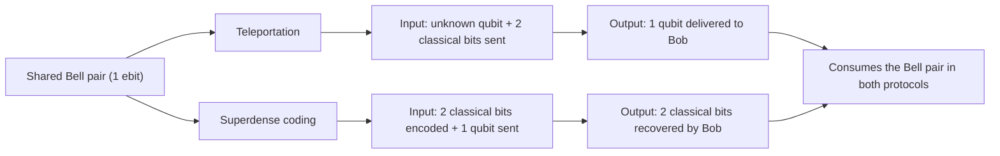

## Entanglement and Information

### Overview

Entanglement is the phenomenon by which two or more quantum systems share correlations that cannot be described by any local classical model — measuring one system instantaneously constrains the possible outcomes of measuring the other, regardless of spatial separation, in a way stronger than any classical shared-randomness scheme can reproduce. This topic draws together the entropic tools developed earlier (von Neumann entropy, quantum mutual information) with the operational question of what entanglement is actually good *for* as an information resource — teleportation, superdense coding, and quantum key distribution.

### Defining Entanglement Formally

A bipartite pure state $|\psi\rangle_{AB}$ is **separable** (unentangled) if it can be written as a tensor product:

$$|\psi\rangle_{AB} = |\phi\rangle_A \otimes |\chi\rangle_B$$

If no such factorization exists, the state is **entangled**. For mixed states $\rho_{AB}$, separability is defined more generally as expressibility as a convex combination of product states:

$$\rho_{AB} = \sum_i p_i\, \rho_A^{(i)} \otimes \rho_B^{(i)}$$

A state that cannot be written this way is entangled. This mixed-state definition is strictly more subtle than the pure-state case, and determining whether a general mixed state is separable or entangled ([Unverified] a problem sometimes referred to in the literature as the separability problem) is known to be computationally hard in general — specific criteria (e.g., the PPT/Peres-Horodecki criterion) provide sufficient or necessary conditions in restricted cases rather than a universally efficient general test.

### Entanglement Entropy as the Standard Pure-State Measure

As established earlier, for a bipartite pure state, the entanglement entropy is:

$$E(|\psi\rangle_{AB}) = S(\rho_A) = S(\rho_B)$$

This quantity is zero if and only if the state is a product state (unentangled), and reaches its maximum value $\log_2 d$ (for $d$-dimensional subsystems) for **maximally entangled states** — of which the Bell states are the canonical two-qubit example.

### The Four Bell States

The complete set of two-qubit maximally entangled states forming an orthonormal basis:

$$|\Phi^+\rangle = \frac{1}{\sqrt{2}}(|00\rangle + |11\rangle), \qquad |\Phi^-\rangle = \frac{1}{\sqrt{2}}(|00\rangle - |11\rangle)$$

$$|\Psi^+\rangle = \frac{1}{\sqrt{2}}(|01\rangle + |10\rangle), \qquad |\Psi^-\rangle = \frac{1}{\sqrt{2}}(|01\rangle - |10\rangle)$$

Each has entanglement entropy $E = 1$ bit (maximal for two qubits), and each can be transformed into any other by applying local Pauli operations to just one of the two qubits ($I, X, Z, XZ$ respectively, applied to the second qubit relative to $|\Phi^+\rangle$).

### Diagram: Bell States and Local Transformations

<svg xmlns="http://www.w3.org/2000/svg" viewBox="0 0 700 260">
\<style\>
  .lbl { font-family: sans-serif; font-size: 13px; fill: #222; }
  .small { font-family: sans-serif; font-size: 11px; fill: #555; }
  .title { font-family: sans-serif; font-size: 14px; fill: #111; font-weight: bold; }
  .box { fill: #eef3fb; stroke: #1a5fb4; stroke-width: 1.5; }
  .arrow { stroke: #333; stroke-width: 1.4; marker-end: url(#arrowhead6); fill: none; }
\</style\>
<text x="20" y="24" class="title">Bell States (svg_diagram)</text>

<rect x="40" y="60" width="140" height="60" rx="4" class="box" />
<text x="55" y="95" class="lbl">|Φ+⟩</text>

<rect x="240" y="60" width="140" height="60" rx="4" class="box" />
<text x="255" y="95" class="lbl">|Φ-⟩ (apply Z)</text>

<rect x="440" y="60" width="140" height="60" rx="4" class="box" />
<text x="455" y="95" class="lbl">|Ψ+⟩ (apply X)</text>

<rect x="240" y="160" width="140" height="60" rx="4" class="box" />
<text x="255" y="195" class="lbl">|Ψ-⟩ (apply XZ)</text>

<path d="M180 90 L240 90" class="arrow" />
<path d="M380 90 L440 90" class="arrow" />
<path d="M310 120 L310 160" class="arrow" />
</svg>

### Entanglement as a Resource: Operational Tasks

**Key Points**
- Entanglement is treated in quantum information theory as a consumable resource, quantified and manipulated similarly to how classical shared randomness or communication bandwidth are treated as resources in classical information theory — but with distinct operational rules, since entanglement cannot be created by local operations and classical communication (LOCC) alone.
- **LOCC monotonicity**: entanglement measures (entanglement entropy for pure states, and various generalizations for mixed states) cannot increase under LOCC — this is the defining structural property used to formally establish that a given quantity is a legitimate entanglement measure.
- Entanglement enables tasks impossible with classical correlation alone: quantum teleportation, superdense coding, and device-independent quantum key distribution security proofs all rely fundamentally on entanglement as the enabling resource.

### Quantum Teleportation

Teleportation transmits an unknown qubit state $|\psi\rangle$ from Alice to Bob using one shared entangled pair (e.g., $|\Phi^+\rangle$) plus two classical bits of communication — without physically transmitting the qubit itself, and without violating the no-cloning theorem (the original state at Alice's location is destroyed by her measurement in the process).

**Protocol outline:**
1. Alice and Bob pre-share a Bell pair, one qubit each.
2. Alice performs a joint Bell-basis measurement on her unknown qubit $|\psi\rangle$ and her half of the entangled pair.
3. This measurement yields one of four possible classical outcomes (2 classical bits), which Alice sends to Bob over a classical channel.
4. Bob applies one of four corresponding Pauli corrections ($I, X, Z, XZ$) to his half of the pair, recovering $|\psi\rangle$ exactly.

Teleportation consumes the entangled pair (it is left in a product state, no longer usable) and requires exactly 2 classical bits of communication — illustrating a general resource trade-off: 1 Bell pair + 2 classical bits transmits 1 qubit.

### Superdense Coding

The complementary protocol: Alice sends 2 classical bits to Bob using only 1 qubit of quantum communication, given a pre-shared Bell pair.

1. Alice applies one of four Pauli operations ($I, X, Z, XZ$, corresponding to the 2 classical bits she wants to send) to her half of the shared Bell pair.
2. She sends her (now-transformed) qubit to Bob.
3. Bob performs a joint Bell-basis measurement on both qubits, unambiguously recovering which of the four Pauli operations Alice applied — and therefore the 2 classical bits.

This resource trade-off is the reverse of teleportation: 1 Bell pair + 1 qubit of quantum communication transmits 2 classical bits — directly connecting back to the earlier discussion of the Holevo bound, since superdense coding appears to "beat" the 1-bit-per-qubit Holevo limit only because it consumes pre-shared entanglement as an additional resource, not because it violates the bound applied to unassisted qubit transmission.

### Diagram: Teleportation vs Superdense Coding Resource Trade

### Entanglement and Bell Inequality Violations

Entanglement's departure from classical correlation is experimentally testable via **Bell inequalities** (e.g., the CHSH inequality), which bound the correlations achievable by any local hidden-variable (classical) model:

$$|S| \leq 2 \quad \text{(classical/local hidden-variable bound)}$$

Quantum mechanics, using entangled states with appropriately chosen measurement settings, can violate this bound up to Tsirelson's bound:

$$|S| \leq 2\sqrt{2} \quad \text{(quantum mechanical bound)}$$

[Inference] Experimental violations of Bell inequalities, closing successive loopholes (detection efficiency, locality/timing) over decades of experiments, are generally regarded in the physics community as strong evidence against local hidden-variable explanations of quantum correlations, though the specific philosophical interpretation of what this implies about the nature of physical reality remains an area of ongoing foundational discussion rather than a fully settled question — this is a distinct matter from the operational, information-theoretic uses of entanglement discussed above, which do not depend on resolving that interpretive discussion.

### Entanglement in Quantum Key Distribution

The E91 protocol (Ekert, 1991) bases QKD security directly on entanglement and Bell inequality violation: Alice and Bob share entangled pairs, measure in randomly chosen bases, and use a subset of results to test a Bell inequality. A violation certifies — based on the assumption that no local hidden-variable model can explain the correlations — that the correlations could not have been established or known by an eavesdropper in advance, providing security grounded in the structure of quantum mechanics itself rather than solely on the no-cloning theorem (which underlies the security argument for prepare-and-measure protocols like BB84).

### Applications and Significance

- **Quantum computing**: Entanglement across many qubits is generally understood to be a necessary (though [Unverified] not universally agreed to be fully sufficient on its own, independent of other resources like coherence) ingredient for the computational advantages quantum algorithms can offer over classical computation.
- **Quantum cryptography**: Entanglement-based protocols (E91 and its device-independent extensions) offer security arguments with different underlying assumptions than prepare-and-measure protocols, of ongoing interest particularly for device-independent security models.
- **Quantum networks and repeaters**: Distributing and preserving entanglement over long distances, and purifying degraded entangled pairs, is a central engineering challenge in building quantum communication infrastructure.

### Limitations and Scope Notes

- This treatment addresses bipartite entanglement fundamentals; multipartite entanglement (GHZ states, W states, and their inequivalent entanglement classes) introduces substantially more structure not covered here.
- Mixed-state entanglement measures beyond entanglement entropy (entanglement of formation, distillable entanglement, negativity, concurrence) each capture different operational aspects and are not all mutually consistent in their orderings of mixed states — a more detailed treatment would be needed to compare them rigorously.
- The interpretive/foundational discussion around Bell inequality violations (what they imply about locality, realism, or hidden variables) is a distinct area from the operational information-theoretic content presented here and was intentionally treated only briefly.

**Related Topics**
- Multipartite entanglement (GHZ and W states)
- Mixed-state entanglement measures (concurrence, negativity, entanglement of formation)
- CHSH inequality and Tsirelson's bound
- E91 quantum key distribution protocol
- Entanglement distillation and purification
- LOCC and entanglement monotones