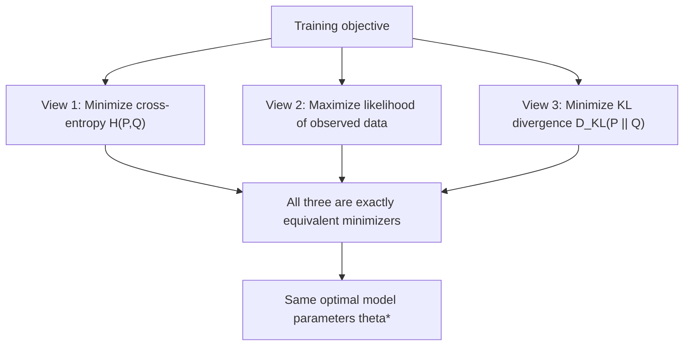

## Cross-Entropy Loss and Maximum Likelihood

### Overview

Cross-entropy loss, the standard training objective for classification models, is a direct application of Shannon's cross-entropy concept to statistical model fitting. It is not a separate invention from information theory but rather information-theoretic cross-entropy applied to comparing a model's predicted probability distribution against the true (empirical) distribution of labels — and it is mathematically equivalent, up to a sign and an additive constant, to maximum likelihood estimation.

### Shannon Cross-Entropy: Definition

For two probability distributions $P$ (the "true" distribution) and $Q$ (a model or approximating distribution) over the same discrete outcome space, cross-entropy is:

$$H(P, Q) = -\sum_x P(x) \log_2 Q(x)$$

This measures the expected number of bits needed to encode outcomes drawn from $P$, using a code that was optimally designed for $Q$ instead. Cross-entropy relates to standard Shannon entropy $H(P)$ and Kullback-Leibler (KL) divergence via:

$$H(P, Q) = H(P) + D_{KL}(P \,\|\, Q)$$

Where $D_{KL}(P \| Q) = \sum_x P(x) \log_2 \frac{P(x)}{Q(x)} \geq 0$ is the KL divergence, with equality (i.e., $D_{KL} = 0$, hence $H(P,Q) = H(P)$) if and only if $P = Q$. Since $H(P)$ is a fixed property of the true distribution (independent of the model), minimizing cross-entropy $H(P,Q)$ over choices of $Q$ is exactly equivalent to minimizing $D_{KL}(P \| Q)$ — pushing the model distribution $Q$ toward the true distribution $P$.

### From Distributions to Machine Learning

In supervised classification, the "true distribution" $P$ for a single training example is typically a one-hot distribution: probability $1$ on the correct class label $y$, and $0$ elsewhere. The model produces a predicted distribution $Q = \hat{y}$ over classes (e.g., via a softmax output layer). Substituting the one-hot $P$ into the cross-entropy formula collapses the sum to a single term:

$$H(P, Q) = -\sum_c \mathbb{1}[c = y] \log_2 \hat{y}_c = -\log_2 \hat{y}_y$$

This is the familiar per-example cross-entropy loss: the negative log-probability the model assigned to the true class, evaluated only at the correct label, since all other terms vanish due to the one-hot true distribution.

In practice, machine learning implementations typically use natural log (base $e$) rather than $\log_2$, since this simplifies gradient expressions when combined with the softmax function's exponential form; the choice of logarithm base only rescales the loss value by a constant factor $\ln 2$ and does not change the location of the minimum.

$$\mathcal{L}_{CE} = -\log \hat{y}_y = -\log \text{softmax}(z)_y$$

### Diagram: From Shannon Cross-Entropy to ML Loss

<svg xmlns="http://www.w3.org/2000/svg" viewBox="0 0 720 300">
\<style\>
  .lbl { font-family: sans-serif; font-size: 13px; fill: #222; }
  .small { font-family: sans-serif; font-size: 11px; fill: #555; }
  .title { font-family: sans-serif; font-size: 14px; fill: #111; font-weight: bold; }
  .box { fill: #eef3fb; stroke: #1a5fb4; stroke-width: 1.5; }
  .arrow { stroke: #333; stroke-width: 1.6; marker-end: url(#arrowhead7); fill: none; }
\</style\>
<text x="20" y="24" class="title">Cross-Entropy to ML Loss (svg_diagram)</text>

<rect x="40" y="50" width="220" height="60" rx="4" class="box" />
<text x="55" y="75" class="lbl">Shannon cross-entropy</text>
<text x="55" y="93" class="small">H(P,Q) = -sum P(x) log Q(x)</text>

<path d="M260 80 L320 80" class="arrow" />

<rect x="320" y="50" width="220" height="60" rx="4" class="box" />
<text x="335" y="75" class="lbl">P = one-hot true label</text>
<text x="335" y="93" class="small">Q = model softmax output</text>

<path d="M430 110 L430 160" class="arrow" />

<rect x="220" y="160" width="280" height="60" rx="4" class="box" />
<text x="240" y="185" class="lbl">Per-example loss collapses to</text>
<text x="240" y="203" class="small">L_CE = -log(y_hat_y)</text>
</svg>

### Equivalence to Maximum Likelihood Estimation

Maximum likelihood estimation (MLE) chooses model parameters $\theta$ to maximize the probability the model assigns to observed data:

$$\theta^* = \arg\max_\theta \prod_{i=1}^N P(y_i \mid x_i; \theta)$$

Taking the log (monotonic, so preserves the maximizer) and negating (to convert maximization to minimization, the convention used in loss functions):

$$\theta^* = \arg\min_\theta \left[-\sum_{i=1}^N \log P(y_i \mid x_i; \theta)\right]$$

This is exactly the sum of per-example cross-entropy losses across the training set. **Minimizing average cross-entropy loss over a training dataset is therefore identical to performing maximum likelihood estimation** of the model parameters, under the assumption that training examples are independent and identically distributed. This equivalence is exact, not approximate — both objectives have precisely the same set of minimizers.

### Worked Example: Binary Classification

For binary classification with true label $y \in \{0, 1\}$ and predicted probability $\hat{y} = P(y=1 \mid x)$, the binary cross-entropy loss is:

$$\mathcal{L}_{BCE} = -\left[y \log \hat{y} + (1-y)\log(1-\hat{y})\right]$$

This is precisely the negative log-likelihood of a Bernoulli distribution with parameter $\hat{y}$, evaluated at the observed outcome $y$ — a direct instance of the general MLE equivalence, specialized to the Bernoulli case.

**Numerical example:** Suppose the true label is $y=1$ and the model predicts $\hat{y} = 0.8$:

$$\mathcal{L}_{BCE} = -\log(0.8) \approx 0.223$$

If instead the model had predicted $\hat{y} = 0.2$ (confidently wrong):

$$\mathcal{L}_{BCE} = -\log(0.2) \approx 1.609$$

This illustrates cross-entropy's characteristic behavior: loss grows without bound as the model's predicted probability for the true class approaches zero, sharply penalizing confident wrong predictions far more than a proportionally-scaled loss (like squared error) would.

### Why Cross-Entropy Rather Than Squared Error for Classification

**Key Points**
- Cross-entropy loss, combined with a softmax or sigmoid output layer, produces gradients that scale naturally with prediction error — the gradient of cross-entropy loss with respect to the pre-activation logits reduces to the simple, well-behaved form $(\hat{y} - y)$, avoiding the vanishing-gradient issues that arise when squared error is combined with a saturating activation function like sigmoid.
- Cross-entropy is the loss that MLE theory says is "correct" under the modeling assumption that outputs represent class probabilities — squared error implicitly assumes a Gaussian noise model, which is a mismatched assumption for discrete class labels.
- [Inference] This gradient-behavior advantage is the standard textbook explanation for cross-entropy's near-universal adoption over squared error in classification tasks, though the practical performance gap in any specific application also depends on other architectural and optimization choices (learning rate schedules, initialization, regularization) not captured by this comparison alone.

### KL Divergence View: What Training Actually Minimizes

Since $H(P,Q) = H(P) + D_{KL}(P\|Q)$ and $H(P)$ is fixed (a property of the true data-generating distribution, not the model), training a classifier by minimizing cross-entropy loss is exactly equivalent to minimizing the KL divergence between the true label distribution and the model's predicted distribution:

$$\min_\theta H(P, Q_\theta) \iff \min_\theta D_{KL}(P \| Q_\theta)$$

This framing clarifies *what* the model is being asked to do at an information-theoretic level: match its output distribution to the empirical training distribution as closely as possible, as measured by KL divergence — reinforcing that cross-entropy loss is not an arbitrary engineering choice but a direct, principled consequence of both an information-theoretic distributional-matching criterion and the maximum likelihood statistical framework, which happen to coincide exactly for this choice of loss.

### Diagram: Three Equivalent Views of the Same Objective

### Multi-Class Generalization

For $K$-class classification with one-hot true label $y$ and softmax output $\hat{y}$:

$$\mathcal{L}_{CE} = -\sum_{c=1}^{K} y_c \log \hat{y}_c = -\log \hat{y}_{\text{true class}}$$

Combined with the softmax function $\hat{y}_c = \frac{e^{z_c}}{\sum_{c'} e^{z_{c'}}}$, the gradient with respect to logits $z$ takes the compact form $\nabla_z \mathcal{L}_{CE} = \hat{y} - y$ (vector form, true label as one-hot vector) — a computationally convenient and numerically well-behaved expression that is a major practical reason for the softmax-plus-cross-entropy combination's ubiquity in classification architectures.

### Label Smoothing: A Practical Modification

[Inference] A common practical variant replaces the hard one-hot true distribution $P$ with a "softened" version (e.g., assigning small non-zero probability $\epsilon/K$ to incorrect classes and $1 - \epsilon + \epsilon/K$ to the true class), which can be understood information-theoretically as deliberately introducing a small, fixed KL divergence floor between $P$ and any achievable $Q$ — a technique commonly reported to improve model calibration and generalization in practice, though the underlying mechanisms and consistency of the empirical benefit across different tasks and architectures remain an active area of applied research rather than a fully settled theoretical result.

### Limitations and Scope Notes

- This treatment covers the entropy/MLE equivalence for the standard supervised classification setting; extensions (e.g., focal loss, contrastive losses) modify or generalize this objective for specific practical problems (class imbalance, representation learning) and are not covered here.
- The MLE equivalence relies on the i.i.d. assumption across training examples; for sequential or structured prediction tasks, the loss decomposition and its information-theoretic interpretation require additional care (e.g., conditional cross-entropy across a sequence).
- [Unverified] The relative empirical performance of cross-entropy versus alternative loss functions in specific deep learning applications is an actively studied and evolving area; general claims about which loss "performs best" depend heavily on task, architecture, and dataset specifics not addressed by the general theoretical equivalences discussed here.

**Related Topics**
- Kullback-Leibler divergence and its properties
- Maximum likelihood estimation theory
- Softmax function and its gradient properties
- Label smoothing and model calibration
- Focal loss and other classification loss variants
- Perplexity as an evaluation metric (exponentiated cross-entropy)