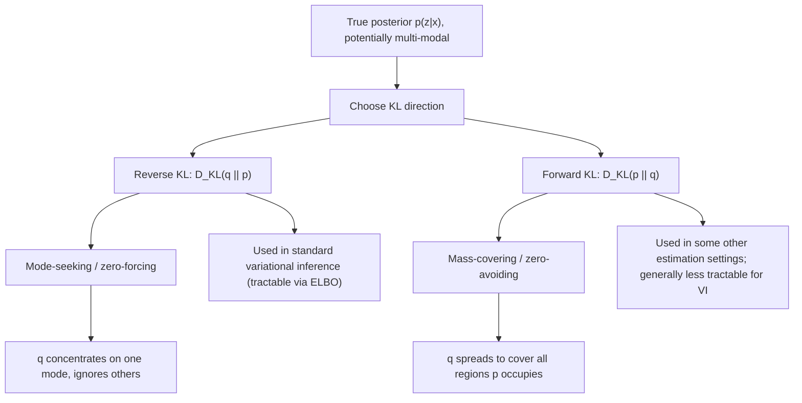

## KL Divergence in Variational Inference

### Overview

Variational inference (VI) is an approximate Bayesian inference technique that recasts an intractable posterior-computation problem as a tractable optimization problem, using KL divergence as the objective that measures how well a chosen approximating distribution matches the true (but computationally inaccessible) posterior. This is a second major application of information-theoretic divergence to machine learning, distinct from the cross-entropy-as-loss framing covered previously, and it introduces a directional subtlety in how KL divergence is applied that has direct practical consequences for the behavior of trained models.

### The Bayesian Inference Problem

Given observed data $x$ and latent variables $z$, Bayesian inference seeks the posterior distribution:

$$p(z \mid x) = \frac{p(x \mid z)\,p(z)}{p(x)}$$

The denominator, the **marginal likelihood** or **evidence**, requires integrating over all possible latent variable values:

$$p(x) = \int p(x \mid z)\,p(z)\,dz$$

For most models of practical interest (especially those with high-dimensional or continuous latent spaces, or non-conjugate prior/likelihood pairs), this integral is analytically intractable and often too expensive to approximate accurately via direct numerical integration. Variational inference sidesteps this by reformulating the problem as optimization rather than integration.

### The Variational Objective

VI introduces a tractable family of approximating distributions $q_\phi(z)$, parameterized by variational parameters $\phi$, and seeks the member of this family closest to the true posterior, as measured by KL divergence:

$$\phi^* = \arg\min_\phi D_{KL}\big(q_\phi(z) \,\|\, p(z \mid x)\big)$$

Critically, this KL divergence still involves the intractable posterior $p(z|x)$ directly, so it cannot be computed or minimized as written. The key algebraic manipulation that makes VI tractable is expanding this divergence and separating out the intractable evidence term.

### Deriving the ELBO (Evidence Lower Bound)

Starting from the KL divergence definition:

$$D_{KL}(q_\phi(z) \| p(z|x)) = \mathbb{E}_{q_\phi}\left[\log \frac{q_\phi(z)}{p(z|x)}\right] = \mathbb{E}_{q_\phi}\left[\log \frac{q_\phi(z)\,p(x)}{p(x,z)}\right]$$

Expanding and rearranging (using $p(z|x) = p(x,z)/p(x)$):

$$D_{KL}(q_\phi(z) \| p(z|x)) = \log p(x) - \mathbb{E}_{q_\phi}\left[\log \frac{p(x,z)}{q_\phi(z)}\right]$$

Since $\log p(x)$ (the log-evidence) does not depend on $\phi$, and $D_{KL} \geq 0$ always, this rearrangement yields:

$$\log p(x) \geq \mathbb{E}_{q_\phi}\left[\log \frac{p(x,z)}{q_\phi(z)}\right] \equiv \text{ELBO}(\phi)$$

The right-hand side, called the **Evidence Lower Bound (ELBO)**, is computable (it involves only the joint distribution $p(x,z)$ and the chosen $q_\phi$, both tractable by construction) and satisfies:

$$\log p(x) = \text{ELBO}(\phi) + D_{KL}(q_\phi(z) \| p(z|x))$$

Since $\log p(x)$ is fixed (independent of $\phi$), **maximizing the ELBO with respect to $\phi$ is exactly equivalent to minimizing $D_{KL}(q_\phi \| p(z|x))$** — this is the central trick of variational inference: the intractable divergence minimization is converted into a tractable ELBO maximization with the identical set of optimal solutions.

### Diagram: ELBO Derivation Structure

<svg xmlns="http://www.w3.org/2000/svg" viewBox="0 0 720 300">
\<style\>
  .lbl { font-family: sans-serif; font-size: 13px; fill: #222; }
  .small { font-family: sans-serif; font-size: 11px; fill: #555; }
  .title { font-family: sans-serif; font-size: 14px; fill: #111; font-weight: bold; }
  .box { fill: #eef3fb; stroke: #1a5fb4; stroke-width: 1.5; }
\</style\>
<text x="20" y="24" class="title">Evidence Decomposition (svg_diagram)</text>

<rect x="60" y="60" width="600" height="60" rx="4" class="box" />
<text x="80" y="95" class="lbl">log p(x)  =  ELBO(φ)  +  D_KL(q_φ(z) || p(z|x))</text>

<rect x="60" y="160" width="280" height="70" rx="4" class="box" />
<text x="75" y="185" class="lbl">Fixed (independent of φ)</text>
<text x="75" y="205" class="small">Cannot be computed directly,</text>
<text x="75" y="220" class="small">but does not need to be</text>

<rect x="380" y="160" width="280" height="70" rx="4" class="box" />
<text x="395" y="185" class="lbl">Maximize ELBO</text>
<text x="395" y="205" class="small">Tractable: only needs joint</text>
<text x="395" y="220" class="small">p(x,z) and chosen q_φ(z)</text>
</svg>

### The ELBO in Decomposed Form

The ELBO is often written in an alternative, more interpretable decomposition:

$$\text{ELBO}(\phi) = \mathbb{E}_{q_\phi}[\log p(x|z)] - D_{KL}(q_\phi(z) \| p(z))$$

This splits into two interpretable terms:
- **Reconstruction term**: $\mathbb{E}_{q_\phi}[\log p(x|z)]$ — the expected log-likelihood of the data given latents sampled from $q_\phi$, rewarding $q_\phi$ for placing probability mass on latent values that explain the observed data well.
- **KL regularization term**: $D_{KL}(q_\phi(z) \| p(z))$ — a penalty pulling the approximate posterior $q_\phi(z)$ toward the prior $p(z)$, preventing $q_\phi$ from collapsing entirely onto whatever latent values best explain the data without regard to prior plausibility.

This decomposition is the direct basis for the training objective of **variational autoencoders (VAEs)**, where $q_\phi(z|x)$ is an encoder network, $p(x|z)$ is a decoder network, and the reconstruction/KL trade-off is optimized jointly via gradient-based methods (using the reparameterization trick to allow gradients to flow through the sampling step).

### Worked Example: Gaussian Variational Family

A common tractable choice is a diagonal Gaussian family: $q_\phi(z) = \mathcal{N}(z; \mu, \text{diag}(\sigma^2))$, with variational parameters $\phi = (\mu, \sigma)$. If the prior is a standard Gaussian $p(z) = \mathcal{N}(0, I)$, the KL regularization term has a closed-form expression for a $D$-dimensional latent space:

$$D_{KL}(q_\phi(z) \| p(z)) = \frac{1}{2}\sum_{d=1}^{D}\left(\mu_d^2 + \sigma_d^2 - \log \sigma_d^2 - 1\right)$$

This closed-form availability is precisely why Gaussian variational families with Gaussian priors are so common in practice (as in standard VAEs) — the KL term can be computed exactly and differentiated directly, avoiding the need for Monte Carlo estimation of that portion of the objective, while the reconstruction term is still generally estimated via sampling.

### The Direction of KL Divergence Matters

**Key Points**
- VI minimizes $D_{KL}(q \| p)$ — the approximating distribution appears as the *first* argument. This is called the **reverse KL** or **"I-projection"** (information projection).
- This differs from $D_{KL}(p \| q)$ (**forward KL**, or **"M-projection"**, moment projection), used e.g. in some other estimation contexts (such as certain forms of maximum likelihood fitting where $p$ is the fixed true/empirical distribution).
- KL divergence is asymmetric in general: $D_{KL}(q\|p) \neq D_{KL}(p\|q)$, and this asymmetry has substantive practical consequences for VI, not merely a notational curiosity.

### Mode-Seeking vs. Mass-Covering Behavior

Reverse KL, $D_{KL}(q\|p)$, is **zero-forcing / mode-seeking**: because the expectation is taken under $q$, the divergence is heavily penalized wherever $q$ places probability mass but $p$ does not (since $\log(q/p) \to \infty$ there). Consequently, $q$ is driven to avoid regions of low $p$-probability, even if this means $q$ concentrates on only one mode of a multi-modal true posterior $p$, essentially ignoring other modes entirely rather than spreading mass thinly across all of them.

Forward KL, $D_{KL}(p\|q)$, is **mass-covering / zero-avoiding**: the expectation under $p$ heavily penalizes $q$ for assigning near-zero probability anywhere $p$ has mass, driving $q$ to spread out and cover all regions where $p$ has support — potentially placing mass in low-probability "in-between" regions of a multi-modal $p$ that neither original mode actually occupies.

[Inference] This mode-seeking behavior of reverse-KL-based VI is a widely cited practical limitation: standard VI with unimodal variational families (e.g., a single Gaussian) applied to a genuinely multi-modal true posterior will typically converge to represent only one mode well, systematically underestimating posterior uncertainty/multi-modality — this is a commonly discussed caveat in the VI literature, though the practical severity depends on the specific model, posterior shape, and variational family chosen, and richer variational families (mixtures, normalizing flows) are commonly proposed specifically to mitigate this limitation.

### Diagram: Mode-Seeking vs Mass-Covering

### Amortized Inference and the Reparameterization Trick

For models like VAEs, computing $q_\phi$ separately for every data point $x$ would be expensive; **amortized inference** instead uses a single neural network (the encoder) that maps any input $x$ directly to variational parameters $\phi(x)$, sharing the inference computation across the dataset. Gradient-based optimization of the ELBO with respect to network parameters requires differentiating through the sampling step $z \sim q_\phi(z)$; the **reparameterization trick** rewrites this sampling as a deterministic, differentiable function of $\phi$ and an independent noise source (e.g., $z = \mu + \sigma \odot \epsilon$, $\epsilon \sim \mathcal{N}(0,I)$ for the Gaussian case), enabling standard backpropagation through the otherwise-stochastic latent sampling operation.

### Applications and Significance

- **Variational autoencoders (VAEs)**: The direct and most widely known application, using the ELBO decomposition (reconstruction + KL regularization) as the training objective for a generative latent-variable model.
- **Bayesian neural networks**: VI is used to approximate posterior distributions over network weights, providing a tractable route to uncertainty quantification in deep learning models.
- **Probabilistic programming**: General-purpose VI (e.g., automatic differentiation variational inference, ADVI) is used as a default inference engine in probabilistic programming frameworks where exact posterior computation is intractable for arbitrary user-specified models.

### Limitations and Scope Notes

- This treatment covers the standard mean-field or simple-family VI setting; structured VI, normalizing-flow-based variational families, and more expressive posterior approximations introduce additional technical machinery not covered here.
- The ELBO provides a *lower* bound on log-evidence; the tightness of this bound (equivalently, the residual $D_{KL}(q\|p)$) depends entirely on how expressive the chosen variational family is relative to the true posterior's actual shape — a poorly chosen family can yield a loose bound and a poor approximation even at the optimal $\phi^*$ within that family.
- [Unverified] Comparative claims about VI versus alternative approximate inference methods (MCMC, Laplace approximation) in terms of accuracy or computational cost are highly dependent on the specific model and problem scale, and general blanket comparisons are not made here.

**Related Topics**
- Variational autoencoders (VAEs) and the reparameterization trick
- Forward vs. reverse KL divergence and moment/information projections
- Mean-field variational inference and coordinate ascent VI
- Normalizing flows for richer variational families
- Bayesian neural networks and weight uncertainty
- Automatic differentiation variational inference (ADVI)