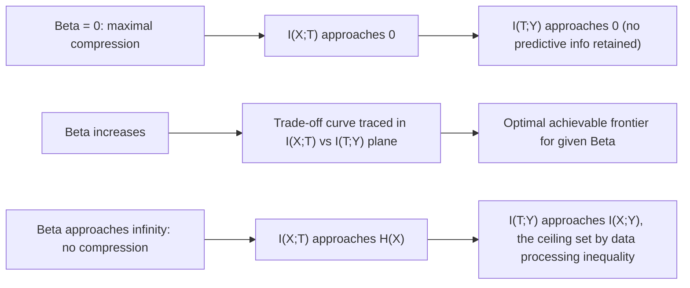

## Information Bottleneck Method

### Overview

The information bottleneck (IB) method, introduced by Tishby, Pereira, and Bialek in 1999, formalizes a specific version of a general problem: given an input variable $X$ and a relevance variable $Y$ that $X$ predicts or relates to, find a compressed representation $T$ of $X$ that retains as much information as possible about $Y$ while discarding as much irrelevant information about $X$ as possible. It provides an information-theoretic formalization of the intuitive idea of "relevant compression" — a principled trade-off between compactness and predictive usefulness, expressed entirely in terms of mutual information.

### The Core Trade-off

Given the joint distribution $p(x,y)$, the IB method seeks a stochastic mapping $p(t|x)$ from input $X$ to a compressed representation $T$, optimizing the trade-off:

$$\min_{p(t|x)} \; I(X;T) - \beta\, I(T;Y)$$

Where:
- $I(X;T)$ is the mutual information between the original input and its compressed representation — minimizing this drives compression, discarding information about $X$ that is not needed.
- $I(T;Y)$ is the mutual information between the representation and the relevance variable — maximizing this preserves predictive power about $Y$.
- $\beta > 0$ is a Lagrange multiplier controlling the trade-off: larger $\beta$ favors retaining more information about $Y$ (less compression), smaller $\beta$ favors more aggressive compression at the cost of losing predictive information.

This is a direct generalization of rate-distortion theory: standard rate-distortion minimizes $I(X;T)$ subject to a distortion constraint measured by a fixed, externally specified distortion function; the IB method instead defines "distortion" implicitly and self-referentially, in terms of how much predictive information about a *separate* relevance variable $Y$ is preserved, rather than via a hand-specified distortion metric on $X$ itself.

### The Markov Chain Constraint

A structural assumption underlies the IB formulation: $T$ is a compressed representation derived only from $X$, with no direct access to $Y$, forming the Markov chain:

$$Y \rightarrow X \rightarrow T$$

This constrains $T$'s only avenue of retaining information about $Y$ to be whatever it can extract through $X$ — formally, this Markov structure implies the data processing inequality $I(T;Y) \leq I(X;Y)$, so the representation $T$ can never contain more information about $Y$ than $X$ itself already does. The IB objective seeks the best possible $T$ subject to this fundamental ceiling, while simultaneously compressing away from $X$.

### Diagram: Information Bottleneck Structure

<svg xmlns="http://www.w3.org/2000/svg" viewBox="0 0 720 260">
\<style\>
  .lbl { font-family: sans-serif; font-size: 13px; fill: #222; }
  .small { font-family: sans-serif; font-size: 11px; fill: #555; }
  .title { font-family: sans-serif; font-size: 14px; fill: #111; font-weight: bold; }
  .box { fill: #eef3fb; stroke: #1a5fb4; stroke-width: 1.5; }
  .arrow { stroke: #333; stroke-width: 1.8; marker-end: url(#arrowhead8); fill: none; }
\</style\>
<text x="20" y="24" class="title">Information Bottleneck (svg_diagram)</text>

<rect x="40" y="100" width="120" height="60" rx="4" class="box" />
<text x="60" y="135" class="lbl">Y (relevance)</text>

<rect x="300" y="100" width="120" height="60" rx="4" class="box" />
<text x="330" y="135" class="lbl">X (input)</text>

<rect x="560" y="100" width="120" height="60" rx="4" class="box" />
<text x="580" y="135" class="lbl">T (bottleneck)</text>

<path d="M160 130 L300 130" class="arrow" />
<text x="185" y="120" class="small">I(X;Y) fixed</text>
<path d="M420 130 L560 130" class="arrow" />
<text x="440" y="120" class="small">minimize I(X;T)</text>
<text x="440" y="105" class="small">maximize I(T;Y)</text>

<text x="220" y="200" class="small">Markov chain: Y -&gt; X -&gt; T (T has no direct access to Y)</text>
</svg>

### The IB Lagrangian and Self-Consistent Equations

The full optimization is typically written as minimizing the Lagrangian:

$$\mathcal{L}[p(t|x)] = I(X;T) - \beta\, I(T;Y)$$

Tishby et al. derived a set of self-consistent equations characterizing the optimal solution, solved via an iterative algorithm structurally analogous to the Blahut-Arimoto algorithm used for computing classical rate-distortion functions and channel capacities:

$$p(t|x) = \frac{p(t)}{Z(x,\beta)} \exp\left(-\beta\, D_{KL}\big(p(y|x) \,\|\, p(y|t)\big)\right)$$

Where $Z(x,\beta)$ is a normalization constant and $D_{KL}(p(y|x) \| p(y|t))$ measures how well the representation $t$ preserves the conditional distribution of $Y$ that was originally associated with $x$. [Unverified] This self-consistent formulation is the standard one presented in Tishby et al.'s original formulation and subsequent treatments, and its iterative solution (alternating updates to $p(t|x)$, $p(t)$, and $p(y|t)$) parallels Blahut-Arimoto structurally, though convergence guarantees and practical solution behavior depend on specifics of the discrete or continuous variable setting being used, which vary across treatments in the literature.

### The Information Plane

A central visualization tool in IB analysis is the **information plane**: a 2D plot with $I(X;T)$ on one axis and $I(T;Y)$ on the other, tracing out the optimal trade-off curve as $\beta$ is varied from $0$ (maximal compression, $I(X;T) \to 0$) to $\infty$ (no compression, $T$ retains all information about $X$, so $I(T;Y) \to I(X;Y)$, its maximum possible value under the Markov constraint).

### Diagram: The Information Plane Trade-off Curve

### Connection to Deep Learning: The Information Bottleneck Theory of Deep Learning

Tishby and Zaslavsky (2015) and Shwartz-Ziv and Tishby (2017) proposed applying the IB framework to analyze deep neural networks, treating each hidden layer $T_i$ as a successive compressed representation of the input $X$ with respect to the output label $Y$, forming an extended Markov chain:

$$Y \rightarrow X \rightarrow T_1 \rightarrow T_2 \rightarrow \cdots \rightarrow T_L$$

The proposed interpretation suggested that training proceeds through two phases: an initial **fitting phase**, where both $I(X;T_i)$ and $I(T_i;Y)$ increase as the network learns to extract predictive information; followed by a **compression phase**, where $I(X;T_i)$ decreases (the network discards irrelevant input information) while $I(T_i;Y)$ is largely preserved, interpreted as the source of good generalization behavior.

[Unverified] This specific two-phase fitting-then-compression account of deep learning training dynamics was influential but has been the subject of substantial subsequent debate and empirical challenge in the machine learning research community — some follow-up studies reported difficulty reproducing the claimed compression phase under certain activation functions or estimation methodologies, and disputed whether reported "compression" was a genuine information-theoretic effect versus a measurement artifact of the specific (and notoriously difficult) mutual information estimators used for continuous, high-dimensional neural activations. This remains an actively debated area rather than settled consensus, and any specific claim about IB's explanatory power for deep learning generalization should be treated as contested pending clearer resolution in the literature, not stated as an established result.

### Practical Difficulty: Estimating Mutual Information in High Dimensions

**Key Points**
- Computing $I(X;T)$ and $I(T;Y)$ exactly requires either known/estimable probability distributions or reliable mutual information estimators; for continuous, high-dimensional variables (as in neural network hidden layers), accurate mutual information estimation is a well-known hard statistical problem.
- Common estimation approaches include binning/discretization (sensitive to bin size choice), kernel density methods, and more recent neural mutual information estimators (e.g., MINE), each with different bias/variance trade-offs and known failure modes in specific regimes.
- [Inference] This estimation difficulty is frequently cited as a central practical limitation constraining how confidently the IB framework's predictions can be empirically verified in deep learning settings specifically, distinct from the mathematical validity of the IB framework itself in settings (e.g., certain Gaussian or discrete cases) where mutual information is more tractable to compute.

### The Deterministic Information Bottleneck and Variational Extensions

Variants of the original IB formulation have been proposed to address specific limitations:

- **Deterministic Information Bottleneck (DIB)**: replaces $I(X;T)$ with $H(T)$ (the entropy of the representation) in the objective, addressing certain technical properties of the original formulation for deterministic encoding maps.
- **Variational Information Bottleneck (VIB)**: Alemi et al. (2017) introduced a variational approximation to the IB objective using neural network encoders and tractable variational bounds on the mutual information terms, making the IB principle directly usable as a training objective for deep neural networks via standard gradient-based optimization — connecting the IB framework back to the variational inference machinery covered previously, since VIB's derivation uses the same ELBO-style bounding technique applied to mutual information terms instead of the marginal likelihood.

### Applications and Significance

- **Representation learning**: IB provides a principled information-theoretic objective for learning compressed representations that retain task-relevant information, used directly as a training criterion in VIB and related methods.
- **Theoretical analysis of neural networks**: Despite the empirical controversy noted above regarding the specific fitting/compression phase account, the IB framework remains a widely referenced conceptual lens for discussing what neural network layers are "supposed to" accomplish informationally.
- **Clustering and dimensionality reduction**: The original Tishby et al. formulation was itself motivated partly by document clustering and related unsupervised compression problems, predating its later application to deep learning specifically.

### Limitations and Scope Notes

- The IB method's optimal solution is generally intractable to compute exactly outside specific tractable cases (discrete variables with small alphabets, or Gaussian IB, which has a known closed-form solution); practical use in high-dimensional settings generally requires the variational or estimator-based approximations discussed above.
- The applicability and interpretive strength of IB-based explanations for deep learning generalization behavior remains genuinely disputed in the literature, as emphasized above — this section should be read as presenting a historically influential but contested framework, not a settled explanatory theory.
- This treatment addresses the core IB formulation and its best-known extensions; alternative compression-relevance trade-off frameworks and more recent theoretical developments in this area are not exhaustively covered.

**Related Topics**
- Rate-distortion theory and the Blahut-Arimoto algorithm
- Variational Information Bottleneck (VIB) and its ELBO-style derivation
- Mutual information estimation methods (MINE, kernel-based, binning)
- Data processing inequality
- Gaussian information bottleneck (closed-form case)
- Representation learning objectives in deep learning