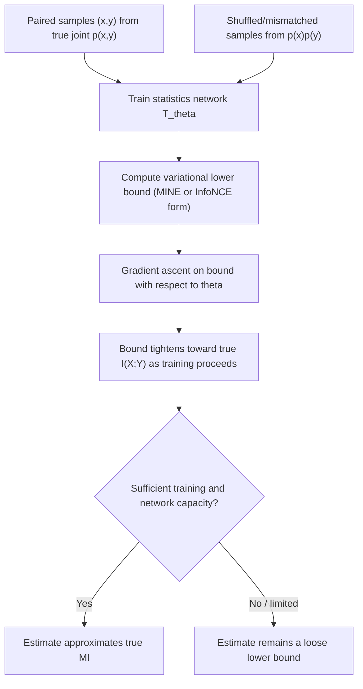

## Mutual Information Estimation Techniques

### Overview

Mutual information $I(X;Y)$ has a clean closed-form definition, but computing it in practice requires knowing the underlying probability distributions $p(x)$, $p(y)$, and $p(x,y)$ exactly — which is rarely available outside of controlled or synthetic settings. Estimating mutual information from finite samples, particularly for continuous or high-dimensional variables, is a genuinely hard statistical problem with well-documented failure modes. This topic surveys the main estimation approaches referenced throughout the preceding material (information bottleneck analysis of deep networks, quantum-classical boundary discussions, general applied information theory) and their respective trade-offs.

### Why Mutual Information Estimation Is Hard

$$I(X;Y) = \sum_{x,y} p(x,y) \log_2 \frac{p(x,y)}{p(x)p(y)}$$

For discrete variables with small alphabets, this can be computed directly from empirical frequency counts. The difficulty arises in two common regimes:

- **Continuous variables**: the sum becomes an integral over a joint density that must itself be estimated from samples, and density estimation in more than a few dimensions suffers acutely from the curse of dimensionality.
- **High-dimensional discrete/continuous variables** (e.g., neural network activation vectors): the effective "alphabet size" or density support grows so large that naive empirical estimation requires an infeasible number of samples to converge.

**Key Points**
- Mutual information estimation error does not shrink gracefully with dimensionality the way many other statistical estimation problems do — required sample sizes for a fixed estimation accuracy can grow rapidly (in some analyses, exponentially) with the dimensionality of the variables involved, which is the central obstacle motivating most estimator designs discussed below.
- No single estimator dominates across all regimes; the appropriate choice depends heavily on whether variables are discrete or continuous, low- or high-dimensional, and how much of the joint distribution's structure can be reasonably assumed in advance.

### Histogram / Binning Estimators

The most direct approach discretizes continuous variables into bins and applies the standard discrete mutual information formula to the resulting empirical joint histogram:

$$\hat{I}(X;Y) = \sum_{i,j} \hat{p}(x_i, y_j) \log_2 \frac{\hat{p}(x_i,y_j)}{\hat{p}(x_i)\hat{p}(y_j)}$$

Where $\hat{p}$ denotes empirical frequencies from binned samples.

**Key Points**
- Extremely sensitive to bin width/count choice: too few bins loses resolution and underestimates $I(X;Y)$; too many bins relative to sample size causes overfitting to sampling noise, which systematically inflates the estimate (finite-sample bias in binned MI estimation is well documented to be predominantly positive/upward).
- Scales poorly to more than a few dimensions, since the number of bins needed grows exponentially with dimensionality (the same curse-of-dimensionality issue affecting general multivariate density estimation).
- Despite these limitations, binning remains common for quick, low-dimensional exploratory estimates due to its simplicity and interpretability.

### K-Nearest-Neighbor (KNN) Estimators: KSG Method

The Kraskov-Stögbauer-Grassberger (KSG) estimator, introduced in 2004, is a widely used non-parametric approach for continuous variables that avoids explicit binning by using distances to the $k$-th nearest neighbor in the joint space to adaptively estimate local density, then combining these into a mutual information estimate.

The core idea: for each sample point, find its $k$-th nearest neighbor in the *joint* $(x,y)$ space, then count how many points fall within that same distance in the marginal $x$ and $y$ spaces separately, using these counts to construct a bias-corrected mutual information estimate.

**Key Points**
- Generally more sample-efficient and more robust to the bin-width sensitivity problem than histogram methods, and is a commonly used default for moderate-dimensional continuous data in the applied statistics and neuroscience literature. [Inference] The comparative robustness claim reflects general consensus in papers benchmarking MI estimators, though relative performance versus other methods (including neural estimators, discussed below) depends on the specific dataset, dimensionality, and true underlying dependency structure.
- Still degrades in higher dimensions, though generally less severely than naive histogram binning, since the KNN approach adapts locally to the data density rather than imposing a fixed global grid.
- Requires choosing the neighbor count $k$, which introduces its own bias-variance trade-off (small $k$: higher variance, less bias; large $k$: lower variance, more bias) — though this is typically considered a more forgiving hyperparameter than histogram bin count.

### Diagram: Estimator Landscape by Dimensionality and Variable Type

<svg xmlns="http://www.w3.org/2000/svg" viewBox="0 0 720 300">
\<style\>
  .lbl { font-family: sans-serif; font-size: 13px; fill: #222; }
  .small { font-family: sans-serif; font-size: 11px; fill: #555; }
  .title { font-family: sans-serif; font-size: 14px; fill: #111; font-weight: bold; }
  .box { fill: #eef3fb; stroke: #1a5fb4; stroke-width: 1.5; }
\</style\>
<text x="20" y="24" class="title">MI Estimator Landscape (svg_diagram)</text>

<rect x="40" y="60" width="180" height="70" rx="4" class="box" />
<text x="55" y="85" class="lbl">Low-dim, discrete</text>
<text x="55" y="105" class="small">Direct empirical</text>
<text x="55" y="120" class="small">frequency counting</text>

<rect x="270" y="60" width="180" height="70" rx="4" class="box" />
<text x="285" y="85" class="lbl">Low/moderate-dim,</text>
<text x="285" y="103" class="small">continuous</text>
<text x="285" y="120" class="small">KSG (KNN-based)</text>

<rect x="500" y="60" width="180" height="70" rx="4" class="box" />
<text x="515" y="85" class="lbl">High-dim, continuous</text>
<text x="515" y="103" class="small">Neural estimators</text>
<text x="515" y="120" class="small">(MINE, InfoNCE, etc.)</text>

<rect x="150" y="180" width="420" height="60" rx="4" class="box" />
<text x="170" y="205" class="lbl">Estimation difficulty and required sample size</text>
<text x="170" y="222" class="small">generally increase left to right across this spectrum</text>
</svg>

### Neural Mutual Information Estimators

For high-dimensional settings (notably, neural network activations in the information bottleneck deep learning context discussed previously), a family of neural estimators reformulates MI estimation as training an auxiliary neural network to optimize a tractable variational bound on mutual information.

**MINE (Mutual Information Neural Estimation)**, introduced by Belghazi et al. (2018), uses the Donsker-Varadhan representation of KL divergence to construct a lower bound on $I(X;Y)$, parameterized by a neural network $T_\theta(x,y)$ trained via gradient ascent:

$$I(X;Y) \geq \sup_\theta \; \mathbb{E}_{p(x,y)}[T_\theta(x,y)] - \log \mathbb{E}_{p(x)p(y)}[e^{T_\theta(x,y)}]$$

The network is trained to maximize this bound; samples from $p(x,y)$ (the true joint) come from paired data, while samples from $p(x)p(y)$ (the product of marginals) are typically obtained by independently shuffling $x$ and $y$ samples.

**InfoNCE**, drawn from contrastive representation learning (notably used in Contrastive Predictive Coding), provides an alternative lower bound based on a categorical cross-entropy-style contrastive objective distinguishing a true paired sample from a set of negative (mismatched) samples:

$$I(X;Y) \geq \log K - \mathcal{L}_{\text{InfoNCE}}$$

Where $K$ is the number of negative samples used per positive pair in the contrastive loss $\mathcal{L}_{\text{InfoNCE}}$.

### Diagram: Neural MI Estimation Training Loop

### Known Limitations of Neural Estimators

**Key Points**
- Neural MI estimators produce provable *lower bounds*, not unbiased point estimates — a reported value should be interpreted as "MI is at least this much," not as a precise estimate of the true value, particularly when the true MI is high relative to what the bound's variance permits it to reliably indicate.
- [Unverified] McAllester and Stutz (2020) and related follow-up analyses identified fundamental statistical limitations on how tightly certain classes of MI lower-bound estimators (including variants used by MINE and InfoNCE-style methods) can estimate MI given finite sample sizes, showing that achieving low-variance estimates of large true MI values requires exponentially many samples in the true MI value itself under certain bound formulations — this is a substantive and specific theoretical critique in the literature, but the precise scope of which estimator variants and sample regimes it applies to involves technical conditions that vary by paper, so this should be treated as an important caveat rather than a blanket claim that all neural MI estimators are unusable in all settings.
- These limitations are part of why the reproducibility challenges to the information-bottleneck deep-learning story (discussed in the previous topic) partly hinge on which specific MI estimator was used to generate the reported compression-phase observations — different estimators can and have produced qualitatively different empirical conclusions on the same underlying network activations.

### Choosing an Estimator in Practice

**Key Points**
- For low-dimensional discrete data with adequate sample size: direct empirical frequency estimation is simplest and most reliable.
- For low-to-moderate-dimensional continuous data: KSG (KNN-based) estimation is a commonly reasonable default, balancing tractability and reasonable sample efficiency.
- For high-dimensional continuous data (e.g., neural network representations): neural estimators (MINE, InfoNCE-based) are typically necessary for any nontrivial estimate to be feasible at all, but results should be interpreted cautiously as lower bounds subject to the sample-complexity limitations noted above, and ideally cross-checked using multiple estimator families or bound types where feasible.
- [Inference] Across all approaches, reporting an MI estimate without also reporting the estimation method, sample size, and any relevant hyperparameters (bin count, $k$ for KSG, network architecture and training details for neural estimators) is generally considered insufficient for the estimate to be independently interpreted or reproduced — this reflects a general norm found in careful applied information-theoretic analyses rather than a single specific formal citation.

### Applications and Significance

- **Representation learning**: Neural MI estimators (particularly InfoNCE-style objectives) are directly used as training losses in contrastive self-supervised learning methods, not merely as post-hoc analysis tools.
- **Analyzing deep network internals**: As discussed in the information bottleneck context, MI estimation is the practical bottleneck (in the ordinary sense) determining how confidently information-theoretic claims about neural network training dynamics can be empirically supported.
- **Feature selection and dependency detection**: Classical KSG- and histogram-based MI estimation remains widely used in statistics, bioinformatics, and neuroscience for detecting general (not just linear) statistical dependencies between variables, where mutual information's ability to capture nonlinear dependence is a key advantage over correlation-based measures.

### Limitations and Scope Notes

- This treatment surveys the main estimator families (histogram, KSG/KNN, neural variational bounds) at a conceptual level; the detailed statistical properties, bias-correction techniques, and specific convergence guarantees for each are each substantially more technical subtopics.
- The debate over neural MI estimator reliability (McAllester-Stutz-style limitations) is an active and technically detailed area; the summary above should not be read as a comprehensive account of the full technical argument or its subsequent literature.
- This topic connects most directly back to the Information Bottleneck Method's practical challenges; broader classical (non-neural) MI estimation has a substantial independent literature in statistics predating and extending beyond the machine learning applications emphasized in this sequence.

**Related Topics**
- KSG (Kraskov-Stögbauer-Grassberger) estimator details and bias correction
- MINE and the Donsker-Varadhan representation
- InfoNCE and contrastive representation learning
- Sample complexity limits for MI lower-bound estimators
- Information bottleneck method and its estimation dependence
- Nonparametric density estimation and the curse of dimensionality