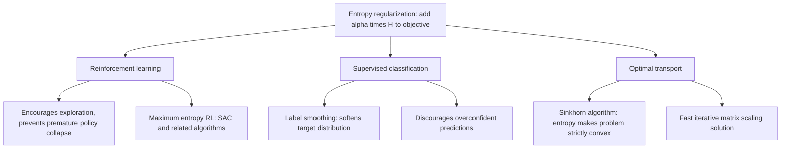

## Entropy Regularization

### Overview

Entropy regularization adds an entropy term to an objective function to encourage a probability distribution — over actions in reinforcement learning, over outputs in supervised learning, or over cluster assignments in unsupervised settings — to remain more uncertain or spread out than an unregularized optimum would produce. It is a direct, practical use of Shannon entropy as an optimization penalty (or bonus) rather than as an analytical or descriptive quantity, closing out this sequence's arc from foundational entropy definitions through cross-entropy loss, KL-based variational inference, and mutual-information-based objectives.

### The General Form

For a policy or output distribution $\pi(\cdot | s)$ over some conditioning context $s$, entropy regularization modifies a base objective $J(\pi)$ by adding a weighted entropy term:

$$J_{ent}(\pi) = J(\pi) + \alpha\, H(\pi(\cdot|s))$$

Where $H(\pi(\cdot|s)) = -\sum_a \pi(a|s)\log \pi(a|s)$ is the Shannon entropy of the distribution, and $\alpha \geq 0$ is a coefficient controlling regularization strength. Since entropy is maximized by a uniform distribution and minimized (at zero) by a fully deterministic (one-hot) distribution, adding $+\alpha H(\pi)$ to a maximization objective explicitly rewards the optimizer for keeping $\pi$ closer to uniform than it would otherwise choose to be.

### Motivation: Why Discourage Determinism

**Key Points**
- Purely optimizing a base objective $J(\pi)$ without regularization often drives distributions toward premature determinism — collapsing to a single confident choice — which can be locally optimal for the immediate objective but harmful for exploration (reinforcement learning) or generalization (supervised learning), since a fully deterministic distribution has committed irreversibly and cannot easily represent remaining uncertainty about better alternatives.
- Entropy regularization provides a smooth, differentiable, information-theoretically principled way to resist this collapse, as opposed to more ad hoc mechanisms (e.g., fixed exploration noise schedules).
- The entropy coefficient $\alpha$ directly controls the exploration-exploitation or confidence-calibration trade-off: $\alpha \to 0$ recovers the unregularized objective; larger $\alpha$ pushes the optimal distribution progressively closer to uniform.

### Entropy Regularization in Reinforcement Learning

In policy-gradient reinforcement learning, the entropy-regularized objective for a policy $\pi_\theta$ is typically written as:

$$J(\theta) = \mathbb{E}_{\pi_\theta}\left[\sum_t r_t\right] + \alpha\, \mathbb{E}_{s_t \sim \pi_\theta}\left[H(\pi_\theta(\cdot|s_t))\right]$$

This encourages the policy to maintain stochasticity across states, directly promoting exploration — a policy with higher-entropy action distributions is more likely to sample and discover better actions that a prematurely deterministic policy would never try. This is the standard justification given for adding entropy bonuses to actor-critic algorithms such as A3C (Asynchronous Advantage Actor-Critic) and PPO (Proximal Policy Optimization).

### Diagram: Entropy Regularization's Effect on Action Distributions

<svg xmlns="http://www.w3.org/2000/svg" viewBox="0 0 720 300">
\<style\>
  .lbl { font-family: sans-serif; font-size: 13px; fill: #222; }
  .small { font-family: sans-serif; font-size: 11px; fill: #555; }
  .title { font-family: sans-serif; font-size: 14px; fill: #111; font-weight: bold; }
  .bar { fill: #1a5fb4; }
  .bar2 { fill: #7a1ac0; }
  .axis { stroke: #333; stroke-width: 1.2; }
\</style\>
<text x="20" y="24" class="title">Effect of Entropy Regularization (svg_diagram)</text>

<text x="60" y="55" class="lbl">Unregularized (alpha = 0)</text>
<line x1="60" y1="200" x2="320" y2="200" class="axis" />
<rect x="80" y="80" width="30" height="120" class="bar" />
<rect x="130" y="185" width="30" height="15" class="bar" />
<rect x="180" y="195" width="30" height="5" class="bar" />
<rect x="230" y="198" width="30" height="2" class="bar" />
<text x="60" y="220" class="small">Collapses toward one dominant action</text>

<text x="420" y="55" class="lbl">Entropy-regularized (alpha &gt; 0)</text>
<line x1="420" y1="200" x2="680" y2="200" class="axis" />
<rect x="440" y="110" width="30" height="90" class="bar2" />
<rect x="490" y="130" width="30" height="70" class="bar2" />
<rect x="540" y="150" width="30" height="50" class="bar2" />
<rect x="590" y="140" width="30" height="60" class="bar2" />
<text x="420" y="220" class="small">Retains spread across multiple actions</text>
</svg>

### Maximum Entropy Reinforcement Learning

A related, more foundational framework — **maximum entropy RL** — treats entropy regularization not as an add-on exploration bonus but as the defining structure of the objective itself, seeking the policy that maximizes expected return *and* entropy jointly across the entire trajectory:

$$\pi^* = \arg\max_\pi \; \mathbb{E}_\pi\left[\sum_t r_t + \alpha H(\pi(\cdot|s_t))\right]$$

Algorithms such as **Soft Actor-Critic (SAC)** are built directly on this formulation, deriving value functions and Bellman-style update equations that incorporate entropy terms throughout, rather than adding entropy as a separate loss term appended to an otherwise standard RL objective. [Inference] This distinction — entropy as a foundational part of the value/objective definition versus entropy as an auxiliary regularization term — is a substantive design choice in the RL literature with different theoretical properties (e.g., different fixed-point/Bellman-consistency guarantees), though a full technical comparison of the two framings is beyond the scope of this overview.

### Label Smoothing as Entropy Regularization

The label smoothing technique noted briefly in the earlier cross-entropy loss discussion can be understood as an implicit form of entropy regularization on the model's *output* distribution: rather than directly penalizing low output entropy, label smoothing modifies the training target itself (softening the one-hot label), which has the practical effect of discouraging the model from producing arbitrarily overconfident (near-zero-entropy) predictions, since achieving a perfect loss of zero against the softened target is no longer possible with a fully deterministic output.

### Entropy Regularization in Optimal Transport: The Sinkhorn Algorithm

A distinct but related application arises in computational optimal transport. The classical (unregularized) optimal transport problem seeks the minimum-cost coupling between two distributions and is a linear program, computationally expensive for large problem sizes. Adding an entropy regularization term to the transport plan:

$$\min_{P} \; \langle P, C \rangle - \epsilon\, H(P)$$

Where $P$ is the transport plan (coupling matrix), $C$ is the cost matrix, and $H(P)$ is the Shannon entropy of $P$ treated as a joint distribution, transforms the problem into one solvable extremely efficiently via the **Sinkhorn-Knopp algorithm** — an iterative matrix-scaling procedure with strong parallelization properties, in contrast to the linear-programming solvers required for the unregularized problem.

**Key Points**
- The entropy term here serves a primarily computational role: it makes the optimization strictly convex and solvable via fast iterative matrix scaling, rather than serving an exploration or confidence-calibration purpose as in the RL and classification cases above.
- Larger $\epsilon$ produces smoother, more diffuse transport plans (again reflecting entropy's spreading effect) at the cost of deviating further from the true unregularized optimal transport cost; smaller $\epsilon$ approaches the true optimal transport solution but at greater computational cost and potential numerical instability in the Sinkhorn iterations.
- This is the standard computational technique underlying the widespread practical adoption of optimal transport methods in machine learning applications (e.g., Wasserstein-distance-based generative models), where the unregularized linear program would otherwise be prohibitively expensive at scale.

### Diagram: Entropy Regularization Across Application Domains

### Connection to Earlier Topics in This Sequence

**Key Points**
- Entropy regularization completes a conceptual arc from this sequence: Shannon entropy (foundational definition) → cross-entropy loss (entropy compared against a target distribution) → KL divergence in variational inference (directional divergence between distributions) → information bottleneck (mutual information as a compression-relevance trade-off) → entropy regularization (entropy used directly as an optimization penalty/bonus rather than a comparison or compression measure).
- Across all these applications, the same core Shannon entropy formula recurs; what changes across applications is the object being regularized or measured (weights, labels, hidden representations, policies, transport plans) and the specific role entropy plays in the surrounding optimization structure (loss, bound, penalty, or convexifying term).

### Practical Considerations

- **Coefficient scheduling**: [Inference] In practice, the entropy coefficient $\alpha$ is often annealed over training (starting higher to encourage early exploration, decreasing later to allow convergence to a more confident/deterministic solution), though the specific scheduling approach and its benefit are implementation- and problem-dependent rather than governed by a single universal best practice.
- **Automatic entropy tuning**: Some RL algorithms (including variants of SAC) adjust $\alpha$ automatically during training to target a specific desired entropy level, rather than requiring it to be fixed or manually scheduled in advance — this is a specific algorithmic design choice with its own associated hyperparameters (the target entropy value) rather than a universal solution to the coefficient-selection problem.
- **Diminishing returns and over-regularization**: Excessively large $\alpha$ can prevent the policy or model from ever converging to a useful, sufficiently confident solution, illustrating that entropy regularization strength requires task-specific tuning rather than a default value that performs well universally.

### Limitations and Scope Notes

- This treatment covers entropy regularization's most common application domains (RL, classification, optimal transport); other uses (e.g., entropy regularization in clustering objectives, or in certain generative adversarial network variants) exist but are not detailed here.
- The choice and scheduling of the entropy coefficient $\alpha$ is empirically driven in most practical applications; no general closed-form or universally optimal choice is claimed here, consistent with this being an actively tuned hyperparameter across the cited application areas.
- The Sinkhorn algorithm's convergence properties and the precise approximation error introduced by entropy regularization in optimal transport are a more detailed numerical-analysis topic not covered in full here.

**Related Topics**
- Soft Actor-Critic (SAC) and maximum entropy reinforcement learning
- Proximal Policy Optimization (PPO) and entropy bonus terms
- Label smoothing and model calibration
- Sinkhorn-Knopp algorithm and entropy-regularized optimal transport
- Wasserstein distance and computational optimal transport
- Automatic entropy coefficient tuning in RL