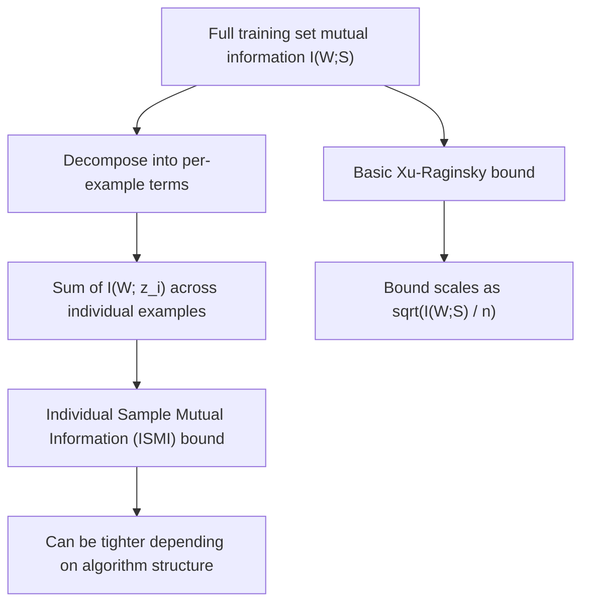

## Information-Theoretic Generalization Bounds

### Overview

Information-theoretic generalization bounds quantify how well a learning algorithm's performance on training data predicts its performance on unseen data, using mutual information between the algorithm's output (typically its learned parameters) and the training dataset as the central quantity of interest. This framework, developed substantially by Russo and Zou (2016) and Xu and Raginsky (2017), reframes generalization — traditionally analyzed via VC dimension, Rademacher complexity, or PAC-Bayes theory — in terms of how much information a learning algorithm "memorizes" about its specific training sample, connecting directly back to the mutual information and KL divergence machinery developed throughout this sequence.

### The Generalization Gap

For a learning algorithm that takes a training set $S = \{z_1, \ldots, z_n\}$ (drawn i.i.d. from a data distribution $\mathcal{D}$) and outputs a hypothesis or parameter $W$ via a (possibly randomized) learning algorithm characterized by $P(W|S)$, the **generalization gap** is defined as the difference between expected population risk and empirical training risk:

$$\text{gen}(W, S) = \mathbb{E}_{\mathcal{D}}[\ell(W, Z)] - \frac{1}{n}\sum_{i=1}^n \ell(W, z_i)$$

Where $\ell$ is a loss function. A small generalization gap means the algorithm's training performance is a reliable proxy for its performance on new data; a large gap indicates overfitting to the specific training sample.

### The Core Bound: Generalization via Mutual Information

The central result, in its most commonly cited form (Xu and Raginsky, 2017), bounds the expected generalization gap in terms of the mutual information between the learned hypothesis $W$ and the training set $S$:

$$\left|\mathbb{E}[\text{gen}(W,S)]\right| \leq \sqrt{\frac{2\sigma^2\, I(W;S)}{n}}$$

Where $\sigma^2$ is a sub-Gaussianity parameter bounding the tail behavior of the loss function, and $n$ is the training set size. This holds under the assumption that the loss $\ell(w, Z)$ is $\sigma$-sub-Gaussian for every fixed $w$.

**Key Points**
- $I(W;S)$ measures how much the learned parameters $W$ depend on — effectively, "remember about" — the specific training sample $S$, beyond what would be determined by the underlying data distribution $\mathcal{D}$ alone.
- If $I(W;S) = 0$ (the algorithm's output is statistically independent of which particular training set was drawn), the bound guarantees zero expected generalization gap — intuitively, an algorithm that learns nothing sample-specific cannot overfit to that sample.
- The bound scales as $1/\sqrt{n}$, matching the general rate seen in many classical generalization bounds (e.g., Rademacher complexity bounds), but with $I(W;S)$ playing the role that complexity measures like VC dimension or Rademacher complexity play in those classical frameworks.

### Diagram: The Information-Theoretic Generalization Framework

<svg xmlns="http://www.w3.org/2000/svg" viewBox="0 0 720 300">
\<style\>
  .lbl { font-family: sans-serif; font-size: 13px; fill: #222; }
  .small { font-family: sans-serif; font-size: 11px; fill: #555; }
  .title { font-family: sans-serif; font-size: 14px; fill: #111; font-weight: bold; }
  .box { fill: #eef3fb; stroke: #1a5fb4; stroke-width: 1.5; }
  .arrow { stroke: #333; stroke-width: 1.6; marker-end: url(#arrowhead9); fill: none; }
\</style\>
<text x="20" y="24" class="title">Information-Theoretic Generalization (svg_diagram)</text>

<rect x="40" y="60" width="180" height="60" rx="4" class="box" />
<text x="55" y="85" class="lbl">Training set S</text>
<text x="55" y="103" class="small">n i.i.d. samples</text>

<rect x="300" y="60" width="180" height="60" rx="4" class="box" />
<text x="315" y="85" class="lbl">Learning algorithm</text>
<text x="315" y="103" class="small">P(W|S)</text>

<rect x="560" y="60" width="140" height="60" rx="4" class="box" />
<text x="575" y="85" class="lbl">Output W</text>

<path d="M220 90 L300 90" class="arrow" />
<path d="M480 90 L560 90" class="arrow" />

<rect x="200" y="180" width="360" height="70" rx="4" class="box" />
<text x="215" y="205" class="lbl">Compute I(W;S)</text>
<text x="215" y="225" class="small">Bound: |gen gap| &lt;= sqrt(2 sigma^2 I(W;S) / n)</text>
</svg>

### Interpretation: Memorization and Overfitting

This framework formalizes an intuitive connection between memorization and overfitting: an algorithm whose output $W$ depends very precisely on the exact identity of its training samples (high $I(W;S)$) is at greater risk of having fit to sample-specific noise rather than genuine population-level structure. Conversely, algorithms whose outputs are relatively insensitive to small perturbations or resamplings of the training set (low $I(W;S)$) are, by this bound, guaranteed to generalize better.

This directly motivates why regularization techniques generally help generalization from this perspective: any mechanism that reduces the algorithm's sensitivity to the specific training sample — weight decay, dropout, early stopping, or the entropy regularization techniques discussed previously (which explicitly resist committing too confidently/deterministically to what a limited sample suggests) — can be understood as implicitly reducing $I(W;S)$, and thus tightening the generalization bound via this framework.

### Individual Sample Mutual Information (ISMI) Bounds

A refinement of the basic bound decomposes the training-set-level mutual information into a sum over individual training examples, yielding tighter, per-example bounds in some settings:

$$\left|\mathbb{E}[\text{gen}(W,S)]\right| \leq \sqrt{\frac{2\sigma^2}{n^2}\sum_{i=1}^n I(W; z_i)}$$

Where $I(W; z_i)$ measures how much the learned output depends on the $i$-th individual training example specifically, rather than the joint dependence on the entire dataset $S$ at once. [Unverified] This per-example decomposition and its various refinements (including subsequent work using conditional mutual information and other variants) form an active area of the information-theoretic generalization literature, with different specific bound formulations offering different tightness/applicability trade-offs depending on the algorithm and data distribution — the precise comparative advantages of specific variants are more technical than can be summarized in a single general statement.

### Diagram: From Full-Dataset MI to Per-Example Decomposition

### Connection to Differential Privacy

**Key Points**
- Algorithms satisfying differential privacy guarantees have their sensitivity to individual training examples explicitly bounded by construction (a core design goal of differential privacy), which translates directly into bounds on $I(W; z_i)$ for each example — establishing a direct, formal connection between differential privacy and generalization via this information-theoretic framework.
- [Inference] This connection is often cited as a notable, somewhat unexpected byproduct of differential privacy research: mechanisms designed purely for individual privacy protection turn out to also provide generalization guarantees, since both properties fundamentally require limiting how much an algorithm's output can depend on any single training example — this dual benefit is a frequently highlighted result in the differentially-private machine learning literature, though the tightness and practical significance of the resulting generalization bounds (as opposed to the qualitative connection itself) vary by specific application and privacy budget.

### PAC-Bayes Connection

Information-theoretic generalization bounds are closely related to, and can in some formulations be derived from or shown to imply, **PAC-Bayes bounds** — a separate, older framework for generalization analysis that bounds generalization error in terms of the KL divergence between a learned "posterior" distribution over hypotheses and a fixed "prior" distribution chosen before seeing the data:

$$\mathbb{E}_{w \sim Q}[\text{gen}(w, S)] \leq \sqrt{\frac{D_{KL}(Q \| P) + \log(n/\delta)}{2n}} \quad \text{(with probability } 1-\delta\text{)}$$

Where $Q$ is the learned posterior over hypotheses and $P$ is a fixed prior. [Unverified] The precise technical relationship between PAC-Bayes bounds and mutual-information-based generalization bounds — which formulations imply which, and under what specific conditions one is tighter than the other — is itself a subject of ongoing technical analysis in the literature, and this overview does not attempt to resolve or fully characterize that relationship; both frameworks share the common thread of measuring "how much the learned output depends on/deviates from a distribution-independent baseline" via a KL-divergence-related quantity, but treating them as simply interchangeable would understate real technical distinctions between the two lines of work.

### Practical Significance and Limitations

**Key Points**
- These bounds are primarily of **conceptual and analytical** value rather than directly computable, practical generalization certificates for typical deep learning models: computing $I(W;S)$ exactly for a modern neural network trained on a realistic dataset faces the same fundamental mutual information estimation difficulties discussed earlier in this sequence (high dimensionality of $W$, intractable exact computation), so these bounds are rarely evaluated numerically for practical models with precise, tight values.
- [Inference] Despite this practical estimability gap, these bounds are widely valued in the theoretical machine learning literature for the qualitative and structural insight they provide — connecting generalization, information transfer from data to model, differential privacy, and regularization within a single coherent information-theoretic language — rather than for producing numerically tight, directly usable generalization guarantees for specific trained models today.
- Some bound variants have been shown to be vacuous (numerically uninformative, e.g., far exceeding the trivial bound of 1 for a bounded loss) when applied to large modern neural networks, reflecting a broader, well-known challenge across many classical and information-theoretic generalization bound families in explaining the empirically observed generalization behavior of heavily overparameterized deep learning models — this vacuousness issue is not unique to information-theoretic bounds specifically.

### Limitations and Scope Notes

- This treatment covers the foundational mutual-information generalization bound and its immediate refinements and connections; the broader landscape of generalization theory (VC dimension, Rademacher complexity, algorithmic stability, and their relationships to the information-theoretic framework) is not exhaustively covered here.
- The practical numerical vacuousness of many bound variants for large modern models, as noted above, is an important caveat distinguishing the theoretical/conceptual value of this framework from its current direct practical applicability as a certification tool.
- The relationship between information-theoretic bounds, PAC-Bayes bounds, and differential-privacy-based bounds is an active and technically involved research area; this overview presents the qualitative connections without fully resolving their precise formal relationships.

**Related Topics**
- PAC-Bayes theory and KL-divergence-based generalization bounds
- Differential privacy and its formal connection to generalization
- Algorithmic stability as a generalization framework
- Rademacher complexity and VC dimension (classical, non-information-theoretic bounds)
- Individual Sample Mutual Information (ISMI) and conditional MI refinements
- Mutual information estimation techniques (practical estimability of these bounds)