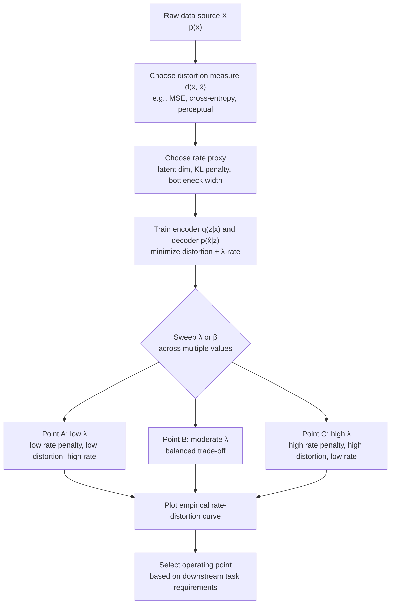

## Rate-Distortion Perspective on Representation Learning

### Overview

Rate-distortion (R-D) theory formalizes the fundamental trade-off between how much a signal is compressed and how much fidelity is lost in that compression. Applied to representation learning, this framework treats a learned representation (embedding, latent code, bottleneck activation) as a compressed encoding of raw data, and treats the downstream task performance or reconstruction quality as a measure of distortion. This lens explains why bottlenecks, regularization, and information-limiting architectural choices in neural networks are not incidental engineering tricks but instances of an optimal compression problem with a long theoretical history.

### Rate-Distortion Theory: Core Formalism

Given a source $X$ with distribution $p(x)$, rate-distortion theory asks: what is the minimum number of bits per symbol (the **rate** $R$) needed to represent $X$ such that a reconstruction $\hat{X}$ satisfies an average distortion constraint $D$?

Formally, the rate-distortion function is:

$$R(D) = \min_{p(\hat{x}|x) : \, \mathbb{E}[d(X,\hat{X})] \leq D} I(X; \hat{X})$$

where:
- $d(x, \hat{x})$ is a distortion measure (e.g., squared error, Hamming distance)
- $I(X; \hat{X})$ is the mutual information between the source and its reconstruction
- The minimization is over all conditional distributions (encoders) $p(\hat{x}|x)$ satisfying the distortion budget

$R(D)$ is convex, non-increasing in $D$, and characterizes the Pareto-optimal frontier: for any achievable rate below $R(D)$, distortion must exceed $D$, and vice versa. This is the theoretical floor — no encoding scheme can do better.

### Mapping to Representation Learning

In a learned representation setting, the correspondence is direct:

- **Source $X$**: raw input data (images, text, sensor readings)
- **Representation $Z$**: the learned latent code (encoder output)
- **Reconstruction/task output $\hat{X}$ or $\hat{Y}$**: decoder output, or downstream prediction
- **Rate**: $I(X; Z)$, the information the representation retains about the input — controlled via bottleneck width, added noise, or explicit regularization
- **Distortion**: reconstruction error, or (in supervised settings) task loss

An encoder-decoder system trained with a reconstruction loss plus a complexity penalty is, in effect, tracing a point on (or attempting to approach) the input's rate-distortion curve. The choice of latent dimensionality, quantization granularity, or noise injection determines which point on that curve the system settles at.

**(svg_diagram) Rate-Distortion Curve and Representation Learning Operating Points**

<svg xmlns="http://www.w3.org/2000/svg" viewBox="0 0 720 460">
\<style\>
.title { font: bold 18px sans-serif; fill: #1a1a2e; }
.axis-label { font: 13px sans-serif; fill: #333; }
.curve-label { font: 12px sans-serif; fill: #555; }
.point-label { font: 11px sans-serif; fill: #222; }
.tick { font: 10px sans-serif; fill: #444; }
\</style\>
<rect width="720" height="460" fill="#fdfdfd" />
<text x="360" y="28" text-anchor="middle" class="title">Rate-Distortion Curve R(D) (svg_diagram)</text>

<line x1="90" y1="400" x2="650" y2="400" stroke="#333" stroke-width="1.5" />
<line x1="90" y1="400" x2="90" y2="60" stroke="#333" stroke-width="1.5" />
<text x="370" y="435" text-anchor="middle" class="axis-label">Distortion D (bits lost / error tolerated)</text>
<text x="35" y="230" text-anchor="middle" class="axis-label" transform="rotate(-90 35 230)">Rate R (bits retained)</text>

<path d="M 110 90 C 200 100, 260 140, 320 210 C 380 280, 440 330, 600 385" fill="none" stroke="#2b6cb0" stroke-width="3" />
<text x="430" y="175" class="curve-label" fill="#2b6cb0">R(D) — achievable region (above/right of curve)</text>

<path d="M 110 90 C 200 100, 260 140, 320 210 C 380 280, 440 330, 600 385 L 600 60 L 110 60 Z" fill="#2b6cb0" opacity="0.06" />
<text x="250" y="100" class="curve-label" fill="#a0a0a0" font-style="italic">infeasible (below curve)</text>

<circle cx="150" cy="100" r="7" fill="#c0392b" />
<text x="160" y="95" class="point-label">A: wide bottleneck</text>
<text x="160" y="110" class="point-label">(high rate, low distortion)</text>

<circle cx="330" cy="220" r="7" fill="#27ae60" />
<text x="340" y="215" class="point-label">B: moderate bottleneck</text>
<text x="340" y="230" class="point-label">(balanced trade-off)</text>

<circle cx="520" cy="355" r="7" fill="#8e44ad" />
<text x="440" y="340" class="point-label">C: narrow bottleneck</text>
<text x="440" y="355" class="point-label">(low rate, high distortion)</text>

<circle cx="330" cy="270" r="7" fill="#e67e22" />
<text x="345" y="290" class="point-label">D: suboptimal encoder</text>
<text x="345" y="305" class="point-label">(same rate as B, worse distortion)</text>
<line x1="330" y1="270" x2="330" y2="220" stroke="#e67e22" stroke-width="1" stroke-dasharray="4,3" />

<text x="90" y="415" text-anchor="middle" class="tick">0</text>
<text x="650" y="415" text-anchor="middle" class="tick">high</text>
<text x="80" y="395" text-anchor="end" class="tick">0</text>
<text x="80" y="70" text-anchor="end" class="tick">high</text>
</svg>

Point A represents a representation with a wide bottleneck (high retained information, low reconstruction error) — typical of an autoencoder with large latent dimension. Point C represents an aggressively compressed representation, common in extreme dimensionality reduction. Point D illustrates a real, trained encoder that fails to reach the theoretical curve — a gap that exists in practice due to optimization limitations, finite data, and imperfect model capacity, not just chosen trade-off.

### The Information Bottleneck as an Instance of Rate-Distortion

The **Information Bottleneck (IB)** method (Tishby, Pereira, Bialek) is the clearest formal bridge between rate-distortion theory and modern representation learning, particularly in the supervised setting. Given input $X$, target $Y$, and representation $Z$, IB seeks:

$$\min_{p(z|x)} \; I(X; Z) - \beta \, I(Z; Y)$$

Here, distortion is not reconstruction error but a *negative relevance* term — how much task-relevant information about $Y$ is preserved. The parameter $\beta$ plays the role of the Lagrange multiplier tracing out the rate-distortion trade-off curve, exactly analogous to the slope-varying parameter in classical R-D optimization:

$$\mathcal{L}_{\text{R-D}} = I(X; \hat{X}) + \lambda \, \mathbb{E}[d(X, \hat{X})]$$

The IB objective substitutes "distortion relative to reconstructing $X$" with "distortion relative to predicting $Y$," making it a supervised variant of the same compression-fidelity trade-off. This reframes deep learning generalization itself: a network compresses irrelevant input variation while retaining task-predictive information, and the "fitting" then "compression" phases observed in some empirical studies of deep network training dynamics have been interpreted (though this interpretation is contested) as movement along an implicit rate-distortion trajectory.

[Inference] The degree to which real deep networks empirically follow a two-phase (fitting then compression) trajectory as originally proposed is disputed in the literature, with follow-up work reporting mixed replication depending on architecture and activation function choice.

### Variational Autoencoders as Explicit Rate-Distortion Optimizers

The VAE objective makes the rate-distortion trade-off completely explicit:

$$\mathcal{L}_{\text{VAE}} = \underbrace{\mathbb{E}_{q(z|x)}[-\log p(x|z)]}_{\text{distortion}} + \underbrace{D_{\text{KL}}(q(z|x) \,\|\, p(z))}_{\text{rate}}$$

The reconstruction term is the distortion; the KL divergence between the approximate posterior and the prior upper-bounds the rate (bits needed to communicate $z$ using the prior as a code). The $\beta$-VAE generalizes this to:

$$\mathcal{L}_{\beta\text{-VAE}} = \mathbb{E}_{q(z|x)}[-\log p(x|z)] + \beta \, D_{\text{KL}}(q(z|x) \,\|\, p(z))$$

Sweeping $\beta$ traces an empirical rate-distortion curve for the model class in question. Low $\beta$ favors low distortion (better reconstructions, less compressed, less disentangled); high $\beta$ favors low rate (heavier compression, often better factor disentanglement, but blurrier reconstructions). This is precisely the classical R-D trade-off, with the Lagrange multiplier made an explicit, tunable hyperparameter.

**(svg_diagram) VAE Encoder-Decoder as a Rate-Distortion Channel**

<svg xmlns="http://www.w3.org/2000/svg" viewBox="0 0 700 320">
\<style\>
.title { font: bold 17px sans-serif; fill: #1a1a2e; }
.block-label { font: 13px sans-serif; fill: #222; }
.small-label { font: 11px sans-serif; fill: #555; }
\</style\>
<rect width="700" height="320" fill="#fdfdfd" />
<text x="350" y="26" text-anchor="middle" class="title">VAE as Rate-Distortion Channel (svg_diagram)</text>

<rect x="30" y="120" width="120" height="70" rx="6" fill="#eaf2f8" stroke="#2b6cb0" stroke-width="1.5" />
<text x="90" y="160" text-anchor="middle" class="block-label">Input X</text>

<path d="M 150 155 L 210 155" stroke="#333" stroke-width="2" marker-end="url(#arrow)" />
<text x="180" y="140" text-anchor="middle" class="small-label">encode</text>

<rect x="210" y="110" width="140" height="90" rx="6" fill="#eafaf1" stroke="#27ae60" stroke-width="1.5" />
<text x="280" y="145" text-anchor="middle" class="block-label">q(z|x)</text>
<text x="280" y="165" text-anchor="middle" class="small-label">Rate = KL(q||p)</text>
<text x="280" y="182" text-anchor="middle" class="small-label">bits to encode z</text>

<path d="M 350 155 L 410 155" stroke="#333" stroke-width="2" marker-end="url(#arrow)" />
<text x="380" y="140" text-anchor="middle" class="small-label">latent z</text>

<rect x="410" y="110" width="140" height="90" rx="6" fill="#fdf2e9" stroke="#e67e22" stroke-width="1.5" />
<text x="480" y="145" text-anchor="middle" class="block-label">p(x|z)</text>
<text x="480" y="165" text-anchor="middle" class="small-label">decode</text>

<path d="M 550 155 L 610 155" stroke="#333" stroke-width="2" marker-end="url(#arrow)" />

<rect x="610" y="120" width="70" height="70" rx="6" fill="#f9ebea" stroke="#c0392b" stroke-width="1.5" />
<text x="645" y="160" text-anchor="middle" class="block-label" font-size="12">X̂</text>

<text x="645" y="210" text-anchor="middle" class="small-label">Distortion =</text>
<text x="645" y="225" text-anchor="middle" class="small-label">-log p(x|z)</text>

<line x1="30" y1="250" x2="680" y2="250" stroke="#999" stroke-width="1" stroke-dasharray="3,3" />
<text x="350" y="272" text-anchor="middle" class="small-label">β scales the rate term: β↑ → more compression, more disentanglement, higher distortion</text>
</svg>

### Distortion Measures Beyond Reconstruction Error

Classical R-D theory typically uses squared error or Hamming distance, but representation learning generalizes the distortion measure to whatever downstream objective matters:

- **Perceptual distortion**: distances in a pretrained feature space (e.g., VGG-based perceptual loss) rather than pixel-space MSE, better matching human-perceived fidelity
- **Task distortion**: classification cross-entropy, as in the Information Bottleneck's use of $-I(Z;Y)$
- **Adversarial distortion**: a discriminator's ability to distinguish reconstructions from originals, as in VAE-GAN hybrids

This generalization means the rate-distortion framework is not confined to compression systems narrowly construed — any system that maps high-dimensional input through a constrained channel to satisfy some fidelity criterion inherits an R-D interpretation, including contrastive representation learners, where the "distortion" is implicitly defined by invariance to augmentations rather than reconstruction.

### Self-Supervised and Contrastive Learning Through This Lens

Contrastive methods (SimCLR, InfoNCE-based objectives) do not use an explicit decoder, but they can still be interpreted rate-distortion-theoretically. The InfoNCE loss lower-bounds mutual information between two augmented views:

$$I(Z_1; Z_2) \geq \log(N) - \mathcal{L}_{\text{InfoNCE}}$$

Maximizing this bound pushes the representation to retain information shared across augmented views (a proxy for semantic content) while implicitly discarding view-specific nuisance variation (a proxy for controlling rate, though not via an explicit bottleneck constraint). [Inference] Because there is no explicit rate penalty in most contrastive objectives, describing them as tracing a classical R-D curve is an analogy rather than a literal instantiation — the compression is emergent from the finite representation dimension and negative sampling structure rather than from a KL or entropy penalty. This distinction matters: contrastive methods control distortion (via the InfoNCE bound) directly but control rate only implicitly, through architectural bottleneck width, unlike IB or VAEs where rate is an explicit penalized term.

### Practical Design Implications

**Key Points**

- **Latent dimensionality is a rate budget.** Choosing a smaller latent space directly restricts $I(X;Z)$, forcing the encoder toward higher-rate-efficient, more abstract encodings.
- **Regularization terms (KL, L1, dropout noise) are rate proxies.** Rather than literal bit-counting, they act as differentiable surrogates that penalize retained information.
- **The distortion measure defines what "good" means.** Reconstruction-based distortion favors pixel fidelity; task-based distortion (as in IB) favors label-predictive fidelity; the two can produce very different optimal representations from the same data.
- **There is no free lunch.** Improving distortion at fixed rate requires either better data statistics exploitation or a fundamentally different (often higher-capacity) encoder-decoder family; the R(D) curve is a hard limit set by the data distribution and distortion measure, not by architecture choice alone.
- **The rate-distortion curve is data-dependent, not universal.** A different source distribution $p(x)$ produces a different $R(D)$ curve entirely — this is why representations transfer poorly across domains with different underlying statistics.

### Worked Example: Reasoning About a Bottleneck Size Choice

Suppose an engineer is designing an autoencoder for 128×128 RGB face images (input dimensionality $128 \times 128 \times 3 \approx 49{,}000$ raw values) and must choose a latent dimension.

- A latent dimension of $d = 2$ imposes a severe rate constraint. Per rate-distortion theory, $R(D)$ at such a low rate forces high distortion — reconstructions will capture only the coarsest factors (e.g., average skin tone, rough pose), because $I(X;Z)$ is information-theoretically too small to specify fine-grained facial detail.
- A latent dimension of $d = 512$ relaxes the rate constraint substantially, permitting the encoder to operate much further down the curve toward $D \to 0$ — enabling sharper, more detailed reconstructions, at the cost of a representation that is less compressed and often less disentangled.
- Choosing $d = 32$–$64$ (a common empirical range for face datasets) represents an intermediate operating point, often selected not from a closed-form calculation of $R(D)$ (which is generally intractable for high-dimensional natural image distributions) but through empirical validation — tracing an approximate empirical rate-distortion curve by training multiple models at different $d$ or $\beta$ values and selecting the elbow point where marginal distortion improvement per added bit of rate drops sharply.

[Unverified] The exact numerical elbow point depends heavily on dataset, architecture, and training procedure, and no universal "optimal" latent dimension exists independent of these choices.

### Relationship to Deep Learning Generalization Theory

The rate-distortion view connects to a broader thread in deep learning theory concerning why over-parameterized networks generalize despite having capacity to memorize training data. If a network's effective information content about its training set (a compression-based, not literal, notion of rate) is small relative to the dataset size, generalization bounds derived from information-theoretic and MDL (Minimum Description Length) arguments suggest better generalization — a distortion (test error) versus rate (effective model complexity) trade-off structurally analogous to classical R(D), though operating on parameters/weights rather than a per-example latent code.

**(svg_diagram) Rate-Distortion Correspondence Table**

<svg xmlns="http://www.w3.org/2000/svg" viewBox="0 0 720 380">
\<style\>
.title { font: bold 17px sans-serif; fill: #1a1a2e; }
.header { font: bold 13px sans-serif; fill: #fff; }
.cell { font: 12px sans-serif; fill: #222; }
.cell-alt { font: 12px sans-serif; fill: #222; }
\</style\>
<rect width="720" height="380" fill="#fdfdfd" />
<text x="360" y="26" text-anchor="middle" class="title">Classical R-D vs. Representation Learning (svg_diagram)</text>

<rect x="20" y="50" width="220" height="36" fill="#2b6cb0" />
<rect x="240" y="50" width="230" height="36" fill="#2b6cb0" />
<rect x="470" y="50" width="230" height="36" fill="#2b6cb0" />
<text x="30" y="73" class="header">Classical R-D</text>
<text x="250" y="73" class="header">Representation Learning</text>
<text x="480" y="73" class="header">Concrete Instance</text>

<g font-family="sans-serif">
<rect x="20" y="86" width="220" height="42" fill="#f4f8fb" />
<rect x="240" y="86" width="230" height="42" fill="#f4f8fb" />
<rect x="470" y="86" width="230" height="42" fill="#f4f8fb" />
<text x="30" y="111" class="cell">Source X</text>
<text x="250" y="111" class="cell">Raw input data</text>
<text x="480" y="111" class="cell">Images, text, audio</text>

<rect x="20" y="128" width="220" height="42" fill="#ffffff" />
<rect x="240" y="128" width="230" height="42" fill="#ffffff" />
<rect x="470" y="128" width="230" height="42" fill="#ffffff" />
<text x="30" y="153" class="cell">Rate R</text>
<text x="250" y="153" class="cell">I(X;Z), bottleneck size</text>
<text x="480" y="153" class="cell">Latent dim, KL term</text>

<rect x="20" y="170" width="220" height="42" fill="#f4f8fb" />
<rect x="240" y="170" width="230" height="42" fill="#f4f8fb" />
<rect x="470" y="170" width="230" height="42" fill="#f4f8fb" />
<text x="30" y="195" class="cell">Distortion D</text>
<text x="250" y="195" class="cell">Reconstruction / task loss</text>
<text x="480" y="195" class="cell">MSE, cross-entropy</text>

<rect x="20" y="212" width="220" height="42" fill="#ffffff" />
<rect x="240" y="212" width="230" height="42" fill="#ffffff" />
<rect x="470" y="212" width="230" height="42" fill="#ffffff" />
<text x="30" y="237" class="cell">Lagrange multiplier</text>
<text x="250" y="237" class="cell">β (IB, β-VAE)</text>
<text x="480" y="237" class="cell">Tunable hyperparameter</text>

<rect x="20" y="254" width="220" height="42" fill="#f4f8fb" />
<rect x="240" y="254" width="230" height="42" fill="#f4f8fb" />
<rect x="470" y="254" width="230" height="42" fill="#f4f8fb" />
<text x="30" y="279" class="cell">Optimal encoder p(x̂|x)</text>
<text x="250" y="279" class="cell">Learned q(z|x)</text>
<text x="480" y="279" class="cell">Neural network encoder</text>

<rect x="20" y="296" width="220" height="42" fill="#ffffff" />
<rect x="240" y="296" width="230" height="42" fill="#ffffff" />
<rect x="470" y="296" width="230" height="42" fill="#ffffff" />
<text x="30" y="321" class="cell">R(D) curve</text>
<text x="250" y="321" class="cell">Empirical trade-off frontier</text>
<text x="480" y="321" class="cell">Traced by sweeping β or dim</text>
</g>
</svg>

### Process Flow: From Data to Rate-Distortion-Optimal Representation

### Limitations of the Rate-Distortion Framing

- **Intractability of true $R(D)$.** For high-dimensional, non-Gaussian sources like natural images, the true rate-distortion function has no closed form; practitioners work with variational bounds (as in VAEs) or empirical approximations, not the exact curve.
- **Distortion measure choice is itself a modeling assumption.** Pixel-wise MSE is a poor proxy for perceptual or semantic fidelity, so an encoder optimal under one distortion measure may be far from optimal under another — the R-D framework clarifies the trade-off but does not resolve which distortion measure is "correct" for a given application.
- **Mutual information estimation is difficult in practice.** Neural mutual information estimators (e.g., MINE) used to approximate $I(X;Z)$ in IB-style objectives face known variance and bias issues, particularly in high dimensions, so reported "information" values in empirical IB studies are commonly approximate. [Unverified]

### Related Topics

- Information Bottleneck method: derivation and Lagrangian dual formulation
- β-VAE and disentanglement metrics (MIG, DCI, SAP scores)
- Neural estimation of mutual information (MINE, InfoNCE bounds, CLUB)
- Minimum Description Length (MDL) and its connection to generalization bounds
- Blahut-Arimoto algorithm for computing rate-distortion functions
- Lossy source coding theorem and its finite-blocklength refinements
- Wyner-Ziv problem: rate-distortion with side information at the decoder
- Contrastive predictive coding (CPC) and InfoNCE as MI lower bounds