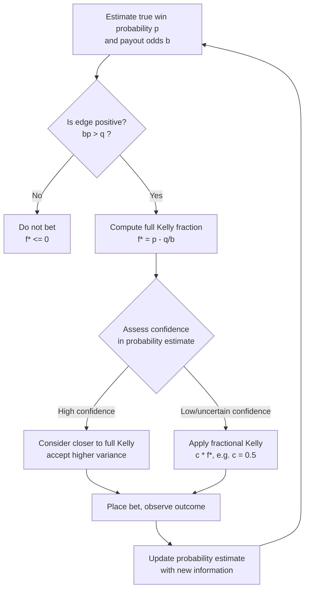

## Kelly Criterion and Gambling

### Overview

The Kelly criterion is a formula for sizing a sequence of bets or investments to maximize the long-run exponential growth rate of wealth. Originally derived by John L. Kelly Jr. in 1956 as a reinterpretation of Claude Shannon's channel capacity theorem, it sits at the intersection of information theory, probability theory, and gambling/investment strategy. Kelly showed that a gambler with private information about the outcome of a repeated bet (analogous to a noisy channel with side information) can determine an optimal fraction of capital to wager such that wealth grows at a rate directly tied to the mutual information the gambler possesses about the outcome.

### Historical and Information-Theoretic Origin

Kelly's 1956 paper, "A New Interpretation of Information Rate," was explicitly framed as an application of Shannon's information theory rather than as a gambling paper per se. Kelly considered a gambler receiving information over a noisy channel about the outcome of a repeated event (originally framed around horse races), where the channel capacity $C$ (in bits) sets an upper bound on how fast the gambler's wealth can grow, generation after generation of bets.

The key insight: the maximum exponential growth rate of the gambler's capital equals the rate of information transmission (in bits per bet) about the outcome — the channel capacity of the information source, in Shannon's sense. This directly links gambling growth rate to Shannon's noisy-channel coding theorem: information has a quantifiable monetary value when it can be exploited through repeated betting, and that value is bounded by the mutual information between the signal and the true outcome.

### The Basic Kelly Formula (Binary Bet)

For a simple binary bet — win with probability $p$, lose with probability $q = 1-p$, at odds $b$ to $1$ (i.e., a win returns $b$ times the amount staked, in addition to the stake) — the Kelly criterion specifies the optimal fraction of current capital $f^*$ to wager:

$$f^* = \frac{bp - q}{b} = p - \frac{q}{b}$$

This maximizes the expected logarithmic growth rate of wealth:

$$G(f) = p \log(1 + bf) + q \log(1 - f)$$

Setting $\frac{dG}{df} = 0$ and solving yields $f^*$. Wagering exactly this fraction each round maximizes the long-run exponential growth rate $\mathbb{E}[\log W_n]/n$ as $n \to \infty$, where $W_n$ is wealth after $n$ bets.

**Key Points**

- $f^*$ can be negative if $bp < q$ — meaning the bet has negative expected edge, and the "optimal" action is not to bet at all (or to bet on the opposing side, if available).
- The formula requires *true* probabilities $p$ and $q$; using incorrect estimates leads to suboptimal or even ruinous betting, since Kelly sizing is highly sensitive to estimation error in $p$.
- Kelly betting is provably the growth-optimal strategy among all fixed-fraction betting strategies, but "growth-optimal" does not mean "risk-minimal" or "variance-minimal" — full Kelly betting carries a substantial risk of large drawdowns along the way, even though ruin (losing everything) has probability zero under idealized fractional Kelly (since $f^* < 1$ implies never betting the entire bankroll).

### Connection to Mutual Information

For the case of a gambler betting on a repeated, i.i.d. binary event where the "inside information" is a noisy signal $Y$ correlated with the true outcome $X$, Kelly's growth rate result generalizes to:

$$W^* = I(X; Y)$$

where $W^*$ is the maximum achievable exponential growth rate of wealth (doubling rate, in bits per bet, under fair-odds betting), and $I(X;Y)$ is the mutual information between the true outcome and the side information the gambler observes. This is the core theoretical bridge: **the value of information, measured in growth rate of wealth, equals the mutual information between what you know and what will actually happen.**

This result assumes fair odds (odds exactly matching the true unconditional probabilities, so the house has no built-in edge). Under uniform, unfavorable, or house-favored odds, the doubling rate is adjusted downward, but mutual information still governs the *marginal* value of additional information — every additional bit of correlation with the true outcome that the gambler acquires translates directly into additional long-run growth rate.

**(svg_diagram) Kelly Growth Rate as a Function of Mutual Information**

<svg xmlns="http://www.w3.org/2000/svg" viewBox="0 0 700 380">
\<style\>
.title { font: bold 17px sans-serif; fill: #1a1a2e; }
.axis-label { font: 13px sans-serif; fill: #333; }
.curve-label { font: 12px sans-serif; fill: #555; }
.point-label { font: 11px sans-serif; fill: #222; }
\</style\>
<rect width="700" height="380" fill="#fdfdfd" />
<text x="350" y="26" text-anchor="middle" class="title">Doubling Rate vs. Mutual Information (svg_diagram)</text>

<line x1="90" y1="330" x2="620" y2="330" stroke="#333" stroke-width="1.5" />
<line x1="90" y1="330" x2="90" y2="60" stroke="#333" stroke-width="1.5" />
<text x="355" y="360" text-anchor="middle" class="axis-label">Mutual Information I(X;Y) — bits per bet</text>
<text x="35" y="195" text-anchor="middle" class="axis-label" transform="rotate(-90 35 195)">Growth Rate W* — bits per bet</text>

<line x1="90" y1="330" x2="600" y2="90" stroke="#2b6cb0" stroke-width="3" />
<text x="430" y="150" class="curve-label" fill="#2b6cb0">W* = I(X;Y) (fair odds, idealized)</text>

<circle cx="150" cy="288" r="6" fill="#c0392b" />
<text x="165" y="285" class="point-label">A: weak signal</text>
<text x="165" y="299" class="point-label">low I(X;Y), slow growth</text>

<circle cx="330" cy="200" r="6" fill="#27ae60" />
<text x="345" y="197" class="point-label">B: moderate signal</text>
<text x="345" y="211" class="point-label">e.g., a biased-coin tipster</text>

<circle cx="500" cy="120" r="6" fill="#8e44ad" />
<text x="380" y="105" class="point-label">C: strong signal</text>
<text x="380" y="119" class="point-label">near-certain outcome knowledge</text>

<text x="90" y="345" text-anchor="middle" class="axis-label" font-size="11">0</text>
</svg>

### Kelly Criterion in Continuous / Portfolio Settings

For investment applications (as opposed to discrete win/lose bets), the Kelly framework generalizes to continuous return distributions. For a single risky asset with expected return $\mu$ (in excess of the risk-free rate) and variance $\sigma^2$, under a log-normal approximation, the Kelly-optimal fraction of capital to allocate is approximately:

$$f^* \approx \frac{\mu}{\sigma^2}$$

For multiple correlated assets, this generalizes to a vector formula involving the inverse covariance matrix:

$$\mathbf{f}^* = \Sigma^{-1} \boldsymbol{\mu}$$

where $\boldsymbol{\mu}$ is the vector of expected excess returns and $\Sigma$ is the covariance matrix of returns. This is structurally identical to mean-variance portfolio theory's tangency portfolio weights, which is why Kelly betting is sometimes described as growth-optimal portfolio theory, distinct from Markowitz's risk-adjusted (utility-based) mean-variance framework, though the two coincide under specific assumptions about the utility function (log utility corresponds exactly to Kelly).

[Inference] The continuous-time and multi-asset extensions of Kelly rely on approximations (log-normality, i.i.d. returns) that do not hold exactly for real markets, so practical implementations typically use fractional Kelly and additional risk constraints rather than the raw formula.

### Fractional Kelly and Practical Risk Management

Because full Kelly betting maximizes long-run growth rate at the cost of very high short-run variance (a well-known property: full Kelly bettors experience large, sometimes 50%+ drawdowns with non-trivial probability even under a positive edge), practitioners commonly use **fractional Kelly** — wagering some fraction $c \cdot f^*$ for $0 < c < 1$ (commonly $c = 0.5$, "half-Kelly").

Half-Kelly betting has a notable property: it achieves approximately **75% of the growth rate** of full Kelly while substantially reducing variance and drawdown risk, because the growth rate as a function of bet fraction $f$ is a smooth, concave curve peaking at $f^*$ — moving partway toward the peak sacrifices growth rate quadratically while cutting variance roughly linearly.

**(svg_diagram) Growth Rate vs. Bet Fraction — the Kelly Curve**

<svg xmlns="http://www.w3.org/2000/svg" viewBox="0 0 700 400">
\<style\>
.title { font: bold 17px sans-serif; fill: #1a1a2e; }
.axis-label { font: 13px sans-serif; fill: #333; }
.point-label { font: 11px sans-serif; fill: #222; }
\</style\>
<rect width="700" height="400" fill="#fdfdfd" />
<text x="350" y="26" text-anchor="middle" class="title">Growth Rate G(f) vs. Bet Fraction f (svg_diagram)</text>

<line x1="80" y1="340" x2="640" y2="340" stroke="#333" stroke-width="1.5" />
<line x1="80" y1="340" x2="80" y2="60" stroke="#333" stroke-width="1.5" />
<text x="360" y="370" text-anchor="middle" class="axis-label">Fraction of bankroll wagered, f</text>
<text x="30" y="200" text-anchor="middle" class="axis-label" transform="rotate(-90 30 200)">Expected log growth rate G(f)</text>

<path d="M 100 340 C 200 150, 280 90, 360 85 C 440 90, 520 160, 600 320" fill="none" stroke="#2b6cb0" stroke-width="3" />

<line x1="80" y1="250" x2="640" y2="250" stroke="#999" stroke-dasharray="4,3" />
<text x="645" y="254" class="point-label">G=0</text>

<circle cx="360" cy="86" r="6" fill="#c0392b" />
<text x="365" y="70" class="point-label">Full Kelly f* (peak growth)</text>
<line x1="360" y1="86" x2="360" y2="340" stroke="#c0392b" stroke-width="1" stroke-dasharray="3,2" />
<text x="360" y="358" text-anchor="middle" class="point-label" fill="#c0392b">f*</text>

<circle cx="230" cy="150" r="6" fill="#27ae60" />
<text x="150" y="140" class="point-label">Half-Kelly (~75% of peak growth,</text>
<text x="150" y="153" class="point-label">much lower variance)</text>
<line x1="230" y1="150" x2="230" y2="340" stroke="#27ae60" stroke-width="1" stroke-dasharray="3,2" />
<text x="230" y="358" text-anchor="middle" class="point-label" fill="#27ae60">f*/2</text>

<circle cx="520" cy="180" r="6" fill="#e67e22" />
<text x="470" y="170" class="point-label">Over-betting: growth</text>
<text x="470" y="183" class="point-label">falls even though f increased</text>

<circle cx="600" cy="320" r="6" fill="#7f1d1d" />
<text x="530" y="300" class="point-label" fill="#7f1d1d">Approaching f=1:</text>
<text x="530" y="313" class="point-label" fill="#7f1d1d">catastrophic variance</text>
</svg>

### Worked Example: Horse Race with Private Information

Consider a simplified horse race with two horses, A and B, each truly winning with probability $p_A = 0.6$, $p_B = 0.4$ (known to the gambler via private information), while the track's posted odds imply the public believes $p_A = 0.5$, $p_B = 0.5$ (even-money odds on both, i.e., $b = 1$ for each).

Using the binary Kelly formula for a bet on horse A at $b=1$:

$$f^*_A = p_A - \frac{q_A}{b} = 0.6 - \frac{0.4}{1} = 0.2$$

The gambler should wager 20% of their bankroll on horse A. The mutual information the gambler's private signal provides (relative to the public's uniform 50/50 belief), computed as the KL divergence between the gambler's true distribution and the market-implied distribution, translates into this specific edge and bet size — a concrete instance of "information having monetary value" as Shannon and Kelly's framework formalizes.

If the gambler mistakenly believed $p_A = 0.7$ (overestimating their edge) and bet accordingly ($f^* = 0.7 - 0.3 = 0.4$), they would be **over-betting relative to their true edge**, incurring more variance than optimal and — under repeated play with the true $p_A = 0.6$ — a lower actual long-run growth rate than the correctly-calculated 20% would have produced. This illustrates why Kelly sizing is often described as requiring "the courage of your convictions but not more" — errors in probability estimation are costly in a specific, quantifiable way (the growth rate loss from mis-sizing is itself expressible via a KL-divergence-like penalty term).

### Kelly Criterion and the St. Petersburg-Style Critique of Expected Value Maximization

Kelly's approach was partly motivated by a well-known deficiency of naive expected-value maximization in repeated betting: a strategy that maximizes expected wealth $\mathbb{E}[W_n]$ after $n$ bets can still lead to **almost sure ruin**, because expectation is dominated by astronomically unlikely, astronomically large outcomes, while the *typical* (median) outcome under expectation-maximizing strategies is often bankruptcy. Maximizing expected log-wealth (equivalently, the Kelly criterion) instead maximizes the growth rate that occurs *almost surely* — a form of ergodic, not merely ensemble-average, optimality. This distinction (time-average vs. ensemble-average growth) is a recurring theme in more recent "ergodicity economics" literature revisiting Kelly's original insight.

[Inference] The framing of Kelly-optimality as resolving the ensemble-average/time-average distinction is broadly accepted within the ergodicity economics literature, but this remains a less mainstream framing relative to traditional expected-utility finance theory, and its broader acceptance across mainstream financial economics is not settled.

### Process Flow: Applying Kelly Sizing to a Repeated Bet

### Common Pitfalls and Misconceptions

- **Confusing Kelly with "bet everything on the favorite."** Kelly sizing is about fraction of bankroll, not which side to bet — it can recommend a small stake even on a strong favorite if the offered odds barely exceed fair value.
- **Ignoring parameter uncertainty.** The formula treats $p$ as known exactly; in practice $p$ is estimated with error, and Kelly sizing computed from an overconfident $p$ estimate systematically over-bets, which is why fractional Kelly is near-universal in real applications (sports betting syndicates, quantitative trading desks).
- **Applying single-bet Kelly to correlated, simultaneous bets naively.** When multiple bets are placed simultaneously (rather than sequentially), naively summing single-bet Kelly fractions ignores correlation between outcomes and can lead to substantial over-betting in aggregate; the correct generalization requires the multivariate/simultaneous Kelly formulation (analogous to the portfolio covariance form above).
- **Treating Kelly as a risk-minimization strategy.** It is a growth-rate maximization strategy under log utility; investors or bettors with different risk preferences (more risk-averse than log-utility, or more risk-seeking) will rationally choose a different fraction, not full Kelly.

### Related Topics

- Shannon's noisy-channel coding theorem and channel capacity
- Kullback-Leibler divergence as an "edge" or belief-mismatch measure
- Ergodicity economics: time-average vs. ensemble-average growth
- Log-optimal portfolio theory and universal portfolios (Cover)
- Simultaneous/multivariate Kelly betting under correlated outcomes
- Drawdown analysis and risk-of-ruin calculations under fractional Kelly
- Behavioral finance: why real bettors and investors systematically over-bet relative to Kelly