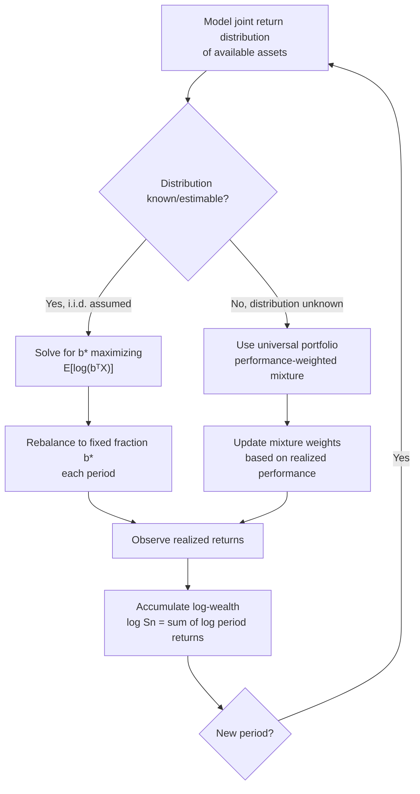

## Growth-Optimal Portfolios

### Overview

A growth-optimal portfolio (GOP) is a portfolio allocation strategy that maximizes the expected long-run exponential growth rate of wealth, rather than expected value, expected utility under an arbitrary utility function, or variance-adjusted return. This concept, formalized by Kelly's information-theoretic betting result and extended to portfolio theory primarily through the work of Thomas Cover, treats portfolio selection as a repeated game in which the log of wealth accumulates additively across periods — making log-wealth maximization the natural criterion for long-horizon compounding. Growth-optimal portfolios connect directly to information theory through the equivalence between log-optimal growth rate and information-theoretic quantities such as entropy rate and mutual information.

### Formal Definition

Given a market with $n$ assets and a sequence of return vectors $\mathbf{X}_1, \mathbf{X}_2, \ldots$ (each $\mathbf{X}_t$ a vector of gross returns for period $t$), a portfolio is a vector $\mathbf{b} = (b_1, \ldots, b_n)$ with $b_i \geq 0$, $\sum_i b_i = 1$, representing the fraction of wealth allocated to each asset. Wealth after $n$ periods, under a fixed-fraction (constantly rebalanced) portfolio $\mathbf{b}$, is:

$$S_n(\mathbf{b}) = \prod_{t=1}^{n} \mathbf{b}^\top \mathbf{X}_t$$

The growth-optimal portfolio $\mathbf{b}^*$ maximizes the expected exponential growth rate:

$$W(\mathbf{b}) = \mathbb{E}[\log(\mathbf{b}^\top \mathbf{X})]$$

$$\mathbf{b}^* = \arg\max_{\mathbf{b}} \; \mathbb{E}[\log(\mathbf{b}^\top \mathbf{X})]$$

By the strong law of large numbers, $\frac{1}{n}\log S_n(\mathbf{b}^*) \to W(\mathbf{b}^*)$ almost surely, meaning the growth-optimal portfolio achieves the maximum possible almost-sure asymptotic growth rate among all fixed-fraction rebalancing strategies — not merely the maximum expected wealth, which (as in the Kelly single-bet case) can be dominated by improbable extreme outcomes.

### Why Log-Wealth, Not Expected Wealth

Maximizing $\mathbb{E}[S_n(\mathbf{b})]$ directly (expected wealth after $n$ periods) generally does *not* coincide with growth-optimality, and can lead to portfolios with a high probability of near-total loss, offset by vanishingly rare enormous gains that dominate the expectation calculation. Log-wealth maximization instead has the property that:

$$\log S_n(\mathbf{b}) = \sum_{t=1}^{n} \log(\mathbf{b}^\top \mathbf{X}_t)$$

is a sum of i.i.d. random variables (under the i.i.d. market assumption), so ordinary large-number convergence applies directly to the *log* of wealth, making $W(\mathbf{b})$ the correct long-run rate criterion. This is the same ergodic/time-average reasoning underlying single-asset Kelly betting, generalized to a full portfolio of correlated assets.

**Key Points**

- The growth-optimal portfolio corresponds exactly to a Kelly bettor's log-utility criterion; equivalently, GOP theory is Kelly betting generalized from a binary bet to a full asset allocation problem.
- GOP maximizes long-run wealth almost surely, not variance-adjusted return; it can therefore differ substantially from a mean-variance-optimal (Markowitz) portfolio, especially when returns are highly skewed or fat-tailed.
- GOP is myopic: under the i.i.d. assumption, the same fixed fraction $\mathbf{b}^*$ is optimal in every period, and does not require forecasting beyond the current period's return distribution.

### Connection to Information Theory: Growth Rate as Entropy Reduction

Cover's core information-theoretic result parallels Kelly's single-asset case. Consider a "horse race" market interpretation with $n$ mutually exclusive outcomes (as in Kelly's original horse-race framing), where true win probabilities are $p_1, \ldots, p_n$ and the market's posted (fair) odds imply probabilities $p_1^{(o)}, \ldots, p_n^{(o)}$. The growth-optimal doubling rate is:

$$W^* = D(p \,\|\, p^{(o)}) = \sum_i p_i \log \frac{p_i}{p_i^{(o)}}$$

where $D(p \| p^{(o)})$ is the Kullback-Leibler divergence between the gambler/investor's true belief distribution and the market's implied distribution. This is a direct generalization of the single-bet mutual-information result: **the growth rate advantage available to an informed investor equals the KL divergence between their (correct) beliefs and the market's (incorrect or less-informed) implied beliefs.**

If the investor's beliefs exactly match the market's implied odds ($p = p^{(o)}$), $W^* = 0$ — no edge exists, and no allocation strategy outperforms any other in expected log-growth (an information-theoretic restatement of market efficiency). Any nonzero KL divergence between true and market-implied probabilities represents an exploitable statistical edge, exactly quantified in bits (or nats).

**(svg_diagram) Growth Rate as KL Divergence from Market Beliefs**

<svg xmlns="http://www.w3.org/2000/svg" viewBox="0 0 700 380">
\<style\>
.title { font: bold 17px sans-serif; fill: #1a1a2e; }
.block-label { font: 13px sans-serif; fill: #222; }
.small-label { font: 11px sans-serif; fill: #555; }
\</style\>
<rect width="700" height="380" fill="#fdfdfd" />
<text x="350" y="26" text-anchor="middle" class="title">Investor Edge as KL Divergence (svg_diagram)</text>

<rect x="60" y="80" width="230" height="100" rx="8" fill="#eaf2f8" stroke="#2b6cb0" stroke-width="1.5" />
<text x="175" y="115" text-anchor="middle" class="block-label">True distribution p</text>
<text x="175" y="135" text-anchor="middle" class="small-label">(investor's accurate belief</text>
<text x="175" y="150" text-anchor="middle" class="small-label">about asset outcomes)</text>

<rect x="410" y="80" width="230" height="100" rx="8" fill="#fdf2e9" stroke="#e67e22" stroke-width="1.5" />
<text x="525" y="115" text-anchor="middle" class="block-label">Market-implied p⁽ᵒ⁾</text>
<text x="525" y="135" text-anchor="middle" class="small-label">(odds/prices reflect</text>
<text x="525" y="150" text-anchor="middle" class="small-label">consensus belief)</text>

<path d="M 290 130 L 405 130" stroke="#333" stroke-width="2" marker-end="url(#arrow2)" />
<path d="M 405 145 L 290 145" stroke="#333" stroke-width="2" />

<rect x="220" y="230" width="260" height="90" rx="8" fill="#eafaf1" stroke="#27ae60" stroke-width="2" />
<text x="350" y="260" text-anchor="middle" class="block-label">Growth rate W* = D(p || p⁽ᵒ⁾)</text>
<text x="350" y="280" text-anchor="middle" class="small-label">exploitable edge, measured in bits</text>
<text x="350" y="298" text-anchor="middle" class="small-label">zero iff beliefs match market exactly</text>

<line x1="175" y1="180" x2="300" y2="230" stroke="#666" stroke-width="1.5" stroke-dasharray="3,2" />
<line x1="525" y1="180" x2="400" y2="230" stroke="#666" stroke-width="1.5" stroke-dasharray="3,2" />
</svg>

### Universal Portfolios

A significant extension, also due to Cover, addresses the case where the true return distribution is *unknown* in advance (no i.i.d. assumption, no known $p$). The **universal portfolio** algorithm constructs a sequence of portfolios that, without knowledge of the underlying return-generating process, achieves a growth rate asymptotically as good as the best *constant-rebalanced portfolio in hindsight* — with a provable, distribution-free regret bound.

The universal portfolio at each step is essentially a performance-weighted average over all possible constant-rebalanced portfolios, weighted by how well each hypothetical portfolio would have performed on the data observed so far:

$$b_{n+1} = \frac{\int \mathbf{b} \, S_n(\mathbf{b}) \, d\mathbf{b}}{\int S_n(\mathbf{b}) \, d\mathbf{b}}$$

This is structurally a Bayesian-like mixture (though derived without assuming a true prior over "the market") over the simplex of possible portfolio weights, and the key theoretical result is that the wealth achieved by the universal portfolio, $\hat{S}_n$, satisfies:

$$\frac{1}{n} \log \frac{S_n(\mathbf{b}^*)}{\hat{S}_n} \to 0$$

meaning the per-period growth-rate gap between the universal portfolio and the best-in-hindsight constant-rebalanced portfolio vanishes as $n \to \infty$, regardless of the actual sequence of market returns (no stochastic assumption on the data is required — the bound is worst-case / individual-sequence, borrowing directly from universal source coding and universal prediction theory in information theory). [Inference] This equivalence to universal source coding is a well-established theoretical connection in Cover's original work and subsequent literature, though "universal" here refers to a specific worst-case regret guarantee relative to the best fixed-mixture portfolio class, not literal outperformance of all possible trading strategies including those with lookback or leverage.

### Growth-Optimal vs. Mean-Variance (Markowitz) Portfolios

| Aspect | Growth-Optimal (Kelly/Cover) | Mean-Variance (Markowitz) |
|---|---|---|
| Objective | Maximize $\mathbb{E}[\log(\mathbf{b}^\top X)]$ | Maximize $\mu^\top w - \frac{\lambda}{2} w^\top \Sigma w$ |
| Utility assumption | Implicit log utility | Explicit risk-aversion parameter $\lambda$ |
| Horizon | Long-run, multi-period, compounding | Typically single-period |
| Risk treatment | No explicit variance penalty; risk emerges from bet sizing | Variance directly penalized |
| Typical behavior | Can prescribe aggressive, high-variance allocations for high-edge assets | Naturally diversifies based on variance/covariance |
| Coincide when? | When returns are (at least approximately) log-normal or when $\lambda$ is chosen to match the log-utility case | — |

For small bets or small per-period returns, the two frameworks approximately coincide, because $\log(1+x) \approx x - x^2/2$ for small $x$, making log-utility approximately equivalent to a quadratic (mean-variance-like) utility locally. For large returns or leveraged/aggressive positions, the two frameworks diverge substantially — GOP is willing to accept much larger variance than a typical mean-variance-optimal allocation would, because it is optimizing a fundamentally different (multiplicative, compounding) objective.

### Worked Example: Two-Asset Growth-Optimal Allocation

Consider two assets with returns each period drawn from a simple binary model: Asset A returns either $+50\%$ or $-30\%$ with probability $0.5$ each; Asset B is risk-free, returning $0\%$ (cash). Let $b$ be the fraction allocated to Asset A (fraction $1-b$ to cash).

$$W(b) = 0.5 \log(1 + 0.5b) + 0.5 \log(1 - 0.3b)$$

Differentiating and setting to zero:

$$\frac{dW}{db} = 0.5 \cdot \frac{0.5}{1+0.5b} - 0.5 \cdot \frac{0.3}{1-0.3b} = 0$$

Solving numerically gives $b^* \approx 0.222$, meaning approximately 22% of the portfolio should be allocated to the risky asset, with the remainder in cash — despite the risky asset having a positive expected simple return of $0.5(0.5) + 0.5(-0.3) = 0.10$, or 10%. The growth-optimal allocation is *not* "bet everything on the positive-expectation asset"; it is tempered by the asset's variance in a specific, log-derived way, illustrating that full allocation to any positive-edge but volatile asset is generally growth-suboptimal once compounding effects are properly accounted for.

[Unverified] The exact numerical solution depends on the precision of root-finding; $b^* \approx 0.222$ is accurate to the given decimal precision under the stated return assumptions but is not a universal constant.

### Process Flow: Constructing a Growth-Optimal Allocation

### Practical Limitations and Critiques

- **Extreme sensitivity to input estimates.** Growth-optimal allocations, like single-asset Kelly, are highly sensitive to errors in estimated return distributions (means, variances, and especially tail behavior); small estimation errors can produce large allocation errors and substantial growth-rate shortfalls relative to the true optimum.
- **Fat tails and non-stationarity.** Real asset returns are not i.i.d. and often exhibit fat tails and regime changes; the clean convergence guarantees of GOP theory rely on assumptions (i.i.d. or, for universal portfolios, no distributional assumption but still fixed-rebalancing-class comparison) that real markets violate to varying degrees.
- **High interim variance/drawdown.** As in single-asset Kelly, growth-optimal portfolios can experience severe short- and medium-term drawdowns despite being long-run optimal, which is why practitioners commonly apply fractional-Kelly-style scaling to portfolio-level GOP allocations as well.
- **Transaction costs and rebalancing frequency.** The theory assumes frictionless, continuous rebalancing to the fixed fraction $\mathbf{b}^*$; in practice, transaction costs and discrete rebalancing intervals erode realized growth rate relative to the theoretical continuous-rebalancing benchmark. [Inference] The magnitude of this erosion is market- and cost-structure-dependent and is not derivable from the core GOP theory itself.

### Related Topics

- Kelly criterion for single-asset and single-bet sizing
- Universal source coding and its correspondence to universal portfolio theory
- Kullback-Leibler divergence as a measure of market inefficiency / exploitable edge
- Ergodicity economics and time-average vs. ensemble-average return
- Markowitz mean-variance portfolio theory and the efficient frontier
- Log-optimal betting under transaction costs and discrete rebalancing
- Side information and portfolio growth rate (analogous to Kelly with side information)