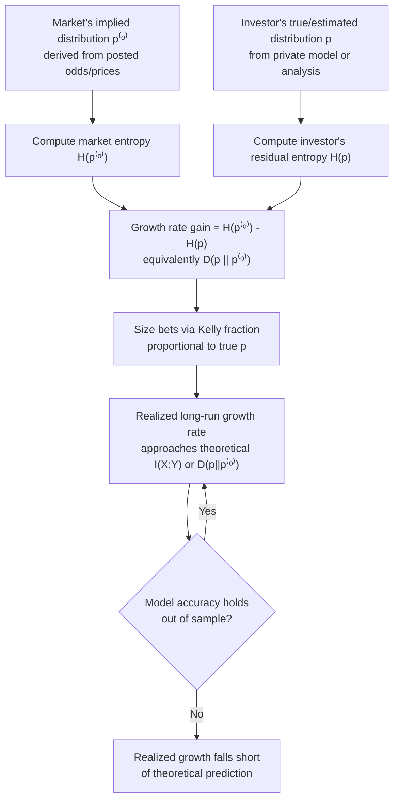

## Entropy and Investment Growth

### Overview

The relationship between entropy and investment growth formalizes how the statistical uncertainty (entropy) of a market's outcomes directly bounds and shapes the achievable long-run growth rate of an investor's wealth. This connects Shannon entropy, conditional entropy, and mutual information to Kelly/Cover-style growth-optimal portfolio theory, showing that the "horse race" market model is not merely an analogy but an exact mathematical correspondence between source coding problems and betting/investment problems. Higher market entropy (more inherent unpredictability) caps achievable growth from private information, while lower entropy (given side information) directly translates into higher achievable growth rate, following the same mathematics as channel capacity and data compression limits.

### The Horse Race Model as an Entropy-Growth Bridge

Cover and Thomas's canonical treatment uses a horse race with $m$ horses, true win probabilities $p_1, \ldots, p_m$, and fair-odds payouts $o_i = 1/p_i$ (i.e., the market correctly prices the true probabilities, offering zero house edge). Under proportional (Kelly) betting — wagering fraction $p_i$ of wealth on horse $i$ — the expected log-wealth growth rate per race is:

$$W = \sum_i p_i \log(p_i \cdot o_i) = \sum_i p_i \log(1) = 0$$

under fair odds with correct beliefs, confirming that no growth advantage exists when the market is already efficient (odds match true probabilities exactly, and the bettor has no additional information). Growth becomes possible only when either (a) odds are *not* fair (mispriced by the market) or (b) the bettor has *side information* not already reflected in the odds.

### Growth Rate Gain from Side Information Equals Mutual Information

The central entropy-growth result: if a gambler/investor observes side information $Y$ correlated with the true outcome $X$ (e.g., a signal, a forecast, insider information, or a predictive feature), the *increase* in achievable growth rate from having access to $Y$, compared to betting without it, is exactly:

$$\Delta W = W_Y - W = I(X; Y)$$

where $W_Y$ is the growth rate achievable using the side information optimally, and $W$ is the growth rate achievable without it. This result — that **the value of information in a repeated betting/investment game equals its mutual information with the outcome, measured in growth-rate units (bits per period)** — is one of the most direct and quotable bridges between information theory and financial decision theory.

This follows from decomposing entropy: $H(X) = H(X|Y) + I(X;Y)$. The uncertainty (entropy) about the outcome is reduced by exactly $I(X;Y)$ once $Y$ is known, and under the Kelly/fair-odds framework, growth rate is directly tied to this reduction in uncertainty — every bit of uncertainty resolved by side information becomes, under fair-odds proportional betting, one additional bit per period of guaranteed long-run exponential growth.

**(svg_diagram) Entropy Decomposition and Growth Rate Gain**

<svg xmlns="http://www.w3.org/2000/svg" viewBox="0 0 720 400">
\<style\>
.title { font: bold 17px sans-serif; fill: #1a1a2e; }
.block-label { font: 13px sans-serif; fill: #222; }
.small-label { font: 11px sans-serif; fill: #555; }
\</style\>
<rect width="720" height="400" fill="#fdfdfd" />
<text x="360" y="26" text-anchor="middle" class="title">H(X) = H(X|Y) + I(X;Y) → Growth Rate (svg_diagram)</text>
<rect x="60" y="70" width="600" height="70" rx="6" fill="#eaf2f8" stroke="#2b6cb0" stroke-width="2" />
<text x="360" y="112" text-anchor="middle" class="block-label">Total outcome uncertainty: H(X)</text>
<rect x="60" y="170" width="340" height="70" rx="6" fill="#fdf2e9" stroke="#e67e22" stroke-width="2" />
<text x="230" y="212" text-anchor="middle" class="block-label">Residual uncertainty: H(X|Y)</text>
<rect x="420" y="170" width="240" height="70" rx="6" fill="#eafaf1" stroke="#27ae60" stroke-width="2" />
<text x="540" y="200" text-anchor="middle" class="block-label">Resolved: I(X;Y)</text>
<text x="540" y="218" text-anchor="middle" class="small-label">= growth rate gain ΔW</text>
<path d="M 360 140 L 230 170" stroke="#666" stroke-width="1.5" stroke-dasharray="3,2" />
<path d="M 360 140 L 540 170" stroke="#666" stroke-width="1.5" stroke-dasharray="3,2" />
<rect x="120" y="280" width="480" height="80" rx="8" fill="#f4f0fb" stroke="#8e44ad" stroke-width="2" />
<text x="360" y="315" text-anchor="middle" class="block-label">W(with Y) = W(without Y) + I(X;Y)</text>
<text x="360" y="338" text-anchor="middle" class="small-label">every bit of resolved uncertainty = one bit/period of extra growth</text>
</svg>

### Doubling Rate and Entropy Rate for Stationary Processes

For a stationary stochastic process (rather than i.i.d. repeated identical bets), the relevant quantity generalizes from single-symbol entropy $H(X)$ to the **entropy rate** $H(\mathcal{X})$ of the process:

$$H(\mathcal{X}) = \lim_{n \to \infty} \frac{1}{n} H(X_1, X_2, \ldots, X_n)$$

The maximum achievable doubling rate for a gambler betting on this process under fair odds, using all past history optimally, converges to a quantity governed by the entropy rate of the process — lower entropy rate (more predictable, more structured sequences) permits higher achievable growth, mirroring exactly how lower entropy rate permits more efficient lossless compression in source coding. This is the same underlying mathematical object (entropy rate) appearing in two superficially different problems: optimal compression (minimum bits/symbol to losslessly encode a source) and optimal betting (maximum growth rate exploiting a source's structure).

**Key Points**

- Lossless source coding and growth-optimal betting are two faces of the same mathematical structure: both are governed by the entropy (rate) of the underlying stochastic process.
- A process with entropy rate $H(\mathcal{X})$ requires at least $H(\mathcal{X})$ bits/symbol to encode losslessly (compression limit) and simultaneously permits a maximum doubling rate directly related to that same $H(\mathcal{X})$ under an appropriately specified betting/odds model (growth limit).
- This duality is why information-theoretic tools developed for compression (arithmetic coding, universal coding, context-tree weighting) have direct analogues in growth-optimal betting algorithms (e.g., universal portfolios, as covered separately).

### Log-Optimal Growth and Redundancy / Excess Entropy

When a gambler's assumed probability model $q$ differs from the true distribution $p$, the shortfall in achievable growth rate relative to the true growth-optimal rate is exactly the KL divergence between the two distributions:

$$W(p) - W(q) = D(p \| q)$$

This mirrors the exact analogous result in source coding: using a code optimized for distribution $q$ to encode data actually generated by $p$ incurs an expected **redundancy** (excess bits per symbol relative to the entropy-optimal code) of precisely $D(p \| q)$. The same KL-divergence penalty structure governs both:

- **Compression**: coding to the wrong distribution wastes $D(p\|q)$ bits/symbol relative to optimal
- **Betting/investing**: betting to the wrong distribution sacrifices $D(p\|q)$ in growth rate/period relative to optimal

This equivalence is not a loose analogy — it follows from the same underlying log-probability mathematics, since both quantities reduce to expectations of log-probability ratios under the true distribution $p$.

### Worked Example: Quantifying an Analyst's Edge in Entropy Terms

Suppose a market has four equally likely outcomes (e.g., four candidates in an election market, fair odds of 4-to-1 each, implying market entropy $H(X) = \log_2 4 = 2$ bits). An analyst has a private forecasting model producing a probability distribution $p = (0.55, 0.20, 0.15, 0.10)$ over the same four outcomes, which turns out to match the true underlying probabilities exactly.

The analyst's residual entropy under their model is:

$$H(X) = -\sum_i p_i \log_2 p_i \approx -(0.55 \log_2 0.55 + 0.20\log_2 0.20 + 0.15\log_2 0.15 + 0.10 \log_2 0.10) \approx 1.71 \text{ bits}$$

The mutual information (equivalently here, the entropy reduction from the market's naive uniform assumption to the analyst's true model) is:

$$I \approx H(X)_{\text{market}} - H(X)_{\text{analyst}} = 2 - 1.71 = 0.29 \text{ bits per race}$$

Equivalently, this can be computed directly as the KL divergence between the analyst's true distribution and the market's implied uniform distribution:

$$D(p | p^{(o)}) = \sum_i p_i \log_2 \frac{p_i}{0.25} \approx 0.29 \text{ bits}$​

Under proportional (Kelly) betting exploiting this edge fully and repeatedly, the analyst's wealth grows at approximately $2^{0.29} \approx 1.22\times$ per race — a roughly 22% compounding growth rate per race, purely as a quantifiable consequence of possessing 0.29 bits/race of edge over the market's implied uniform prior.

[Unverified] This example assumes the analyst's model is exactly correct and that fair, frictionless proportional betting at the stated odds is available; real markets include vig/spread, liquidity constraints, and model uncertainty that reduce realized growth substantially below this theoretical figure.

### Process Flow: From Model Edge to Realized Growth

### Limitations of the Entropy-Growth Correspondence

- **Requires fair-odds or correctly-specified odds structure.** The clean $W = I(X;Y)$ and $W(p)-W(q) = D(p\|q)$ identities rely on specific odds-setting assumptions (proportional/fair odds); real-world markets with bid-ask spreads, vig, or non-proportional payout structures require modified formulas that still involve entropy-like quantities but are not identical to the clean textbook results.
- **Assumes accurate probability estimation.** As throughout Kelly-type theory, the entropy and mutual information quantities are only as good as the underlying probability model; estimation error propagates directly into growth-rate shortfall, itself quantifiable via the same $D(p\|q)$ framework applied to the estimation error rather than to genuine market inefficiency.
- **I.i.d. or stationary-ergodic assumptions.** The clean entropy-rate correspondence for sequential/repeated betting assumes some form of stationarity in the underlying process; genuinely non-stationary markets (regime changes, structural breaks) break the simple entropy-rate convergence guarantees, requiring adaptive or universal (distribution-free) methods instead.

### Related Topics

- Kelly criterion: single-bet formalization of the entropy-growth relationship
- Growth-optimal portfolios and universal portfolios (Cover)
- KL divergence as a unifying measure of coding redundancy and betting shortfall
- Entropy rate of stochastic processes and its role in source coding theorems
- Arbitrage-free pricing and market efficiency as zero-mutual-information conditions
- Universal source coding (Lempel-Ziv, context-tree weighting) and its betting analogues
- Asymptotic equipartition property (AEP) and its interpretation in betting contexts