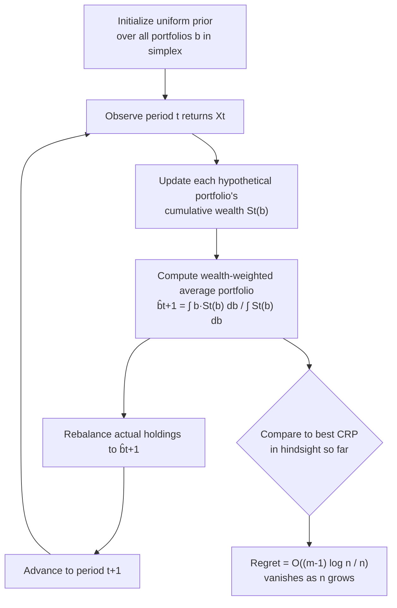

## Universal Portfolios

### Overview

Universal portfolios are a class of investment strategies, introduced by Thomas Cover, that achieve asymptotically optimal growth rate *without* assuming any statistical model for how asset prices evolve. Unlike Kelly betting or growth-optimal portfolio theory (which assume a known, typically i.i.d., return distribution), universal portfolio algorithms guarantee performance competitive with the best fixed-rebalancing strategy *in hindsight*, for essentially any sequence of market returns whatsoever — including adversarially chosen sequences. This makes universal portfolios a direct descendant of universal source coding and universal prediction in information theory, applied to sequential investment.

### Motivation: The Problem With Model-Dependent Growth Optimality

Classical growth-optimal portfolio theory (Kelly/Cover's log-optimal portfolio) requires knowing or correctly estimating the joint distribution of asset returns. If that distribution is misspecified, the realized growth rate falls short of the true optimum by exactly the KL divergence between the assumed and true distributions. In real markets, the "true" distribution of returns is never known with certainty and may not even be stationary.

Universal portfolios sidestep this dependency entirely by asking a different question: rather than "what is the best portfolio given a known return distribution," they ask "what algorithm, with no distributional assumptions at all, performs almost as well as the best possible fixed portfolio, chosen retrospectively with full knowledge of the realized returns?" This reframing converts the problem from parametric estimation into **universal prediction / universal coding**, a well-established branch of information theory concerned with algorithms that perform well against every element of a comparison class without prior knowledge of which element the world will resemble.

### The Universal Portfolio Algorithm

Cover's original universal portfolio is defined as a wealth-weighted average over the entire simplex of constant-rebalanced portfolios (CRPs). Let $\mathbf{b}$ range over all valid portfolio vectors (the probability simplex $\Delta_n$), and let $S_n(\mathbf{b})$ denote the wealth a fixed portfolio $\mathbf{b}$ would have achieved over the first $n$ periods. The universal portfolio's holdings at period $n+1$ are:

$$\hat{b}_{n+1} = \frac{\int_{\Delta_n} \mathbf{b} \, S_n(\mathbf{b}) \, d\mathbf{b}}{\int_{\Delta_n} S_n(\mathbf{b}) \, d\mathbf{b}}$$

Equivalently, this can be interpreted as placing a uniform prior over all possible CRPs, then updating that prior by each portfolio's realized (Bayesian-like) performance-weight, and rebalancing to the resulting posterior mean allocation each period. Practically, this is implemented either via direct numerical integration over the simplex (for low-dimensional asset universes) or via Monte Carlo / MCMC sampling of the simplex for higher-dimensional cases, since the exact integral becomes computationally intractable for large numbers of assets.

**(svg_diagram) Universal Portfolio as Performance-Weighted Mixture**

<svg xmlns="http://www.w3.org/2000/svg" viewBox="0 0 720 400">
\<style\>
.title { font: bold 17px sans-serif; fill: #1a1a2e; }
.block-label { font: 13px sans-serif; fill: #222; }
.small-label { font: 11px sans-serif; fill: #555; }
\</style\>
<rect width="720" height="400" fill="#fdfdfd" />
<text x="360" y="26" text-anchor="middle" class="title">Universal Portfolio Mixture Construction (svg_diagram)</text>

<rect x="40" y="70" width="640" height="60" rx="6" fill="#eaf2f8" stroke="#2b6cb0" stroke-width="1.5" />
<text x="360" y="105" text-anchor="middle" class="block-label">Simplex of all possible constant-rebalanced portfolios b ∈ Δn</text>

<path d="M 360 130 L 360 165" stroke="#333" stroke-width="2" marker-end="url(#arrow3)" />

<rect x="40" y="170" width="640" height="60" rx="6" fill="#fdf2e9" stroke="#e67e22" stroke-width="1.5" />
<text x="360" y="205" text-anchor="middle" class="block-label">Weight each b by its realized wealth Sn(b) so far</text>

<path d="M 360 230 L 360 265" stroke="#333" stroke-width="2" marker-end="url(#arrow3)" />

<rect x="40" y="270" width="640" height="60" rx="6" fill="#eafaf1" stroke="#27ae60" stroke-width="1.5" />
<text x="360" y="305" text-anchor="middle" class="block-label">Rebalance to performance-weighted average portfolio b̂n+1</text>

<text x="360" y="360" text-anchor="middle" class="small-label">No distributional assumption — regret bound holds for any realized return sequence</text>
</svg>

### The Universal Regret Bound

Cover's central theoretical result is a worst-case, distribution-free regret bound. Let $\mathbf{b}^*$ denote the best constant-rebalanced portfolio *in hindsight* (chosen with full knowledge of the entire realized return sequence), and let $\hat{S}_n$ denote the wealth achieved by the universal portfolio after $n$ periods. Then:

$$\frac{1}{n} \log \frac{S_n(\mathbf{b}^*)}{\hat{S}_n} = O\left(\frac{(m-1)\log n}{n}\right)$$

where $m$ is the number of assets. Critically, this bound holds for **every possible sequence of market returns**, with no probabilistic or stationarity assumption whatsoever — it is a worst-case, individual-sequence guarantee, precisely analogous to universal source coding redundancy bounds (e.g., in the context of Lempel-Ziv coding or minimax universal coding), where redundancy relative to the best fixed code in a comparison class vanishes at a rate governed by the number of free parameters and the sequence length.

**Key Points**

- The regret term shrinks as $O(\log n / n)$ per period, meaning the *per-period* growth-rate gap to the best-in-hindsight CRP vanishes asymptotically.
- The number of assets $m$ enters the bound linearly (via $m-1$ degrees of freedom in the simplex), meaning the convergence is slower with more assets — a manifestation of the same "more parameters, more redundancy" trade-off familiar from universal coding with larger model classes.
- No assumption is made about how returns are generated: they can be adversarial, non-stationary, or arbitrary, and the bound still holds — this worst-case robustness is the defining feature distinguishing universal portfolios from classical growth-optimal portfolio theory.

### Correspondence to Universal Source Coding

The mathematical machinery underlying universal portfolios is essentially identical to that of universal source coding, particularly the mixture/Bayesian-averaging approach to universal coding (e.g., the Krichevsky-Trofimov estimator for coding binary sequences without knowing the true bias in advance). In both settings:

| Universal Source Coding | Universal Portfolio |
|---|---|
| Unknown true source distribution | Unknown true return-generating process |
| Comparison class: all fixed-parameter codes | Comparison class: all constant-rebalanced portfolios |
| Mixture over model class weighted by likelihood | Mixture over portfolio simplex weighted by wealth |
| Redundancy relative to best code in hindsight | Growth-rate regret relative to best CRP in hindsight |
| Redundancy bound: $O(k \log n / n)$, $k$ = parameters | Regret bound: $O((m-1)\log n / n)$, $m$ = assets |
| Achieves minimax-optimal redundancy | Achieves minimax-optimal regret |

This correspondence is not superficial: both problems reduce to the same information-theoretic question of how well a single adaptive strategy (encoder or portfolio) can track the best member of a comparison class without knowing in advance which member will turn out to be best, and both are solved via essentially the same Bayesian-mixture-over-a-parameter-space technique with matching asymptotic redundancy/regret rates.

### Worked Example: Two-Asset Universal Portfolio Over a Short Horizon

Consider two assets over 3 periods with per-period gross returns:

- Period 1: Asset A ×1.20, Asset B ×0.90
- Period 2: Asset A ×0.85, Asset B ×1.15
- Period 3: Asset A ×1.10, Asset B ×1.05

A uniform-mixture universal portfolio starts at $\mathbf{b}_1 = (0.5, 0.5)$. After observing period 1's returns, the "in-hindsight" evaluation begins weighting portfolios that would have favored Asset A more heavily (since it outperformed in period 1), shifting the period-2 allocation modestly toward A — but not fully, since the universal portfolio hedges against the possibility that period 1 was not representative.

By period 3, after A has underperformed in period 2, the mixture pulls back partway toward B again. Across the full 3-period window, the best CRP in hindsight (computed by grid search or calculus over $b \in [0,1]$ for the fraction in A) will typically outperform the universal portfolio's realized wealth by only a small margin — this gap is exactly the regret quantity the $O((m-1)\log n/n)$ bound characterizes, and it shrinks in relative (per-period) terms as more periods are observed. [Unverified] The specific numerical regret value for this exact 3-period example depends on precise integration over the simplex and is not derived symbolically here; the qualitative behavior (partial, hedged adaptation toward the retrospectively-better asset) is the well-established, documented property being illustrated.

### Process Flow: Universal Portfolio Rebalancing Loop

### Practical Variants and Extensions

- **Side-information universal portfolios**: extensions incorporating side information (analogous to Kelly betting with side information) achieve regret bounds that also account for the informativeness of the side channel, blending the universal-portfolio and mutual-information perspectives.
- **Switching / non-stationary universal portfolios**: variants designed to compete not against a single best fixed CRP, but against the best sequence of CRPs with a bounded number of "switches," relevant when the best allocation genuinely changes over time (regime shifts) rather than remaining fixed.
- **Computationally efficient approximations**: because the exact simplex integral is intractable for realistic numbers of assets, practical implementations use online convex optimization techniques (e.g., online gradient descent, follow-the-regularized-leader) that achieve similar worst-case regret guarantees with far lower computational cost than direct integration.
- **Transaction-cost-aware universal portfolios**: the original formulation assumes frictionless, continuous rebalancing; variants incorporating proportional transaction costs modify the regret bound and often favor less frequent rebalancing.

[Inference] The practical performance of universal portfolios relative to simpler fixed-allocation or momentum-based strategies in live markets is empirically mixed and depends heavily on transaction costs, rebalancing frequency, and the actual (non-adversarial, often trending or mean-reverting) structure of real markets, which differs from the worst-case adversarial setting the theoretical guarantees are designed for.

### Limitations

- **No guarantee of positive absolute return.** Universal portfolios guarantee competitiveness with the best CRP in hindsight, not a positive return in absolute terms — if all assets in the universe perform poorly, the best CRP in hindsight (and hence the universal portfolio tracking it) can still lose money.
- **Computational cost scales poorly with asset count.** The exact simplex-integral formulation is only practical for a handful of assets; realistic portfolios with dozens or hundreds of assets require the approximate/online-optimization variants, which have somewhat different (though still favorable) regret guarantees.
- **Comparison class is restricted to constant-rebalanced portfolios.** The guarantee is relative to the best *fixed-fraction, continuously rebalanced* strategy, not the best possible trading strategy overall — dynamic strategies with lookback, leverage, or short-selling are outside the comparison class, so a universal portfolio's regret is only meaningful relative to this specific, if broad, strategy family.

### Related Topics

- Growth-optimal portfolios and Cover's log-optimal portfolio theory
- Universal source coding and the Krichevsky-Trofimov estimator
- Online convex optimization and regret minimization in sequential decision-making
- Kelly criterion with side information
- Minimax redundancy in universal coding
- Follow-the-regularized-leader and online gradient descent for portfolio selection
- Non-stationary/switching regret bounds in online learning