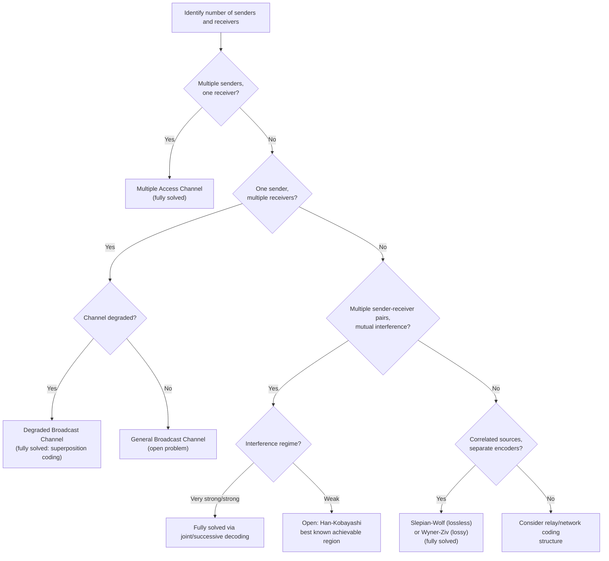

## Multiterminal Information Theory

### Overview

Multiterminal (or multi-user) information theory extends Shannon's original point-to-point communication framework — a single sender, single receiver, single channel — to networks involving multiple senders, multiple receivers, or both, often sharing a common medium or having correlated information. Unlike point-to-point channel capacity, which has a complete, closed-form single-letter characterization (Shannon's noisy-channel coding theorem), most multiterminal problems remain only partially solved, with several canonical open problems that have resisted complete characterization for decades. This makes multiterminal information theory one of the most active and theoretically rich subfields of information theory, blending network coding, distributed source coding, and multi-user channel capacity.

### Why Multiterminal Problems Are Fundamentally Harder

In point-to-point communication, Shannon's coding theorem provides a single-letter mutual-information expression, $C = \max_{p(x)} I(X;Y)$, that is both achievable and a tight converse bound. In multiterminal settings, this clean structure typically breaks down for several structural reasons:

- **Interference between multiple senders** cannot generally be resolved by simple time-sharing or independent coding; the optimal strategy often requires *joint* encoding across multiple messages (e.g., superposition coding, dirty-paper coding).
- **Correlated sources observed at different locations** cannot be compressed independently at the sum of their marginal entropies without loss; the Slepian-Wolf theorem shows something more subtle is achievable, but generalizations to more complex correlation and side-information structures remain open.
- **Feedback and cooperation among terminals** can enlarge the achievable region in ways that are difficult to characterize with single-letter formulas, and in many cases it remains unknown whether feedback increases capacity at all for certain channel classes.
- **The capacity region itself (not just a single number) must be characterized** — since with multiple users, there are trade-offs between different users' rates, requiring a full-dimensional achievable rate *region*, not a single capacity value.

### Distributed Source Coding: The Slepian-Wolf Theorem

The **Slepian-Wolf theorem** addresses lossless compression of two correlated sources $X$ and $Y$ observed at physically separate encoders (who cannot communicate with each other) but decoded jointly at a single receiver. Remarkably, Slepian and Wolf showed that this **separate encoding, joint decoding** setup can achieve the same total rate as if the encoders could cooperate — provided the rate pair $(R_X, R_Y)$ lies within the achievable region:

$$R_X \geq H(X|Y), \quad R_Y \geq H(Y|X), \quad R_X + R_Y \geq H(X,Y)$$

This is a striking result: even without any communication between the two encoders, distributed compression can achieve the same total rate, $H(X,Y)$, as joint encoding would — the loss of cooperation costs nothing in the sum rate, only in how the required rate is *split* between the two encoders. This defies the naive intuition that separate encoders would need to each pay the full marginal entropy (which would give $H(X) + H(Y) \geq H(X,Y) + I(X;Y)$, wasting $I(X;Y)$ bits).

**(svg_diagram) Slepian-Wolf Achievable Rate Region**

<svg xmlns="http://www.w3.org/2000/svg" viewBox="0 0 700 420">
\<style\>
.title { font: bold 17px sans-serif; fill: #1a1a2e; }
.axis-label { font: 13px sans-serif; fill: #333; }
.point-label { font: 11px sans-serif; fill: #222; }
\</style\>
<rect width="700" height="420" fill="#fdfdfd" />
<text x="350" y="26" text-anchor="middle" class="title">Slepian-Wolf Rate Region (svg_diagram)</text>

<line x1="90" y1="360" x2="620" y2="360" stroke="#333" stroke-width="1.5" />
<line x1="90" y1="360" x2="90" y2="60" stroke="#333" stroke-width="1.5" />
<text x="355" y="392" text-anchor="middle" class="axis-label">Rate Rx</text>
<text x="35" y="215" text-anchor="middle" class="axis-label" transform="rotate(-90 35 215)">Rate Ry</text>

<line x1="230" y1="360" x2="230" y2="140" stroke="#2b6cb0" stroke-width="2.5" />
<text x="235" y="380" class="point-label" fill="#2b6cb0">H(X|Y)</text>

<line x1="230" y1="140" x2="600" y2="140" stroke="#2b6cb0" stroke-width="2.5" />
<text x="60" y="145" class="point-label" fill="#2b6cb0">H(Y|X)</text>

<line x1="230" y1="140" x2="230" y2="140" stroke="#27ae60" stroke-width="0" />
<path d="M 90 300 L 230 140" stroke="#27ae60" stroke-width="0" />

<path d="M 90 360 L 90 300 L 230 140 L 600 140" fill="none" stroke="#27ae60" stroke-width="2.5" stroke-dasharray="6,3" />
<text x="130" y="230" class="point-label" fill="#27ae60">Rx + Ry ≥ H(X,Y)</text>

<path d="M 230 140 L 600 140 L 600 60 L 230 60 Z M 230 140 L 230 360 L 600 360 L 600 140 Z" fill="#2b6cb0" opacity="0.05" />

<circle cx="230" cy="140" r="6" fill="#c0392b" />
<text x="245" y="130" class="point-label" fill="#c0392b">Corner point:</text>
<text x="245" y="144" class="point-label" fill="#c0392b">(H(X|Y), H(Y))</text>

<circle cx="400" cy="240" r="6" fill="#8e44ad" />
<text x="410" y="235" class="point-label">Interior point:</text>
<text x="410" y="249" class="point-label">achievable via time-sharing</text>
</svg>

**Key Points**

- The Slepian-Wolf result is achieved using random binning: each encoder independently assigns source sequences to random "bins," and the joint decoder uses the correlation structure between $X$ and $Y$ to resolve ambiguity within bins.
- Practical Slepian-Wolf coding (e.g., using LDPC or turbo-code-based syndrome coding) has been implemented in distributed video coding and sensor network compression, though achieving the exact theoretical rate region in practice requires careful code design.
- The theorem generalizes to more than two sources, though the resulting rate region becomes a polytope in higher dimensions with more complex constraints for each subset of sources.

### The Multiple Access Channel (MAC)

The **multiple access channel** models multiple independent senders transmitting to a single common receiver over a shared channel. For two senders with independent messages, the capacity region (for a discrete memoryless MAC with fixed input distributions $p(x_1), p(x_2)$) is the set of rate pairs $(R_1, R_2)$ satisfying:

$$R_1 \leq I(X_1; Y | X_2), \quad R_2 \leq I(X_2; Y | X_1), \quad R_1 + R_2 \leq I(X_1, X_2; Y)$$

with the overall capacity region given by the convex hull of the union of such regions over all input distributions $p(x_1)p(x_2)$. This is one of the few multiterminal problems with a **complete, closed-form solution** — unlike many multiterminal channel problems, MAC capacity was fully characterized (by Ahlswede and Liao, independently, in the early 1970s), including matching achievability (via **successive interference cancellation**, i.e., decoding one user's signal, subtracting it, then decoding the other) and converse arguments.

**(svg_diagram) Multiple Access Channel Capacity Region**

<svg xmlns="http://www.w3.org/2000/svg" viewBox="0 0 700 420">
\<style\>
.title { font: bold 17px sans-serif; fill: #1a1a2e; }
.axis-label { font: 13px sans-serif; fill: #333; }
.point-label { font: 11px sans-serif; fill: #222; }
\</style\>
<rect width="700" height="420" fill="#fdfdfd" />
<text x="350" y="26" text-anchor="middle" class="title">MAC Capacity Region (svg_diagram)</text>

<line x1="90" y1="360" x2="620" y2="360" stroke="#333" stroke-width="1.5" />
<line x1="90" y1="360" x2="90" y2="60" stroke="#333" stroke-width="1.5" />
<text x="355" y="392" text-anchor="middle" class="axis-label">R1</text>
<text x="35" y="215" text-anchor="middle" class="axis-label" transform="rotate(-90 35 215)">R2</text>

<path d="M 90 200 L 380 200 L 480 100 L 480 60" fill="none" stroke="#2b6cb0" stroke-width="0" />

<path d="M 90 360 L 90 200 L 380 200 L 480 100 L 480 60" fill="#2b6cb0" opacity="0.07" stroke="none" />
<path d="M 90 200 L 380 200" stroke="#2b6cb0" stroke-width="2.5" />
<path d="M 380 200 L 480 100" stroke="#27ae60" stroke-width="2.5" />
<path d="M 480 100 L 480 60" stroke="#2b6cb0" stroke-width="0" />
<line x1="90" y1="200" x2="90" y2="360" stroke="#2b6cb0" stroke-width="2.5" />
<line x1="480" y1="60" x2="480" y2="100" stroke="#2b6cb0" stroke-width="2.5" />

<text x="30" y="200" class="point-label" fill="#2b6cb0">I(X2;Y|X1)</text>
<text x="475" y="45" class="point-label" fill="#2b6cb0">I(X1;Y|X2)</text>
<text x="230" y="185" class="point-label" fill="#27ae60">R1+R2 ≤ I(X1,X2;Y)</text>

<circle cx="380" cy="200" r="6" fill="#c0392b" />
<text x="390" y="195" class="point-label" fill="#c0392b">Corner: successive</text>
<text x="390" y="209" class="point-label" fill="#c0392b">cancellation, decode 1 first</text>
</svg>

### The Broadcast Channel

The **broadcast channel** is the "reverse" scenario: a single sender transmits to multiple receivers, potentially sending a common message (intended for all receivers) and/or private messages (intended for specific receivers only). Unlike the MAC, the broadcast channel's capacity region is **not fully known in general** — it has been solved completely only for specific important special cases, most notably the **degraded broadcast channel**, where one receiver's channel is (in a precise statistical sense) a degraded version of the other's.

For the degraded broadcast channel (receiver 2 sees a "worse" version of the signal than receiver 1), the capacity region is characterized using **superposition coding**: the sender encodes the message for the weaker receiver in a coarse, robust "cloud center," and superimposes a finer message for the stronger receiver as a refinement within each cloud. The achievable rate region is:

$$R_2 \leq I(U; Y_2), \quad R_1 \leq I(X; Y_1 | U)$$

for an auxiliary random variable $U$ representing the "cloud center" codeword, optimized over the joint distribution $p(u)p(x|u)$.

[Inference] The general (non-degraded) broadcast channel capacity region remains an open problem in information theory; only specific structured cases (degraded, semi-deterministic, certain Gaussian and more-capable variants) have complete characterizations, and this is widely acknowledged as unresolved in the literature rather than a settled result.

### The Relay Channel

The **relay channel** involves a source, a destination, and one or more intermediate relay nodes that can hear the source's transmission and assist in forwarding information to the destination. Unlike simple repeaters, information-theoretically optimal relaying can use sophisticated strategies:

- **Decode-and-forward**: the relay fully decodes the source's message, then re-encodes and forwards it, achieving good performance when the source-relay link is strong.
- **Compress-and-forward**: the relay does not attempt to decode the message but instead compresses (using Wyner-Ziv-style source coding with side information at the destination) its noisy observation and forwards the compressed version, useful when the source-relay link is weak but the relay-destination link is strong.
- **Amplify-and-forward**: the simplest strategy, where the relay merely retransmits a scaled version of its received (noisy) signal, without decoding or compressing.

Cover and El Gamal's classical result establishes achievable rate regions for decode-and-forward and compress-and-forward strategies, and shows that the relay channel's capacity is known exactly only in specific cases (e.g., the degraded relay channel), while the general relay channel capacity — like the general broadcast channel — remains an open problem.

### The Interference Channel

The **interference channel** models two (or more) sender-receiver pairs sharing a common medium, where each sender wishes to communicate only with its own receiver, but each receiver's signal is corrupted by interference from the *other* sender. Unlike the MAC (where both messages go to the same receiver, so joint decoding is natural) or broadcast channel (single sender, so joint encoding is natural), the interference channel has neither joint encoding nor joint decoding, making it structurally the hardest of the classical two-user network models.

The capacity region of the general interference channel remains **unknown** except in specific regimes:

- **Very strong interference**: interference is so strong that each receiver can fully decode and cancel the other's message before decoding its own; capacity in this regime equals what would be achievable with no interference at all.
- **Strong interference**: less extreme, but the Han-Kobayashi coding scheme achieves the capacity in this specific regime.
- **Weak interference**: no complete general characterization exists; the best known achievable region is due to Han and Kobayashi (1981), which uses rate-splitting — each transmitter splits its message into a public part (decodable at both receivers, allowing interference to be partially cancelled) and a private part (decodable only at the intended receiver) — and this Han-Kobayashi region remains, decades later, the best known achievable region for the general two-user interference channel, though it is not proven to be exactly the capacity region except in special cases.

[Inference] Whether the Han-Kobayashi achievable region equals the true capacity region for the general (weak interference) two-user interference channel remains one of the best-known open problems in network information theory, and closing this gap (or proving the region is strictly suboptimal) has resisted solution for over four decades.

### Network Coding

**Network coding** generalizes multiterminal information theory to arbitrary directed graph networks, where intermediate nodes may combine (not merely forward) incoming information before relaying it onward. The canonical result establishing network coding's value is the **butterfly network**, where a simple binary combination (XOR) at an intermediate node allows two source-destination pairs to achieve their max-flow min-cut bound simultaneously — a rate unachievable using routing (simple forwarding) alone.

The **max-flow min-cut theorem for network coding** (Ahlswede, Cai, Li, Yeung, 2000) establishes that for a single source multicasting to multiple sinks over a network of error-free links, the achievable rate to each sink equals the max-flow (min-cut) from source to that sink — and this is achievable *simultaneously to all sinks* using linear network coding, even when simple routing cannot achieve this simultaneously.

**(svg_diagram) Butterfly Network Coding Example**

<svg xmlns="http://www.w3.org/2000/svg" viewBox="0 0 640 440">
\<style\>
.title { font: bold 17px sans-serif; fill: #1a1a2e; }
.node-label { font: bold 13px sans-serif; fill: #fff; }
.edge-label { font: 11px sans-serif; fill: #555; }
\</style\>
<rect width="640" height="440" fill="#fdfdfd" />
<text x="320" y="26" text-anchor="middle" class="title">Butterfly Network: XOR Coding Gain (svg_diagram)</text>

<circle cx="320" cy="70" r="26" fill="#2b6cb0" />
<text x="320" y="76" text-anchor="middle" class="node-label">S</text>

<circle cx="160" cy="160" r="24" fill="#27ae60" />
<text x="160" y="166" text-anchor="middle" class="node-label">a</text>
<circle cx="480" cy="160" r="24" fill="#27ae60" />
<text x="480" y="166" text-anchor="middle" class="node-label">b</text>

<circle cx="320" cy="240" r="24" fill="#e67e22" />
<text x="320" y="246" text-anchor="middle" class="node-label">X⊕Y</text>

<circle cx="160" cy="330" r="24" fill="#8e44ad" />
<text x="160" y="336" text-anchor="middle" class="node-label">T1</text>
<circle cx="480" cy="330" r="24" fill="#8e44ad" />
<text x="480" y="336" text-anchor="middle" class="node-label">T2</text>

<line x1="300" y1="90" x2="180" y2="140" stroke="#333" stroke-width="2" />
<text x="220" y="110" class="edge-label">X</text>
<line x1="340" y1="90" x2="460" y2="140" stroke="#333" stroke-width="2" />
<text x="410" y="110" class="edge-label">Y</text>

<line x1="160" y1="184" x2="300" y2="222" stroke="#333" stroke-width="2" />
<line x1="480" y1="184" x2="340" y2="222" stroke="#333" stroke-width="2" />

<line x1="300" y1="258" x2="180" y2="308" stroke="#e67e22" stroke-width="2.5" />
<text x="210" y="290" class="edge-label" fill="#e67e22">X⊕Y</text>
<line x1="340" y1="258" x2="460" y2="308" stroke="#e67e22" stroke-width="2.5" />
<text x="380" y="290" class="edge-label" fill="#e67e22">X⊕Y</text>

<line x1="160" y1="184" x2="160" y2="306" stroke="#333" stroke-width="2" stroke-dasharray="4,3" />
<text x="100" y="250" class="edge-label">X (direct)</text>
<line x1="480" y1="184" x2="480" y2="306" stroke="#333" stroke-width="2" stroke-dasharray="4,3" />
<text x="490" y="250" class="edge-label">Y (direct)</text>

<text x="320" y="410" text-anchor="middle" class="edge-label">T1 recovers Y from (X⊕Y) and known X; T2 recovers X similarly — both achieve rate 1 simultaneously, unlike pure routing</text>
</svg>

### Correlated Sources With Side Information: Wyner-Ziv and Beyond

Beyond Slepian-Wolf lossless compression, **lossy** distributed source coding with side information at the decoder is characterized by the **Wyner-Ziv theorem**, which generalizes rate-distortion theory to the setting where the decoder has access to correlated side information $Y$ not available to the encoder. The Wyner-Ziv rate-distortion function is generally strictly greater than the rate achievable if the encoder also had access to $Y$ (i.e., there is generally a nonzero cost to the encoder's ignorance of the side information), except in special cases (e.g., the quadratic Gaussian case, where Wyner-Ziv achieves the same rate as if the encoder knew $Y$ — a notable exception sometimes called the "no rate loss" result for jointly Gaussian sources).

### Table: Solved vs. Open Multiterminal Problems

| Problem | Status | Key Technique |
|---|---|---|
| Point-to-point channel capacity | Fully solved (Shannon) | Random coding, typical sequences |
| Multiple access channel (MAC) | Fully solved | Successive interference cancellation |
| Slepian-Wolf distributed source coding | Fully solved | Random binning |
| Wyner-Ziv (lossy, side info at decoder) | Fully solved | Binning + rate-distortion |
| Degraded broadcast channel | Fully solved | Superposition coding |
| General broadcast channel | Open | Best known: superposition + auxiliary variables |
| Degraded relay channel | Fully solved | Decode-and-forward |
| General relay channel | Open | Decode/compress/amplify-forward (achievability only) |
| Very strong / strong interference channel | Fully solved | Joint/successive decoding |
| General (weak) interference channel | Open | Han-Kobayashi rate-splitting (best known achievable region) |
| Single-source network multicast | Fully solved | Linear network coding, max-flow min-cut |
| General multi-source network coding | Open | Various inner/outer bounds, no general capacity characterization |

### Process Flow: Classifying a Multiterminal Problem

### Why Multiterminal Theory Matters Beyond Pure Theory

Multiterminal information theory underlies the theoretical performance limits of essentially all modern multi-user communication systems: cellular networks (uplink as a MAC, downlink as a broadcast channel), sensor networks (Slepian-Wolf-style distributed compression), device-to-device and mesh networks (relay and interference channel models), and content distribution networks (network coding for multicast efficiency). Even where exact capacity regions remain open (broadcast, general interference, general relay, general network coding), the achievable regions and outer bounds developed in this field directly inform practical system design choices such as interference alignment, superposition coding in modern cellular standards, and distributed compression schemes in sensor networks.

[Inference] The direct practical adoption of information-theoretically optimal multiterminal coding schemes (e.g., full Han-Kobayashi rate-splitting, exact Wyner-Ziv binning) in commercial systems is often partial or approximate, since practical constraints (complexity, latency, backward compatibility) frequently favor simplified, near-optimal engineering approximations over the theoretically exact schemes.

### Related Topics

- Network coding and the max-flow min-cut theorem for multicast
- Interference alignment as a practical approximation to Han-Kobayashi rate-splitting
- Distributed source coding for sensor networks (practical Slepian-Wolf implementations)
- Gaussian multiterminal source and channel coding (quadratic Gaussian special cases)
- Information-theoretic security in multi-user channels (wiretap channel extensions)
- Deterministic and linear deterministic models for approximating Gaussian network capacity
- Rate-distortion theory and its Wyner-Ziv extension with decoder side information