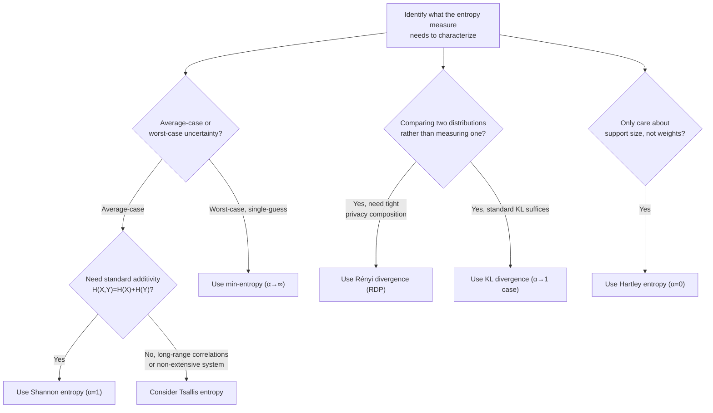

## Rényi Entropy and Generalized Entropies

### Overview

Rényi entropy is a one-parameter family of entropy measures that generalizes Shannon entropy, introduced by Alfréd Rényi in 1961 by relaxing one of the axioms Shannon entropy satisfies (specifically, the additivity/averaging axiom) while retaining the others. This generalization is not merely a mathematical curiosity: different values of the Rényi parameter $\alpha$ recover or relate to distinct, independently important quantities — collision entropy, min-entropy, Hartley entropy, and Shannon entropy itself all emerge as special cases — making the Rényi family a unifying framework across information theory, cryptography, ecology, and statistical physics. Alongside Rényi entropy, several other generalized entropy families (Tsallis entropy, Havrda-Charvát entropy) address similar generalization goals via related but distinct axiomatic routes.

### Definition and the Role of the Order Parameter α

For a discrete probability distribution $p = (p_1, \ldots, p_n)$, the Rényi entropy of order $\alpha$ (for $\alpha \geq 0$, $\alpha \neq 1$) is defined as:

$$H_\alpha(p) = \frac{1}{1-\alpha} \log \left( \sum_{i=1}^n p_i^\alpha \right)$$

The parameter $\alpha$ controls how strongly the entropy measure weights high-probability versus low-probability events. As $\alpha$ increases from 0 toward infinity, $H_\alpha$ becomes increasingly dominated by the highest-probability outcomes; as $\alpha$ decreases toward 0, $H_\alpha$ becomes increasingly sensitive to the mere *support* of the distribution (which outcomes have nonzero probability) rather than their relative weights.

**Key Points**

- Rényi entropy is non-increasing in $\alpha$: $H_\alpha(p) \geq H_\beta(p)$ whenever $\alpha \leq \beta$, for any fixed distribution $p$ — higher-order Rényi entropies are always less than or equal to lower-order ones.
- All Rényi entropies of a distribution with full support on $n$ outcomes are bounded above by $\log n$ (achieved when $p$ is uniform, for every value of $\alpha$) and bounded below by 0 (achieved when $p$ is a point mass).
- Unlike Shannon entropy, Rényi entropy for $\alpha \neq 1$ does **not** satisfy the standard chain rule $H(X,Y) = H(X) + H(Y|X)$ in general, reflecting the relaxed additivity axiom that defines the whole family.

### Special Cases of the Rényi Family

**(svg_diagram) Rényi Entropy Order Parameter and Named Special Cases**

<svg xmlns="http://www.w3.org/2000/svg" viewBox="0 0 720 340">
\<style\>
.title { font: bold 17px sans-serif; fill: #1a1a2e; }
.label { font: 12px sans-serif; fill: #222; }
.small-label { font: 10px sans-serif; fill: #555; }
\</style\>
<rect width="720" height="340" fill="#fdfdfd" />
<text x="360" y="26" text-anchor="middle" class="title">The Rényi Entropy Spectrum (svg_diagram)</text>

<line x1="60" y1="200" x2="660" y2="200" stroke="#333" stroke-width="2" />
<text x="360" y="230" text-anchor="middle" class="small-label">order parameter α (0 → ∞)</text>

<circle cx="90" cy="200" r="7" fill="#c0392b" />
<text x="90" y="170" text-anchor="middle" class="label">α = 0</text>
<text x="90" y="255" text-anchor="middle" class="small-label">Hartley entropy</text>
<text x="90" y="268" text-anchor="middle" class="small-label">log(support size)</text>

<circle cx="270" cy="200" r="7" fill="#e67e22" />
<text x="270" y="170" text-anchor="middle" class="label">α → 1</text>
<text x="270" y="255" text-anchor="middle" class="small-label">Shannon entropy</text>
<text x="270" y="268" text-anchor="middle" class="small-label">-Σ p log p</text>

<circle cx="450" cy="200" r="7" fill="#27ae60" />
<text x="450" y="170" text-anchor="middle" class="label">α = 2</text>
<text x="450" y="255" text-anchor="middle" class="small-label">Collision entropy</text>
<text x="450" y="268" text-anchor="middle" class="small-label">-log Σ p²</text>

<circle cx="620" cy="200" r="7" fill="#8e44ad" />
<text x="620" y="170" text-anchor="middle" class="label">α → ∞</text>
<text x="620" y="255" text-anchor="middle" class="small-label">Min-entropy</text>
<text x="620" y="268" text-anchor="middle" class="small-label">-log(max p)</text>

<line x1="90" y1="193" x2="90" y2="207" stroke="#333" stroke-width="1.5" />
<line x1="270" y1="193" x2="270" y2="207" stroke="#333" stroke-width="1.5" />
<line x1="450" y1="193" x2="450" y2="207" stroke="#333" stroke-width="1.5" />
<line x1="620" y1="193" x2="620" y2="207" stroke="#333" stroke-width="1.5" />
</svg>

**Hartley Entropy ($\alpha = 0$).** As $\alpha \to 0$, the Rényi entropy reduces to $H_0(p) = \log |\{i : p_i > 0\}|$ — simply the logarithm of the number of outcomes with nonzero probability, entirely ignoring the actual probability values (the "max entropy" or Hartley measure, predating Shannon's work).

**Shannon Entropy ($\alpha \to 1$).** Taking the limit $\alpha \to 1$ (via L'Hôpital's rule, since the defining expression is undefined at $\alpha = 1$) recovers exactly the familiar Shannon entropy:

$$\lim_{\alpha \to 1} H_\alpha(p) = -\sum_i p_i \log p_i = H(p)$$

This limiting recovery is why Shannon entropy is often described as sitting "in the middle" of the Rényi family — the unique point where the additivity axiom holds exactly, rather than merely approximately or asymptotically.

**Collision Entropy ($\alpha = 2$).** At $\alpha = 2$:

$$H_2(p) = -\log \sum_i p_i^2$$

This is called collision entropy because $\sum_i p_i^2$ is exactly the probability that two independent samples drawn from $p$ collide (are equal to each other) — a quantity of direct practical importance in hash function analysis, birthday-paradox-style collision estimation, and random number generator quality testing.

**Min-Entropy ($\alpha \to \infty$).** As $\alpha \to \infty$, Rényi entropy converges to:

$$H_\infty(p) = -\log \max_i p_i$$

Min-entropy depends only on the single most probable outcome, making it the most conservative (smallest-valued, worst-case) member of the Rényi family. Min-entropy has particular importance in **cryptography**, where it quantifies the guessing resistance of a secret against a single-guess adversary — an adversary's best strategy to guess a secret in one attempt succeeds with probability exactly $2^{-H_\infty(p)}$ (in bits), making min-entropy the operationally correct quantity for randomness-extraction and key-derivation security proofs, where Shannon entropy would give an overly optimistic (too-generous) security estimate.

### Why Min-Entropy Matters More Than Shannon Entropy in Cryptography

A critical practical distinction: Shannon entropy measures *average* uncertainty across many independent guesses/observations, while min-entropy measures *worst-case, single-guess* uncertainty. A distribution can have high Shannon entropy while still having a single, disproportionately likely outcome that makes it cryptographically weak.

**Worked Example**: Consider a password distribution over $10,001$ possible values, where one specific password ("password123") occurs with probability $0.5$, and the remaining $10,000$ passwords each occur with probability $0.5/10{,}000 = 0.00005$.

Shannon entropy:

$$H(p) = -0.5\log_2(0.5) - 10{,}000 \times (0.00005 \log_2 0.00005) \approx 0.5 + 7.29 \approx 7.79 \text{ bits}$$

Min-entropy:

$$H_\infty(p) = -\log_2(\max_i p_i) = -\log_2(0.5) = 1 \text{ bit}$$

This roughly 7.79-bit Shannon entropy figure substantially overstates the actual guessing resistance: an adversary who simply guesses "password123" first succeeds with probability $0.5$ on the very first attempt — exactly the $2^{-1} = 0.5$ probability the 1-bit min-entropy figure correctly predicts, while the Shannon-entropy figure would misleadingly suggest roughly $2^{7.79} \approx 221$ effectively equally-likely guesses are needed on average. This is precisely why cryptographic standards for key derivation and randomness extraction specify min-entropy requirements, not Shannon entropy requirements.

[Unverified] The specific numerical example above is constructed for illustration; real-world password distributions are typically far more complex (many probability tiers, not a simple two-tier split), though the qualitative point about Shannon entropy overstating guessing resistance relative to min-entropy is a well-established, standard result in the cryptographic literature.

### Rényi Divergence

Just as Shannon entropy has a corresponding divergence (KL divergence), Rényi entropy has a corresponding **Rényi divergence** of order $\alpha$:

$$D_\alpha(p \| q) = \frac{1}{\alpha - 1} \log \sum_i p_i^\alpha q_i^{1-\alpha}$$

As $\alpha \to 1$, $D_\alpha(p\|q) \to D_{\text{KL}}(p\|q)$, recovering the standard KL divergence as a special case, exactly paralleling how Shannon entropy is the $\alpha \to 1$ special case of Rényi entropy. Rényi divergence has become particularly important in modern **differential privacy** theory, where "Rényi Differential Privacy" (RDP) uses $D_\alpha$ (for a chosen $\alpha$) as the core privacy-loss measure, offering tighter composition bounds (i.e., a more precise accounting of cumulative privacy loss across multiple queries) than the older $(\epsilon,\delta)$-differential-privacy framework, while still permitting conversion back to $(\epsilon,\delta)$-DP guarantees when needed for compatibility with existing systems.

### Tsallis Entropy: A Related but Distinct Generalization

**Tsallis entropy**, developed independently in statistical physics (Constantino Tsallis, 1988) to address anomalies in systems with long-range interactions or long-term memory, is defined as:

$$S_q(p) = \frac{1}{q-1}\left(1 - \sum_i p_i^q\right)$$

Tsallis entropy is related to but distinct from Rényi entropy — both reduce to Shannon entropy as their respective parameter approaches 1, and both are monotonic transformations of the same underlying sum $\sum_i p_i^\alpha$ (or $\sum_i p_i^q$), but they combine this sum differently (Rényi via a logarithm, Tsallis via a direct algebraic form), giving them different composition/additivity properties.

**Key Points**

- Tsallis entropy is **non-extensive** (non-additive) for independent systems in a specific, structured way: $S_q(A,B) = S_q(A) + S_q(B) + (1-q) S_q(A) S_q(B)$ for independent subsystems $A, B$ — a generalized "pseudo-additivity" rule rather than simple additivity, which is the entire motivating point of Tsallis's original construction (modeling systems, e.g., in statistical mechanics with long-range correlations, where ordinary additive entropy fails to capture the correct thermodynamic behavior).
- Because Rényi entropy is a monotonic (logarithmic) transformation of the same core sum $\sum p_i^\alpha$ that defines Tsallis entropy, the two entropy families share the same ordering properties and are related by a simple algebraic transformation, though they are not numerically equal except in the $\alpha=q=1$ (Shannon) limit.
- [Inference] The choice between Rényi and Tsallis entropy in a given application is often driven by which composition/additivity property (log-additive for Rényi vs. pseudo-additive for Tsallis) better matches the physical or statistical structure of the system under study, rather than one being universally "more correct" than the other.

### Axiomatic Origins: Why Rényi Relaxed Additivity

Shannon's original axiomatic derivation of entropy included, among its defining axioms, a strong averaging/additivity condition ensuring $H(X,Y) = H(X) + H(Y)$ for independent $X, Y$, combined with a grouping axiom about how entropy combines across coarse-grained and fine-grained partitions of outcomes. Rényi's 1961 paper asked what entropy-like measures result from relaxing the specific averaging axiom to a weaker, "quasi-linear mean" version — replacing the requirement that entropy be expressible as a linear (arithmetic) average of surprisal values, $-\log p_i$, with the more general requirement that it be expressible as a quasi-arithmetic (generalized, Kolmogorov-Nagumo) mean of surprisal values, for an appropriately chosen generating function.

This relaxation is precisely what opens up the one-parameter family: choosing the generating function to be $2^{(1-\alpha)x}$ (an exponential function parametrized by $\alpha$) yields the Rényi entropy formula, while the ordinary arithmetic mean (the $\alpha=1$ special case of this generating function family) recovers Shannon entropy exactly — confirming that Shannon entropy is not an arbitrary member of the family but the unique case corresponding to the simplest (linear/arithmetic) averaging rule.

### Applications Summary Table

| Entropy Measure | Formula | Primary Application Domain |
|---|---|---|
| Hartley ($\alpha=0$) | $\log$(support size) | Coarse capacity/complexity bounds |
| Shannon ($\alpha=1$) | $-\sum p_i \log p_i$ | Source coding, channel capacity, general information measures |
| Collision ($\alpha=2$) | $-\log \sum p_i^2$ | Hash collision analysis, randomness testing, quantum information |
| Min-entropy ($\alpha=\infty$) | $-\log \max_i p_i$ | Cryptographic key derivation, randomness extraction |
| Rényi divergence $D_\alpha$ | $\frac{1}{\alpha-1}\log\sum p_i^\alpha q_i^{1-\alpha}$ | Differential privacy (RDP), hypothesis testing |
| Tsallis $S_q$ | $\frac{1}{q-1}(1-\sum p_i^q)$ | Non-extensive statistical mechanics, complex systems |

### Process Flow: Choosing an Entropy Measure for an Application

### Limitations and Subtleties

- **Loss of chain rule complicates multi-step analyses.** Because $H_\alpha(X,Y) \neq H_\alpha(X) + H_\alpha(Y|X)$ in general for $\alpha \neq 1$, many standard information-theoretic derivations that rely on chain-rule decomposition do not directly generalize to Rényi entropy without additional care, requiring specialized (and sometimes weaker, inequality-only rather than exact-equality) conditional Rényi entropy definitions.
- **Multiple, non-equivalent definitions of conditional Rényi entropy exist in the literature.** Unlike Shannon conditional entropy (which has a single, universally agreed definition), several distinct proposals for "conditional Rényi entropy" exist, each preserving different desirable properties (chain-rule-like behavior, operational guessing interpretations, etc.) at the expense of others, and the literature has not converged on one canonical choice for all purposes. [Unverified] The degree of consensus on this point may continue to evolve as the differential privacy and information-theoretic security literature matures further.
- **Parameter selection is application-specific and not always principled.** The choice of $\alpha$ (in Rényi entropy/divergence) or $q$ (in Tsallis entropy) for a given application is often guided by which operational property (guessing resistance, collision probability, composition tightness) matters most for that application, rather than derived from a single overarching theoretical principle applicable across all use cases.

### Related Topics

- Min-entropy and randomness extraction in cryptography
- Rényi Differential Privacy and its composition theorems
- Tsallis entropy and non-extensive statistical mechanics
- Quantum Rényi entropies and their role in quantum information theory
- Guessing entropy and its relationship to min-entropy
- Kolmogorov-Nagumo generalized means and axiomatic entropy derivations
- Conditional Rényi entropy: competing definitions and their trade-offs