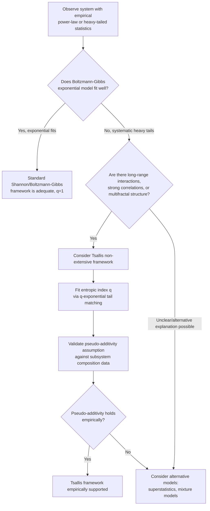

## Tsallis Entropy

### Overview

Tsallis entropy is a generalization of Shannon entropy introduced by Constantino Tsallis in 1988 to model statistical systems exhibiting long-range interactions, long-term memory, or multifractal structure — systems where the standard additive (extensive) assumptions underlying Boltzmann-Gibbs-Shannon statistical mechanics break down. Rather than replacing Shannon entropy, Tsallis entropy forms the foundation of a broader statistical framework, often called **non-extensive statistical mechanics**, that recovers standard thermodynamics as a limiting special case while extending naturally to systems where entropy does not simply add across independent subsystems.

### Definition

For a discrete probability distribution $p = (p_1, \ldots, p_n)$ and a real parameter $q$ (called the **entropic index**, $q \neq 1$), Tsallis entropy is defined as:

$$S_q(p) = \frac{1}{q-1}\left(1 - \sum_{i=1}^n p_i^q \right)$$

An equivalent and often useful reformulation uses the **q-logarithm**, defined as $\ln_q(x) = \frac{x^{1-q}-1}{1-q}$, giving:

$$S_q(p) = -\sum_i p_i \ln_q(p_i) = \sum_i p_i \ln_q(1/p_i)$$

This mirrors Shannon entropy's form $H(p) = -\sum_i p_i \ln(p_i) = \sum_i p_i \ln(1/p_i)$ exactly, with the ordinary logarithm replaced by the $q$-deformed logarithm — making explicit that Tsallis entropy is, structurally, "Shannon entropy with a deformed logarithm," a framing that clarifies much of its behavior and its recovery of Shannon entropy in the appropriate limit.

### Recovery of Shannon Entropy as q → 1

As $q \to 1$, the $q$-logarithm converges to the ordinary logarithm ($\lim_{q\to1} \ln_q(x) = \ln(x)$), and correspondingly:

$$\lim_{q \to 1} S_q(p) = -\sum_i p_i \ln(p_i) = H(p)$$

This can be verified directly via L'Hôpital's rule applied to the original definition, treating $q$ as the variable of a limit at $q=1$. This limiting behavior parallels exactly how Rényi entropy recovers Shannon entropy as $\alpha \to 1$, and is a defining, expected feature of essentially any reasonable one-parameter generalization of Shannon entropy — the $q=1$ (or $\alpha=1$) point is where the "deformation" vanishes and standard statistical mechanics is recovered.

**(svg_diagram) Tsallis Entropy Deformation of the Logarithm**

<svg xmlns="http://www.w3.org/2000/svg" viewBox="0 0 700 380">
\<style\>
.title { font: bold 17px sans-serif; fill: #1a1a2e; }
.axis-label { font: 13px sans-serif; fill: #333; }
.curve-label { font: 12px sans-serif; fill: #555; }
\</style\>
<rect width="700" height="380" fill="#fdfdfd" />
<text x="350" y="26" text-anchor="middle" class="title">q-Logarithm for Different q (svg_diagram)</text>

<line x1="90" y1="200" x2="620" y2="200" stroke="#333" stroke-width="1.5" />
<line x1="200" y1="330" x2="200" y2="60" stroke="#333" stroke-width="1.5" />
<text x="355" y="360" text-anchor="middle" class="axis-label">x (probability value, 0 to 1)</text>
<text x="130" y="195" text-anchor="middle" class="axis-label">0</text>

<path d="M 210 330 C 260 280, 350 220, 600 90" fill="none" stroke="#2b6cb0" stroke-width="3" />
<text x="500" y="105" class="curve-label" fill="#2b6cb0">q = 1 (ordinary ln x)</text>

<path d="M 210 330 C 260 300, 380 250, 600 160" fill="none" stroke="#27ae60" stroke-width="3" />
<text x="480" y="175" class="curve-label" fill="#27ae60">q &lt; 1 (sub-extensive, flatter)</text>

<path d="M 210 330 C 250 260, 320 150, 380 70" fill="none" stroke="#c0392b" stroke-width="3" />
<text x="280" y="60" class="curve-label" fill="#c0392b">q &gt; 1 (super-extensive, steeper)</text>
</svg>

### Pseudo-Additivity: The Defining Structural Property

The single most important structural feature distinguishing Tsallis entropy from Shannon entropy is its behavior under composition of independent systems. For two statistically independent subsystems $A$ and $B$ (i.e., their joint distribution factorizes, $p_{AB} = p_A \times p_B$), Tsallis entropy satisfies:

$$S_q(A,B) = S_q(A) + S_q(B) + (1-q)\, S_q(A)\, S_q(B)$$

This is called **pseudo-additivity** (sometimes non-extensivity), and it is the entire motivating construction behind Tsallis's original 1988 proposal. Three regimes follow directly from the sign of $(1-q)$:

- **$q = 1$**: pseudo-additivity reduces to ordinary additivity, $S_1(A,B) = S_1(A) + S_1(B)$ — this is exactly the Shannon/Boltzmann-Gibbs extensive case.
- **$q < 1$ (super-extensive/super-additive)**: $S_q(A,B) > S_q(A) + S_q(B)$ — the combined system has *more* entropy than the sum of its parts, appropriate for modeling systems where combining subsystems creates additional accessible configurations or correlations beyond simple independence.
- **$q > 1$ (sub-extensive/sub-additive)**: $S_q(A,B) < S_q(A) + S_q(B)$ — the combined system has *less* entropy than the sum of its parts, appropriate for modeling systems with strong correlations or constraints that reduce the effective combined phase space below the naively independent expectation.

**Key Points**

- Pseudo-additivity is not a flaw or an approximation — it is the precise structural feature Tsallis entropy was designed to have, targeting physical systems (long-range gravitational or Coulombic interactions, certain turbulence and multifractal phenomena) where ordinary Boltzmann-Gibbs additive entropy has been argued to give physically inconsistent or poorly-converging results.
- The entropic index $q$ functions as a tunable "degree of non-extensivity," with $q=1$ as the reference extensive (standard thermodynamic) point.
- Because pseudo-additivity introduces a genuinely different composition rule, standard thermodynamic relations (e.g., certain forms of the zeroth law of thermodynamics concerning transitivity of thermal equilibrium) require careful re-derivation in the Tsallis framework, and this re-derivation has itself been a significant and sometimes contested part of the non-extensive statistical mechanics literature.

### Relationship to Rényi Entropy

Both Tsallis and Rényi entropy are built from the same core quantity, $\sum_i p_i^\alpha$ (written with parameter $q$ for Tsallis, $\alpha$ for Rényi), but combine it differently:

$$H_\alpha(p) = \frac{1}{1-\alpha}\log\left(\sum_i p_i^\alpha\right) \quad \text{(Rényi, logarithmic)}$$

$$S_q(p) = \frac{1}{q-1}\left(1 - \sum_i p_i^q\right) \quad \text{(Tsallis, algebraic)}$$

For the same parameter value ($\alpha = q$), the two are related by a monotonic transformation:

$$S_q(p) = \frac{e^{(1-q) H_q(p)} - 1}{1-q} \quad \Longleftrightarrow \quad H_q(p) = \frac{1}{1-q}\log\left(1+(1-q)S_q(p)\right)$$

Because the transformation between them is monotonic (for fixed $q$/$\alpha$), Tsallis and Rényi entropies always **agree on ordering** — if $S_q(p) > S_q(p')$ for two distributions $p, p'$, then $H_q(p) > H_q(p')$ as well, and vice versa. They differ in their *composition* behavior (log-additive for Rényi vs. pseudo-additive for Tsallis) and in specific numerical value, but never in which of two distributions is "more disordered" by their respective measure at the same parameter value.

### The Tsallis Distribution: Maximum-Entropy Generalization

Just as Shannon entropy maximization under an energy-expectation constraint yields the Boltzmann-Gibbs (exponential) distribution, maximizing Tsallis entropy under an analogous constraint (using the Tsallis-specific "escort distribution" formalism for the constraint, a technical requirement of the non-extensive framework) yields the **Tsallis distribution** (also called the **q-exponential distribution**):

$$p_i \propto \left[1 - (1-q)\beta E_i\right]^{\frac{1}{1-q}} = e_q(-\beta E_i)$$

where $e_q(x) = [1+(1-q)x]^{1/(1-q)}$ is the **q-exponential** function (inverse of the q-logarithm), and $\beta$ is a Lagrange multiplier analogous to inverse temperature. For $q \to 1$, $e_q(x) \to e^x$, recovering the ordinary Boltzmann exponential distribution exactly.

A distinctive feature of the q-exponential (for $q > 1$) is that it produces **power-law tails** rather than the exponential decay of the standard Boltzmann distribution — for large $E_i$, $e_q(-\beta E_i) \sim E_i^{-1/(q-1)}$, decaying polynomially rather than exponentially. This is precisely why Tsallis statistics has been applied extensively to phenomena exhibiting empirical power-law behavior: certain turbulence spectra, cosmic ray energy spectra, financial return distributions, and some complex network degree distributions have been fit using $q$-exponential forms, with the fitted $q$ value serving as an empirical measure of the system's departure from standard exponential (Boltzmann) statistics.

**(svg_diagram) q-Exponential Distribution: Power-Law vs. Exponential Tails**

<svg xmlns="http://www.w3.org/2000/svg" viewBox="0 0 700 380">
\<style\>
.title { font: bold 17px sans-serif; fill: #1a1a2e; }
.axis-label { font: 13px sans-serif; fill: #333; }
.curve-label { font: 12px sans-serif; fill: #555; }
\</style\>
<rect width="700" height="380" fill="#fdfdfd" />
<text x="350" y="26" text-anchor="middle" class="title">q-Exponential Tail Behavior (svg_diagram)</text>

<line x1="90" y1="330" x2="620" y2="330" stroke="#333" stroke-width="1.5" />
<line x1="90" y1="330" x2="90" y2="60" stroke="#333" stroke-width="1.5" />
<text x="355" y="360" text-anchor="middle" class="axis-label">Energy / value E</text>
<text x="35" y="200" text-anchor="middle" class="axis-label" transform="rotate(-90 35 200)">Probability (log scale)</text>

<path d="M 100 90 C 200 200, 300 290, 500 325" fill="none" stroke="#2b6cb0" stroke-width="3" />
<text x="380" y="270" class="curve-label" fill="#2b6cb0">q = 1 (Boltzmann, exponential decay)</text>

<path d="M 100 90 C 220 180, 400 240, 600 270" fill="none" stroke="#c0392b" stroke-width="3" />
<text x="420" y="220" class="curve-label" fill="#c0392b">q &gt; 1 (power-law tail, slower decay)</text>
</svg>

### Worked Example: Fitting q to a Power-Law-Tailed Dataset

Consider financial return data known empirically to exhibit "fat tails" — extreme returns occurring far more often than a Gaussian or exponential model would predict. Suppose a researcher fits the empirical distribution of absolute returns to a q-exponential form and finds a best-fit value of $q \approx 1.4$.

This $q \approx 1.4$ value directly quantifies the tail's power-law exponent via $E_i^{-1/(q-1)} = E_i^{-1/0.4} = E_i^{-2.5}$ — implying the tail decays as a power law with exponent $2.5$, substantially heavier than any exponential (or Gaussian) tail would predict, but consistent with commonly cited empirical power-law exponents in financial return data (typically cited in the range of roughly 3 to 5 for many asset classes, though this varies by asset, timeframe, and estimation method). [Unverified] The specific fitted value $q \approx 1.4$ here is illustrative; actual fitted values in the empirical finance literature vary considerably by dataset, time period, and fitting methodology, and different studies do not always agree on a single characteristic $q$ for a given market.

### Applications in Physics and Complex Systems

- **Long-range interacting systems**: gravitational systems, plasmas with long-range Coulomb interactions, and certain turbulence models have been argued to require non-extensive treatment because the additive Boltzmann-Gibbs framework does not converge properly (or converges to physically inappropriate results) when interaction ranges are comparable to system size.
- **Complex networks**: some studies model the degree distribution of certain real-world networks (exhibiting scale-free/power-law degree distributions) using Tsallis-statistics-derived maximum entropy arguments, connecting network topology to non-extensive statistical mechanics.
- **Anomalous diffusion**: certain super-diffusive and sub-diffusive processes (deviating from standard Brownian-motion-based diffusion) have been modeled using Tsallis-entropy-derived generalized diffusion equations (nonlinear Fokker-Planck equations), where the standard linear diffusion equation is recovered in the $q \to 1$ limit.

[Inference] The application of Tsallis statistics across these domains has produced genuine, published empirical fits and theoretical models, but the underlying physical necessity of the non-extensive framework (versus alternative explanations for observed power laws, such as superstatistics or simple mixture-of-exponentials models) remains actively debated in parts of the statistical physics community rather than universally settled.

### Table: Tsallis vs. Shannon/Boltzmann-Gibbs Framework

| Aspect | Shannon/Boltzmann-Gibbs | Tsallis |
|---|---|---|
| Composition rule (independent systems) | Additive: $S(A,B)=S(A)+S(B)$ | Pseudo-additive: $S_q(A,B)=S_q(A)+S_q(B)+(1-q)S_q(A)S_q(B)$ |
| Maximum-entropy distribution | Exponential (Boltzmann) | q-exponential (power-law tail for $q>1$) |
| Appropriate system class | Short-range interactions, weak correlations | Long-range interactions, strong correlations, multifractal structure |
| Parameter | None (fixed, "$q=1$" implicitly) | Entropic index $q$, tunable |
| Tail behavior of equilibrium distribution | Exponential decay | Power-law decay (for $q>1$) |

### Process Flow: Deciding Whether Tsallis Entropy Applies

### Criticisms and Open Debates

- **Escort distribution formalism is technically involved and debated.** Deriving the Tsallis (q-exponential) distribution from a maximum-entropy principle requires using "escort distributions" (a normalized reweighting of the original probabilities by $p_i^q$) to properly define expectation-value constraints; this technical machinery is more complex than the standard Boltzmann-Gibbs case and has been a source of ongoing methodological discussion regarding which constraint formulation is most physically appropriate.
- **Physical necessity vs. curve-fitting flexibility.** Critics have argued that the additional free parameter $q$ gives Tsallis-based models substantial curve-fitting flexibility that can match power-law-tailed empirical data without necessarily reflecting a genuine underlying non-extensive physical mechanism — i.e., good empirical fit alone does not prove the physical necessity of non-extensive statistics over alternative explanations. [Inference] This is a genuine, ongoing point of contention in the statistical physics literature rather than a fully resolved methodological question.
- **Relationship to superstatistics.** An alternative and sometimes complementary framework, "superstatistics" (Beck and Cohen), models heavy-tailed behavior as arising from a Boltzmann-Gibbs system with a fluctuating (rather than fixed) temperature/inverse-temperature parameter, and has been shown in specific cases to produce distributions statistically indistinguishable from Tsallis q-exponentials — raising the question of whether Tsallis's non-extensive entropy or superstatistics' fluctuating-parameter Boltzmann-Gibbs model is the more fundamentally correct description for a given physical system.

### Related Topics

- Rényi entropy and its relationship to the Tsallis framework
- Superstatistics and fluctuating-temperature alternatives to non-extensive entropy
- q-exponential and q-Gaussian distributions in complex systems
- Escort distributions and generalized maximum entropy principles
- Power-law and heavy-tailed distributions in finance and physics
- Nonlinear Fokker-Planck equations and anomalous diffusion
- Non-extensive statistical mechanics: foundations and critiques