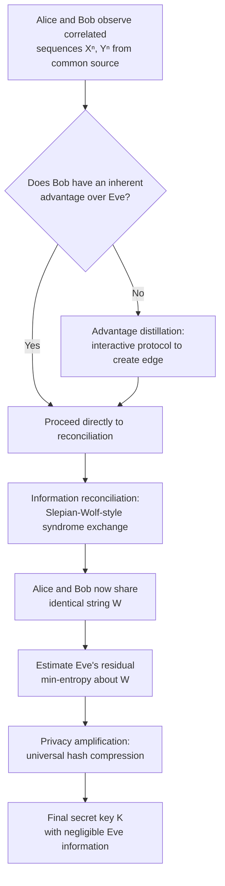

## Common Randomness and Secret Key Generation

### Overview

Common randomness and secret key generation is a subfield of information-theoretic security concerned with how two (or more) parties, observing correlated signals or communicating over a channel, can distill a shared secret key — a string of bits both parties know but an eavesdropper cannot determine, even given unlimited computational power. Unlike computational cryptography, which relies on the presumed hardness of mathematical problems (factoring, discrete log), information-theoretic key generation derives its security guarantees purely from the statistical structure of correlated observations and channel noise, offering security that holds regardless of an adversary's computational resources. This framework, pioneered by Maurer and independently by Ahlswede and Csiszár, generalizes and formalizes Wyner's earlier wiretap channel model.

### The Source Model: Key Generation From Correlated Observations

In the **source model**, two legitimate parties (conventionally Alice and Bob) each observe a sequence of samples from a correlated source — for example, Alice observes $X^n = (X_1, \ldots, X_n)$ and Bob observes $Y^n = (Y_1,\ldots,Y_n)$, where $(X_i, Y_i)$ are i.i.d. draws from a joint distribution $p(x,y)$, while an eavesdropper Eve observes a correlated but distinct sequence $Z^n$ from the same joint distribution $p(x,y,z)$. Alice and Bob are also permitted a public discussion channel — messages sent over this channel are visible to Eve, but not alterable by her (an authenticated, public channel).

The goal: using their correlated observations plus public discussion, Alice and Bob generate a shared secret key $K$ such that (a) both parties compute the same key with high probability, and (b) Eve's information about $K$, even combining her private observation $Z^n$ with everything said over the public channel, is negligible.

**Key Points**

- The public discussion is essential: without any communication, Alice and Bob generally cannot agree on a common key from correlated but non-identical observations; the public channel allows them to reconcile discrepancies between $X^n$ and $Y^n$ (information reconciliation) while still preserving secrecy (privacy amplification) against an eavesdropper who saw the same public messages.
- Security here means **information-theoretic** (unconditional) security: even an eavesdropper with unbounded computational power and unlimited time cannot determine the key with better than negligible advantage, in contrast to computational security's reliance on unproven hardness assumptions.
- This differs fundamentally from standard key-exchange protocols (e.g., Diffie-Hellman), which rely on computational hardness assumptions and provide no protection against an adversary with sufficient computational power (including, notably, a sufficiently large quantum computer running Shor's algorithm).

**(svg_diagram) Source Model for Secret Key Agreement**

<svg xmlns="http://www.w3.org/2000/svg" viewBox="0 0 720 420">
\<style\>
.title { font: bold 17px sans-serif; fill: #1a1a2e; }
.node-label { font: bold 13px sans-serif; fill: #fff; }
.label { font: 12px sans-serif; fill: #222; }
.small-label { font: 11px sans-serif; fill: #555; }
\</style\>
<rect width="720" height="420" fill="#fdfdfd" />
<text x="360" y="26" text-anchor="middle" class="title">Secret Key Agreement: Source Model (svg_diagram)</text>

<rect x="290" y="60" width="140" height="60" rx="6" fill="#8e44ad" />
<text x="360" y="96" text-anchor="middle" class="node-label">Correlated Source</text>
<text x="360" y="135" text-anchor="middle" class="small-label">p(x, y, z)</text>

<circle cx="130" cy="220" r="45" fill="#2b6cb0" />
<text x="130" y="226" text-anchor="middle" class="node-label">Alice</text>
<text x="130" y="280" text-anchor="middle" class="small-label">observes Xⁿ</text>

<circle cx="590" cy="220" r="45" fill="#27ae60" />
<text x="590" y="226" text-anchor="middle" class="node-label">Bob</text>
<text x="590" y="280" text-anchor="middle" class="small-label">observes Yⁿ</text>

<circle cx="360" cy="330" r="45" fill="#c0392b" />
<text x="360" y="336" text-anchor="middle" class="node-label">Eve</text>
<text x="360" y="390" text-anchor="middle" class="small-label">observes Zⁿ</text>

<line x1="310" y1="120" x2="160" y2="185" stroke="#333" stroke-width="2" />
<line x1="410" y1="120" x2="560" y2="185" stroke="#333" stroke-width="2" />
<line x1="345" y1="120" x2="360" y2="285" stroke="#333" stroke-width="2" />

<path d="M 175 210 Q 360 150, 545 210" fill="none" stroke="#e67e22" stroke-width="2.5" stroke-dasharray="6,3" />
<text x="360" y="175" text-anchor="middle" class="small-label" fill="#e67e22">public discussion (visible to Eve, authenticated)</text>

<text x="360" y="415" text-anchor="middle" class="label">Goal: shared key K, negligible I(K; Zⁿ, public messages)</text>
</svg>

### Secret Key Capacity

The **secret key capacity** $C_S$ is the maximum rate (bits of key per source symbol) at which Alice and Bob can generate a shared secret key, secure against Eve, using unlimited public discussion. For the source model, Maurer and Ahlswede-Csiszár established the fundamental result:

$$I(X;Y) - I(X;Z) \leq C_S \leq \min\big(I(X;Y), \, I(X;Y|Z)\big)$$

The lower bound $I(X;Y) - I(X;Z)$ is achievable using straightforward one-way information reconciliation followed by privacy amplification. The upper bound involves $I(X;Y|Z)$, the mutual information between Alice's and Bob's observations *conditioned on* Eve's observation — reflecting that even Eve's own information can, in principle, be exploited to bound (or in specific cases, tighten) the achievable secret key rate.

In the important special case where the joint distribution forms a **Markov chain** $X - Y - Z$ (Eve's observation is a degraded version of Bob's, conditional on Alice's), the capacity is known exactly:

$$C_S = I(X;Y) - I(X;Z) = I(X;Y|Z)$$

with the two potentially-different bounds coinciding exactly in this Markov-chain special case — one of the relatively few settings where the secret key capacity is fully, exactly characterized rather than merely bounded.

[Inference] For the general (non-Markov) source model, the exact secret key capacity remains open in some parameter regimes, with the stated bounds representing the best known general achievability and converse results rather than a universally tight characterization.

### Advantage Distillation, Information Reconciliation, Privacy Amplification

Practical secret key generation protocols typically proceed through three sequential stages:

**Advantage distillation.** When Alice and Bob do not already have an inherent statistical advantage over Eve (e.g., in some channel models Eve's channel could be *better* than Bob's), an initial round of interactive communication can be used to create or amplify an advantage — for instance, Alice and Bob repeatedly compare short blocks of their data over the public channel and retain only certain agreeing subsets, in a way engineered so that Eve's uncertainty grows faster than Bob's.

**Information reconciliation.** Alice and Bob's raw observations $X^n$ and $Y^n$ are correlated but not identical (due to noise). Information reconciliation is the process (structurally identical to Slepian-Wolf distributed source coding) by which Bob (or Alice) sends enough syndrome/parity information over the public channel for the other party to correct discrepancies and recover an identical shared string, using the minimum possible public communication rate — governed by the same conditional entropy bounds as Slepian-Wolf coding.

**Privacy amplification.** After reconciliation, Alice and Bob share an identical string, but this string is only "partially secret" — Eve, having observed $Z^n$ and all public reconciliation messages, retains some residual information about it. Privacy amplification compresses this shared string (typically via a randomly chosen universal hash function) into a shorter final key, such that Eve's information about the *final, shortened* key is provably negligible — the compression ratio is calibrated using a min-entropy-based bound (specifically, the **leftover hash lemma**) on Eve's residual uncertainty about the pre-amplification string.

**(svg_diagram) Three-Stage Secret Key Generation Pipeline**

<svg xmlns="http://www.w3.org/2000/svg" viewBox="0 0 700 340">
\<style\>
.title { font: bold 17px sans-serif; fill: #1a1a2e; }
.block-label { font: 13px sans-serif; fill: #222; }
.small-label { font: 11px sans-serif; fill: #555; }
\</style\>
<rect width="700" height="340" fill="#fdfdfd" />
<text x="350" y="26" text-anchor="middle" class="title">Key Generation Pipeline (svg_diagram)</text>

<rect x="30" y="80" width="190" height="90" rx="6" fill="#eaf2f8" stroke="#2b6cb0" stroke-width="1.5" />
<text x="125" y="115" text-anchor="middle" class="block-label">Advantage Distillation</text>
<text x="125" y="140" text-anchor="middle" class="small-label">establish/amplify</text>
<text x="125" y="153" text-anchor="middle" class="small-label">statistical edge over Eve</text>

<path d="M 220 125 L 260 125" stroke="#333" stroke-width="2" marker-end="url(#a1)" />

<rect x="260" y="80" width="190" height="90" rx="6" fill="#fdf2e9" stroke="#e67e22" stroke-width="1.5" />
<text x="355" y="115" text-anchor="middle" class="block-label">Information Reconciliation</text>
<text x="355" y="140" text-anchor="middle" class="small-label">correct discrepancies</text>
<text x="355" y="153" text-anchor="middle" class="small-label">(Slepian-Wolf-style)</text>

<path d="M 450 125 L 490 125" stroke="#333" stroke-width="2" marker-end="url(#a1)" />

<rect x="490" y="80" width="190" height="90" rx="6" fill="#eafaf1" stroke="#27ae60" stroke-width="1.5" />
<text x="585" y="115" text-anchor="middle" class="block-label">Privacy Amplification</text>
<text x="585" y="140" text-anchor="middle" class="small-label">universal hashing,</text>
<text x="585" y="153" text-anchor="middle" class="small-label">leftover hash lemma</text>

<text x="350" y="230" text-anchor="middle" class="small-label">Eve's info decreases at each stage; final key length calibrated to her residual min-entropy deficit</text>
<text x="350" y="255" text-anchor="middle" class="small-label">Output: shared key K with I(K; Eve's total information) ≈ 0</text>
</svg>

### The Leftover Hash Lemma

The **leftover hash lemma** is the key technical tool underlying privacy amplification, quantifying precisely how much a shared string can be compressed to eliminate an eavesdropper's residual information. If Alice and Bob share a string $W$ (of length $n$ bits) about which Eve has min-entropy $H_\infty(W|Z^n) \geq k$ (i.e., Eve's best single-guess success probability for $W$, given her observation, is at most $2^{-k}$), then applying a randomly chosen 2-universal hash function to compress $W$ down to a string of length $\ell < k$ bits yields a final key that is statistically close (within a quantifiable, exponentially small error term) to being uniformly random and independent of Eve's entire information.

This result is why min-entropy (rather than Shannon entropy) is the operationally correct quantity throughout secret-key-generation theory: privacy amplification's security guarantee is fundamentally a *worst-case, single-guess* statement about Eve's uncertainty, which is exactly what min-entropy — not Shannon entropy, which only bounds average-case uncertainty — correctly captures.

### The Channel Model: Wyner's Wiretap Channel

An earlier and closely related model, predating the source model, is Wyner's **wiretap channel** (1975). Here, instead of correlated observations from a common source, Alice transmits over a broadcast channel to both the legitimate receiver Bob (over the "main channel") and an eavesdropper Eve (over a "wiretap channel," typically modeled as a degraded/noisier version of the main channel). The **secrecy capacity** — the maximum rate at which Alice can transmit a message to Bob such that Eve learns asymptotically nothing about it — is:

$$C_S = \max_{p(x)} \big[ I(X;Y) - I(X;Z) \big]^+$$

where $[\cdot]^+$ denotes the positive part, and $Y, Z$ are Bob's and Eve's respective channel outputs. This requires Eve's channel to be strictly worse (noisier) than Bob's for any positive secrecy capacity to exist — if Eve's channel is equal to or better than Bob's, $C_S = 0$ under the basic wiretap model, since no coding scheme can then guarantee Eve learns strictly less than Bob.

**Key Points**

- The wiretap channel's secrecy capacity has the same structural form ($I(X;Y) - I(X;Z)$) as the source model's secret key capacity lower bound, reflecting the deep structural correspondence between these two problem formulations — both ultimately reduce to "how much more information does the legitimate receiver get than the eavesdropper."
- Achievability in the wiretap channel uses a technique sometimes called **channel prefixing** or **wiretap coding**, which deliberately introduces extra randomness into the transmitted codeword (beyond what's needed to convey the message to Bob) specifically to confuse Eve — a counterintuitive but essential technique, since transmitting the message as efficiently as possible for Bob alone generally leaks too much information to Eve.
- The wiretap channel model has been extended extensively to Gaussian channels (the "Gaussian wiretap channel"), fading channels, and MIMO wiretap channels, forming the theoretical foundation of the broader field now called **physical layer security**.

### Worked Example: Secret Key Rate From a Simple Binary Symmetric Setup

Suppose Alice and Bob each observe correlated bits through independent binary symmetric channels from a common uniformly random bit source $X$: Bob's channel has crossover probability $p_B = 0.05$ (Bob's observation $Y$ disagrees with $X$ 5% of the time), while Eve's channel (observing the same source, independently) has crossover probability $p_E = 0.15$ (a noisier channel than Bob's, so Eve's information is more degraded).

Using the binary symmetric channel mutual information formula $I(X;Y) = 1 - H_b(p)$ (where $H_b$ is binary entropy), we get:

$$I(X;Y) = 1 - H_b(0.05) \approx 1 - 0.286 = 0.714 \text{ bits}$$

$$I(X;Z) = 1 - H_b(0.15) \approx 1 - 0.610 = 0.390 \text{ bits}$$

Assuming this setup satisfies the Markov chain condition $X-Y-Z$ (Eve's channel is a further-degraded version relative to Bob's from the same source), the secret key capacity is:

$$C_S = I(X;Y) - I(X;Z) \approx 0.714 - 0.390 = 0.324 \text{ bits per source symbol}$$

This means Alice and Bob can, in principle (using sufficiently long block lengths and optimal reconciliation/privacy amplification), extract approximately 0.324 secret key bits per correlated source symbol observed, secure against Eve, despite Eve having a fairly good (85% correlated) view of the same source. [Unverified] This calculation assumes the idealized Markov-chain structure and asymptotically long block lengths; finite-length effects and non-ideal reconciliation efficiency reduce the practically achievable rate below this asymptotic figure.

### Process Flow: Establishing a Secret Key From Correlated Observations

### Applications and Practical Systems

- **Quantum key distribution (QKD)**: protocols like BB84 use quantum mechanics to establish the initial correlated (and partially secret) raw key material, after which classical information reconciliation and privacy amplification — using exactly the theory described above — are applied to distill the final information-theoretically secure key.
- **Physical-layer key generation from wireless channel reciprocity**: in wireless systems, Alice and Bob can each measure the same physical channel (which is reciprocal, i.e., statistically identical in both directions over short timescales) to generate correlated observations without any pre-shared secret, then apply reconciliation and privacy amplification to derive a shared key — an active area of applied physical-layer security research.
- **Biometric key generation**: some proposals apply this framework to biometric data (e.g., fingerprint or iris measurements), treating small measurement variations between enrollment and authentication as the "noise" requiring reconciliation, though this application area faces distinctive challenges around the actual achievable min-entropy of biometric sources.

[Inference] The practical security of physical-layer and biometric key generation systems depends heavily on whether real-world channel/biometric measurements actually satisfy the statistical independence and correlation assumptions the theory requires, which is harder to verify rigorously than in controlled QKD hardware settings, and this is a recognized, active concern in the applied physical-layer security literature.

### Limitations

- **Public channel authentication is assumed, not free.** The entire framework assumes Alice and Bob's public discussion channel is authenticated (Eve cannot inject or alter messages, only observe them); achieving this authentication without a pre-existing shared secret is itself a nontrivial problem, typically requiring a short pre-shared authentication key or an unconditionally secure authentication code consuming part of the generated key material.
- **I.i.d. and known-distribution assumptions.** Exact capacity results generally assume the correlated source is i.i.d. with a known (or at least well-estimated) joint distribution; real-world sources (wireless channels, biometrics) may deviate from these idealized statistical assumptions, requiring more conservative, assumption-robust protocol design.
- **Finite block-length effects.** As with most Shannon-theoretic capacity results, the stated capacities are asymptotic (infinite block length); practical, finite-length implementations achieve somewhat lower rates and require explicit security-parameter analysis accounting for finite-length statistical fluctuations.

### Related Topics

- Wyner's wiretap channel and physical layer security
- Slepian-Wolf distributed source coding (used directly in information reconciliation)
- Leftover hash lemma and universal hash families
- Min-entropy and its cryptographic operational significance
- Quantum key distribution (BB84, E91) and classical post-processing
- Multiterminal secret key agreement (more than two legitimate parties)
- Authentication codes and unconditionally secure message authentication