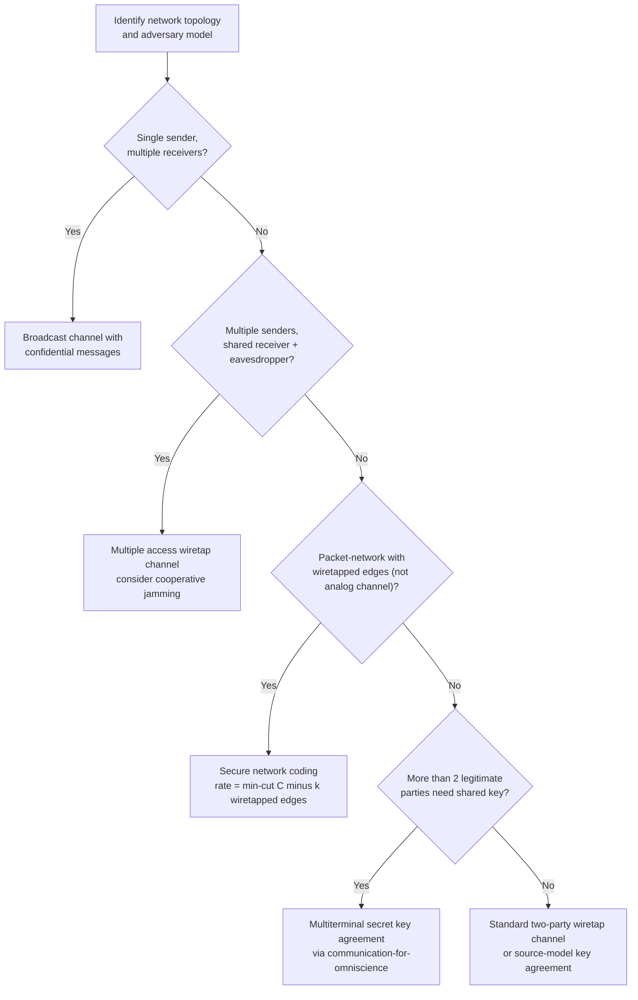

## Information-Theoretic Security in Networks

### Overview

Information-theoretic security in networks extends the two-party secrecy results of the wiretap channel and secret key agreement to settings with multiple legitimate users, multiple eavesdroppers, relays, and complex network topologies. Where classical physical-layer security (Wyner's wiretap channel) established that secrecy could be achieved from channel noise alone between one sender and one receiver against one eavesdropper, network information-theoretic security asks how these guarantees extend — and what new phenomena emerge — when many nodes must simultaneously communicate securely, cooperate, relay, or compete for a shared, eavesdropped medium. This is a natural network-theoretic generalization sitting at the intersection of multiterminal information theory and information-theoretic secrecy.

### From Point-to-Point to Network Secrecy

The two-party wiretap channel's secrecy capacity, $C_S = \max_{p(x)}[I(X;Y)-I(X;Z)]^+$, generalizes into a family of distinct network problems depending on the topology:

- **Multiple legitimate receivers, one eavesdropper** (broadcast channel with confidential messages): a sender wishes to send independent confidential messages to multiple legitimate receivers, all overheard by a common eavesdropper.
- **Multiple senders, one legitimate receiver, one eavesdropper** (multiple access wiretap channel): several senders' signals combine at both the legitimate receiver and the eavesdropper, requiring joint consideration of interference and secrecy simultaneously.
- **Interference with secrecy constraints**: two or more sender-receiver pairs, each pair's transmission acting as both useful signal (at its own receiver) and potential eavesdropping material (at the other pair's receiver, which may itself need to be kept secret from).
- **Relay-eavesdropper networks**: a relay assists a source-destination pair while itself potentially being untrusted (a "trusted-but-curious" relay) or while an external eavesdropper also observes the network.

Each of these network secrecy problems typically inherits the achievability techniques from its non-secrecy multiterminal counterpart (superposition coding for broadcast, successive cancellation for MAC, Han-Kobayashi rate-splitting for interference) combined with wiretap-coding-style randomization to confuse eavesdroppers — but, mirroring the general state of multiterminal information theory, most network secrecy capacity regions remain only partially characterized.

**(svg_diagram) Taxonomy of Network Secrecy Problems**

<svg xmlns="http://www.w3.org/2000/svg" viewBox="0 0 720 460">
\<style\>
.title { font: bold 17px sans-serif; fill: #1a1a2e; }
.node-label { font: bold 12px sans-serif; fill: #fff; }
.label { font: 11px sans-serif; fill: #222; }
\</style\>
<rect width="720" height="460" fill="#fdfdfd" />
<text x="360" y="26" text-anchor="middle" class="title">Network Secrecy Topologies (svg_diagram)</text>

<circle cx="130" cy="100" r="22" fill="#2b6cb0" />
<text x="130" y="105" text-anchor="middle" class="node-label">Tx</text>
<circle cx="60" cy="170" r="20" fill="#27ae60" />
<text x="60" y="175" text-anchor="middle" class="node-label">R1</text>
<circle cx="200" cy="170" r="20" fill="#27ae60" />
<text x="200" y="175" text-anchor="middle" class="node-label">R2</text>
<circle cx="130" cy="230" r="20" fill="#c0392b" />
<text x="130" y="235" text-anchor="middle" class="node-label">Eve</text>
<line x1="120" y1="118" x2="70" y2="152" stroke="#333" stroke-width="1.5" />
<line x1="140" y1="118" x2="190" y2="152" stroke="#333" stroke-width="1.5" />
<line x1="130" y1="122" x2="130" y2="210" stroke="#333" stroke-width="1.5" stroke-dasharray="3,2" />
<text x="130" y="270" text-anchor="middle" class="label">Broadcast + confidential msgs</text>

<circle cx="450" cy="80" r="20" fill="#2b6cb0" />
<text x="450" y="85" text-anchor="middle" class="node-label">Tx1</text>
<circle cx="570" cy="80" r="20" fill="#2b6cb0" />
<text x="570" y="85" text-anchor="middle" class="node-label">Tx2</text>
<circle cx="510" cy="160" r="20" fill="#27ae60" />
<text x="510" y="165" text-anchor="middle" class="node-label">Rx</text>
<circle cx="510" cy="230" r="20" fill="#c0392b" />
<text x="510" y="235" text-anchor="middle" class="node-label">Eve</text>
<line x1="460" y1="98" x2="500" y2="145" stroke="#333" stroke-width="1.5" />
<line x1="560" y1="98" x2="520" y2="145" stroke="#333" stroke-width="1.5" />
<line x1="510" y1="180" x2="510" y2="210" stroke="#333" stroke-width="1.5" stroke-dasharray="3,2" />
<text x="510" y="270" text-anchor="middle" class="label">MAC wiretap channel</text>

<circle cx="130" cy="360" r="20" fill="#2b6cb0" />
<text x="130" y="365" text-anchor="middle" class="node-label">Src</text>
<circle cx="260" cy="330" r="20" fill="#8e44ad" />
<text x="260" y="335" text-anchor="middle" class="node-label">Relay</text>
<circle cx="390" cy="360" r="20" fill="#27ae60" />
<text x="390" y="365" text-anchor="middle" class="node-label">Dst</text>
<circle cx="260" cy="420" r="20" fill="#c0392b" />
<text x="260" y="425" text-anchor="middle" class="node-label">Eve</text>
<line x1="150" y1="350" x2="240" y2="335" stroke="#333" stroke-width="1.5" />
<line x1="280" y1="335" x2="370" y2="355" stroke="#333" stroke-width="1.5" />
<line x1="150" y1="365" x2="370" y2="365" stroke="#333" stroke-width="1.5" stroke-dasharray="2,2" />
<line x1="260" y1="350" x2="260" y2="400" stroke="#333" stroke-width="1.5" stroke-dasharray="3,2" />
<text x="260" y="450" text-anchor="middle" class="label">Relay-eavesdropper network</text>
</svg>

### Broadcast Channel With Confidential Messages

Csiszár and Körner's classical result (extending Wyner's single-receiver wiretap model) characterizes the capacity region for a broadcast channel where a sender transmits a common message (to both legitimate receivers) and a confidential message (to only one receiver, kept secret from the other, who is treated as an eavesdropper for that message). The achievable secrecy rate uses an auxiliary random variable $U$ and takes the form:

$$R_1 \leq I(V;Y_1|U) - I(V;Y_2|U), \quad R_0 \leq \min(I(U;Y_1), I(U;Y_2))$$

for appropriately chosen auxiliary variables $U, V$ in a Markov chain relationship, where $R_1$ is the confidential rate and $R_0$ the common (non-confidential) rate. This result is one of the earliest and most complete generalizations of two-party wiretap secrecy to a genuine multi-receiver network setting, and — unlike many later network secrecy extensions — has a essentially complete capacity-region characterization for the degraded case.

### Secrecy in Interference and Multiple Access Settings

**Multiple access wiretap channel.** When two senders transmit simultaneously to a common legitimate receiver, with a separate eavesdropper also observing the combined signal, achieving secrecy for both senders' messages simultaneously requires each sender's signal to act partly as "friendly interference" degrading the eavesdropper's ability to decode the other sender's message — a cooperative secrecy effect with no analogue in the single-sender wiretap setting. The general capacity region for this problem remains only partially characterized, with the best known achievable regions using a combination of wiretap coding and rate-splitting techniques adapted from ordinary (non-secrecy) MAC and interference-channel theory.

**Cooperative jamming.** A distinctive technique that emerges specifically in network secrecy settings (with no point-to-point counterpart) is **cooperative jamming**: a node with no message of its own to transmit deliberately injects noise-like signals into the network, specifically degrading the eavesdropper's channel more than the legitimate receiver's, thereby enabling or increasing secrecy rates that would otherwise be unachievable. This technique has no analogue in the classical single-link wiretap channel, since it fundamentally requires a network with at least one additional node beyond the basic sender-receiver-eavesdropper triple to serve as the dedicated "friendly jammer."

**Key Points**

- Cooperative jamming exploits the fact that noise which degrades the eavesdropper's channel more than the legitimate receiver's channel is a genuine resource for secrecy — this is only possible because the jammer's transmission is a network-topological choice not available in the two-terminal wiretap model.
- Artificial noise (a related technique, primarily developed for MIMO systems) has the legitimate transmitter itself inject the jamming signal into the null space of the legitimate channel (i.e., a direction the intended receiver cannot detect due to its antenna geometry) while the eavesdropper, lacking precise channel-state alignment, is still degraded by it.
- Both cooperative jamming and artificial noise techniques require the legitimate parties to have some channel-state information advantage over the eavesdropper (at minimum, knowledge of their own channel to the legitimate receiver); the exact benefit achievable depends heavily on what channel-state information assumptions are made about the eavesdropper's link.

### Secure Network Coding

**Secure network coding** extends the classical (non-secrecy) network coding max-flow min-cut framework to networks where an adversary can wiretap a limited number of network links (or nodes), and asks: what is the maximum rate at which a single source can multicast information to multiple sinks such that an eavesdropper tapping any $k$ links (out of the network) learns nothing about the transmitted message?

Cai and Yeung's foundational result establishes that, for a network with min-cut capacity $C$ (the ordinary, non-secrecy network coding capacity) and an eavesdropper capable of observing any $k$ edges, the maximum securely achievable multicast rate is exactly:

$$R_{\text{secure}} = C - k$$

achieved using a combination of linear network coding (for the ordinary multicast structure) and a pre-coding step that mixes the message with random "key" symbols in a way structurally analogous to Shannon's one-time pad, distributed across the network's coding structure so that any $k$-edge wiretap set reveals no information about the message, regardless of *which* $k$ edges are chosen.

**(svg_diagram) Secure Network Coding: Capacity Loss From Wiretapping**

<svg xmlns="http://www.w3.org/2000/svg" viewBox="0 0 680 320">
\<style\>
.title { font: bold 17px sans-serif; fill: #1a1a2e; }
.label { font: 12px sans-serif; fill: #222; }
.small-label { font: 11px sans-serif; fill: #555; }
\</style\>
<rect width="680" height="320" fill="#fdfdfd" />
<text x="340" y="26" text-anchor="middle" class="title">Secure Network Coding Rate (svg_diagram)</text>

<rect x="60" y="80" width="200" height="140" fill="#eaf2f8" stroke="#2b6cb0" stroke-width="2" />
<text x="160" y="60" text-anchor="middle" class="label">Ordinary multicast capacity C</text>
<text x="160" y="155" text-anchor="middle" class="small-label" font-size="20">C</text>

<rect x="420" y="80" width="160" height="140" fill="#eafaf1" stroke="#27ae60" stroke-width="2" />
<rect x="420" y="180" width="160" height="40" fill="#f9ebea" stroke="#c0392b" stroke-width="2" />
<text x="500" y="60" text-anchor="middle" class="label">Secure rate R = C − k</text>
<text x="500" y="140" text-anchor="middle" class="small-label" font-size="18">C − k</text>
<text x="500" y="205" text-anchor="middle" class="small-label" fill="#c0392b">k (sacrificed to randomness/keying)</text>

<path d="M 270 150 L 410 150" stroke="#333" stroke-width="2" marker-end="url(#a2)" />
<text x="340" y="140" text-anchor="middle" class="small-label">wiretap k edges</text>
</svg>

**Key Points**

- The rate loss $k$ is exactly equal to the wiretap set size, regardless of network topology beyond the min-cut value — a clean, information-theoretically tight result analogous in spirit to the two-party wiretap channel's $I(X;Y)-I(X;Z)$ formula, but exact rather than a bound, for this specific adversary model (a fixed number of wiretapped edges, no computational restriction on the adversary, arbitrary choice of which edges).
- This result assumes the adversary can choose *any* $k$ edges (a worst-case, not average-case, adversary model) and that the network topology and min-cut structure are known in advance to the code designer.
- Extensions address adversaries who can not only eavesdrop but actively *inject* erroneous packets into up to $z$ edges (Byzantine network coding / network error correction), requiring a further rate reduction beyond the pure-eavesdropping case, generalizing classical error-correcting code redundancy concepts to the network coding setting.

### Multiterminal Secret Key Agreement

Extending two-party secret key agreement (Maurer, Ahlswede-Csiszár) to more than two legitimate parties introduces genuinely new structure. In the **multiterminal source model**, a group of $m$ terminals each observe correlated sources, communicate over an authenticated public channel visible to all (including any eavesdropper), and wish to agree on a common secret key known to all $m$ legitimate parties but secret from the eavesdropper.

Csiszár and Narayan's key result characterizes the **secret key capacity** for this multiterminal setting using an elegant, general formula involving minimization over all possible partitions of the terminal set:

$$C_S = H(X_{[m]}) - R_{\text{CO}}$$

where $H(X_{[m]})$ is the joint entropy of all terminals' observations and $R_{\text{CO}}$ is the minimum total rate of public communication required for all terminals to compute a common function of their combined observations (related to the "communication for omniscience" problem) — a beautiful reduction of the secret-key-capacity problem to a distinct, well-studied multiterminal source coding problem.

[Inference] While this formula is an elegant and exact characterization of secret key capacity in terms of the CO (communication for omniscience) rate, computing the CO rate itself for general multiterminal source distributions is a hard combinatorial optimization problem in general (requiring search over set partitions), meaning the "exact characterization" trades one hard problem for a different, but at least well-studied and separately characterized, hard problem.

### Wireless Physical-Layer Network Security

Beyond the pure information-theoretic framework, network physical-layer security research addresses practical wireless network scenarios:

- **Multi-hop secure routing**: extending secrecy capacity concepts to multi-hop wireless networks, where the choice of route itself (not just per-hop coding) becomes a security-relevant design decision, since different routes offer different secrecy-capacity profiles against a given eavesdropper.
- **Secrecy in massive MIMO and millimeter-wave networks**: large antenna arrays provide substantial spatial degrees of freedom useful for both artificial-noise-based secrecy techniques and highly directional (hard-to-intercept) beamforming, an active applied research area building on the underlying information-theoretic secrecy-capacity framework.
- **Secrecy outage probability**: in fading wireless channels, the instantaneous secrecy capacity is a random variable (depending on the current channel realizations to the legitimate receiver and eavesdropper); practical system design often uses "secrecy outage probability" — the probability that the instantaneous secrecy capacity falls below a target rate — as a design metric more directly actionable than the (ergodic, long-run-average) secrecy capacity alone.

[Inference] The gap between idealized information-theoretic network security results (assuming known statistics, unlimited block length, and specific eavesdropper channel-knowledge assumptions) and practical deployed wireless security systems remains substantial, with most currently deployed wireless security still relying on computational (not information-theoretic) cryptography; physical-layer security techniques are an active research and early-stage-deployment area rather than a wholesale replacement for computational security in current commercial systems.

### Process Flow: Selecting a Network Secrecy Framework

### Limitations and Open Problems

- **Most network secrecy capacity regions remain open.** Mirroring the general state of multiterminal information theory (where broadcast, interference, and general relay capacities are largely unsolved), the corresponding secrecy-augmented versions of these problems are, if anything, even less completely characterized — the added secrecy constraint generally makes an already-open problem harder, not easier.
- **Channel-state-information assumptions are consequential and often idealized.** Many network secrecy achievability results (particularly cooperative jamming and artificial noise) rely on legitimate parties having accurate channel-state information about the eavesdropper's channel — an assumption that is often unrealistic in practice (a passive eavesdropper generally does not reveal its channel), and results assuming only eavesdropper channel *statistics* (not exact channel state) are generally weaker and more complex.
- **Gap between theory and deployed systems remains large.** As noted above, essentially all currently deployed network security (Wi-Fi, cellular, TLS) relies on computational cryptography rather than information-theoretic network secrecy techniques; the latter remain primarily a research and early-prototype area, valuable for its unconditional security guarantees but not yet a wholesale practical replacement.

### Related Topics

- Wyner's wiretap channel and the two-party secrecy capacity formula
- Cooperative jamming and artificial noise in MIMO secrecy
- Secure network coding and the Cai-Yeung capacity result
- Multiterminal secret key agreement and communication for omniscience
- Byzantine network coding and network error correction
- Secrecy outage probability in fading wireless channels
- Quantum key distribution as a complementary, physically-distinct secrecy mechanism