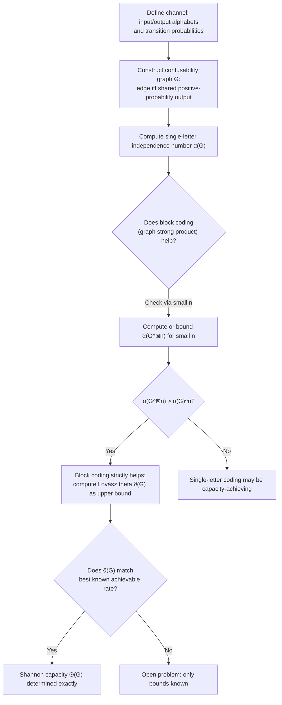

## Zero-Error Information Theory

### Overview

Zero-error information theory studies communication and coding problems under the strict requirement that decoding errors are *completely* forbidden, not merely made asymptotically rare. This contrasts with Shannon's classical (ordinary) information theory, which permits an error probability approaching zero as block length grows but never demands exact zero error. The zero-error framework, founded by Shannon in 1956 and developed substantially by Claude Berge, László Lovász, and others, replaces probabilistic typicality arguments with combinatorial and graph-theoretic structures, revealing that the zero-error capacity of a channel is generally strictly *smaller* than its ordinary Shannon capacity and depends on genuinely different — and often far harder to compute — mathematical objects.

### Why Zero Error Is a Fundamentally Different Problem

In ordinary Shannon theory, a rate is "achievable" if the error probability can be driven to zero *as block length increases*, but at any finite block length some (arbitrarily small) error probability is tolerated. Zero-error theory instead demands that, for a chosen fixed block length, the decoder **never** makes a mistake — not with high probability, but with certainty, for every possible transmitted codeword. This seemingly small change in requirement has dramatic mathematical consequences: while ordinary channel capacity is characterized by a clean, single-letter mutual information formula ($C = \max_p I(X;Y)$), zero-error capacity is characterized by combinatorial graph invariants that are, in general, extremely difficult to compute exactly — some remaining open for specific small channels for decades.

**Key Points**

- Zero-error capacity $C_0$ satisfies $C_0 \leq C$ (ordinary Shannon capacity) always, and the inequality is frequently strict — a channel can have substantial ordinary capacity while having zero-error capacity equal to zero, if even a single confusable pair of inputs exists at every block length.
- The zero-error problem is fundamentally combinatorial (graph theory, hypergraph theory) rather than probabilistic, because "never confusable, ever" is a worst-case combinatorial guarantee, not an average-case probabilistic one.
- Shannon's original 1956 paper on this topic explicitly introduced the tool that now bears his name in this context — the **confusability graph** — establishing the graph-theoretic reformulation that defines the entire field.

### The Confusability Graph

For a discrete memoryless channel with input alphabet $\mathcal{X}$, define the **confusability graph** (or "channel graph") $G$ with vertex set $\mathcal{X}$, where two input symbols $x, x'$ are connected by an edge if and only if they can produce the same output symbol with positive probability (i.e., there exists some $y$ with $p(y|x) > 0$ and $p(y|x') > 0$). Two inputs connected by an edge are said to be **confusable** — a receiver cannot always distinguish, from the output alone, which of the two was actually sent.

A **zero-error code** of length $n$ corresponds exactly to an **independent set** in the $n$-fold "co-normal product" (also called the "confusability graph power") $G^n$: a set of length-$n$ input sequences no two of which can ever produce the same output sequence with positive probability. The zero-error capacity is then defined as the exponential growth rate of the maximum independent set size in these successive graph powers:

$$C_0 = \lim_{n\to\infty} \frac{1}{n} \log \alpha(G^n)$$

where $\alpha(G^n)$ denotes the independence number (size of the largest independent set) of the $n$-th confusability graph power.

**(svg_diagram) Confusability Graph and Zero-Error Codewords**

<svg xmlns="http://www.w3.org/2000/svg" viewBox="0 0 700 380">
\<style\>
.title { font: bold 17px sans-serif; fill: #1a1a2e; }
.node-label { font: bold 13px sans-serif; fill: #fff; }
.label { font: 12px sans-serif; fill: #222; }
.small-label { font: 11px sans-serif; fill: #555; }
\</style\>
<rect width="700" height="380" fill="#fdfdfd" />
<text x="350" y="26" text-anchor="middle" class="title">Confusability Graph (svg_diagram)</text>

<circle cx="180" cy="100" r="26" fill="#2b6cb0" />
<text x="180" y="106" text-anchor="middle" class="node-label">0</text>
<circle cx="350" cy="70" r="26" fill="#2b6cb0" />
<text x="350" y="76" text-anchor="middle" class="node-label">1</text>
<circle cx="520" cy="100" r="26" fill="#2b6cb0" />
<text x="520" y="106" text-anchor="middle" class="node-label">2</text>
<circle cx="560" cy="230" r="26" fill="#2b6cb0" />
<text x="560" y="236" text-anchor="middle" class="node-label">3</text>
<circle cx="350" cy="270" r="26" fill="#2b6cb0" />
<text x="350" y="276" text-anchor="middle" class="node-label">4</text>
<circle cx="140" cy="230" r="26" fill="#2b6cb0" />
<text x="140" y="236" text-anchor="middle" class="node-label">5</text>

<line x1="204" y1="90" x2="326" y2="76" stroke="#c0392b" stroke-width="2.5" />
<line x1="374" y1="82" x2="496" y2="98" stroke="#c0392b" stroke-width="2.5" />
<line x1="530" y1="126" x2="555" y2="204" stroke="#c0392b" stroke-width="2.5" />
<line x1="540" y1="245" x2="375" y2="262" stroke="#c0392b" stroke-width="2.5" />
<line x1="325" y1="265" x2="160" y2="245" stroke="#c0392b" stroke-width="2.5" />
<line x1="160" y1="210" x2="180" y2="126" stroke="#c0392b" stroke-width="2.5" />

<text x="350" y="340" text-anchor="middle" class="small-label">C5: 5-cycle, each vertex confusable with two neighbors</text>
<text x="350" y="356" text-anchor="middle" class="small-label">Independent set (zero-error code): e.g., {0, 2}, size 2</text>
</svg>

### Shannon's Pentagon Problem

The canonical, historically pivotal example is the **5-cycle graph** $C_5$ — a confusability graph where five input symbols are arranged in a cycle, each confusable only with its two immediate neighbors (this arises naturally, for instance, from a specific 5-input channel Shannon constructed). For the single-letter graph, the independence number is trivially $\alpha(C_5) = 2$ (any two non-adjacent vertices in a 5-cycle), giving a naive single-letter zero-error rate of $\log_2 2 = 1$ bit per channel use.

Shannon's own 1956 paper left the exact zero-error capacity of this specific 5-input channel as an **open problem**, only establishing bounds. The problem asks specifically about the **Shannon capacity of the graph** $C_5$, defined via the "strong product" of graphs:

$$\Theta(G) = \lim_{n\to\infty} \sqrt[n]{\alpha(G^{\boxtimes n})}$$

where $G^{\boxtimes n}$ is the $n$-fold strong graph product. Remarkably, using a clever two-symbol-block coding scheme, $\alpha(C_5 \boxtimes C_5) = 5$ (not merely $2^2=4$, which is what independently coding two single symbols would give) — demonstrating that **block coding over the confusability graph can strictly outperform naive single-letter coding**, a genuinely graph-theoretic phenomenon with no counterpart in ordinary Shannon capacity (where single-letter mutual information already achieves the true capacity, with no gain from block-coding "graph power" tricks).

### The Lovász Theta Function

The 5-cycle's zero-error capacity problem remained unresolved for over two decades until László Lovász's landmark 1979 solution, which introduced the **Lovász theta function** $\vartheta(G)$ — a graph invariant computable via semidefinite programming, satisfying the crucial "sandwich" property:

$$\alpha(G) \leq \Theta(G) \leq \vartheta(G) \leq \bar\chi(G)$$

where $\bar\chi(G)$ is the clique cover number (chromatic number of the graph complement). For the specific case of $C_5$, Lovász computed $\vartheta(C_5) = \sqrt{5}$ exactly, and — combined with the block-coding construction showing $\Theta(C_5) \geq \sqrt{5}$ (from the $\alpha(C_5\boxtimes C_5)=5$ result, since $\sqrt[2]{5} = \sqrt{5}$) — this pins down the **exact** Shannon capacity of the pentagon:

$$\Theta(C_5) = \sqrt{5} \approx 2.236$$

This resolved a two-decade-old open problem and remains one of the most celebrated results connecting information theory, combinatorics, and semidefinite programming/convex optimization. The Lovász theta function itself has become an important tool far beyond zero-error information theory, with applications throughout combinatorial optimization and theoretical computer science.

**(svg_diagram) The Sandwich Theorem for Graph Capacity**

<svg xmlns="http://www.w3.org/2000/svg" viewBox="0 0 700 300">
\<style\>
.title { font: bold 17px sans-serif; fill: #1a1a2e; }
.label { font: 13px sans-serif; fill: #222; }
.small-label { font: 11px sans-serif; fill: #555; }
\</style\>
<rect width="700" height="300" fill="#fdfdfd" />
<text x="350" y="26" text-anchor="middle" class="title">Lovász Sandwich Theorem (svg_diagram)</text>

<line x1="80" y1="150" x2="620" y2="150" stroke="#333" stroke-width="2" />

<circle cx="150" cy="150" r="7" fill="#2b6cb0" />
<text x="150" y="120" text-anchor="middle" class="label">α(G)</text>
<text x="150" y="185" text-anchor="middle" class="small-label">independence number</text>
<text x="150" y="198" text-anchor="middle" class="small-label">(single-letter, easy)</text>

<circle cx="350" cy="150" r="7" fill="#c0392b" />
<text x="350" y="120" text-anchor="middle" class="label">Θ(G)</text>
<text x="350" y="185" text-anchor="middle" class="small-label">Shannon capacity</text>
<text x="350" y="198" text-anchor="middle" class="small-label">(true zero-error capacity, hard)</text>

<circle cx="450" cy="150" r="7" fill="#27ae60" />
<text x="450" y="120" text-anchor="middle" class="label">ϑ(G)</text>
<text x="450" y="185" text-anchor="middle" class="small-label">Lovász theta</text>
<text x="450" y="198" text-anchor="middle" class="small-label">(SDP-computable)</text>

<circle cx="580" cy="150" r="7" fill="#8e44ad" />
<text x="580" y="120" text-anchor="middle" class="label">χ̄(G)</text>
<text x="580" y="185" text-anchor="middle" class="small-label">clique cover number</text>

<text x="350" y="250" text-anchor="middle" class="label">For C5: α=2, Θ=√5≈2.236, ϑ=√5, χ̄=3 — sandwich pins Θ exactly</text>
</svg>

### Why This Problem Is Combinatorially Hard in General

Beyond the specific $C_5$ case, computing the Shannon capacity $\Theta(G)$ of a general graph remains, for many graphs, an **open problem**, despite the Lovász theta function providing a computable (via semidefinite programming) upper bound. The core difficulty is that:

- The independence number $\alpha(G^{\boxtimes n})$ can, for some graphs, grow super-multiplicatively in ways that are extremely difficult to characterize or even compute for finite $n$, let alone in the $n\to\infty$ limit.
- The Lovász theta function, while an excellent and often tight bound, is **not always exactly equal** to the true Shannon capacity — for many graphs, $\vartheta(G)$ and $\Theta(G)$ are known or strongly suspected to differ, though pinning down the exact value of $\Theta(G)$ in such cases has resisted solution.
- Even seemingly simple, small graphs (larger odd cycles $C_7, C_9$, etc., and certain small specific graphs studied in the literature) have Shannon capacities that remain **unknown exactly** to this day, with only upper and lower bounds established.

[Inference] The Shannon capacity of $C_7$ specifically remains, as of the most recent literature commonly cited on this topic, not exactly determined — only bounded between known lower (block-coding-construction-based) and upper (Lovász-theta-based) values, illustrating that Shannon's 1956 pentagon problem, while itself resolved, is emblematic of a broader class of still-open problems for other small graphs.

### Zero-Error Capacity With Feedback

A striking additional result in zero-error information theory concerns the effect of a **noiseless feedback link** from receiver back to sender. In *ordinary* Shannon theory, feedback does not increase the capacity of a memoryless point-to-point channel (a well-known classical result: feedback can simplify coding but cannot increase capacity for DMCs). In **zero-error** theory, this is dramatically different: **Shannon showed that feedback can strictly increase zero-error capacity** for certain channels.

The zero-error capacity *with feedback*, $C_{0,f}$, has a cleaner characterization than the feedback-free case, given by:

$$C_{0,f} = \max_{p(x)} \; \min_{x,x' \text{ confusable}} \; \left[-\log \max(\ldots)\right]$$

More precisely and famously, Shannon showed $C_{0,f}$ relates to a different, more tractable graph quantity than the feedback-free Shannon capacity, and — notably — for graphs like odd cycles $C_{2k+1}$ where the ordinary (feedback-free) zero-error capacity is difficult or unknown, the feedback zero-error capacity often has a clean closed form. This asymmetry (feedback helps in zero-error theory but not in ordinary Shannon theory) is one of the clearest illustrations of how fundamentally different the zero-error and ordinary-error frameworks are, despite superficially similar setups.

**Key Points**

- Feedback's zero-error benefit arises because, under the strict zero-error requirement, feedback allows the sender to adapt subsequent transmissions based on exactly what the receiver has correctly resolved so far, resolving combinatorial ambiguities interactively — a benefit unavailable under ordinary Shannon capacity, where the mutual-information-based capacity already fully captures the best achievable rate regardless of adaptive strategies.
- This is a genuinely surprising result precisely because it contradicts the intuition (correctly established for ordinary Shannon capacity) that feedback is "useless" for capacity in memoryless point-to-point channels — zero-error capacity's combinatorial nature breaks this intuition.

### Zero-Error Capacity of the Noisy Typewriter Channel

A useful, fully worked, tractable example is the **noisy typewriter channel**: an alphabet of $n$ symbols arranged in a cycle, where each transmitted symbol is received either correctly or as the next symbol in the cyclic order (each with probability $1/2$, say). The confusability graph here is exactly the cycle graph $C_n$ (each symbol confusable with its single cyclic successor — a directed, but for confusability purposes effectively undirected in this construction, adjacency).

For **even** $n$, the cycle graph $C_n$ (even cycle) has zero-error capacity exactly $\frac{1}{2}\log_2 n$, achieved simply by using every other symbol (an independent set of size $n/2$, achievable at the single-letter level with no need for block-coding tricks) — this is one case where the naive single-letter independence number already gives the exact answer, no Lovász-theta machinery required.

For **odd** $n$ (like the $C_5$ pentagon case), the situation is the harder one described above — no single-letter coding achieves the true Shannon capacity, block coding strictly helps, and (except for the specific $n=5$ case Lovász resolved) the exact capacity for general odd $n$ typewriter/cycle channels may remain open or require case-specific analysis.

### Worked Example: Verifying the Pentagon's Two-Letter Code

To make the $\alpha(C_5\boxtimes C_5)=5$ result concrete: label the five vertices of $C_5$ as $\{0,1,2,3,4\}$ with edges between $i$ and $i+1 \pmod 5$. A valid 5-codeword independent set in the strong product $C_5 \boxtimes C_5$ (pairs of symbols, where two pairs are "adjacent"/confusable only if *both* coordinates are equal or adjacent in $C_5$) is:

$$\{(0,0), (1,2), (2,4), (3,1), (4,3)\}$$

Checking any two of these pairs — e.g., $(0,0)$ and $(1,2)$ — confirms they are not simultaneously equal-or-adjacent in both coordinates: $0$ and $1$ are adjacent (confusable) in the first coordinate, but $0$ and $2$ are *not* adjacent in $C_5$ (distance 2 around the cycle) in the second coordinate — so the pair as a whole is not confusable in the strong product. Verifying all $\binom{5}{2}=10$ pairs this way confirms all five two-symbol codewords are mutually non-confusable, giving $\alpha(C_5^{\boxtimes 2}) \geq 5 > 4 = \alpha(C_5)^2$, the strict super-multiplicative gain that motivated the entire Lovász theta construction.

### Process Flow: Analyzing a Zero-Error Communication Problem

### Applications and Broader Significance

- **Combinatorial optimization and complexity theory**: the Lovász theta function developed for this problem has become a standard tool in approximation algorithms and semidefinite-programming-based combinatorial optimization, extending well beyond its original zero-error information theory motivation.
- **Coding for systems requiring absolute reliability**: certain applications (safety-critical control systems, some forms of digital rights management token systems, specific error-correcting scenarios where any error is catastrophic rather than merely costly) motivate zero-error-style analysis directly, though most practical error-correcting code design uses ordinary (near-zero, not exactly-zero) error probability targets, since these permit vastly higher rates.
- **Graph entropy and related invariants**: zero-error information theory has motivated a family of related graph-theoretic entropy measures (graph entropy, fractional graph coloring numbers) with applications in perfect hashing, circuit complexity, and combinatorial search theory.

[Inference] The direct practical deployment of zero-error coding techniques (as opposed to the mathematical tools like Lovász theta they inspired) remains niche relative to ordinary near-zero-error coding, since the rate penalty for insisting on exact zero error is often substantial and most applications tolerate arbitrarily small (not necessarily zero) error probability in exchange for significantly higher throughput.

### Limitations and Open Problems

- **Many small graphs' Shannon capacities remain unknown.** Despite the resolution of the pentagon problem, the exact Shannon capacity of several other specific small graphs (including some cycle graphs $C_7$ and beyond, and various other small vertex-transitive graphs studied in the literature) remains unresolved, bounded but not pinned down exactly.
- **The Lovász theta function is not always tight.** For graphs where $\vartheta(G) \neq \Theta(G)$, no general method is known to compute the exact Shannon capacity, and determining whether the gap is genuine (theta is a strict overestimate) or merely a matter of not yet having found the right block-coding construction is itself often unresolved for specific graphs.
- **The feedback zero-error capacity's full generalization is more specialized.** While Shannon's feedback result cleanly resolves capacity for several structured graph families (odd cycles notably), a fully general theory characterizing zero-error feedback capacity for arbitrary channels/graphs is less complete than the feedback-free framework's (already incomplete) Lovász-theta machinery.

### Related Topics

- Lovász theta function and semidefinite programming in combinatorial optimization
- Graph entropy and perfect hashing
- Shannon capacity of graphs: known results and open problems for small graphs
- Strong graph products and their role in block-coding constructions
- Zero-error capacity with noiseless feedback
- Confusability graphs and independent sets in coding theory
- Perfect codes and combinatorial designs in coding theory