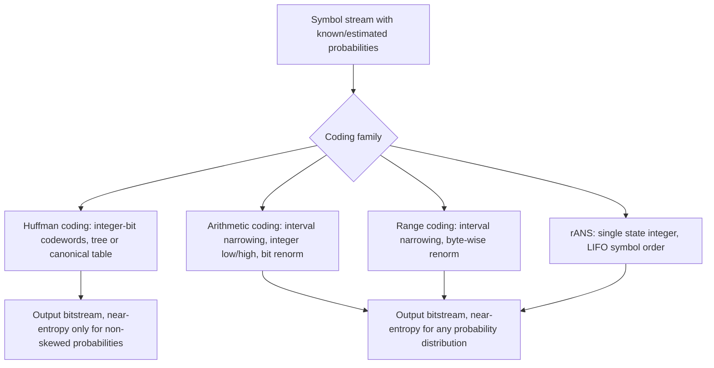

## Implementing Entropy Coders from Scratch

### Overview and Goals

Entropy coding is the final stage of most compression pipelines, converting a stream of symbols with known (or estimated) probabilities into a bitstream whose length approaches the theoretical entropy limit:

$$H(X) = -\sum_{i} p(x_i) \log_2 p(x_i)$$

Implementing an entropy coder from scratch means building the machinery that achieves this bound in practice — not just computing $H(X)$ analytically, but producing actual bits that a decoder can losslessly invert. This section walks through the core building blocks for three widely implemented families: **Huffman coding**, **arithmetic coding**, and **range/asymmetric numeral systems (rANS)** coding, with attention to the practical details (integer arithmetic, renormalization, table construction) that separate a working implementation from a textbook description.

### Huffman Coding: Data Structures and Algorithm

Huffman coding assigns variable-length binary codewords to symbols such that more frequent symbols get shorter codes, using a full binary tree built greedily.

**Core algorithm:**

1. Compute symbol frequencies (or probabilities) from the input.
2. Create a leaf node for each symbol, with weight equal to its frequency.
3. Insert all leaves into a min-priority queue keyed by weight.
4. While more than one node remains in the queue:
   - Pop the two lowest-weight nodes.
   - Create a new internal node with these two as children, and weight equal to the sum of their weights.
   - Push the new node back into the queue.
5. The remaining node is the root; codewords are derived by traversing root-to-leaf, appending `0` for a left branch and `1` for a right branch (or vice versa, by convention).

**Implementation considerations:**

- A **binary min-heap** is the standard priority-queue implementation, giving $O(n \log n)$ total construction time for $n$ symbols.
- Ties in weight should be broken deterministically (e.g., by insertion order or a secondary key) to ensure the encoder and decoder — or two independent encoder runs — produce an identical tree; without a fixed tie-breaking rule, non-canonical Huffman implementations can diverge.
- For decoding efficiency and compact header transmission, **canonical Huffman codes** are typically used in practice: instead of transmitting the tree structure, only the codeword lengths per symbol are transmitted, and the actual codewords are reconstructed deterministically (shortest codes first, in lexicographic/numeric symbol order, incrementing by 1 and left-shifting on length increase). This is the technique used in DEFLATE (zlib/gzip) and JPEG.

**Encoding:** for each input symbol, look up its codeword (bit pattern and length) in a precomputed table, and append those bits to the output bitstream, most commonly using a bit-buffer that accumulates bits into bytes.

**Decoding:** two common approaches:

- **Tree traversal**: walk the Huffman tree bit-by-bit from the root until a leaf is reached, emitting that leaf's symbol, then restart at the root. Simple but branch-heavy.
- **Table-driven decoding**: precompute a lookup table indexed by the next $k$ bits of the stream (for canonical codes, this is straightforward to build from the code lengths), returning the decoded symbol and the number of bits consumed in one step. This trades memory for significant decode-speed improvements and is standard in production codecs.

**Limitation:** Huffman coding is provably optimal only among prefix codes assigning an *integer* number of bits per symbol, so it cannot approach entropy for skewed distributions where an optimal code would need fractional bits per symbol (e.g., a symbol with probability 0.9 ideally needs about $-\log_2(0.9) \approx 0.152$ bits, but Huffman must assign it at least 1 bit). This gap motivates arithmetic and range coding.

### Arithmetic Coding: Core Mechanics

Arithmetic coding represents an entire message as a single number (conceptually a sub-interval of $[0,1)$), allowing fractional bits per symbol and getting arbitrarily close to the entropy bound.

**Conceptual model:**

1. Maintain a current interval $[\text{low}, \text{high})$, initialized to $[0,1)$ (or an integer-scaled equivalent, see below).
2. For each symbol, partition the current interval into sub-intervals proportional to each symbol's cumulative probability.
3. Narrow $[\text{low}, \text{high})$ to the sub-interval corresponding to the actual symbol encountered.
4. Repeat for every symbol in the message; the final interval (or any number within it) uniquely encodes the entire sequence.
5. Decoding reverses this: given the encoded number, repeatedly determine which sub-interval it falls in to recover each symbol, narrowing the interval identically to the encoder at each step.

**Why floating-point arithmetic coding is impractical:** in a naive implementation, `low` and `high` require unbounded precision as the interval narrows exponentially with message length, which floating-point numbers cannot represent exactly, and cross-platform floating-point rounding differences would desynchronize encoder and decoder. Virtually all real implementations therefore use **integer arithmetic coding**.

**Integer arithmetic coding — key mechanisms:**

- `low` and `high` are maintained as fixed-width integers (commonly 32-bit).
- **Renormalization**: whenever the leading bits of `low` and `high` agree (i.e., the interval has narrowed into the top or bottom half of the range), that leading bit is output, and both `low` and `high` are shifted left by one bit (with `high` having a 1 shifted into its low bit), preventing the interval from collapsing to a single point due to finite precision.
- **Underflow handling**: when `low` and `high` converge toward the middle without their leading bits agreeing (e.g., `low` just below $0.5$ and `high` just above $0.5$ in normalized terms), a special case tracks pending bits (`E3 mapping`, the classic technique from Witten–Neal–Cleary) to avoid the interval collapsing without producing output.
- Frequencies and cumulative frequency tables are stored as integers with a bounded total, and interval subdivision is computed via integer multiplication and division (with careful attention to avoiding overflow given the chosen bit width).

**Cumulative frequency table:** for symbols $\{s_1, \dots, s_k\}$ with frequencies $f_1, \dots, f_k$ and total $T = \sum f_i$, define $C_i = \sum_{j<i} f_j$. The new interval for symbol $s_i$ is:

$$\text{new\_low} = \text{low} + (\text{high} - \text{low} + 1) \cdot \frac{C_i}{T}, \qquad
\text{new\_high} = \text{low} + (\text{high} - \text{low} + 1) \cdot \frac{C_i + f_i}{T} - 1$$

with all divisions performed as integer division.

**Adaptive vs. static models:** a static arithmetic coder uses fixed, precomputed frequencies (requiring the table to be transmitted or agreed upon in advance). An **adaptive** arithmetic coder updates frequency counts after each symbol is processed, using identical update logic in encoder and decoder so both stay synchronized without transmitting a table — at the cost of the model being less accurate early in the stream.

### Range Coding

Range coding is a close variant of arithmetic coding that operates directly on byte-aligned (or otherwise wider) renormalization rather than bit-by-bit, which historically avoided software patents that covered certain arithmetic-coding implementation details and remains popular for its speed. The mathematical principle is identical to arithmetic coding — narrowing a `[low, low+range)` interval proportionally to cumulative symbol frequencies — but renormalization emits a full byte at a time once `range` falls below a threshold, rather than a single bit, which reduces the number of renormalization operations and improves throughput.

### rANS (Range Asymmetric Numeral Systems)

rANS, part of the ANS family introduced by Jarosław Duda, achieves entropy-coding performance comparable to arithmetic coding but reformulates the process as operations on a single state integer rather than an interval, and — notably — processes symbols in a **LIFO (last-in, first-out)** order, meaning the encoder typically runs over the input in reverse so the decoder can proceed forward.

**Core state update (encoding a symbol $s$ with frequency $f_s$, cumulative frequency $C_s$, and total $M$):**

$$x' = M \cdot \left\lfloor \frac{x}{f_s} \right\rfloor + (x \bmod f_s) + C_s$$

Renormalization keeps the state $x$ within a bounded range by shifting bits/bytes out to the bitstream before or after the state update, depending on the specific renormalization variant (streaming vs. interleaved).

**Why rANS is popular in modern codecs:** compared to classical arithmetic coding, rANS implementations often achieve **higher throughput** because the state update is a small number of integer operations without the interval-tracking bookkeeping, and rANS is particularly amenable to **SIMD** and **interleaved multi-stream** implementations, where several independent rANS states are advanced in parallel to hide instruction latency — a technique popularized in Fabian Giesen's public rANS implementations. This has made rANS the entropy-coding backend of choice in several modern compressors (e.g., components of Facebook's Zstandard, and Apple's LZFSE).

[Inference] The specific list of production codecs using rANS evolves; consult the current source or documentation of a given codec to confirm which entropy stage it uses, since some systems use rANS for some substreams (e.g., literals) and other techniques (e.g., FSE, a table-driven ANS variant) elsewhere.

### Implementation Checklist (Practical Steps)

**Key Points**

- Choose a fixed integer bit-width for state/interval variables (commonly 16, 32, or 64 bits) and reason explicitly about overflow in every multiplication.
- Decide static vs. adaptive modeling; adaptive models need matching update rules on both encoder and decoder, executed in identical order.
- Implement renormalization carefully — this is the most error-prone part of both arithmetic and range coders, and subtle bugs (e.g., in underflow/carry handling) often manifest only on specific rare input sequences, making thorough testing essential.
- Build round-trip tests: encode then decode a wide range of inputs (empty input, single symbol, highly skewed distributions, uniform distributions, long runs) and assert bit-for-bit or symbol-for-symbol equality.
- Compare achieved bitstream length against the computed entropy $H(X)$ for the same input to validate the coder is approaching the theoretical bound (a correct coder should land within a small overhead, particularly for static models over reasonably long inputs).
- For adaptive models, add carry/overflow safety by periodically rescaling frequency counts if the running total approaches the bit-width's precision limit.

### Diagram: Entropy Coder Family Comparison

### Diagram: Arithmetic Coding Interval Narrowing (svg_diagram)

<svg xmlns="http://www.w3.org/2000/svg" viewBox="0 0 700 260">
<text x="350" y="28" text-anchor="middle" font-size="18" font-weight="bold" fill="#222">Arithmetic Coding: Interval Narrowing (svg_diagram)</text>

<text x="40" y="65" font-size="13" fill="#333">Step 0: [0.0, 1.0)</text>

<rect x="40" y="72" width="600" height="24" fill="`#e8f0fe`" stroke="`#3355aa`" stroke-width="1.5" />

<text x="40" y="120" font-size="13" fill="#333">Step 1: symbol "A" (p=0.3) → [0.0, 0.3)</text>

<rect x="40" y="127" width="180" height="24" fill="`#d0e6d0`" stroke="`#227722`" stroke-width="1.5" />

<rect x="40" y="127" width="600" height="24" fill="none" stroke="#999" stroke-width="1" stroke-dasharray="3,3" />

<text x="40" y="175" font-size="13" fill="#333">Step 2: symbol "B" (p=0.5 of sub-range) → [0.09, 0.24)</text>

<rect x="94" y="182" width="90" height="24" fill="`#ffe0b3`" stroke="`#cc8800`" stroke-width="1.5" />

<rect x="40" y="182" width="600" height="24" fill="none" stroke="#999" stroke-width="1" stroke-dasharray="3,3" />

<text x="40" y="230" font-size="12" fill="#555">Final interval narrows with each symbol; any number inside it encodes the full sequence.</text>

</svg>

### Related Topics

- Huffman coding optimality proof and Kraft's inequality
- Adaptive modeling and context modeling (e.g., PPM, context mixing)
- Finite State Entropy (FSE) and table-based ANS variants
- Arithmetic coding underflow/carry handling (E1/E2/E3 mapping details)
- Practical bitstream I/O: bit-buffers, byte alignment, and endianness handling
- Comparing entropy-coder throughput and compression ratio empirically
- Integration of entropy coders into full compression pipelines (e.g., LZ77 + entropy stage, as in DEFLATE and Zstandard)