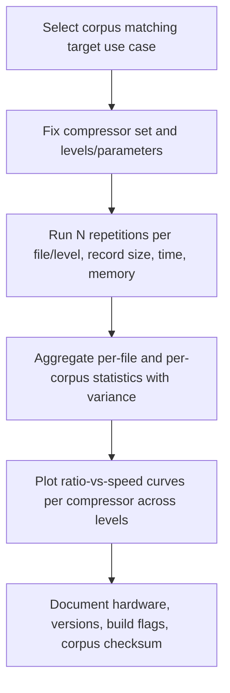

## Benchmarking Compression Algorithms

### Goals and Scope of Benchmarking

Benchmarking a compression algorithm means measuring its behavior along several axes — compression ratio, encode/decode speed, memory usage, and robustness — under conditions representative of real intended use. A benchmark that reports only compression ratio, or only speed on a single dataset, gives an incomplete and potentially misleading picture, since compressors trade off these dimensions against each other by design (e.g., higher-ratio modes almost always cost more CPU time and/or memory).

### Core Metrics

**Compression ratio and related measures:**

$$\text{Compression ratio} = \frac{\text{original size}}{\text{compressed size}}$$

Equivalently reported as **space savings**:

$$\text{Space savings} = 1 - \frac{\text{compressed size}}{\text{original size}}$$

or as **bits per byte / bits per character (bpc)**, which is often preferred in the compression research literature because it is directly comparable to the theoretical entropy bound $H(X)$ computed on the same input:

$$\text{bpc} = \frac{\text{compressed size in bits}}{\text{number of input symbols}}$$

Reporting bpc alongside the empirically estimated entropy of the test data allows a direct assessment of how close a coder gets to the theoretical limit, which is particularly relevant when validating an entropy coder implementation (see prior topic) rather than a full compressor.

**Speed metrics:**

- **Throughput**, typically in MB/s, measured separately for **compression speed** and **decompression speed**, since many algorithms (e.g., Brotli, zstd at high levels) are deliberately asymmetric — slow to compress but fast to decompress — which is a deliberate design trade-off for use cases like static asset delivery where compression happens once and decompression happens many times.
- **Latency** for small inputs, which matters for use cases like compressing individual small network messages or database records, where fixed per-call overhead (e.g., dictionary/table setup) can dominate.

**Memory metrics:**

- **Peak memory usage** during compression and during decompression, which can differ substantially (e.g., some algorithms need large hash tables or window buffers only at compression time).
- **Memory usage scaling** with configured compression level and/or window/dictionary size, since many modern compressors (zstd, Brotli, LZMA) expose a level parameter that trades ratio for both speed and memory.

**Other relevant properties:**

- **Determinism**: whether the same input and same settings always produce byte-identical output, relevant for reproducible builds and certain content-addressed storage systems.
- **Streaming support and behavior**: throughput and ratio under streaming/incremental input versus single-shot whole-buffer compression, since streaming mode often sacrifices some ratio for the ability to flush/emit output before the full input is seen.
- **Robustness to adversarial or malformed input**, particularly for decompression: a decoder should degrade safely (reject or error cleanly) rather than exhibit undefined behavior or unbounded resource consumption on malformed compressed streams (relevant for compressors exposed to untrusted input, e.g., in web servers or archive tools).

### Test Corpora

The choice of test data substantially affects reported results, so benchmarks should specify the corpus precisely and, ideally, use recognized standard corpora so results are comparable across independent studies:

- **Calgary Corpus**: an early, historically influential (1987) benchmark set including a mix of text, executable, and image files; now considered somewhat dated but still referenced for continuity with historical compression literature.
- **Canterbury Corpus**: a later, more carefully curated successor to Calgary, intended to be more representative of the file types and sizes common at the time of its creation.
- **Silesia Corpus**: a larger, more modern corpus (assembled by Sebastian Deorowicz) including varied real-world file types (database dumps, executables, XML, text, images), commonly used to benchmark general-purpose compressors like zstd, Brotli, and LZMA.
- **Large Text Compression Benchmark (LTCB)** and the **Hutter Prize** corpus (a specific large excerpt of English Wikipedia text): used specifically for benchmarking text/context-modeling compressors, where the goal is often maximum compression ratio rather than speed.
- **Domain-specific corpora**: for specialized use cases (e.g., genomic data, JSON logs, protobuf-serialized data, floating-point scientific data), general-purpose corpora may not be representative, and a benchmark intended to guide a real deployment decision should include data resembling the actual production workload.

[Inference] The relative popularity and perceived "standardness" of these corpora shifts over time as new corpora are published and older ones are seen as less representative of modern data (e.g., increasing prevalence of already-compressed media, JSON/structured logs, or ML model weights); a benchmark author should verify which corpus is currently considered appropriate for their specific comparison claim rather than assuming a fixed hierarchy.

### Methodological Pitfalls

**Key Points**

- **Cold vs. warm cache effects**: repeated runs on the same data can benefit from OS file-cache or CPU-cache warm-up; benchmarks should specify whether timing includes disk I/O and whether multiple runs are averaged with cache effects controlled for (or explicitly measured).
- **Single-threaded vs. multi-threaded comparison**: some compressors (e.g., zstd, xz with `-T`) support multi-threaded compression that can substantially change throughput without changing ratio; comparisons across tools should state thread counts explicitly, since an apples-to-oranges single-threaded-vs-multi-threaded comparison misrepresents relative speed.
- **Level/parameter matching**: comparing "zstd" against "gzip" without specifying compression levels for both is close to meaningless, since each tool spans a wide ratio/speed range across its own level parameter; fair comparisons typically plot a **ratio-vs-speed curve** across multiple levels for each tool rather than a single point.
- **File-size effects**: compressors with fixed per-call overhead (dictionary initialization, header bytes) perform very differently on many small files versus one large file; a benchmark should report results for the file-size distribution relevant to the intended use case, or explicitly test multiple size regimes.
- **Preprocessing and dictionary effects**: some benchmarks apply a shared/pretrained dictionary (common for small, similar records, e.g., zstd's dictionary training) which can dramatically change ratio for small inputs; whether a dictionary was used, and how it was trained, must be disclosed for the result to be reproducible.
- **Hardware and build variance**: results are influenced by CPU microarchitecture (e.g., available SIMD instruction sets), compiler and optimization flags, and system load from other processes; reporting the exact hardware, compiler version, and build flags is necessary for others to reproduce or contextualize the numbers.

### Statistical Rigor in Reported Results

- Run each configuration multiple times and report a measure of central tendency (mean or median) together with a variance measure (standard deviation, or min/max range), rather than a single run's number, since system-level timing noise (scheduling, thermal throttling, background processes) can produce meaningfully different single-run results.
- When comparing two algorithms' speed, consider whether observed differences are within the run-to-run variance before asserting one is "faster"; for close results, this comparison benefits from a real statistical test rather than eyeballing averages. [Inference] Whether a formal significance test (rather than a simple variance-vs-difference sanity check) is applied varies substantially across published compression benchmarks, so the rigor of any specific external result should be assessed individually rather than assumed.
- Report both **compression ratio** and **combined throughput** (or separate compression/decompression throughput) as a joint result per configuration, since ranking algorithms by a single metric alone can favor a tool that is only good along that one axis (e.g., a coder with an excellent ratio but decompression too slow for the target application).

### Practical Benchmark Design

**Example** benchmark structure for comparing several general-purpose compressors:

1. Fix a set of test files spanning the corpus/corpora relevant to the target use case, and record each file's uncompressed size.
2. For each compressor under test, run at multiple representative levels (e.g., "fast", "default", "max") across a fixed number of repetitions per file/level combination.
3. For each run, record: compressed size, wall-clock compression time, wall-clock decompression time, and peak resident memory during each phase.
4. Aggregate per-file results into per-corpus summaries (e.g., total compression ratio across the corpus, and mean/median throughput), while also retaining per-file results to check for outlier files that behave very differently from the aggregate (e.g., a single already-compressed file dragging down the mean ratio).
5. Present results as a ratio-vs-speed scatter or line plot (one curve per compressor, across its levels) rather than a single-number leaderboard, since this communicates the actual trade-off space rather than an arbitrary operating-point comparison.
6. Document exact tool versions, build flags, hardware, OS, and corpus version/checksum so the benchmark is independently reproducible.

### Diagram: Benchmark Workflow

### Diagram: Ratio vs. Speed Trade-off (svg_diagram)

<svg xmlns="http://www.w3.org/2000/svg" viewBox="0 0 640 320">
<text x="320" y="26" text-anchor="middle" font-size="18" font-weight="bold" fill="#222">Compression Ratio vs. Speed Trade-off (svg_diagram)</text>
<line x1="70" y1="270" x2="600" y2="270" stroke="#333" stroke-width="1.5" />
<line x1="70" y1="270" x2="70" y2="50" stroke="#333" stroke-width="1.5" />
<text x="335" y="300" text-anchor="middle" font-size="13" fill="#333">Speed (MB/s, higher = right)</text>
<text x="30" y="160" text-anchor="middle" font-size="13" fill="#333" transform="rotate(-90 30 160)">Compression ratio (higher = up)</text>
<polyline points="120,240 200,210 300,170 420,120 560,80" fill="none" stroke="#3355aa" stroke-width="2.5" />
<circle cx="120" cy="240" r="4" fill="#3355aa" />
<circle cx="200" cy="210" r="4" fill="#3355aa" />
<circle cx="300" cy="170" r="4" fill="#3355aa" />
<circle cx="420" cy="120" r="4" fill="#3355aa" />
<circle cx="560" cy="80" r="4" fill="#3355aa" />
<text x="560" y="65" text-anchor="middle" font-size="11" fill="#3355aa">Tool A (levels 1-9)</text>
<polyline points="150,255 250,245 380,225 500,195 590,160" fill="none" stroke="#cc6600" stroke-width="2.5" />
<circle cx="150" cy="255" r="4" fill="#cc6600" />
<circle cx="250" cy="245" r="4" fill="#cc6600" />
<circle cx="380" cy="225" r="4" fill="#cc6600" />
<circle cx="500" cy="195" r="4" fill="#cc6600" />
<circle cx="590" cy="160" r="4" fill="#cc6600" />
<text x="590" y="145" text-anchor="middle" font-size="11" fill="#cc6600">Tool B (levels 1-9)</text>
</svg>

### Related Topics

- Compression corpora deep dive: composition and known biases of Calgary, Canterbury, and Silesia
- Statistical significance testing for performance benchmarks
- Dictionary training methods for small-message compression (e.g., zstd dictionary API)
- Asymmetric compressors and their deployment implications (compress-once/decompress-many workloads)
- Memory-constrained and embedded-system compression benchmarking
- Reproducible benchmarking practices and containerized test environments