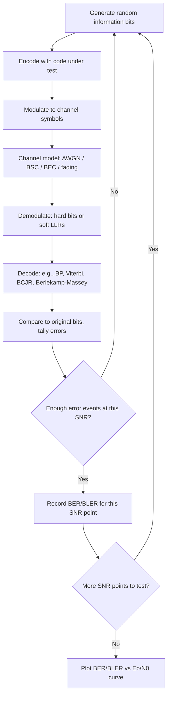

## Simulating Channel Coding Schemes

### Purpose of Simulation

Channel coding theorems (Shannon capacity, error exponents, and code-specific bounds) establish what is achievable in principle, but they typically say little about the finite-length, practical performance of a specific code under a specific decoder on a specific channel. Simulation bridges this gap: it empirically measures how a real, finite-length code and decoder perform, producing curves (most commonly **bit error rate** or **block error rate** versus signal-to-noise ratio) that guide code selection, decoder design, and system-level link-budget decisions in ways closed-form analysis often cannot, especially for iterative codes (LDPC, turbo codes) whose finite-length behavior is analytically intractable in general.

### Core Simulation Loop

A standard channel-coding Monte Carlo simulation follows this structure:

1. **Generate random information bits** (uniformly at random, since code performance should not depend on message content for a well-designed code, and using non-uniform or patterned data risks measuring an artifact of the data rather than the code).
2. **Encode** the information bits using the code under test (e.g., a specific LDPC parity-check matrix, a convolutional code with a given generator polynomial, a Reed–Solomon encoder).
3. **Modulate** the coded bits onto channel symbols (e.g., BPSK, QPSK, higher-order QAM), since the channel model typically operates on continuous symbols, not raw bits.
4. **Pass through the channel model**, adding the appropriate impairment (see channel models below) at a specified noise level.
5. **Demodulate**, producing either hard decisions (bits) or soft decisions (log-likelihood ratios, LLRs) depending on whether the decoder is hard-decision or soft-decision.
6. **Decode**, running the code's decoding algorithm (e.g., belief propagation for LDPC, the Viterbi or BCJR algorithm for convolutional codes, Berlekamp–Massey for Reed–Solomon).
7. **Compare** decoded output to the original information bits, tallying bit errors and/or block (frame) errors.
8. **Repeat** steps 1–7 many times at each tested noise level, accumulating error statistics until a target confidence level is reached (see statistical considerations below), then repeat the entire process across a range of noise levels to produce a full performance curve.

### Channel Models

**Additive White Gaussian Noise (AWGN):** the most common baseline channel, modeling thermal noise as independent Gaussian noise added to each transmitted symbol:

$$y = x + n, \qquad n \sim \mathcal{N}(0, \sigma^2)$$

The noise variance $\sigma^2$ is set according to the target $E_b/N_0$ (energy per information bit over noise spectral density), which requires correctly accounting for the code rate $R$ and modulation order when converting $E_b/N_0$ to the per-symbol noise variance used in the simulation, since the same $E_b/N_0$ corresponds to different SNR depending on both the code rate and modulation.

**Binary Symmetric Channel (BSC):** a simpler abstraction where each transmitted bit is independently flipped with fixed crossover probability $p$, useful for testing decoders at the algorithmic level (isolating decoder behavior from modulation/demodulation details) and for theoretical comparison against BSC-specific bounds.

**Binary Erasure Channel (BEC):** each bit is either received correctly or erased (marked as unknown) with probability $\epsilon$, commonly used to evaluate erasure-correcting codes (e.g., fountain codes, some LDPC applications) and for its analytical tractability in code-design theory.

**Fading channels** (Rayleigh, Rician): model multipath wireless propagation where the received signal amplitude varies randomly, typically simulated by multiplying the transmitted symbol by a random complex fading coefficient (drawn from the appropriate distribution) in addition to AWGN; these are essential for realistic wireless system simulation but add simulation complexity (e.g., choices about fading coherence time / block vs. fast fading) that must match the target real-world scenario.

[Inference] The specific choice of channel model (and its parameters, e.g., Doppler spread for fading channels) should be driven by the target application; using an AWGN-only simulation to make claims about performance in a fading environment would misrepresent real-world behavior, since code and decoder rankings can differ substantially between channel types.

### Statistical Considerations: Confidence and Error Counting

Because bit/block error rate is being estimated from a finite number of Monte Carlo trials, the simulation result is itself a random variable with associated uncertainty, and this uncertainty must be characterized rather than ignored:

- **Rule of thumb for confidence**: a commonly cited guideline is to accumulate at least on the order of 100 (and preferably more, e.g., several hundred) error events at each tested point before treating the estimated error rate as reasonably reliable, since an error-rate estimate based on very few observed errors has wide relative uncertainty.
- **Low-error-rate regions are expensive to simulate**: at high SNR (or equivalently, deep into the "waterfall" or "error floor" region of a code's performance curve), true error rates can be extremely low (e.g., $10^{-8}$ or lower for some codes' error floors), meaning a naive Monte Carlo simulation would require an impractically large number of trials to observe enough errors for a reliable estimate — this motivates **variance-reduction / importance sampling techniques** (biasing the noise or channel realizations toward error-causing events, then correcting the resulting statistics by the known importance weight) to estimate very low error rates without simulating an infeasible number of trials. [Unverified] The specific importance-sampling technique and correction formula appropriate for a given code/decoder combination is a nontrivial, code-specific design choice; general treatments of importance sampling for coding simulation should be consulted for the precise weighting derivation before implementation.
- **Error floors** in iterative codes (LDPC, turbo codes) are a specific phenomenon worth simulating for deliberately: performance curves for these codes typically show a steep "waterfall" region followed by a much shallower "error floor" at higher SNR, often attributable to structural weaknesses (e.g., trapping sets in LDPC codes) that plain Monte Carlo simulation may fail to characterize accurately without either very large trial counts or specialized techniques targeting the floor region specifically.

### Performance Curves and What They Show

**Key Points**

- **BER/BLER vs. $E_b/N_0$ (or SNR)** is the standard output plot, with error rate on a logarithmic y-axis (since error rates typically span many orders of magnitude across the tested range) and $E_b/N_0$ in dB on the x-axis.
- Comparing a simulated curve against the **Shannon limit** for the given code rate and channel (the theoretical minimum $E_b/N_0$ at which reliable communication is possible at that rate) quantifies the code's **gap to capacity**, a standard figure of merit for evaluating how close a practical code/decoder combination comes to the information-theoretic bound.
- **Waterfall region**: the steep drop in error rate over a narrow SNR range, generally where practical codes are designed to operate.
- **Error floor**: the shallower tail at higher SNR, particularly prominent in iterative decoders, where the error rate decreases much more slowly with increasing SNR; the SNR at which the floor becomes noticeable is a key design/selection criterion, especially for applications with very low target error rates (e.g., storage systems).

### Decoder-Specific Simulation Considerations

- **Iterative decoders (LDPC, turbo codes)**: the number of decoding iterations, and the stopping criterion (fixed iteration count vs. early termination on convergence, e.g., all parity checks satisfied), materially affects both simulated performance and simulated decoding time; both should be fixed and reported as part of the simulation configuration for reproducibility.
- **Quantization effects**: simulating a decoder with finite-precision LLRs (as would occur in real hardware) rather than full floating-point LLRs can reveal a performance gap relevant to hardware implementations; a simulation intended to inform hardware design should include a quantized-LLR variant alongside the floating-point baseline.
- **List decoding (e.g., for polar codes)**: simulating list-decoded codes requires tracking additional complexity (list size, CRC-aided selection among list candidates), and performance depends on the chosen list size, which is itself a design parameter to sweep.

### Simulation Implementation Considerations

- **Random number generator quality**: a Monte Carlo channel-coding simulation depends on a high-quality, sufficiently long-period pseudo-random generator for both bit generation and noise generation; a generator with hidden correlations or a short period can bias results, particularly at the high trial counts needed for low-error-rate estimation.
- **Reproducibility**: fixing and recording the random seed(s) used allows exact reproduction of a specific simulation run, which is valuable for debugging discrepancies between implementations or verifying reported results.
- **Vectorization and parallelization**: because Monte Carlo channel simulation involves large numbers of independent trials, it is naturally parallelizable across trials (and, for iterative decoders, across independent codeword decodes), making it well suited to vectorized/batched implementations (e.g., array-based operations, GPU acceleration) that substantially reduce wall-clock time for a target confidence level, particularly at low error rates requiring many trials.
- **Validation against known results**: before trusting a new simulation implementation for a novel code, validating it by reproducing a published performance curve for a well-known code (e.g., a standard-rate convolutional code with Viterbi decoding on AWGN) is a standard sanity check that the encode/channel/decode/statistics pipeline is implemented correctly.

### Diagram: Simulation Pipeline

### Diagram: Typical BER Curve Regions (svg_diagram)

<svg xmlns="http://www.w3.org/2000/svg" viewBox="0 0 640 320">
<text x="320" y="26" text-anchor="middle" font-size="18" font-weight="bold" fill="#222">BER vs Eb/N0: Waterfall and Error Floor (svg_diagram)</text>
<line x1="70" y1="270" x2="600" y2="270" stroke="#333" stroke-width="1.5" />
<line x1="70" y1="270" x2="70" y2="50" stroke="#333" stroke-width="1.5" />
<text x="335" y="300" text-anchor="middle" font-size="13" fill="#333">Eb/N0 (dB)</text>
<text x="30" y="160" text-anchor="middle" font-size="13" fill="#333" transform="rotate(-90 30 160)">BER (log scale)</text>

<path d="M100,80 C160,85 220,90 260,140 C300,190 320,235 360,250 C420,262 500,266 570,268" fill="none" stroke="`#aa2222`" stroke-width="2.5" />

<text x="200" y="120" font-size="12" fill="`#aa2222`">Waterfall region</text>

<line x1="240" y1="128" x2="280" y2="165" stroke="`#aa2222`" stroke-width="1" />

<text x="470" y="255" font-size="12" fill="`#aa2222`">Error floor</text>

<line x1="500" y1="250" x2="520" y2="264" stroke="`#aa2222`" stroke-width="1" />

<line x1="70" y1="60" x2="600" y2="230" stroke="#3355aa" stroke-width="1.5" stroke-dasharray="5,4" />
<text x="500" y="200" font-size="12" fill="#3355aa">Shannon limit (this rate)</text>
</svg>

### Related Topics

- LDPC belief-propagation decoding implementation details
- Turbo code iterative (BCJR-based) decoding
- Importance sampling techniques for rare-event simulation in coding
- Finite-length channel coding bounds (e.g., normal approximation, achievability/converse bounds)
- Error floor analysis and trapping sets in LDPC codes
- Polar codes and successive-cancellation list decoding
- Link-level vs. system-level simulation in wireless standards development