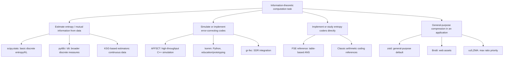

## Software Libraries for Information-Theoretic Computation

### Scope and Categorization

Software support for information theory spans several distinct purposes: general-purpose entropy/mutual-information estimation from data, error-correcting code encode/decode implementations, arithmetic/range/ANS entropy coders as reusable components, and full compression codecs. These categories require different libraries with different design goals (numerical estimation accuracy versus throughput versus standards compliance), so selecting a library should start from which specific task is needed rather than assuming a single "information theory library" covers all of them.

[Inference] The library landscape in this space changes frequently as projects are created, deprecated, or superseded; version numbers, maintenance status, and exact feature sets below should be verified against each project's current documentation before depending on them for production or research work, since claims here reflect general, relatively stable characterizations rather than up-to-the-minute status.

### Entropy and Mutual Information Estimation

**Python — `scipy.stats`**: provides basic entropy computation (`scipy.stats.entropy`) given a discrete probability distribution or set of counts, including relative entropy (KL divergence) via the same function's optional second-distribution argument. This covers the simplest case — entropy of an already-known or already-estimated discrete distribution — but does not itself perform density estimation from continuous samples.

**Python — `scikit-learn`**: includes mutual information estimators for feature selection (`mutual_info_classif`, `mutual_info_regression`), which use nearest-neighbor-based estimation methods suitable for continuous or mixed discrete/continuous variables, relevant when mutual information is needed as a feature-ranking or dependency-detection tool rather than as a standalone theoretical quantity.

**Python — `pyitlib`**: a library specifically focused on discrete information-theoretic quantities (entropy, conditional entropy, mutual information, various measures of statistical dependence), built on top of pandas/numpy, aimed at researchers who need a broader palette of information-theoretic measures than the basics covered by scipy.

**Python — `dit` (discrete information theory)**: designed to represent and compute a wide range of information measures on arbitrary discrete joint distributions, including many multivariate information measures beyond simple pairwise mutual information (e.g., interaction information, various multivariate generalizations), aimed at researchers exploring the multivariate information-theoretic landscape described in prior topics on multivariate mutual information and higher-order interactions.

**R — `infotheo`**: a widely used R package offering discretization utilities alongside entropy, mutual information, and related computations, commonly used in bioinformatics and statistics contexts where R is the primary analysis environment.

**Nearest-neighbor / continuous estimators (Kraskov–Stögbauer–Grassberger, KSG)**: several packages across Python and other languages implement the KSG estimator and its variants for estimating mutual information directly from continuous samples without explicit density estimation or binning; because binning-based entropy/MI estimates are sensitive to bin-width choice and can be badly biased, KSG-style estimators are generally preferred for continuous data in careful empirical work. [Unverified] The specific current best-maintained KSG implementation varies by ecosystem and changes over time; a project-specific search is warranted rather than assuming a single canonical package.

### Error-Correcting Codes

**AFF3CT (A Fast Forward Error Correction Toolbox)**: a C++ library and simulation toolchain specifically built for high-throughput simulation and implementation of channel codes (LDPC, turbo, polar, convolutional, and others), designed with performance (including SIMD-friendly implementations) as a primary goal, making it well suited to the kind of Monte Carlo channel-coding simulation described in the prior topic.

**Python — `komm`**: a Python package providing implementations of a range of classical and modern coding-theory constructs (block codes, convolutional codes, some encoding/decoding algorithms) aimed at education and prototyping, trading some performance for accessibility and readability relative to lower-level C/C++ libraries.

**GNU Radio / `gr-fec`**: within the GNU Radio software-defined radio ecosystem, the FEC (forward error correction) block library provides encoder/decoder blocks (including LDPC, convolutional/Viterbi, and others) intended for integration into real signal-processing flow graphs rather than standalone offline simulation, relevant when the coding scheme needs to interoperate with actual RF transmission/reception.

**Reed–Solomon-specific libraries**: because Reed–Solomon codes are widely deployed (QR codes, storage systems, DVDs/CDs historically, some network protocols), multiple language-specific libraries exist purely for RS encode/decode (e.g., Python's `reedsolo`, and RS implementations embedded within larger libraries like `zfec` for erasure coding); these are typically simpler to integrate than general-purpose coding-theory toolkits when only Reed–Solomon is needed.

**MATLAB Communications Toolbox**: provides built-in functions and Simulink blocks for a wide range of channel codes (convolutional, LDPC, turbo, Reed–Solomon, polar) along with modulation and channel-model blocks, historically a common choice in academic and industry communications-system design workflows due to tight integration with MATLAB's broader signal-processing ecosystem. [Unverified] Exact current toolbox feature coverage (e.g., specific standards-compliant code configurations) should be checked against MathWorks' current documentation, since toolbox contents are updated across MATLAB releases.

### Entropy Coding and Compression Libraries

**zlib / DEFLATE**: the long-standing, extremely widely deployed baseline compression library implementing LZ77 plus Huffman coding, used as the underlying engine for gzip, PNG, and many network protocols; valuable as a stable, universally available reference point (albeit not competitive in ratio with modern alternatives) in compression benchmarking.

**Zstandard (zstd)**: a modern general-purpose compressor from Meta combining an LZ77-style match-finding stage with an FSE/tANS (table-based ANS) entropy-coding stage, exposing a wide level range and supporting trained dictionaries for small-message compression; a common baseline in modern general-purpose compression benchmarking given its strong ratio/speed trade-off curve and wide adoption.

**Brotli**: a compressor from Google combining LZ77-style matching, a static/custom dictionary tuned for web content (e.g., common HTML/JS/CSS substrings), and Huffman-based entropy coding (specifically, second-order context modeling with Huffman coding rather than an ANS variant), commonly used for web asset compression given its typically stronger ratio than gzip at comparable or better decompression speed.

**LZMA / xz**: implements the Lempel–Ziv–Markov chain algorithm with range coding as the entropy stage, generally achieving strong compression ratios at the cost of slower compression speed relative to zstd/Brotli at comparable ratio targets, widely used in the `.xz`/`.7z` archive formats and Linux package distribution.

**FiniteStateEntropy (FSE) and tANS reference implementations**: Yann Collet's reference FSE library (which also underlies zstd's entropy stage) is a commonly cited, relatively accessible reference implementation for studying table-based ANS coding directly, useful when the goal is specifically to understand or benchmark the entropy-coding stage described in the prior topic rather than a full LZ-plus-entropy pipeline.

**libzstd / liblzma bindings**: most major languages (Python, Rust, Go, Java, JavaScript/Node) have maintained bindings or native reimplementations of the major compressors above, which matters when integrating a compressor into an application pipeline rather than using it purely for research/benchmarking purposes, since binding overhead and API ergonomics differ from the underlying C library's raw performance.

### Specialized and Research-Oriented Tools

- **PAQ family and CMIX**: extremely high-ratio, context-mixing compressors (using neural-network-like mixing of many predictive models) that prioritize maximum compression ratio far above speed, commonly used in research contexts like the Hutter Prize benchmark discussed previously; not intended for production deployment given their very high computational cost.
- **libbsc**: a block-sorting compressor (based on the Burrows–Wheeler transform, related to but distinct from the LZ-family approaches above) offering an alternative compression paradigm relevant when BWT-based approaches specifically are of interest.
- **Information-theoretic security / cryptography-adjacent tools**: some libraries (e.g., specialized privacy-amplification or secret-key-agreement research code) implement information-theoretic security constructs directly tied to topics like the wiretap channel and secret-key capacity discussed elsewhere in this material; these tend to be narrower, research-group-maintained codebases rather than broadly adopted general libraries. [Speculation] Because this subarea is more academic and less standardized than general compression/coding libraries, any specific tool named here would likely be less durable/maintained than the mainstream libraries above; a literature/repository search at the time of need is more reliable than a fixed recommendation.

### Choosing a Library: Practical Guidance

**Key Points**

- For **estimating entropy/mutual information from empirical data** (e.g., for feature selection, dependency analysis, or validating a theoretical model against measurements): start with `scipy.stats.entropy` for the simplest discrete case, move to `pyitlib`/`dit` for a broader palette of discrete measures, and use a KSG-based estimator specifically when working with continuous data where binning would introduce bias.
- For **simulating and evaluating channel codes** (as in the prior topic): AFF3CT is the strongest choice when throughput and breadth of supported codes matter and C++ is acceptable; `komm` or similar Python tools are preferable for teaching, prototyping, or quick experimentation where implementation transparency matters more than raw speed.
- For **implementing or studying entropy coders directly** (as in the "implementing entropy coders from scratch" topic): FSE's reference implementation and the original arithmetic-coding reference implementations described in classic papers (e.g., Witten–Neal–Cleary) are commonly used as ground-truth references to validate a from-scratch implementation against.
- For **general-purpose compression in an application**: default to zstd for a strong, well-supported ratio/speed trade-off with broad language bindings; consider Brotli specifically for web-asset delivery; consider xz/LZMA when maximum ratio at acceptable (slower) speed is the priority and decompression speed is less critical.
- Always **pin exact library versions** in any benchmark or research artifact, since entropy coders and compressors are performance-sensitive code that receives frequent optimization updates, and results from one version may not transfer to another.

### Diagram: Library Landscape by Task

### Related Topics

- Reproducible research practices for information-theoretic experiments (version pinning, seed control)
- Building a validation suite for a from-scratch entropy coder against reference implementations
- Continuous vs. discrete mutual information estimation pitfalls (binning bias, KSG parameter selection)
- Integrating channel-code simulation libraries with software-defined radio hardware
- Licensing considerations when embedding compression libraries in commercial products
- Benchmarking library-level compressors using the corpora and methodology from the prior benchmarking topic