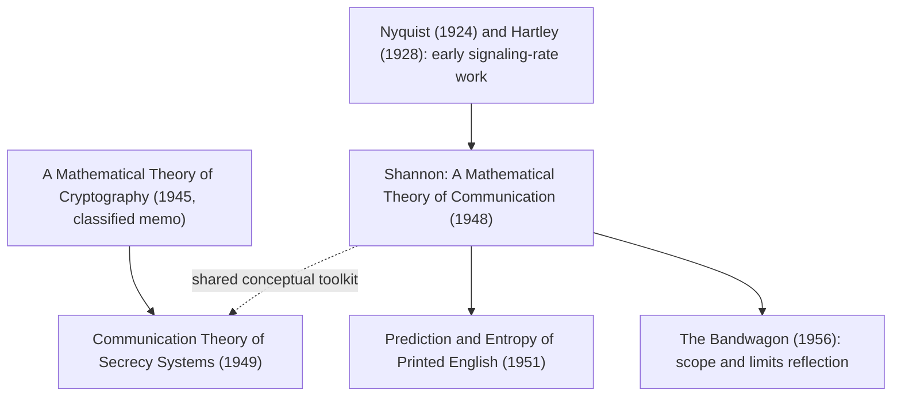

## Reading and Analyzing Shannon's Original Papers

### The Primary Text: "A Mathematical Theory of Communication"

Claude Shannon's 1948 paper, published in two parts in the *Bell System Technical Journal*, is the foundational document of information theory and remains directly readable by a modern technically trained reader, unlike many founding papers in other fields that have been substantially superseded in notation and framing. Reading it in the original is valuable not merely historically but because Shannon's own motivating discussion, definitions, and proof sketches often illuminate *why* a result is stated the way it is — context that condensed modern textbook treatments frequently compress away.

**Structure of the paper**, at a high level:

- **Part I** introduces the discrete noiseless channel, defines entropy, establishes properties of entropy for discrete sources, and introduces the discrete channel with noise, culminating in the noisy-channel coding theorem.
- **Part II** extends the treatment to continuous sources and channels, introduces differential entropy, and develops the capacity of the continuous (bandlimited, power-constrained) channel — the result now commonly cited as the Shannon–Hartley theorem.

**Recommended reading approach**: read Part I in full before attempting Part II, since Part II's continuous-channel treatment builds on definitions and intuitions (particularly around entropy and channel capacity) established discretely first. Reading the paper alongside a modern textbook treatment (e.g., Cover and Thomas) as a "translation reference" for notation is a common and effective strategy, since Shannon's 1948 notation differs in places from what became standard.

### Notable Sections Worth Close Reading

- **Section 1 (introductory discussion)**: Shannon's framing of communication as reproducing a message "either exactly or approximately" at a destination, and his explicit statement that the semantic content of messages is irrelevant to the engineering problem — a foundational methodological choice that defines the scope of the entire field and is worth reading in Shannon's own words rather than only as a paraphrased textbook summary.
- **The discussion of entropy as a measure of information (Section 6)**: Shannon's derivation of why $-\sum p_i \log p_i$ is the essentially unique measure satisfying a small set of natural axioms (continuity, monotonicity in the number of equally likely outcomes, and a grouping/additivity property) is presented with an accessible axiomatic argument that is worth working through by hand rather than just accepting the formula.
- **The noisy-channel coding theorem statement and proof sketch (Section 11 and surrounding)**: Shannon's original proof uses a **random coding argument** — showing that a randomly chosen code achieves rates approaching capacity with vanishing error probability on average over the code ensemble, which implies at least one such code exists — a proof technique that was itself novel and highly influential, and understanding it in Shannon's original presentation clarifies why the theorem is non-constructive (it proves good codes exist without exhibiting one), a point sometimes lost in condensed retellings.
- **The discussion of channel capacity and the continuous channel (Part II)**: the derivation of $C = B \log_2(1 + S/N)$ and Shannon's discussion of its interpretation and limits is worth reading directly, since the compact modern formula obscures the derivation's dependence on the specific bandlimited, average-power-constrained, AWGN assumptions that Shannon makes explicit.

### Reading Shannon in Historical Context

Shannon's paper built on and responded to earlier work, and reading it alongside (or being aware of) this context substantially aids interpretation:

- **Harry Nyquist** (1924, "Certain Factors Affecting Telegraph Speed") and **Ralph Hartley** (1928, "Transmission of Information") established earlier quantitative treatments of signaling rate and information capacity that Shannon explicitly built upon and generalized; Shannon's own citations and framing acknowledge this lineage directly in the paper.
- Shannon's wartime work on cryptography (later published separately as "Communication Theory of Secrecy Systems," 1949) was developed in close temporal and conceptual proximity to the 1948 paper, and reading them together illuminates how Shannon's thinking about uncertainty, redundancy, and information moved between the communications and cryptographic contexts. [Inference] The degree to which the two papers directly cross-pollinated specific technical results (versus sharing a common conceptual toolkit developed in the same period) is a matter of historical-of-science interpretation rather than a simple documented fact, and readers interested in the precise intellectual history should consult dedicated historical scholarship on Shannon rather than relying on inference from the papers' publication dates alone.
- The paper's reception and rapid influence on the emerging field of "communication theory" (as it was then called) in the years immediately following 1948 is itself a subject of historical study; Shannon's own later reflections and interviews provide additional context not present in the paper itself.

### Reading Shannon's Other Foundational Papers

- **"Communication Theory of Secrecy Systems" (1949)**: applies information-theoretic reasoning to cryptography, introducing concepts like perfect secrecy and unicity distance; essential reading for anyone connecting information theory to the cryptographic topics covered elsewhere in this material (e.g., the wiretap channel's conceptual ancestor).
- **"A Mathematical Theory of Cryptography" (1945, originally a classified Bell Labs memorandum)**: the direct technical predecessor to the 1949 secrecy paper, of interest primarily to readers pursuing the historical development in depth rather than as a first entry point.
- **"The Bandwagon" (1956)**: a short, notably candid editorial in which Shannon expresses concern about information theory being applied uncritically outside its proper domain of applicability (e.g., in biology, psychology, and economics, where the framework was being enthusiastically but sometimes inappropriately adopted in the mid-1950s) — valuable reading for understanding Shannon's own view of his theory's scope and limits, in his own words, as a corrective to over-broad popular applications of the theory.
- **"Prediction and Entropy of Printed English" (1951)**: Shannon's empirical estimation of the entropy of English text using human-subject guessing-game experiments, directly relevant to source-coding and language-modeling topics, and a good example of Shannon's characteristic blend of rigorous theory and clever, low-tech empirical measurement.

### Practical Tips for Working Through the Papers

**Key Points**

- **Locate the original 1948 BSTJ text** (freely available from multiple academic archive sources) rather than relying solely on secondary retellings, since Shannon's original notation, ordering of results, and framing remarks carry information that summaries lose; cross-check any specific claim about "what Shannon said" against the primary text directly.
- **Work the axiomatic entropy derivation by hand** (Section 6) rather than passively reading it — reproducing the argument that the axioms force the $-\sum p_i \log p_i$ form builds a much deeper intuition for why entropy has the specific functional form it does, versus simply memorizing the formula.
- **Track notation differences explicitly**: maintain a personal "translation table" between Shannon's 1948 notation and the notation used in a modern reference text, since silently assuming notational equivalence is a common source of confusion when moving between the primary source and secondary literature.
- **Read the proof sketch of the noisy-channel coding theorem for the argument structure, not full rigor**: Shannon's original proof is a sketch by modern standards (later authors, notably Feinstein and Gallager, provided more rigorous treatments); reading it for the core random-coding *idea* is more valuable than expecting textbook-level rigor from the original.
- **Cross-reference with a modern textbook when a passage is unclear**: this is not "cheating" — it is the standard, recommended way to read a 75+ year old technical paper whose notation and terminology have partially been superseded, and doing so actively (comparing Shannon's exact statement to the modern restatement) deepens understanding of both.
- **Note what Shannon does *not* claim**: Part of careful primary-source reading is noticing the paper's explicit scope limitations (e.g., Shannon's discussion of what the theory does not address, such as semantic meaning) — these limitations are sometimes overlooked in later popularizations of the theory that extend it well beyond Shannon's own stated scope.

### Suggested Reading Sequence

**Example** sequence for a reader working through the primary literature systematically:

1. Read "A Mathematical Theory of Communication," Part I, in full, working the entropy axiomatic derivation by hand.
2. Pause and compare Section 6 (entropy) and Section 11 (noisy-channel theorem) against a modern textbook's treatment of the same results.
3. Read Part II (continuous case), paying attention to the explicit assumptions underlying the $C = B\log_2(1+S/N)$ result.
4. Read "The Bandwagon" as a short, illuminating coda on Shannon's own view of the theory's proper scope.
5. Read "Communication Theory of Secrecy Systems" if pursuing the cryptography-adjacent branch of information theory.
6. Read "Prediction and Entropy of Printed English" if pursuing the source-coding/language-modeling branch.
7. Optionally, consult dedicated historical/biographical scholarship on Shannon for the broader intellectual context connecting these papers.

### Diagram: Shannon's Core Papers and Their Relationships

### Related Topics

- Modern rigorous proofs of the noisy-channel coding theorem (Feinstein, Gallager)
- Historical scholarship on Shannon's life and the development of information theory at Bell Labs
- Comparing Shannon's 1948 notation to modern textbook conventions in detail
- The Nyquist–Hartley precursor results and their relationship to Shannon's generalization
- Entropy of natural language beyond English, and modern language-model-based entropy estimation
- Perfect secrecy and unicity distance as introduced in the 1949 secrecy paper