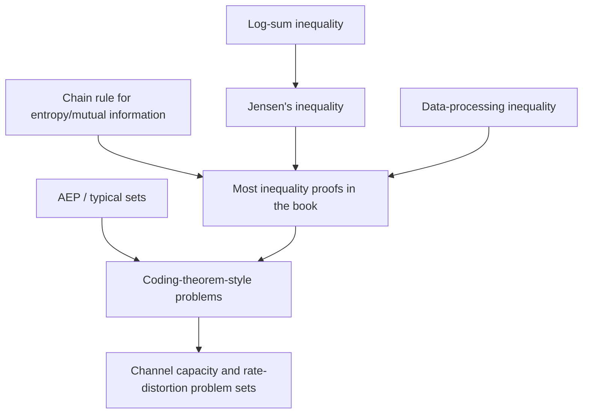

## Working Through Cover and Thomas Problem Sets

### Why This Textbook's Problems Matter

*Elements of Information Theory* by Cover and Thomas is the most widely used graduate-level textbook in the field, and its end-of-chapter problem sets are, by broad consensus in the community, an integral part of the book rather than optional supplementary exercises. Many core results that are stated but not fully proved in the main text are developed step-by-step through the problems, and several problems introduce genuinely important results (alternative entropy inequalities, specific channel examples, extensions of chapter theorems) that do not appear in the expository text at all. Working through the problems is, for this book specifically, closer to essential than optional for developing real fluency with the subject.

### General Strategy for Approaching the Problem Sets

- **Attempt problems before reading solutions**, including a genuine multi-session effort on problems that resist a first attempt, since the productive struggle with an information-theoretic inequality or coding argument is where the actual learning occurs; consulting a solution too early converts an exercise in reasoning into an exercise in reading comprehension.
- **Re-derive relevant main-text results from memory before starting a chapter's problems**, since many problems assume fluent recall of definitions and inequalities established earlier in the chapter (e.g., the chain rule for entropy, the data-processing inequality, Jensen's inequality applications) and treat these as available tools rather than re-deriving them.
- **Distinguish "compute" problems from "prove" problems** early when scanning a problem set: computational problems (e.g., "find the entropy of this distribution") build calculation fluency and confirm understanding of definitions, while proof problems (e.g., "show that X is a concave function of Y") build the inequality-manipulation skills that are the book's central pedagogical focus; both types are worth doing, but proof problems generally reward more time investment per problem.
- **Keep a running personal reference sheet** of the standard inequality-manipulation techniques that recur across problems (see below), since Cover and Thomas problems draw repeatedly on a fairly compact toolkit of standard moves, and recognizing which tool applies is often the actual difficulty, more than the algebra itself.

### Recurring Proof Techniques Across the Problem Sets

**Key Points**

- **Jensen's inequality applications**: an enormous fraction of information-theoretic inequalities (concavity of entropy, log-sum inequality, various capacity-region bounds) reduce to a careful application of Jensen's inequality to a convex or concave function of a probability-weighted average; recognizing when a problem is "secretly a Jensen's inequality problem" is a core skill built through repeated exposure across chapters.
- **The chain rule for entropy and mutual information**, used to decompose a joint quantity into a sum of conditional terms, is the single most load-bearing algebraic tool in the book, and a large fraction of "prove this inequality" problems begin by applying the chain rule to both sides and then bounding term-by-term.
- **The data-processing inequality**, applied to a Markov chain implicit in the problem's setup (sometimes not stated explicitly as a Markov chain in the problem text, requiring the solver to first recognize the Markov structure), recurs across channel-coding and rate-distortion problem sets.
- **Convexity/concavity arguments about mutual information** as a function of the input distribution (concave) or the channel (convex), used extensively in channel-capacity and capacity-region problems, and worth having as an immediately available fact rather than re-deriving each time.
- **The log-sum inequality** as a compact, frequently reusable building block for proving many of the other standard inequalities (including as an alternative route to some Jensen's-inequality-based proofs), worth memorizing in its exact statement given how often it appears as a lemma within larger problem solutions.
- **Typical-set and AEP-based arguments**, especially in problems from the chapters on entropy rates, data compression, and channel capacity, where a problem effectively asks the solver to reconstruct a piece of a coding-theorem proof using AEP machinery rather than a purely algebraic inequality manipulation.

### Chapter-by-Chapter Problem Set Character

- **Entropy, relative entropy, and mutual information (early chapters)**: problems here are foundational and heavily inequality-focused (Jensen's, log-sum, chain rule); getting comfortable with these problem sets is a prerequisite for the later, more applied chapters, since the later problems assume this toolkit is second nature.
- **Asymptotic Equipartition Property (AEP)**: problems test understanding of typical sets and their properties, often via direct computation with a specific small example distribution before asking for a general proof, a useful pattern for building intuition before abstraction.
- **Entropy rates of stochastic processes**: problems extend single-variable entropy reasoning to sequences and Markov chains, requiring comfort with the chain rule applied to a growing sequence of random variables and with entropy-rate limits.
- **Data compression**: problems connect directly to source-coding theorems (Kraft inequality, optimality of Huffman-style codes) and reward the reader who has also worked through an actual entropy-coder implementation (see the earlier "implementing entropy coders from scratch" topic), since hands-on familiarity with codeword-length tradeoffs makes several of these problems more intuitive.
- **Channel capacity**: problems here are often the most demanding in the book, requiring the solver to compute or bound capacity for specific channel examples (sometimes channels not treated in the main text) using the tools built in earlier chapters, and several classic "compute the capacity of this specific channel" problems are considered rite-of-passage exercises within the information theory community.
- **Rate distortion theory**: problems mirror the channel-capacity chapter's structure but for the lossy source-coding dual problem, and benefit from explicitly noting the source-coding/channel-coding duality (covered elsewhere in this material) while working through them.
- **Later/advanced chapters** (network information theory, universal source coding, Kolmogorov complexity, among others depending on edition): problem difficulty and open-endedness generally increase, with some problems bordering on small independent research exercises rather than confirmatory exercises on settled material.

### Common Pitfalls When Working the Problems

- **Treating a problem's Markov chain assumption as given when it must be derived**: several problems require the solver to first establish that a Markov chain structure holds (often from an independence assumption stated earlier in the problem) before the data-processing inequality can be invoked; skipping this step is a common way to produce a proof that looks complete but has an unjustified step.
- **Sign and direction errors in inequality chains**: because many proofs chain together several inequalities (Jensen's, log-sum, chain rule bounds) in sequence, a single reversed inequality direction partway through invalidates the whole argument while still "looking" like a complete proof if not checked carefully term-by-term; explicitly verifying the direction of each inequality against a simple numerical example is a useful sanity check.
- **Confusing entropy in nats versus bits**: because the book is generally consistent about using $\log_2$ (bits) but some derivations are cleaner in natural log (nats), and some standard results (e.g., certain Gaussian-channel capacity derivations) are more naturally expressed in nats, mixing bases within a single derivation without explicit unit-tracking is a frequent source of numerical errors in computational problems.
- **Under-using small worked examples as sanity checks**: for a "prove this general inequality" problem, plugging in a small concrete distribution (e.g., a binary or ternary random variable with simple probabilities) to numerically verify both sides of the claimed inequality before attempting the general proof is a highly effective way to catch a wrong or backwards claim before investing significant proof-writing effort.

### Using Solutions Manuals and Community Resources

- **Official/unofficial solutions manuals** exist and circulate for the book; using them for genuine post-attempt verification (checking a completed proof attempt for errors, or unblocking after substantial independent effort) is a reasonable and common use, while using them as a first resort undermines the pedagogical structure the problem sets are designed around, since the book's exposition intentionally leaves gaps that the problems are meant to fill through independent reasoning.
- **Study groups and forum discussions** (course forums, discussion boards for self-study readers) are a valuable resource specifically for comparing proof strategies after independent attempts, since information-theoretic inequalities frequently admit multiple valid proof routes (e.g., a problem provable via both a direct Jensen's-inequality argument and a chain-rule-plus-data-processing argument), and seeing an alternative valid route to a result already proved independently deepens understanding of the toolkit's flexibility. [Inference] The specific quality and availability of any given forum or solutions resource changes over time and was not independently verified here; readers should evaluate a specific resource's reliability (e.g., checking whether posted solutions have visible errors or community corrections) before treating it as authoritative.

### Example: A Representative Problem Pattern

**Example**

A frequently recurring problem pattern: "Show that $I(X;Y) \le \min(H(X), H(Y))$." A standard solution path illustrates several of the recurring techniques above in combination:

1. Start from the chain-rule identity $I(X;Y) = H(X) - H(X\mid Y)$.
2. Use non-negativity of conditional entropy, $H(X\mid Y) \ge 0$, to conclude $I(X;Y) \le H(X)$.
3. By symmetry of mutual information, $I(X;Y) = I(Y;X) = H(Y) - H(Y\mid X) \le H(Y)$.
4. Combine both bounds: $I(X;Y) \le \min(H(X), H(Y))$.

This short derivation exemplifies the book's typical problem style: a short chain of previously established identities and inequalities (chain rule, non-negativity of conditional entropy, symmetry of mutual information), combined in the right order, rather than a long or computationally heavy argument — recognizing *which* short chain applies is the actual skill being developed.

### Diagram: Problem-Solving Toolkit Dependency Map

### Related Topics

- Rate-distortion theory problem-solving strategies specifically
- Source-coding/channel-coding duality as a proof-organizing principle
- Kolmogorov complexity chapter exercises and their distinct proof style
- Building a personal inequality "cheat sheet" for information theory
- Comparing Cover and Thomas problem style to other textbooks (e.g., MacKay, Gallager, Csiszár–Körner)
- Network information theory open problems as a bridge from textbook exercises to research