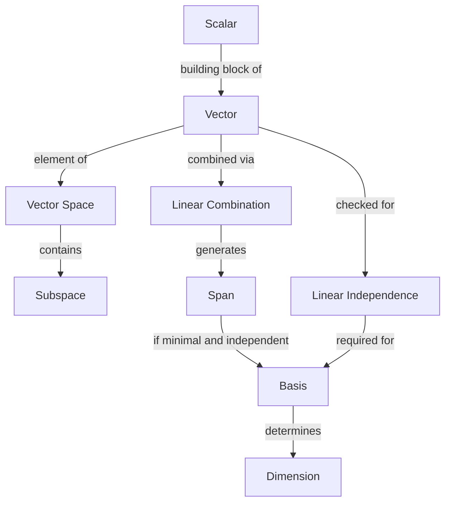

## Scalars, Vectors, and Vector Spaces

### Scalars

A scalar is a single numerical value, typically drawn from the real numbers $\mathbb{R}$ (or complex numbers $\mathbb{C}$ in some contexts). Scalars represent magnitude without direction and are used to scale vectors, weight terms in equations, and represent individual features or parameters.

**Example**
$$a = 5, \quad b = -2.3, \quad c = \pi$$

In machine learning, scalars commonly represent quantities such as a learning rate, a single weight value, a loss value, or a bias term.

### Vectors

A vector is an ordered collection of scalars, called components or entries. A vector in $n$-dimensional space is written as:

$$\mathbf{v} = \begin{bmatrix} v_1 \\ v_2 \\ \vdots \\ v_n \end{bmatrix} \in \mathbb{R}^n$$

Vectors can represent geometric quantities (direction and magnitude) or, in machine learning, feature representations — for example, a single data point with $n$ features.

**Notation Conventions**
- Vectors are typically written in lowercase bold: $\mathbf{v}$, $\mathbf{x}$, $\mathbf{w}$
- The $i$-th component of $\mathbf{v}$ is denoted $v_i$
- Column vectors are the default convention in most ML literature; row vectors are denoted as the transpose: $\mathbf{v}^T$

#### Row vs. Column Vectors

$$\mathbf{v} = \begin{bmatrix} 1 \\ 2 \\ 3 \end{bmatrix} \quad \text{(column vector)}, \qquad \mathbf{v}^T = \begin{bmatrix} 1 & 2 & 3 \end{bmatrix} \quad \text{(row vector)}$$

[Inference] The convention of using column vectors by default is common in many ML textbooks and frameworks, but not universal — some sources default to row vectors. Framework-specific behavior should be checked directly.

#### Geometric Interpretation

A vector can be visualized as an arrow from the origin to a point in space, with a defined length (magnitude) and direction.

<svg xmlns="http://www.w3.org/2000/svg" viewBox="0 0 400 300">
  <text x="120" y="20" font-size="14" fill="#333">Vector in R^2 (svg_diagram)</text>
  <line x1="50" y1="250" x2="380" y2="250" stroke="#888" stroke-width="1" />
  <line x1="50" y1="250" x2="50" y2="20" stroke="#888" stroke-width="1" />
  <text x="370" y="265" font-size="12" fill="#555">x</text>
  <text x="35" y="25" font-size="12" fill="#555">y</text>
  <line x1="50" y1="250" x2="280" y2="90" stroke="#1a73e8" stroke-width="2.5" marker-end="url(#arrowhead)" />
  <text x="285" y="85" font-size="13" fill="#1a73e8">v = [3, 2]</text>
  <circle cx="50" cy="250" r="3" fill="#333" />
  <text x="20" y="265" font-size="12" fill="#333">origin</text>
</svg>

### Vector Spaces

A vector space (or linear space) is a set $V$ of vectors, together with two operations — vector addition and scalar multiplication — that satisfy a specific set of axioms. These operations must remain closed within $V$, meaning the result of the operation is always another vector in $V$.

#### Formal Definition

A set $V$ over a field $\mathbb{F}$ (commonly $\mathbb{R}$) is a vector space if, for all $\mathbf{u}, \mathbf{v}, \mathbf{w} \in V$ and scalars $\alpha, \beta \in \mathbb{F}$, the following axioms hold:

1. **Closure under addition**: $\mathbf{u} + \mathbf{v} \in V$
2. **Closure under scalar multiplication**: $\alpha \mathbf{v} \in V$
3. **Commutativity of addition**: $\mathbf{u} + \mathbf{v} = \mathbf{v} + \mathbf{u}$
4. **Associativity of addition**: $(\mathbf{u} + \mathbf{v}) + \mathbf{w} = \mathbf{u} + (\mathbf{v} + \mathbf{w})$
5. **Additive identity**: There exists $\mathbf{0} \in V$ such that $\mathbf{v} + \mathbf{0} = \mathbf{v}$
6. **Additive inverse**: For every $\mathbf{v} \in V$, there exists $-\mathbf{v}$ such that $\mathbf{v} + (-\mathbf{v}) = \mathbf{0}$
7. **Distributivity over vector addition**: $\alpha(\mathbf{u} + \mathbf{v}) = \alpha \mathbf{u} + \alpha \mathbf{v}$
8. **Distributivity over scalar addition**: $(\alpha + \beta)\mathbf{v} = \alpha \mathbf{v} + \beta \mathbf{v}$
9. **Associativity of scalar multiplication**: $\alpha(\beta \mathbf{v}) = (\alpha \beta)\mathbf{v}$
10. **Scalar identity**: $1 \cdot \mathbf{v} = \mathbf{v}$

**Example**
$\mathbb{R}^n$, the set of all $n$-tuples of real numbers, is the canonical vector space used throughout machine learning. Every feature vector, weight vector, and gradient in standard ML models lives in some $\mathbb{R}^n$.

#### Subspaces

A subspace is a subset of a vector space that is itself a vector space under the same operations. A subset $W \subseteq V$ is a subspace if it contains the zero vector and is closed under addition and scalar multiplication.

**Example**
The set of all vectors $\begin{bmatrix} x \\ y \\ 0 \end{bmatrix}$ in $\mathbb{R}^3$ forms a subspace (the $xy$-plane), since any linear combination of such vectors remains in the same plane.

#### Span

The span of a set of vectors $\{\mathbf{v}_1, \mathbf{v}_2, \dots, \mathbf{v}_k\}$ is the set of all possible linear combinations of those vectors:

$$\text{span}(\mathbf{v}_1, \dots, \mathbf{v}_k) = \{ \alpha_1 \mathbf{v}_1 + \alpha_2 \mathbf{v}_2 + \dots + \alpha_k \mathbf{v}_k \mid \alpha_i \in \mathbb{R} \}$$

The span represents every point reachable through weighted combinations of the given vectors, and is itself always a subspace.

#### Linear Independence

A set of vectors is linearly independent if no vector in the set can be written as a linear combination of the others — equivalently, the only solution to

$$\alpha_1 \mathbf{v}_1 + \alpha_2 \mathbf{v}_2 + \dots + \alpha_k \mathbf{v}_k = \mathbf{0}$$

is $\alpha_1 = \alpha_2 = \dots = \alpha_k = 0$.

If a nontrivial solution exists, the vectors are linearly dependent.

**Relevance to ML**
[Inference] Linear independence is relevant to machine learning in contexts such as identifying redundant features, understanding rank in design matrices, and diagnosing multicollinearity in linear regression, since dependent features can affect the stability of certain solution methods (e.g., matrix inversion in ordinary least squares). This is a general mathematical relationship rather than a claim about any specific software behavior.

#### Basis and Dimension

A basis of a vector space $V$ is a set of linearly independent vectors that span $V$. Every vector in $V$ can be expressed as a unique linear combination of basis vectors. The number of vectors in a basis is called the dimension of $V$, denoted $\dim(V)$.

**Example**
The standard basis for $\mathbb{R}^3$ is:

$$\mathbf{e}_1 = \begin{bmatrix} 1 \\ 0 \\ 0 \end{bmatrix}, \quad \mathbf{e}_2 = \begin{bmatrix} 0 \\ 1 \\ 0 \end{bmatrix}, \quad \mathbf{e}_3 = \begin{bmatrix} 0 \\ 0 \\ 1 \end{bmatrix}$$

Any vector $\mathbf{v} = [a, b, c]^T$ can be written as $a\mathbf{e}_1 + b\mathbf{e}_2 + c\mathbf{e}_3$.

### Vector Operations

#### Addition

$$\mathbf{u} + \mathbf{v} = \begin{bmatrix} u_1 + v_1 \\ u_2 + v_2 \\ \vdots \\ u_n + v_n \end{bmatrix}$$

#### Scalar Multiplication

$$\alpha \mathbf{v} = \begin{bmatrix} \alpha v_1 \\ \alpha v_2 \\ \vdots \\ \alpha v_n \end{bmatrix}$$

#### Linear Combination

A linear combination merges both operations:

$$\mathbf{w} = \alpha_1 \mathbf{v}_1 + \alpha_2 \mathbf{v}_2 + \dots + \alpha_k \mathbf{v}_k$$

Linear combinations are foundational to nearly every operation in machine learning, including weighted sums in linear models, feature combinations, and layer computations in neural networks.

### Vector Spaces in Machine Learning Context

[Inference] In applied machine learning, the term "vector space" is often used loosely to refer to $\mathbb{R}^n$ specifically, rather than the fully general abstract vector space defined by the axioms above. Common ML usages include:

- **Feature space**: Each data point is represented as a vector in $\mathbb{R}^n$, where $n$ is the number of features.
- **Embedding space**: Words, images, or other entities are mapped into a vector space (e.g., $\mathbb{R}^{300}$ for some word embeddings), where geometric relationships (distance, angle) are intended to reflect semantic relationships.
- **Weight space**: The parameters of a model (e.g., neural network weights) are often treated as a single vector in a very high-dimensional space during optimization.

[Unverified] The specific dimensionality and structural properties of embedding spaces vary significantly across models and training methods, and no single dimensionality or property should be assumed without checking the source model's documentation.

### Diagram: Relationships Between Concepts

### Related Topics

- Matrices and matrix operations
- Linear transformations and mappings between vector spaces
- Norms and distance metrics (L1, L2, Frobenius)
- Inner products and orthogonality
- Rank, null space, and column space
- Eigenvalues and eigenvectors
- Change of basis
- Vector spaces in the context of neural network embeddings