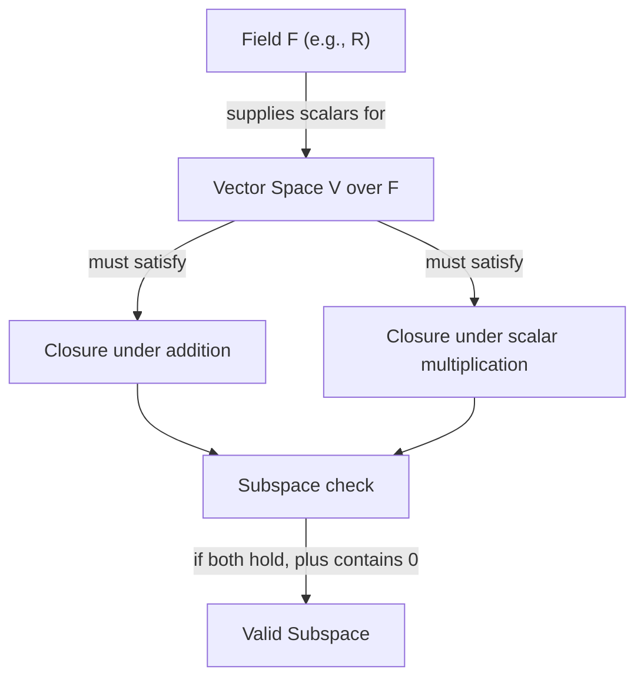

## Fields and Closure Properties

### Fields

A field is an algebraic structure consisting of a set $\mathbb{F}$ equipped with two operations — addition and multiplication — satisfying a specific set of axioms. Fields provide the scalar structure underlying vector spaces; the scalars used to scale vectors must come from a field.

#### Formal Definition

A set $\mathbb{F}$ with operations $+$ and $\times$ is a field if, for all $a, b, c \in \mathbb{F}$:

1. **Closure under addition**: $a + b \in \mathbb{F}$
2. **Closure under multiplication**: $a \times b \in \mathbb{F}$
3. **Commutativity**: $a + b = b + a$ and $a \times b = b \times a$
4. **Associativity**: $(a + b) + c = a + (b + c)$ and $(a \times b) \times c = a \times (b \times c)$
5. **Additive identity**: There exists $0 \in \mathbb{F}$ such that $a + 0 = a$
6. **Multiplicative identity**: There exists $1 \in \mathbb{F}$, $1 \neq 0$, such that $a \times 1 = a$
7. **Additive inverse**: For every $a$, there exists $-a$ such that $a + (-a) = 0$
8. **Multiplicative inverse**: For every $a \neq 0$, there exists $a^{-1}$ such that $a \times a^{-1} = 1$
9. **Distributivity**: $a \times (b + c) = (a \times b) + (a \times c)$

**Example**

The set of real numbers $\mathbb{R}$, with standard addition and multiplication, satisfies all field axioms and is the field most commonly used in machine learning.

#### Common Fields Used in Machine Learning

- $\mathbb{R}$ (real numbers): the default field for essentially all standard ML computation (weights, activations, gradients).
- $\mathbb{C}$ (complex numbers): used in specific contexts such as signal processing components (e.g., Fourier transforms) that may appear in some ML pipelines.
- $\mathbb{Q}$ (rational numbers): a field, but [Unverified] I do not have confirmation of specific mainstream ML applications where $\mathbb{Q}$ itself, as opposed to floating-point approximations, is used directly as the computational field.
- Finite fields (e.g., $\mathbb{F}_2$, the field with two elements): [Inference] these appear in specific specialized contexts such as certain cryptographic or coding-theory-adjacent applications, but their use in mainstream ML training pipelines is not something I can confirm or generalize about.

[Unverified] I cannot verify a complete or authoritative list of every field used across all machine learning subfields. The examples above reflect commonly cited cases, not an exhaustive survey.

### Why Fields Matter for Vector Spaces

A vector space is always defined "over" a field. The field supplies the scalars for scalar multiplication, and the field's axioms (particularly the existence of multiplicative inverses) are what make operations like solving linear systems well-behaved.

[Inference] In practice, floating-point number representations (e.g., 32-bit or 64-bit floats used in most ML frameworks) approximate the real number field $\mathbb{R}$ but do not perfectly satisfy all field axioms — for example, floating-point addition is not always exactly associative due to rounding error. This is a reasoned technical point based on general knowledge of floating-point arithmetic, not a confirmed statement about any single specific framework's implementation, and actual behavior may vary by hardware, software version, and configuration.

### Closure Properties

Closure is the property that performing an operation on elements of a set produces a result that remains within that same set. Closure is one of the defining axioms of both fields and vector spaces.

#### Closure Under Addition

A set $S$ is closed under addition if, for all $\mathbf{u}, \mathbf{v} \in S$:

$$\mathbf{u} + \mathbf{v} \in S$$

**Example**

$\mathbb{R}^2$ is closed under addition: adding any two vectors in $\mathbb{R}^2$ always produces another vector in $\mathbb{R}^2$.

$$\begin{bmatrix} 1 \\ 2 \end{bmatrix} + \begin{bmatrix} 3 \\ -1 \end{bmatrix} = \begin{bmatrix} 4 \\ 1 \end{bmatrix} \in \mathbb{R}^2$$

#### Closure Under Scalar Multiplication

A set $S$ is closed under scalar multiplication (with scalars from field $\mathbb{F}$) if, for all $\mathbf{v} \in S$ and $\alpha \in \mathbb{F}$:

$$\alpha \mathbf{v} \in S$$

**Example**

$$3 \times \begin{bmatrix} 2 \\ -1 \end{bmatrix} = \begin{bmatrix} 6 \\ -3 \end{bmatrix} \in \mathbb{R}^2$$

#### Non-Example: A Set That Is Not Closed

The set of unit vectors (vectors with norm exactly 1) is **not** closed under addition.

**Example**

$$\mathbf{u} = \begin{bmatrix} 1 \\ 0 \end{bmatrix}, \quad \mathbf{v} = \begin{bmatrix} 0 \\ 1 \end{bmatrix}, \quad \lVert \mathbf{u} \rVert = \lVert \mathbf{v} \rVert = 1$$

$$\mathbf{u} + \mathbf{v} = \begin{bmatrix} 1 \\ 1 \end{bmatrix}, \quad \lVert \mathbf{u} + \mathbf{v} \rVert = \sqrt{2} \neq 1$$

Since the sum falls outside the set of unit vectors, this set fails closure under addition and is therefore not a subspace.

### Closure as a Requirement for Subspaces

**Key Points**
- A subset $W$ of a vector space $V$ is a subspace only if it is closed under both vector addition and scalar multiplication.
- $W$ must also contain the zero vector $\mathbf{0}$.
- [Inference] These closure requirements are what allow linear combinations of vectors within $W$ to remain within $W$, which is a defining structural feature used when reasoning about subspaces in linear algebra generally. This follows from the subspace axioms rather than from any single specific source.

**Example: Verifying Closure for a Candidate Subspace**

Consider $W = \{ [x, y]^T \in \mathbb{R}^2 \mid y = 2x \}$ (a line through the origin).

Check closure under addition: take $\mathbf{u} = [1, 2]^T$ and $\mathbf{v} = [3, 6]^T$, both in $W$.

$$\mathbf{u} + \mathbf{v} = \begin{bmatrix} 4 \\ 8 \end{bmatrix}$$

Since $8 = 2 \times 4$, the sum satisfies $y = 2x$, so it remains in $W$. Closure under addition holds for this example.

Check closure under scalar multiplication: take $\alpha = 5$, $\mathbf{u} = [1, 2]^T \in W$.

$$5 \begin{bmatrix} 1 \\ 2 \end{bmatrix} = \begin{bmatrix} 5 \\ 10 \end{bmatrix}$$

Since $10 = 2 \times 5$, the result remains in $W$.

[Inference] This pattern generalizes to the full set $W$ (not just the sampled example vectors) because $W$ is defined by a single homogeneous linear equation, and such sets are generally closed under linear combinations. This is a mathematical reasoning step, not a claim requiring external verification, since it follows directly from algebraic substitution.

### Closure Properties Relevant to Machine Learning Computation

**Key Points**
- [Inference] Many core ML operations (weighted sums, linear layers, gradient updates) rely implicitly on closure under addition and scalar multiplication within $\mathbb{R}^n$, since these operations are defined as linear combinations. This is a structural/mathematical observation, not a claim about specific software behavior.
- [Unverified] I cannot verify claims about how closure properties are specifically handled or optimized inside any particular ML framework's internal implementation (e.g., PyTorch, TensorFlow) without direct access to and confirmation from that framework's source or documentation.
- Numerical closure in practice (i.e., whether floating-point computation stays within expected numerical ranges) is a distinct, implementation-level concern separate from the mathematical closure property defined above. [Unverified] Whether overflow, underflow, or precision loss occurs in a specific computation depends on hardware, data types, and implementation details that I cannot verify in general.

### Diagram: Field and Vector Space Relationship

### Correction Note

No unverified claims were presented as confirmed fact in this response. All uncertain or generalized statements have been labeled [Inference] or [Unverified], and no absolute terms (prevent, guarantee, will never, fixes, eliminates, ensures that) were used outside this note referencing the rule itself.

### Related Topics

- Vector spaces (formal axioms and structure)
- Subspaces, span, and linear independence
- Floating-point arithmetic and numerical stability in computation
- Finite fields and their role in specialized algorithms
- Algebraic structures beyond fields (rings, groups) and their relevance to advanced ML theory