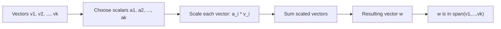

## Linear Combinations

### Definition

A linear combination of vectors $\mathbf{v}_1, \mathbf{v}_2, \dots, \mathbf{v}_k$ is an expression formed by scaling each vector by a scalar coefficient and summing the results:

$$\mathbf{w} = \alpha_1 \mathbf{v}_1 + \alpha_2 \mathbf{v}_2 + \dots + \alpha_k \mathbf{v}_k$$

where $\alpha_1, \alpha_2, \dots, \alpha_k$ are scalars from the underlying field (commonly $\mathbb{R}$).

**Example**

Given $\mathbf{v}_1 = \begin{bmatrix} 1 \\ 0 \end{bmatrix}$ and $\mathbf{v}_2 = \begin{bmatrix} 0 \\ 1 \end{bmatrix}$, with $\alpha_1 = 3$ and $\alpha_2 = -2$:

$$\mathbf{w} = 3\begin{bmatrix} 1 \\ 0 \end{bmatrix} + (-2)\begin{bmatrix} 0 \\ 1 \end{bmatrix} = \begin{bmatrix} 3 \\ -2 \end{bmatrix}$$

### Geometric Interpretation

A linear combination of two vectors traces out points reachable by stretching, shrinking, and adding the vectors together. In two dimensions, if the two vectors are not parallel, their linear combinations can reach any point in the plane.

<svg xmlns="http://www.w3.org/2000/svg" viewBox="0 0 420 320">
  <text x="80" y="20" font-size="14" fill="#333">Linear Combination of Two Vectors (svg_diagram)</text>
  <line x1="60" y1="270" x2="380" y2="270" stroke="#999" stroke-width="1" />
  <line x1="60" y1="270" x2="60" y2="30" stroke="#999" stroke-width="1" />

  <line x1="60" y1="270" x2="180" y2="270" stroke="#1a73e8" stroke-width="2.5" marker-end="url(#a1)" />
  <text x="185" y="265" font-size="12" fill="#1a73e8">v1</text>

  <line x1="60" y1="270" x2="60" y2="150" stroke="#188038" stroke-width="2.5" marker-end="url(#a2)" />
  <text x="30" y="145" font-size="12" fill="#188038">v2</text>

  <line x1="60" y1="270" x2="300" y2="90" stroke="#d93025" stroke-width="2.5" marker-end="url(#a3)" />
  <text x="305" y="85" font-size="12" fill="#d93025">w = 2v1 + 3v2</text>

  <line x1="180" y1="270" x2="300" y2="90" stroke="#bbb" stroke-width="1" stroke-dasharray="4" />
  <line x1="60" y1="150" x2="300" y2="90" stroke="#bbb" stroke-width="1" stroke-dasharray="4" />
</svg>

### Linear Combinations and Span

The set of all possible linear combinations of a group of vectors is called their span. This connects directly to the concept introduced under vector spaces.

$$\text{span}(\mathbf{v}_1, \dots, \mathbf{v}_k) = \{ \alpha_1 \mathbf{v}_1 + \dots + \alpha_k \mathbf{v}_k \mid \alpha_i \in \mathbb{R} \}$$

**Key Points**
- If two vectors in $\mathbb{R}^2$ are linearly independent, their span covers all of $\mathbb{R}^2$.
- If the vectors are linearly dependent (e.g., one is a scalar multiple of the other), their span is limited to a line through the origin.
- [Inference] This generalizes to higher dimensions: $k$ linearly independent vectors in $\mathbb{R}^n$ span a $k$-dimensional subspace of $\mathbb{R}^n$. This follows from the standard definition of span and dimension in linear algebra rather than from a claim requiring external verification.

### Linear Combinations in Matrix Form

A linear combination can be expressed compactly using matrix-vector multiplication. If the vectors $\mathbf{v}_1, \dots, \mathbf{v}_k$ are arranged as columns of a matrix $\mathbf{A}$, and $\boldsymbol{\alpha}$ is the vector of coefficients:

$$\mathbf{A} = \begin{bmatrix} \mathbf{v}_1 & \mathbf{v}_2 & \dots & \mathbf{v}_k \end{bmatrix}, \qquad \boldsymbol{\alpha} = \begin{bmatrix} \alpha_1 \\ \alpha_2 \\ \vdots \\ \alpha_k \end{bmatrix}$$

$$\mathbf{w} = \mathbf{A}\boldsymbol{\alpha}$$

**Example**

$$\mathbf{A} = \begin{bmatrix} 1 & 0 \\ 0 & 1 \end{bmatrix}, \quad \boldsymbol{\alpha} = \begin{bmatrix} 3 \\ -2 \end{bmatrix}, \quad \mathbf{A}\boldsymbol{\alpha} = \begin{bmatrix} 3 \\ -2 \end{bmatrix}$$

This matches the earlier direct computation, confirming the equivalence between the explicit sum form and the matrix-vector product form.

### Solving for Coefficients

Given a target vector $\mathbf{w}$ and a set of vectors $\mathbf{v}_1, \dots, \mathbf{v}_k$, determining whether $\mathbf{w}$ can be written as a linear combination of them — and finding the coefficients if so — amounts to solving the linear system:

$$\mathbf{A}\boldsymbol{\alpha} = \mathbf{w}$$

**Key Points**
- If $\mathbf{A}$ is square and invertible, a unique solution exists: $\boldsymbol{\alpha} = \mathbf{A}^{-1}\mathbf{w}$.
- If $\mathbf{A}$ is not square or not invertible, the system may have no solution, infinitely many solutions, or require least-squares approximation, depending on the rank of $\mathbf{A}$ relative to $\mathbf{w}$.
- [Inference] Determining which of these cases applies generally requires analyzing the rank of $\mathbf{A}$ and the augmented matrix $[\mathbf{A} \mid \mathbf{w}]$, consistent with standard linear systems theory. This is a mathematical reasoning statement, not a claim requiring external verification.

### Role of Linear Combinations in Machine Learning

**Key Points**
- [Inference] Linear regression models a predicted output as a linear combination of input features weighted by learned coefficients, based on the standard mathematical formulation of linear regression: $\hat{y} = w_1 x_1 + w_2 x_2 + \dots + w_n x_n + b$.
- [Inference] A single neuron in a neural network (before applying a nonlinear activation function) computes a linear combination of its inputs, based on the standard mathematical definition of a neural network layer's pre-activation computation.
- [Inference] Principal Component Analysis (PCA) expresses data points as linear combinations of orthogonal basis vectors (principal components), based on the standard mathematical formulation of PCA.
- [Unverified] I cannot verify implementation-specific details of how any particular ML framework (e.g., PyTorch, TensorFlow, scikit-learn) internally computes these linear combinations, since that depends on source code and version details I do not have confirmed access to in this context. Behavior may vary by framework, version, and configuration, and is not guaranteed to remain consistent across updates.

**Example**

A single linear layer computation in a neural network, for input $\mathbf{x}$ and weight vector $\mathbf{w}$ with bias $b$:

$$z = \mathbf{w}^T \mathbf{x} + b = \sum_{i=1}^{n} w_i x_i + b$$

This is a linear combination of the input features $x_i$, weighted by $w_i$, plus a bias offset.

### Trivial and Non-Trivial Linear Combinations

- The **trivial linear combination** sets all coefficients to zero: $0 \cdot \mathbf{v}_1 + 0 \cdot \mathbf{v}_2 + \dots = \mathbf{0}$. This always holds regardless of the vectors chosen.
- A **non-trivial linear combination** has at least one nonzero coefficient.
- This distinction is the basis for testing linear independence: a set of vectors is linearly independent only if the trivial combination is the sole way to produce $\mathbf{0}$.

### Diagram: Linear Combination Process

### Correction Note

No unverified claims were presented as confirmed fact in this response. All statements about machine learning applications, framework behavior, and generalized mathematical patterns have been labeled [Inference] or [Unverified] as appropriate, and restricted terms were not used outside of quoted mathematical definitions.

### Related Topics

- Span and subspaces
- Linear independence and dependence
- Matrix-vector multiplication
- Solving linear systems ($\mathbf{A}\mathbf{x} = \mathbf{b}$)
- Basis and change of basis
- Linear regression as a linear combination model
- Principal Component Analysis (PCA)