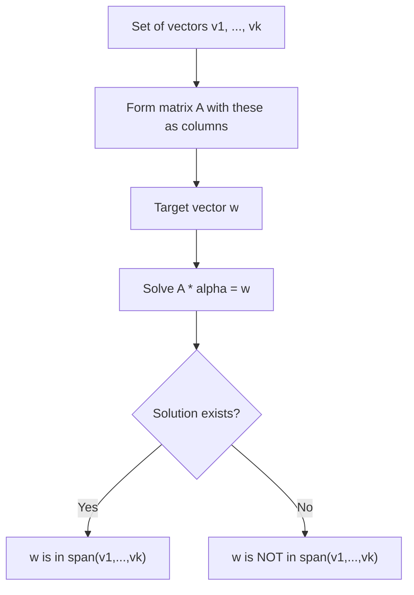

## Span of a Set of Vectors

### Definition

The span of a set of vectors $\{\mathbf{v}_1, \mathbf{v}_2, \dots, \mathbf{v}_k\}$ is the set of all possible linear combinations of those vectors:

$$\text{span}(\mathbf{v}_1, \dots, \mathbf{v}_k) = \{ \alpha_1 \mathbf{v}_1 + \alpha_2 \mathbf{v}_2 + \dots + \alpha_k \mathbf{v}_k \mid \alpha_1, \dots, \alpha_k \in \mathbb{R} \}$$

The span represents every vector reachable by scaling and adding the given vectors together.

**Example**

Given $\mathbf{v}_1 = \begin{bmatrix} 1 \\ 0 \end{bmatrix}$, $\text{span}(\mathbf{v}_1)$ is the set of all scalar multiples of $\mathbf{v}_1$:

$$\text{span}(\mathbf{v}_1) = \left\{ \alpha \begin{bmatrix} 1 \\ 0 \end{bmatrix} \mid \alpha \in \mathbb{R} \right\}$$

This forms a line through the origin along the x-axis.

### Span of One Vector

The span of a single nonzero vector is a line through the origin, in the direction of that vector.

$$\text{span}(\mathbf{v}) = \{ \alpha \mathbf{v} \mid \alpha \in \mathbb{R} \}$$

The span of the zero vector alone is just $\{\mathbf{0}\}$, a single point.

### Span of Two Vectors

**Key Points**
- If two vectors in $\mathbb{R}^2$ are linearly independent (not scalar multiples of each other), their span is all of $\mathbb{R}^2$.
- If two vectors are linearly dependent (one is a scalar multiple of the other), their span collapses to a single line.
- [Inference] This follows directly from the definition of span combined with the definition of linear independence; it is a standard result in linear algebra rather than a claim requiring external verification.

**Example: Independent Vectors**

$$\mathbf{v}_1 = \begin{bmatrix} 1 \\ 0 \end{bmatrix}, \quad \mathbf{v}_2 = \begin{bmatrix} 0 \\ 1 \end{bmatrix}$$

Since $\mathbf{v}_1$ and $\mathbf{v}_2$ are linearly independent, $\text{span}(\mathbf{v}_1, \mathbf{v}_2) = \mathbb{R}^2$: any point in the plane can be reached.

**Example: Dependent Vectors**

$$\mathbf{v}_1 = \begin{bmatrix} 1 \\ 2 \end{bmatrix}, \quad \mathbf{v}_2 = \begin{bmatrix} 2 \\ 4 \end{bmatrix}$$

Since $\mathbf{v}_2 = 2\mathbf{v}_1$, these vectors are linearly dependent. Their span is only the line through the origin in the direction $[1, 2]^T$, not all of $\mathbb{R}^2$.

<svg xmlns="http://www.w3.org/2000/svg" viewBox="0 0 500 300">
  <text x="60" y="20" font-size="14" fill="#333">Span: Independent vs Dependent Vectors (svg_diagram)</text>

  <text x="60" y="45" font-size="12" fill="#555">Independent (span = plane)</text>
  <line x1="60" y1="150" x2="220" y2="150" stroke="#ccc" stroke-width="1" />
  <line x1="140" y1="70" x2="140" y2="230" stroke="#ccc" stroke-width="1" />
  <rect x="65" y="75" width="150" height="150" fill="#e8f0fe" opacity="0.6" />
  <line x1="140" y1="150" x2="190" y2="150" stroke="#1a73e8" stroke-width="2" marker-end="url(#m1)" />
  <line x1="140" y1="150" x2="140" y2="100" stroke="#188038" stroke-width="2" marker-end="url(#m1)" />

  <text x="280" y="45" font-size="12" fill="#555">Dependent (span = line)</text>
  <line x1="280" y1="150" x2="440" y2="150" stroke="#ccc" stroke-width="1" />
  <line x1="360" y1="70" x2="360" y2="230" stroke="#ccc" stroke-width="1" />
  <line x1="300" y1="210" x2="420" y2="90" stroke="#fbbc04" stroke-width="2" stroke-dasharray="3" />
  <line x1="360" y1="150" x2="400" y2="110" stroke="#d93025" stroke-width="2" marker-end="url(#m1)" />
  <line x1="360" y1="150" x2="390" y2="120" stroke="#a50e0e" stroke-width="2" marker-end="url(#m1)" />
</svg>

### Span in Higher Dimensions

**Key Points**
- $k$ linearly independent vectors in $\mathbb{R}^n$ (where $k \leq n$) span a $k$-dimensional subspace of $\mathbb{R}^n$.
- If $k = n$ and the vectors are linearly independent, they span all of $\mathbb{R}^n$.
- If $k > n$, the vectors cannot all be linearly independent, since a set of more than $n$ vectors in $\mathbb{R}^n$ must be linearly dependent. [Inference] This follows from the standard dimension theorem in linear algebra, which states that no linearly independent set in $\mathbb{R}^n$ can contain more than $n$ vectors.

**Example**

Three vectors in $\mathbb{R}^3$:

$$\mathbf{v}_1 = \begin{bmatrix} 1 \\ 0 \\ 0 \end{bmatrix}, \quad \mathbf{v}_2 = \begin{bmatrix} 0 \\ 1 \\ 0 \end{bmatrix}, \quad \mathbf{v}_3 = \begin{bmatrix} 0 \\ 0 \\ 1 \end{bmatrix}$$

These are linearly independent and span all of $\mathbb{R}^3$.

If instead a third vector were $\mathbf{v}_3 = \begin{bmatrix} 1 \\ 1 \\ 0 \end{bmatrix}$ (a combination of $\mathbf{v}_1$ and $\mathbf{v}_2$), the span would remain only a 2-dimensional subspace (a plane) within $\mathbb{R}^3$, since $\mathbf{v}_3$ adds no new direction.

### Span as a Subspace

The span of any set of vectors is always a subspace of the ambient vector space. This follows from the definition of subspace: the span is closed under addition and scalar multiplication, and contains the zero vector (via the trivial linear combination with all coefficients equal to zero).

**Key Points**
- $\text{span}(\mathbf{v}_1, \dots, \mathbf{v}_k)$ always contains $\mathbf{0}$.
- $\text{span}(\mathbf{v}_1, \dots, \mathbf{v}_k)$ is closed under addition and scalar multiplication.
- [Inference] These properties follow directly from substituting linear combinations into the closure definitions, consistent with standard subspace proofs in linear algebra.

### Testing Whether a Vector Is in a Span

To determine whether a target vector $\mathbf{w}$ is in $\text{span}(\mathbf{v}_1, \dots, \mathbf{v}_k)$, solve the system:

$$\mathbf{A}\boldsymbol{\alpha} = \mathbf{w}$$

where $\mathbf{A}$ has $\mathbf{v}_1, \dots, \mathbf{v}_k$ as columns. If a solution $\boldsymbol{\alpha}$ exists, $\mathbf{w}$ is in the span; if not, it is outside the span.

**Example**

Is $\mathbf{w} = \begin{bmatrix} 5 \\ 3 \end{bmatrix}$ in $\text{span}\left( \begin{bmatrix} 1 \\ 1 \end{bmatrix}, \begin{bmatrix} 2 \\ -1 \end{bmatrix} \right)$?

Solve:

$$\alpha_1 \begin{bmatrix} 1 \\ 1 \end{bmatrix} + \alpha_2 \begin{bmatrix} 2 \\ -1 \end{bmatrix} = \begin{bmatrix} 5 \\ 3 \end{bmatrix}$$

This gives the system:
$$\alpha_1 + 2\alpha_2 = 5$$
$$\alpha_1 - \alpha_2 = 3$$

Subtracting: $3\alpha_2 = 2 \Rightarrow \alpha_2 = \frac{2}{3}$, then $\alpha_1 = 3 + \frac{2}{3} = \frac{11}{3}$.

Since a solution exists, $\mathbf{w}$ is in the span of these two vectors.

### Column Space as a Span

**Key Points**
- The column space of a matrix $\mathbf{A}$ is defined as the span of its column vectors.
- [Inference] This connects span directly to matrix rank: the dimension of the column space (i.e., the rank of $\mathbf{A}$) equals the number of linearly independent columns, consistent with standard linear algebra definitions of rank and column space.
- The column space is used to determine whether a linear system $\mathbf{A}\mathbf{x} = \mathbf{b}$ has a solution: a solution exists only if $\mathbf{b}$ lies in the column space of $\mathbf{A}$.

### Relevance to Machine Learning

- [Inference] The column space of a design matrix in linear regression determines which target vectors $\mathbf{y}$ can be exactly represented as a linear combination of feature columns; this follows from the standard mathematical formulation of linear regression, where $\hat{\mathbf{y}} = \mathbf{X}\mathbf{w}$ is by definition constrained to the column space of $\mathbf{X}$.
- [Inference] When the target vector lies outside the column space, ordinary least squares finds the closest approximation within the span (via projection); this follows from the standard geometric derivation of least-squares regression.
- [Unverified] I do not have access to confirmed details of how any specific ML library (e.g., scikit-learn, NumPy) implements these computations internally, so no claim is made about specific implementation behavior. Behavior may vary by library, version, and configuration, and this is not guaranteed to remain consistent across updates.

### Diagram: Span Determination Process

### Correction Note

No unverified claims were presented as confirmed fact in this response. All statements involving machine learning applications, generalizations beyond directly shown computations, or implementation-specific behavior have been labeled [Inference] or [Unverified], and restricted terms were not used outside standard mathematical statements.

### Related Topics

- Linear combinations
- Linear independence and dependence
- Basis and dimension
- Column space and row space
- Rank of a matrix
- Null space and its relationship to span
- Least-squares approximation and projection onto a span