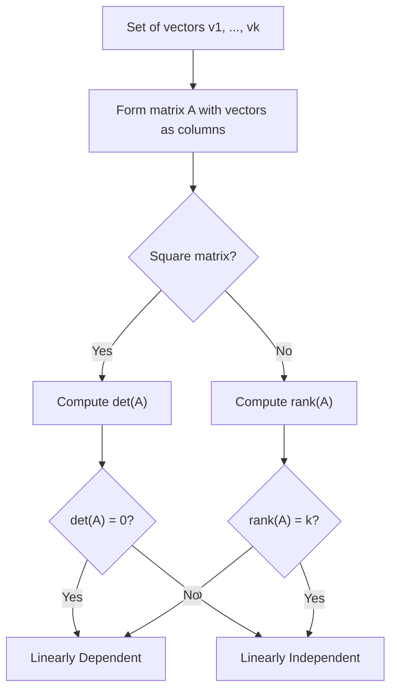

## Linear Independence and Dependence

### Definition

A set of vectors $\{\mathbf{v}_1, \mathbf{v}_2, \dots, \mathbf{v}_k\}$ is linearly independent if the only solution to the equation

$$\alpha_1 \mathbf{v}_1 + \alpha_2 \mathbf{v}_2 + \dots + \alpha_k \mathbf{v}_k = \mathbf{0}$$

is the trivial solution $\alpha_1 = \alpha_2 = \dots = \alpha_k = 0$.

If a nontrivial solution exists (at least one $\alpha_i \neq 0$), the vectors are linearly dependent.

### Intuitive Meaning

**Key Points**
- Linear independence means no vector in the set can be written as a linear combination of the others.
- Linear dependence means at least one vector is "redundant" — it can be constructed from the others and adds no new direction to the span.

### Example: Linearly Independent Vectors

$$\mathbf{v}_1 = \begin{bmatrix} 1 \\ 0 \end{bmatrix}, \quad \mathbf{v}_2 = \begin{bmatrix} 0 \\ 1 \end{bmatrix}$$

Set up the equation:

$$\alpha_1 \begin{bmatrix} 1 \\ 0 \end{bmatrix} + \alpha_2 \begin{bmatrix} 0 \\ 1 \end{bmatrix} = \begin{bmatrix} 0 \\ 0 \end{bmatrix}$$

This gives $\alpha_1 = 0$ and $\alpha_2 = 0$. Since this is the only solution, $\mathbf{v}_1$ and $\mathbf{v}_2$ are linearly independent.

### Example: Linearly Dependent Vectors

$$\mathbf{v}_1 = \begin{bmatrix} 1 \\ 2 \end{bmatrix}, \quad \mathbf{v}_2 = \begin{bmatrix} 2 \\ 4 \end{bmatrix}$$

Set up the equation:

$$\alpha_1 \begin{bmatrix} 1 \\ 2 \end{bmatrix} + \alpha_2 \begin{bmatrix} 2 \\ 4 \end{bmatrix} = \begin{bmatrix} 0 \\ 0 \end{bmatrix}$$

Choosing $\alpha_1 = 2$ and $\alpha_2 = -1$ satisfies this equation:

$$2\begin{bmatrix} 1 \\ 2 \end{bmatrix} + (-1)\begin{bmatrix} 2 \\ 4 \end{bmatrix} = \begin{bmatrix} 2-2 \\ 4-4 \end{bmatrix} = \begin{bmatrix} 0 \\ 0 \end{bmatrix}$$

Since a nontrivial solution exists, $\mathbf{v}_1$ and $\mathbf{v}_2$ are linearly dependent. This matches the direct observation that $\mathbf{v}_2 = 2\mathbf{v}_1$.

<svg xmlns="http://www.w3.org/2000/svg" viewBox="0 0 500 280">
  <text x="60" y="20" font-size="14" fill="#333">Independent vs Dependent Vectors (svg_diagram)</text>

  <text x="60" y="45" font-size="12" fill="#555">Independent</text>
  <line x1="60" y1="150" x2="220" y2="150" stroke="#ccc" stroke-width="1" />
  <line x1="140" y1="70" x2="140" y2="230" stroke="#ccc" stroke-width="1" />
  <line x1="140" y1="150" x2="190" y2="150" stroke="#1a73e8" stroke-width="2" marker-end="url(#mm1)" />
  <line x1="140" y1="150" x2="140" y2="100" stroke="#188038" stroke-width="2" marker-end="url(#mm1)" />
  <text x="195" y="145" font-size="11" fill="#1a73e8">v1</text>
  <text x="110" y="95" font-size="11" fill="#188038">v2</text>

  <text x="300" y="45" font-size="12" fill="#555">Dependent</text>
  <line x1="300" y1="150" x2="460" y2="150" stroke="#ccc" stroke-width="1" />
  <line x1="380" y1="70" x2="380" y2="230" stroke="#ccc" stroke-width="1" />
  <line x1="380" y1="150" x2="415" y2="115" stroke="#d93025" stroke-width="2" marker-end="url(#mm1)" />
  <line x1="380" y1="150" x2="450" y2="80" stroke="#a50e0e" stroke-width="2" marker-end="url(#mm1)" />
  <text x="418" y="112" font-size="11" fill="#d93025">v1</text>
  <text x="452" y="78" font-size="11" fill="#a50e0e">v2 = 2v1</text>
</svg>

### Testing Linear Independence via Matrix Rank

**Key Points**
- Arrange the vectors as columns of a matrix $\mathbf{A}$.
- If $\text{rank}(\mathbf{A}) = k$ (the number of vectors), the vectors are linearly independent.
- If $\text{rank}(\mathbf{A}) < k$, the vectors are linearly dependent.
- [Inference] This equivalence between rank and linear independence follows from the standard definition of matrix rank as the dimension of the column space, which is itself the span of the column vectors. This is a mathematical consequence of definitions rather than a claim requiring external verification.

**Example**

$$\mathbf{A} = \begin{bmatrix} 1 & 2 \\ 2 & 4 \end{bmatrix}$$

Row reduction: $R_2 \to R_2 - 2R_1$ gives:

$$\begin{bmatrix} 1 & 2 \\ 0 & 0 \end{bmatrix}$$

Only one nonzero row remains, so $\text{rank}(\mathbf{A}) = 1 < 2$. The two columns are linearly dependent, consistent with the earlier direct calculation.

### Testing via Determinant (Square Matrices Only)

For a square matrix $\mathbf{A}$ (same number of vectors as dimensions), the columns are linearly independent if and only if:

$$\det(\mathbf{A}) \neq 0$$

**Example**

$$\mathbf{A} = \begin{bmatrix} 1 & 2 \\ 2 & 4 \end{bmatrix}, \quad \det(\mathbf{A}) = (1)(4) - (2)(2) = 4 - 4 = 0$$

Since the determinant is zero, the columns are linearly dependent — again consistent with the earlier results.

[Inference] This determinant test applies only to square matrices; for non-square sets of vectors (more or fewer vectors than dimensions), rank-based methods must be used instead, consistent with the standard definition of the determinant as being defined only for square matrices.

### Maximum Size of a Linearly Independent Set

**Key Points**
- In $\mathbb{R}^n$, no set of more than $n$ vectors can be linearly independent.
- [Inference] This follows from the standard dimension theorem in linear algebra, which states that the maximum number of linearly independent vectors in an $n$-dimensional space is $n$.

**Example**

Any set of 4 or more vectors in $\mathbb{R}^3$ must be linearly dependent, regardless of which specific vectors are chosen.

### Geometric Interpretation in Higher Dimensions

**Key Points**
- Two linearly independent vectors span a plane (assuming they live in a space of dimension $\geq 2$).
- Three linearly independent vectors span a 3-dimensional subspace.
- [Inference] Linear dependence among a set of vectors means the set's span has strictly lower dimension than the number of vectors in the set, following from the relationship between rank, span, and dimension described earlier in this response.

### Relevance to Machine Learning

**Key Points**
- [Inference] In a dataset's feature matrix, linearly dependent columns (features) indicate redundant information — one feature can be expressed as a linear combination of others. This follows from the mathematical definition of linear dependence applied to the columns of a feature matrix.
- [Inference] Multicollinearity in linear regression, a term used in statistics, is closely related to near-linear-dependence among feature columns, which can affect the numerical stability of computing $(\mathbf{X}^T\mathbf{X})^{-1}$ in ordinary least squares, since a matrix with linearly dependent columns is not invertible. This is a mathematical relationship following from properties of matrix invertibility, not a claim about any single specific software's behavior.
- [Unverified] I cannot verify how any particular ML library (e.g., scikit-learn, statsmodels) specifically detects, reports, or handles multicollinearity internally, since this depends on implementation details I do not have confirmed access to. Behavior may vary by library, version, and configuration, and is not guaranteed to remain consistent across updates.
- [Inference] In neural networks, linearly dependent weight vectors within a layer may be associated with redundant learned representations, based on the general mathematical relationship between linear dependence and redundancy in a spanned space. I cannot verify this as a confirmed, universally observed behavior of trained neural networks in practice, since actual learned weights depend on training dynamics, architecture, and data that vary case by case.

### Checking Independence: Step-by-Step Process

### Correction Note

No unverified claims were presented as confirmed fact in this response. All statements involving machine learning applications, generalized mathematical patterns beyond directly shown computations, or claims about software/framework/model behavior have been labeled [Inference] or [Unverified], with disclaimers noting that such behavior is not guaranteed and may vary. Restricted terms were not used outside standard mathematical statements.

### Related Topics

- Span of a set of vectors
- Basis and dimension
- Matrix rank
- Determinants
- Null space and its relationship to dependence
- Multicollinearity in regression
- Eigenvectors and their independence properties