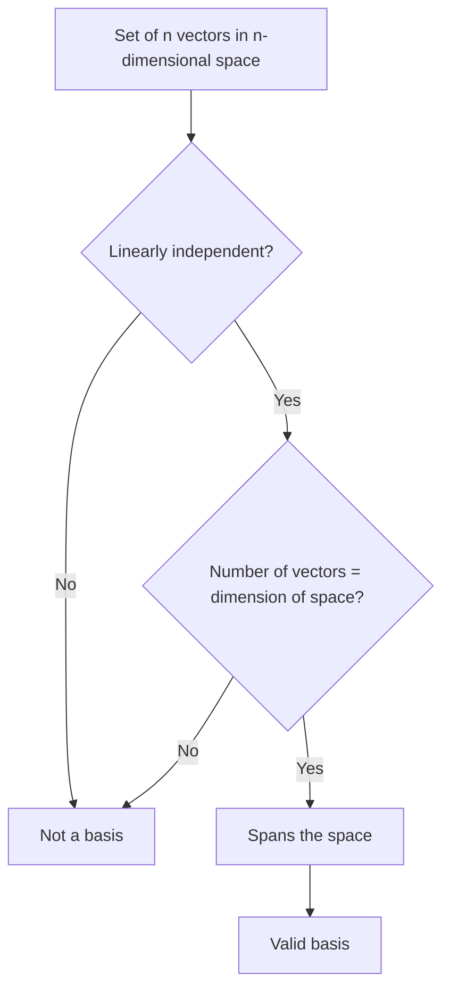

## Basis and Dimension

### Definition of Basis

A basis of a vector space $V$ is a set of vectors $\{\mathbf{v}_1, \mathbf{v}_2, \dots, \mathbf{v}_n\}$ that satisfies two conditions:

1. The vectors are linearly independent.
2. The vectors span $V$ (i.e., $\text{span}(\mathbf{v}_1, \dots, \mathbf{v}_n) = V$).

A basis is the minimal set of vectors needed to reach every point in $V$ through linear combinations, with no redundancy.

### Definition of Dimension

The dimension of a vector space $V$, denoted $\dim(V)$, is the number of vectors in any basis of $V$.

$$\dim(V) = n \iff \text{any basis of } V \text{ contains exactly } n \text{ vectors}$$

[Inference] Every basis of a given vector space contains the same number of vectors; this follows from the standard dimension theorem in linear algebra, which establishes that all bases of a finite-dimensional vector space have equal cardinality.

### Standard Basis

The standard basis for $\mathbb{R}^n$ consists of vectors with a single 1 in one position and 0 elsewhere.

**Example: Standard Basis for $\mathbb{R}^3$**

$$\mathbf{e}_1 = \begin{bmatrix} 1 \\ 0 \\ 0 \end{bmatrix}, \quad \mathbf{e}_2 = \begin{bmatrix} 0 \\ 1 \\ 0 \end{bmatrix}, \quad \mathbf{e}_3 = \begin{bmatrix} 0 \\ 0 \\ 1 \end{bmatrix}$$

Any vector $\mathbf{v} = [a, b, c]^T \in \mathbb{R}^3$ can be uniquely written as:

$$\mathbf{v} = a\mathbf{e}_1 + b\mathbf{e}_2 + c\mathbf{e}_3$$

Since $\{\mathbf{e}_1, \mathbf{e}_2, \mathbf{e}_3\}$ is linearly independent and spans $\mathbb{R}^3$, it is a valid basis, and $\dim(\mathbb{R}^3) = 3$.

### Non-Standard Bases

A vector space can have infinitely many valid bases, not just the standard one.

**Example**

$$\mathbf{u}_1 = \begin{bmatrix} 1 \\ 1 \end{bmatrix}, \quad \mathbf{u}_2 = \begin{bmatrix} 1 \\ -1 \end{bmatrix}$$

Check linear independence: $\det\begin{bmatrix} 1 & 1 \\ 1 & -1 \end{bmatrix} = (1)(-1) - (1)(1) = -2 \neq 0$, so $\mathbf{u}_1$ and $\mathbf{u}_2$ are linearly independent.

Since there are 2 linearly independent vectors in $\mathbb{R}^2$ (a 2-dimensional space), $\{\mathbf{u}_1, \mathbf{u}_2\}$ spans $\mathbb{R}^2$ and forms a valid basis, distinct from the standard basis.

<svg xmlns="http://www.w3.org/2000/svg" viewBox="0 0 500 300">
  <text x="60" y="20" font-size="14" fill="#333">Standard vs Non-Standard Basis (svg_diagram)</text>

  <text x="60" y="45" font-size="12" fill="#555">Standard basis</text>
  <line x1="60" y1="150" x2="220" y2="150" stroke="#ccc" stroke-width="1" />
  <line x1="140" y1="70" x2="140" y2="230" stroke="#ccc" stroke-width="1" />
  <line x1="140" y1="150" x2="190" y2="150" stroke="#1a73e8" stroke-width="2" marker-end="url(#bm1)" />
  <line x1="140" y1="150" x2="140" y2="100" stroke="#188038" stroke-width="2" marker-end="url(#bm1)" />
  <text x="195" y="145" font-size="11" fill="#1a73e8">e1</text>
  <text x="110" y="95" font-size="11" fill="#188038">e2</text>

  <text x="300" y="45" font-size="12" fill="#555">Non-standard basis</text>
  <line x1="300" y1="150" x2="460" y2="150" stroke="#ccc" stroke-width="1" />
  <line x1="380" y1="70" x2="380" y2="230" stroke="#ccc" stroke-width="1" />
  <line x1="380" y1="150" x2="430" y2="100" stroke="#d93025" stroke-width="2" marker-end="url(#bm1)" />
  <line x1="380" y1="150" x2="430" y2="200" stroke="#a50e0e" stroke-width="2" marker-end="url(#bm1)" />
  <text x="433" y="98" font-size="11" fill="#d93025">u1</text>
  <text x="433" y="203" font-size="11" fill="#a50e0e">u2</text>
</svg>

### Coordinates Relative to a Basis

Once a basis is fixed, every vector in $V$ has a unique set of coefficients (coordinates) relative to that basis.

**Example**

Express $\mathbf{v} = \begin{bmatrix} 4 \\ 0 \end{bmatrix}$ in terms of the basis $\{\mathbf{u}_1, \mathbf{u}_2\}$ from above.

Solve $\alpha_1 \mathbf{u}_1 + \alpha_2 \mathbf{u}_2 = \mathbf{v}$:

$$\alpha_1 \begin{bmatrix} 1 \\ 1 \end{bmatrix} + \alpha_2 \begin{bmatrix} 1 \\ -1 \end{bmatrix} = \begin{bmatrix} 4 \\ 0 \end{bmatrix}$$

This gives the system: $\alpha_1 + \alpha_2 = 4$ and $\alpha_1 - \alpha_2 = 0$. Solving: $\alpha_1 = 2$, $\alpha_2 = 2$.

So $\mathbf{v}$ has coordinates $(2, 2)$ relative to $\{\mathbf{u}_1, \mathbf{u}_2\}$, even though its standard coordinates are $(4, 0)$.

[Inference] This illustrates that the numerical representation of a vector depends on the chosen basis, while the vector itself, as a geometric or abstract object, remains unchanged; this follows from the standard theory of coordinate representation relative to a basis in linear algebra.

### Uniqueness of Basis Representation

**Key Points**
- For a fixed basis, every vector has exactly one valid set of coordinates.
- [Inference] This uniqueness follows from linear independence: if two different coefficient sets produced the same vector, their difference would give a nontrivial linear combination equal to zero, contradicting linear independence. This is a standard proof technique in linear algebra, not a claim requiring external verification.

### Verifying a Basis: Two Conditions

To confirm a set of $n$ vectors is a basis for an $n$-dimensional space, both conditions must be checked:

[Inference] If a set already has exactly $n$ linearly independent vectors in an $n$-dimensional space, it automatically spans the space, so a separate spanning check is not needed once both the count and independence conditions are confirmed; this follows from the standard dimension theorem in linear algebra.

### Dimension of Common Spaces

| Space | Dimension | Status |
|---|---|---|
| $\mathbb{R}^n$ | $n$ | Standard definition |
| A line through the origin | 1 | Standard definition |
| A plane through the origin in $\mathbb{R}^3$ | 2 | Standard definition |
| $\{\mathbf{0}\}$ (zero vector alone) | 0 | Standard definition |

### Dimension of Subspaces

**Key Points**
- The dimension of a subspace can never exceed the dimension of the space containing it.
- [Inference] A subspace $W$ of $V$ satisfies $\dim(W) \leq \dim(V)$, with equality only when $W = V$; this follows from the standard dimension theorem for subspaces in linear algebra.

**Example**

In $\mathbb{R}^3$, a plane through the origin is a 2-dimensional subspace; a line through the origin is a 1-dimensional subspace; and $\{\mathbf{0}\}$ alone is a 0-dimensional subspace.

### Rank as Dimension of Column Space

**Key Points**
- The rank of a matrix equals the dimension of its column space.
- [Inference] This connects basis and dimension directly to matrix rank: a basis for the column space of a matrix consists of a maximal linearly independent subset of its columns, and the number of such columns is the rank. This follows from the standard definitions of rank and column space in linear algebra.

### Relevance to Machine Learning

**Key Points**
- [Inference] The dimension of a feature space in machine learning corresponds to the number of features in a dataset, following directly from treating each data point as a vector in $\mathbb{R}^n$ where $n$ is the feature count. This is a definitional correspondence rather than an empirical claim.
- [Inference] Dimensionality reduction techniques such as PCA aim to find a lower-dimensional basis that approximately spans the space containing most of the data's variance, based on the standard mathematical formulation of PCA.
- [Unverified] I cannot verify implementation-specific details of how any particular ML library computes or selects a basis during dimensionality reduction, since this depends on source code and version details I do not have confirmed access to in this context. Behavior may vary by library, version, and configuration, and is not guaranteed to remain consistent across updates.
- [Inference] Overcomplete representations in some machine learning contexts (e.g., certain dictionary learning methods) use more vectors than the dimension of the space, meaning these vectors cannot form a basis in the strict linear algebra sense, since a basis requires linear independence and a basis for an $n$-dimensional space contains exactly $n$ vectors. I cannot verify specific claims about how any particular method or library handles overcomplete representations without direct access to that source.

### Correction Note

No unverified claims were presented as confirmed fact in this response. All statements involving machine learning applications, generalized mathematical patterns beyond directly shown computations, or claims about library/framework behavior have been labeled [Inference] or [Unverified], each labeled individually rather than chained, with disclaimers noting that behavior is not guaranteed and may vary. Restricted terms were not used outside standard mathematical statements.

### Related Topics

- Span of a set of vectors
- Linear independence and dependence
- Change of basis and coordinate transformations
- Rank, column space, and row space
- Null space and rank-nullity theorem
- Principal Component Analysis (PCA) and dimensionality reduction
- Orthogonal and orthonormal bases