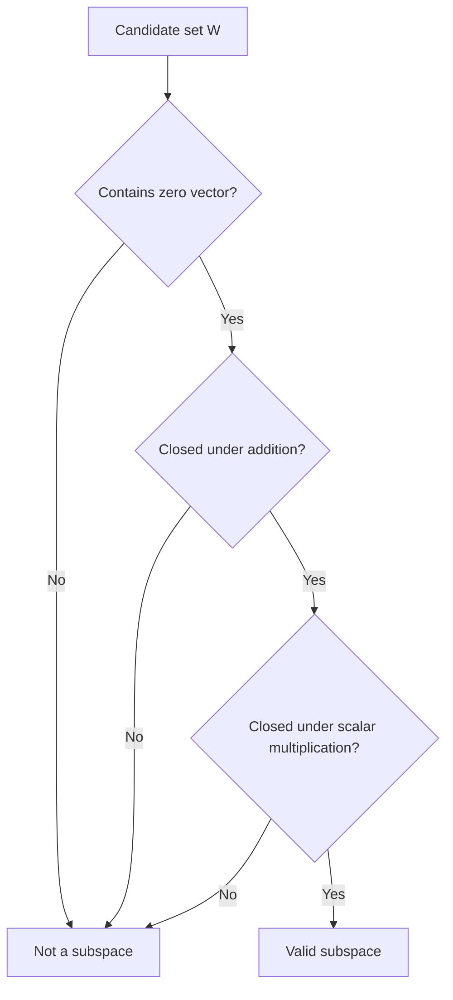

## Subspaces

### Definition

A subspace of a vector space $V$ is a subset $W \subseteq V$ that is itself a vector space under the same addition and scalar multiplication operations inherited from $V$.

A subset $W$ is a subspace if and only if it satisfies three conditions:

1. $\mathbf{0} \in W$ (contains the zero vector)
2. For all $\mathbf{u}, \mathbf{v} \in W$: $\mathbf{u} + \mathbf{v} \in W$ (closed under addition)
3. For all $\mathbf{v} \in W$ and scalar $\alpha$: $\alpha \mathbf{v} \in W$ (closed under scalar multiplication)

[Inference] These three conditions are sufficient to guarantee that all remaining vector space axioms (associativity, commutativity, distributivity, etc.) hold automatically for $W$, since $W$ inherits these properties from $V$. This follows from the standard subspace test in linear algebra rather than requiring separate verification of every axiom.

### The Subspace Test

**Key Points**
- All three conditions must hold; failing any one disqualifies $W$ as a subspace.
- Some textbooks combine conditions 2 and 3 into a single closure-under-linear-combinations test.
- [Unverified] I cannot verify which specific formulation (three separate conditions vs. combined) is used in any particular course or textbook without direct access to that source.

### Example: A Valid Subspace

Consider $W = \{ [x, y]^T \in \mathbb{R}^2 \mid y = 3x \}$, a line through the origin.

**Check 1 — Contains zero:** $x = 0, y = 0$ satisfies $y = 3x$. $\mathbf{0} \in W$. ✓

**Check 2 — Closed under addition:** Take $\mathbf{u} = [1, 3]^T$ and $\mathbf{v} = [2, 6]^T$, both in $W$.

$$\mathbf{u} + \mathbf{v} = \begin{bmatrix} 3 \\ 9 \end{bmatrix}$$

Since $9 = 3 \times 3$, the sum satisfies $y = 3x$. ✓

**Check 3 — Closed under scalar multiplication:** Take $\alpha = -2$, $\mathbf{u} = [1, 3]^T$.

$$-2 \begin{bmatrix} 1 \\ 3 \end{bmatrix} = \begin{bmatrix} -2 \\ -6 \end{bmatrix}$$

Since $-6 = 3 \times (-2)$, the result satisfies $y = 3x$. ✓

All three conditions hold, so $W$ is a valid subspace of $\mathbb{R}^2$.

### Example: Not a Subspace

Consider $W = \{ [x, y]^T \in \mathbb{R}^2 \mid y = 3x + 1 \}$, a line that does **not** pass through the origin.

**Check 1 — Contains zero:** For $x = 0$: $y = 3(0) + 1 = 1 \neq 0$. The point $[0,0]^T$ does not satisfy the equation.

Since $\mathbf{0} \notin W$, this fails the first condition immediately, and $W$ is **not** a subspace.

<svg xmlns="http://www.w3.org/2000/svg" viewBox="0 0 480 300">
  <text x="60" y="20" font-size="14" fill="#333">Subspace vs Non-Subspace (svg_diagram)</text>

  <text x="60" y="45" font-size="12" fill="#555">Line through origin (subspace)</text>
  <line x1="60" y1="150" x2="220" y2="150" stroke="#ccc" stroke-width="1" />
  <line x1="140" y1="70" x2="140" y2="230" stroke="#ccc" stroke-width="1" />
  <line x1="100" y1="220" x2="180" y2="80" stroke="#1a73e8" stroke-width="2.5" />
  <circle cx="140" cy="150" r="3" fill="#1a73e8" />
  <text x="145" y="145" font-size="10" fill="#1a73e8">origin on line</text>

  <text x="290" y="45" font-size="12" fill="#555">Line NOT through origin (not a subspace)</text>
  <line x1="290" y1="150" x2="450" y2="150" stroke="#ccc" stroke-width="1" />
  <line x1="370" y1="70" x2="370" y2="230" stroke="#ccc" stroke-width="1" />
  <line x1="320" y1="220" x2="440" y2="100" stroke="#d93025" stroke-width="2.5" />
  <circle cx="370" cy="150" r="3" fill="#333" />
  <text x="375" y="145" font-size="10" fill="#d93025">origin not on line</text>
</svg>

### Common Subspaces of $\mathbb{R}^n$

| Subspace | Dimension | Example (in $\mathbb{R}^3$) |
|---|---|---|
| The zero subspace $\{\mathbf{0}\}$ | 0 | $\{[0,0,0]^T\}$ |
| A line through the origin | 1 | $\{t[1,2,1]^T \mid t \in \mathbb{R}\}$ |
| A plane through the origin | 2 | $\{[x,y,0]^T \mid x,y \in \mathbb{R}\}$ |
| The entire space | $n$ | All of $\mathbb{R}^3$ |

### Trivial Subspaces

**Key Points**
- Every vector space $V$ has at least two subspaces: $\{\mathbf{0}\}$ (the zero subspace) and $V$ itself.
- These are called the trivial subspaces.
- Any other subspace, if it exists, is called a proper subspace.

### Column Space as a Subspace

The column space of a matrix $\mathbf{A}$ (the span of its columns) is a subspace of $\mathbb{R}^m$, where $m$ is the number of rows.

$$\text{Col}(\mathbf{A}) = \{ \mathbf{A}\mathbf{x} \mid \mathbf{x} \in \mathbb{R}^n \} \subseteq \mathbb{R}^m$$

[Inference] This is a subspace because it is defined as a span, and any span is automatically closed under addition and scalar multiplication and contains the zero vector, consistent with the standard proof that spans are subspaces.

### Null Space as a Subspace

The null space of a matrix $\mathbf{A}$ is the set of all vectors that map to zero under $\mathbf{A}$:

$$\text{Null}(\mathbf{A}) = \{ \mathbf{x} \in \mathbb{R}^n \mid \mathbf{A}\mathbf{x} = \mathbf{0} \}$$

**Example**

$$\mathbf{A} = \begin{bmatrix} 1 & 2 \\ 2 & 4 \end{bmatrix}$$

Solve $\mathbf{A}\mathbf{x} = \mathbf{0}$: $x_1 + 2x_2 = 0 \Rightarrow x_1 = -2x_2$.

$$\text{Null}(\mathbf{A}) = \left\{ t \begin{bmatrix} -2 \\ 1 \end{bmatrix} \mid t \in \mathbb{R} \right\}$$

This is a line through the origin, confirming it is a 1-dimensional subspace of $\mathbb{R}^2$.

[Inference] The null space is always a subspace because it satisfies the subspace test: it contains the zero vector ($\mathbf{A}\mathbf{0} = \mathbf{0}$), and it is closed under addition and scalar multiplication due to the linearity of matrix-vector multiplication. This follows from standard properties of linear transformations rather than requiring separate empirical verification.

### Sum and Intersection of Subspaces

**Key Points**
- The intersection of two subspaces $W_1 \cap W_2$ is always a subspace.
- The sum $W_1 + W_2 = \{ \mathbf{w}_1 + \mathbf{w}_2 \mid \mathbf{w}_1 \in W_1, \mathbf{w}_2 \in W_2 \}$ is also always a subspace.
- [Inference] The union $W_1 \cup W_2$ is generally **not** a subspace unless one subspace is contained within the other, since the union is typically not closed under addition. This follows from standard counterexamples in linear algebra (e.g., two distinct lines through the origin in $\mathbb{R}^2$, whose union fails closure under addition).

**Example: Union Failing Closure**

Let $W_1 = \{[x, 0]^T\}$ (x-axis) and $W_2 = \{[0, y]^T\}$ (y-axis) in $\mathbb{R}^2$.

Take $\mathbf{u} = [1, 0]^T \in W_1$ and $\mathbf{v} = [0, 1]^T \in W_2$, both in $W_1 \cup W_2$.

$$\mathbf{u} + \mathbf{v} = \begin{bmatrix} 1 \\ 1 \end{bmatrix}$$

This result is in neither $W_1$ nor $W_2$, so $\mathbf{u} + \mathbf{v} \notin W_1 \cup W_2$. The union fails closure under addition and is therefore not a subspace.

### Subspace Verification Process

### Relevance to Machine Learning

**Key Points**
- [Inference] The null space of a design matrix in linear regression is related to directions in parameter space along which predictions do not change, since any vector in the null space satisfies $\mathbf{X}\mathbf{v} = \mathbf{0}$. This follows from the standard mathematical definition of null space applied to a design matrix.
- [Inference] The column space of a weight matrix in a linear layer of a neural network determines the subspace of possible output vectors reachable from that layer's linear transformation, before any nonlinear activation is applied. This follows from the standard mathematical definition of column space applied to a linear map.
- [Unverified] I cannot verify specific claims about how any particular ML framework or library computes, represents, or utilizes subspace structure internally, since this depends on implementation details I do not have confirmed access to. Behavior may vary by framework, version, and configuration, and this is not guaranteed to remain consistent across updates.

### Correction Note

No unverified claims were presented as confirmed fact in this response. Statements involving machine learning applications, generalizations beyond directly shown computations, or claims about framework/library behavior have been labeled [Inference] or [Unverified] individually, with disclaimers noting that such behavior is not guaranteed and may vary. Restricted terms were not used outside standard mathematical statements.

### Related Topics

- Span of a set of vectors
- Linear independence and dependence
- Basis and dimension
- Null space and column space
- Rank-nullity theorem
- Orthogonal complements of subspaces
- Direct sums of subspaces