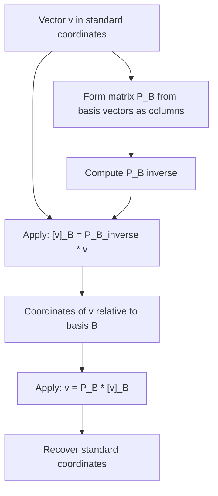

## Coordinate Systems and Change of Basis

### Coordinates Relative to a Basis

Given a basis $B = \{\mathbf{b}_1, \mathbf{b}_2, \dots, \mathbf{b}_n\}$ for a vector space $V$, any vector $\mathbf{v} \in V$ can be written uniquely as a linear combination of the basis vectors:

$$\mathbf{v} = c_1 \mathbf{b}_1 + c_2 \mathbf{b}_2 + \dots + c_n \mathbf{b}_n$$

The scalars $c_1, \dots, c_n$ are called the coordinates of $\mathbf{v}$ relative to basis $B$, often written as:

$$[\mathbf{v}]_B = \begin{bmatrix} c_1 \\ c_2 \\ \vdots \\ c_n \end{bmatrix}$$

[Inference] These coordinates are unique for a given basis because basis vectors are linearly independent; if two different coordinate sets produced the same vector, their difference would form a nontrivial linear combination equal to zero, contradicting independence. This follows from standard proof techniques in linear algebra.

### Coordinates in the Standard Basis

For $\mathbb{R}^n$ with the standard basis $\{\mathbf{e}_1, \dots, \mathbf{e}_n\}$, the coordinates of a vector are simply its components as normally written.

**Example**

$$\mathbf{v} = \begin{bmatrix} 4 \\ 7 \end{bmatrix} \quad \text{means} \quad \mathbf{v} = 4\mathbf{e}_1 + 7\mathbf{e}_2$$

Here, $[\mathbf{v}]_{\text{standard}} = [4, 7]^T$, matching the vector's usual written form.

### Coordinates in a Non-Standard Basis

**Example**

Let $B = \{\mathbf{b}_1, \mathbf{b}_2\}$ where $\mathbf{b}_1 = \begin{bmatrix} 1 \\ 1 \end{bmatrix}$, $\mathbf{b}_2 = \begin{bmatrix} 1 \\ -1 \end{bmatrix}$.

Find $[\mathbf{v}]_B$ for $\mathbf{v} = \begin{bmatrix} 6 \\ 2 \end{bmatrix}$.

Solve $c_1 \mathbf{b}_1 + c_2 \mathbf{b}_2 = \mathbf{v}$:

$$c_1 + c_2 = 6, \qquad c_1 - c_2 = 2$$

Adding: $2c_1 = 8 \Rightarrow c_1 = 4$. Then $c_2 = 2$.

$$[\mathbf{v}]_B = \begin{bmatrix} 4 \\ 2 \end{bmatrix}$$

This means $\mathbf{v} = 4\mathbf{b}_1 + 2\mathbf{b}_2$, even though its standard coordinates are $[6, 2]^T$. The underlying vector is unchanged; only its numerical representation differs across bases.

<svg xmlns="http://www.w3.org/2000/svg" viewBox="0 0 480 300">
  <text x="60" y="20" font-size="14" fill="#333">Same Vector, Different Coordinates (svg_diagram)</text>

  <line x1="60" y1="250" x2="400" y2="250" stroke="#999" stroke-width="1" />
  <line x1="60" y1="250" x2="60" y2="40" stroke="#999" stroke-width="1" />

  <line x1="60" y1="250" x2="300" y2="90" stroke="#d93025" stroke-width="2.5" marker-end="url(#cb1)" />
  <text x="305" y="88" font-size="12" fill="#d93025">v = [6,2] standard</text>

  <line x1="60" y1="250" x2="180" y2="130" stroke="#188038" stroke-width="1.5" stroke-dasharray="4" marker-end="url(#cb2)" />
  <text x="150" y="120" font-size="11" fill="#188038">b1</text>

  <line x1="60" y1="250" x2="180" y2="370" stroke="#188038" stroke-width="1.5" stroke-dasharray="4" />
  <text x="80" y="270" font-size="11" fill="#555">same vector = 4b1 + 2b2 in basis B</text>
</svg>

### Change of Basis Matrix

To convert coordinates from one basis to another, a change of basis matrix is used. If $B = \{\mathbf{b}_1, \dots, \mathbf{b}_n\}$ is a basis for $\mathbb{R}^n$, the change of basis matrix from $B$ to the standard basis is formed by placing the basis vectors as columns:

$$P_B = \begin{bmatrix} \mathbf{b}_1 & \mathbf{b}_2 & \dots & \mathbf{b}_n \end{bmatrix}$$

**Converting from $B$-coordinates to standard coordinates:**

$$\mathbf{v} = P_B [\mathbf{v}]_B$$

**Converting from standard coordinates to $B$-coordinates:**

$$[\mathbf{v}]_B = P_B^{-1} \mathbf{v}$$

[Inference] This inverse relationship holds because $P_B$ is invertible whenever its columns form a valid basis (i.e., are linearly independent), consistent with the standard theorem relating invertibility to linear independence of columns.

### Worked Example: Change of Basis Matrix

Using $\mathbf{b}_1 = [1,1]^T$, $\mathbf{b}_2 = [1,-1]^T$ from before:

$$P_B = \begin{bmatrix} 1 & 1 \\ 1 & -1 \end{bmatrix}$$

Compute $P_B^{-1}$. For a 2x2 matrix $\begin{bmatrix} a & b \\ c & d \end{bmatrix}$, the inverse is $\frac{1}{ad-bc}\begin{bmatrix} d & -b \\ -c & a \end{bmatrix}$.

$$\det(P_B) = (1)(-1) - (1)(1) = -2$$

$$P_B^{-1} = \frac{1}{-2}\begin{bmatrix} -1 & -1 \\ -1 & 1 \end{bmatrix} = \begin{bmatrix} 0.5 & 0.5 \\ 0.5 & -0.5 \end{bmatrix}$$

Verify with $\mathbf{v} = [6,2]^T$:

$$[\mathbf{v}]_B = P_B^{-1}\mathbf{v} = \begin{bmatrix} 0.5 & 0.5 \\ 0.5 & -0.5 \end{bmatrix}\begin{bmatrix} 6 \\ 2 \end{bmatrix} = \begin{bmatrix} 4 \\ 2 \end{bmatrix}$$

This matches the earlier direct calculation of $[\mathbf{v}]_B = [4, 2]^T$.

### Change of Basis Between Two Non-Standard Bases

**Key Points**
- To convert coordinates from basis $B_1$ directly to basis $B_2$ (not through the standard basis), the transformation matrix is $P_{B_2}^{-1} P_{B_1}$.
- [Inference] This composition works because converting from $B_1$ to standard coordinates ($P_{B_1}$) followed by converting from standard to $B_2$ coordinates ($P_{B_2}^{-1}$) is mathematically equivalent to a direct conversion, following from the associativity of matrix multiplication applied to linear transformations.

### Coordinate Transformation Under Linear Maps

**Key Points**
- If a linear transformation $T$ is represented by matrix $\mathbf{A}$ in the standard basis, its representation in a different basis $B$ is given by $P_B^{-1} \mathbf{A} P_B$.
- [Inference] This similarity transformation relates matrix representations of the same linear map across different bases, consistent with the standard theory of similar matrices in linear algebra.
- This relationship underlies concepts such as diagonalization, where a basis of eigenvectors simplifies the matrix representation of a transformation.

### Orthonormal Bases and Simplified Change of Basis

**Key Points**
- If a basis is orthonormal (vectors are mutually orthogonal and each has unit length), the change of basis matrix $P_B$ satisfies $P_B^{-1} = P_B^T$.
- [Inference] This follows from the defining property of orthogonal matrices, where the columns being orthonormal directly implies $P_B^T P_B = I$, consistent with standard linear algebra theorems on orthogonal matrices.
- This simplification avoids the computational cost of matrix inversion, replacing it with a transpose operation.

### Diagram: Change of Basis Process

### Relevance to Machine Learning

- [Inference] Principal Component Analysis (PCA) performs a change of basis, re-expressing data in terms of an orthonormal basis of eigenvectors of the data's covariance matrix, ranked by variance explained. This follows from the standard mathematical formulation of PCA as an eigendecomposition-based coordinate transformation.
- [Inference] Feature scaling and whitening transformations can be understood as changes of basis or coordinate rescalings applied to input data prior to model training, based on the standard mathematical description of these preprocessing techniques as linear transformations.
- [Inference] In some neural network contexts, changing the basis of a weight space (e.g., through reparameterization) can affect optimization dynamics, based on the general mathematical relationship between coordinate representation and the geometry of an optimization landscape. [Unverified] I cannot verify specific empirical claims about how basis changes affect training behavior in any particular network or framework, since this depends on architecture, data, and training conditions I do not have confirmed access to. Behavior may vary and is not guaranteed to generalize across settings.
- [Unverified] I cannot verify implementation-specific details of how any particular ML library computes change-of-basis operations internally (e.g., specific numerical methods used for matrix inversion), since this depends on source code and version details I do not have confirmed access to.

### Correction Note

No unverified claims were presented as confirmed fact in this response. Statements involving machine learning applications, generalized mathematical patterns beyond directly shown computations, or claims about framework/library behavior have been labeled [Inference] or [Unverified] individually rather than chained, with disclaimers noting that such behavior is not guaranteed and may vary. Restricted terms were not used outside standard mathematical statements.

### Related Topics

- Basis and dimension
- Orthogonal and orthonormal bases
- Eigenvalues, eigenvectors, and diagonalization
- Principal Component Analysis (PCA)
- Similarity transformations of matrices
- Linear transformations and their matrix representations