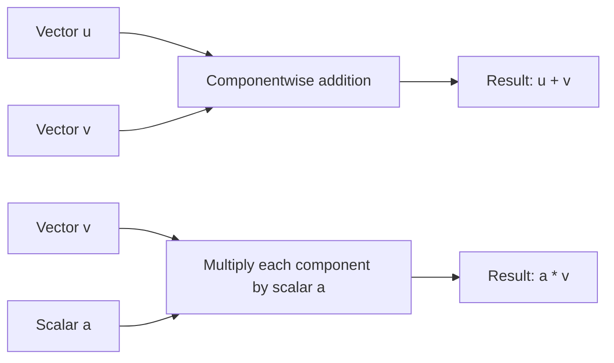

## Vector Addition and Scalar Multiplication

### Vector Addition

Vector addition combines two vectors of the same dimension by adding their corresponding components.

$$\mathbf{u} + \mathbf{v} = \begin{bmatrix} u_1 \\ u_2 \\ \vdots \\ u_n \end{bmatrix} + \begin{bmatrix} v_1 \\ v_2 \\ \vdots \\ v_n \end{bmatrix} = \begin{bmatrix} u_1 + v_1 \\ u_2 + v_2 \\ \vdots \\ u_n + v_n \end{bmatrix}$$

**Example**

$$\begin{bmatrix} 3 \\ -1 \\ 2 \end{bmatrix} + \begin{bmatrix} 1 \\ 4 \\ -5 \end{bmatrix} = \begin{bmatrix} 4 \\ 3 \\ -3 \end{bmatrix}$$

### Geometric Interpretation: The Parallelogram Rule

Vector addition can be visualized geometrically by placing the tail of the second vector at the head of the first; the sum is the vector from the origin to the resulting endpoint.

<svg xmlns="http://www.w3.org/2000/svg" viewBox="0 0 420 320">
  <text x="70" y="20" font-size="14" fill="#333">Vector Addition: Parallelogram Rule (svg_diagram)</text>
  <line x1="60" y1="270" x2="380" y2="270" stroke="#999" stroke-width="1" />
  <line x1="60" y1="270" x2="60" y2="30" stroke="#999" stroke-width="1" />

  <line x1="60" y1="270" x2="220" y2="270" stroke="#1a73e8" stroke-width="2.5" marker-end="url(#va1)" />
  <text x="225" y="265" font-size="12" fill="#1a73e8">u</text>

  <line x1="60" y1="270" x2="130" y2="140" stroke="#188038" stroke-width="2.5" marker-end="url(#va2)" />
  <text x="90" y="135" font-size="12" fill="#188038">v</text>

  <line x1="60" y1="270" x2="290" y2="140" stroke="#d93025" stroke-width="2.5" marker-end="url(#va3)" />
  <text x="295" y="135" font-size="12" fill="#d93025">u + v</text>

  <line x1="220" y1="270" x2="290" y2="140" stroke="#188038" stroke-width="1.5" stroke-dasharray="4" />
  <line x1="130" y1="140" x2="290" y2="140" stroke="#1a73e8" stroke-width="1.5" stroke-dasharray="4" />
</svg>

### Properties of Vector Addition

**Key Points**
- **Commutativity**: $\mathbf{u} + \mathbf{v} = \mathbf{v} + \mathbf{u}$
- **Associativity**: $(\mathbf{u} + \mathbf{v}) + \mathbf{w} = \mathbf{u} + (\mathbf{v} + \mathbf{w})$
- **Additive identity**: $\mathbf{v} + \mathbf{0} = \mathbf{v}$
- **Additive inverse**: $\mathbf{v} + (-\mathbf{v}) = \mathbf{0}$

These are among the defining axioms of a vector space, as established under the earlier vector spaces topic.

### Vector Subtraction

Subtraction is defined as addition of the additive inverse:

$$\mathbf{u} - \mathbf{v} = \mathbf{u} + (-\mathbf{v}) = \begin{bmatrix} u_1 - v_1 \\ u_2 - v_2 \\ \vdots \\ u_n - v_n \end{bmatrix}$$

**Example**

$$\begin{bmatrix} 5 \\ 2 \end{bmatrix} - \begin{bmatrix} 3 \\ 6 \end{bmatrix} = \begin{bmatrix} 2 \\ -4 \end{bmatrix}$$

**Geometric interpretation**: $\mathbf{u} - \mathbf{v}$ produces a vector pointing from the head of $\mathbf{v}$ to the head of $\mathbf{u}$, when both are drawn from the same origin.

### Scalar Multiplication

Scalar multiplication scales every component of a vector by the same scalar value.

$$\alpha \mathbf{v} = \alpha \begin{bmatrix} v_1 \\ v_2 \\ \vdots \\ v_n \end{bmatrix} = \begin{bmatrix} \alpha v_1 \\ \alpha v_2 \\ \vdots \\ \alpha v_n \end{bmatrix}$$

**Example**

$$3 \begin{bmatrix} 2 \\ -1 \\ 4 \end{bmatrix} = \begin{bmatrix} 6 \\ -3 \\ 12 \end{bmatrix}$$

### Geometric Interpretation of Scalar Multiplication

**Key Points**
- If $\alpha > 1$: the vector stretches (magnitude increases), direction unchanged.
- If $0 < \alpha < 1$: the vector shrinks (magnitude decreases), direction unchanged.
- If $\alpha = -1$: the vector reverses direction, magnitude unchanged.
- If $\alpha < 0$ (general case): the vector reverses direction and scales by $|\alpha|$.
- If $\alpha = 0$: the result is the zero vector, regardless of the original vector.

<svg xmlns="http://www.w3.org/2000/svg" viewBox="0 0 420 300">
  <text x="60" y="20" font-size="14" fill="#333">Scalar Multiplication Effects (svg_diagram)</text>
  <line x1="60" y1="160" x2="380" y2="160" stroke="#999" stroke-width="1" />

  <line x1="60" y1="160" x2="140" y2="160" stroke="#1a73e8" stroke-width="2.5" marker-end="url(#sm1)" />
  <text x="80" y="150" font-size="11" fill="#1a73e8">v</text>

  <line x1="60" y1="200" x2="220" y2="200" stroke="#188038" stroke-width="2.5" marker-end="url(#sm2)" />
  <text x="130" y="192" font-size="11" fill="#188038">2v (stretched)</text>

  <line x1="60" y1="240" x2="60" y2="240" stroke="#d93025" stroke-width="2.5" />
  <line x1="220" y1="240" x2="60" y2="240" stroke="#d93025" stroke-width="2.5" marker-end="url(#sm3)" />
  <text x="130" y="232" font-size="11" fill="#d93025">-2v (reversed, stretched)</text>
</svg>

### Properties of Scalar Multiplication

**Key Points**
- **Distributivity over vector addition**: $\alpha(\mathbf{u} + \mathbf{v}) = \alpha \mathbf{u} + \alpha \mathbf{v}$
- **Distributivity over scalar addition**: $(\alpha + \beta)\mathbf{v} = \alpha \mathbf{v} + \beta \mathbf{v}$
- **Associativity of scalars**: $\alpha(\beta \mathbf{v}) = (\alpha \beta)\mathbf{v}$
- **Scalar identity**: $1 \cdot \mathbf{v} = \mathbf{v}$

These properties are part of the vector space axioms described in the earlier fields and vector spaces topics.

### Worked Example: Combining Both Operations

Given $\mathbf{u} = \begin{bmatrix} 2 \\ 3 \end{bmatrix}$, $\mathbf{v} = \begin{bmatrix} 1 \\ -2 \end{bmatrix}$, compute $3\mathbf{u} - 2\mathbf{v}$:

$$3\mathbf{u} = \begin{bmatrix} 6 \\ 9 \end{bmatrix}, \qquad 2\mathbf{v} = \begin{bmatrix} 2 \\ -4 \end{bmatrix}$$

$$3\mathbf{u} - 2\mathbf{v} = \begin{bmatrix} 6 \\ 9 \end{bmatrix} - \begin{bmatrix} 2 \\ -4 \end{bmatrix} = \begin{bmatrix} 4 \\ 13 \end{bmatrix}$$

This is a linear combination, connecting directly to the earlier linear combinations topic.

### Componentwise Nature of These Operations

**Key Points**
- Both vector addition and scalar multiplication are defined componentwise in $\mathbb{R}^n$.
- [Inference] This componentwise structure is what makes these operations computationally efficient to implement, since each output component depends only on the corresponding input component(s) and can, in principle, be computed independently of the others. This is a structural observation based on the mathematical definition, not a claim about any specific hardware or software implementation.
- [Unverified] I cannot verify specific claims about how any particular numerical computing library (e.g., NumPy, PyTorch) implements these operations internally (e.g., specific vectorization or parallelization strategies used), since this depends on source code and version details I do not have confirmed access to.

### Relevance to Machine Learning

- [Inference] Gradient descent updates model parameters using vector addition and scalar multiplication: $\boldsymbol{\theta}_{\text{new}} = \boldsymbol{\theta}_{\text{old}} - \eta \nabla L(\boldsymbol{\theta})$, where $\eta$ is a scalar learning rate and $\nabla L$ is the gradient vector. This follows from the standard mathematical formulation of the gradient descent update rule.
- [Inference] Weighted sums of input features, as used in linear models and neural network layers, rely on scalar multiplication (weights) combined with vector addition (summing weighted terms). This follows from the standard mathematical definition of a linear layer's computation.
- [Inference] Averaging vectors (e.g., averaging word embeddings or gradient vectors across a batch) is a combination of vector addition and scalar multiplication (dividing by the count), based on the standard mathematical definition of a vector average. [Unverified] I cannot verify specific implementation details of how any particular library computes such averages internally, or whether numerical precision considerations affect the result in a specific case, since this depends on source code and version details I do not have confirmed access to.

### Diagram: Operation Summary

### Correction Note

No unverified claims were presented as confirmed fact in this response. Statements involving machine learning applications, generalized structural observations beyond directly shown computations, or claims about library/implementation behavior have been labeled [Inference] or [Unverified] individually rather than chained, with disclaimers noting that such behavior is not guaranteed and may vary. Restricted terms were not used outside standard mathematical statements.

### Related Topics

- Linear combinations
- Vector spaces and their axioms
- Norms and vector magnitude
- Dot product and inner products
- Gradient descent and parameter updates
- Broadcasting in numerical computing libraries