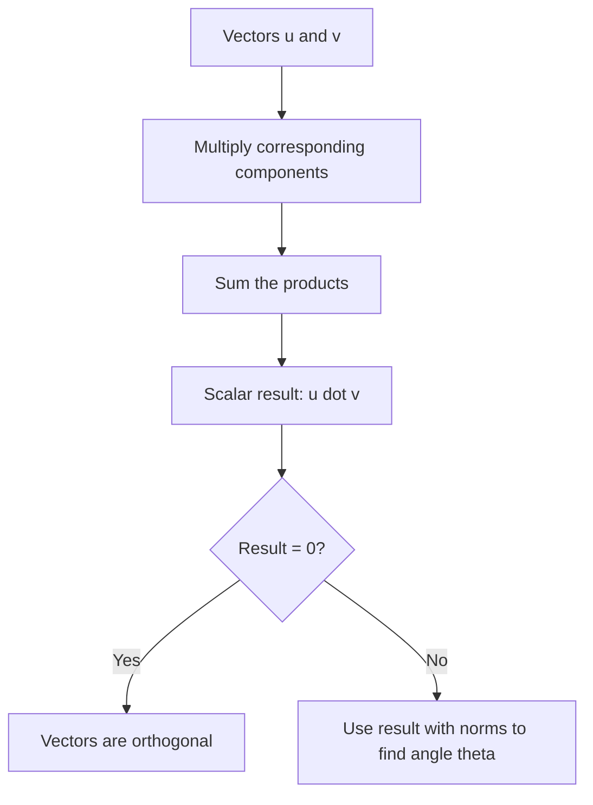

## Dot Product and Inner Product

### Dot Product Definition

The dot product (also called the scalar product) of two vectors $\mathbf{u}, \mathbf{v} \in \mathbb{R}^n$ is defined as the sum of the products of their corresponding components:

$$\mathbf{u} \cdot \mathbf{v} = \sum_{i=1}^{n} u_i v_i = u_1 v_1 + u_2 v_2 + \dots + u_n v_n$$

The result is always a scalar, regardless of the dimension $n$.

**Example**

$$\mathbf{u} = \begin{bmatrix} 2 \\ -1 \\ 3 \end{bmatrix}, \quad \mathbf{v} = \begin{bmatrix} 4 \\ 5 \\ -2 \end{bmatrix}$$

$$\mathbf{u} \cdot \mathbf{v} = (2)(4) + (-1)(5) + (3)(-2) = 8 - 5 - 6 = -3$$

### Dot Product as Matrix Multiplication

The dot product can also be expressed using transpose and matrix multiplication notation:

$$\mathbf{u} \cdot \mathbf{v} = \mathbf{u}^T \mathbf{v}$$

This connects the dot product directly to the earlier discussion of vector notation conventions, where $\mathbf{u}^T\mathbf{v}$ is one of several common notations for the same operation.

### Geometric Interpretation

The dot product relates to the angle $\theta$ between two vectors:

$$\mathbf{u} \cdot \mathbf{v} = \lVert \mathbf{u} \rVert \, \lVert \mathbf{v} \rVert \cos\theta$$

where $\lVert \mathbf{u} \rVert$ and $\lVert \mathbf{v} \rVert$ denote the magnitudes (norms) of the vectors.

**Key Points**
- If $\theta = 90°$ (vectors are perpendicular), $\cos\theta = 0$, so $\mathbf{u} \cdot \mathbf{v} = 0$.
- If $\theta < 90°$ (acute angle), $\mathbf{u} \cdot \mathbf{v} > 0$.
- If $\theta > 90°$ (obtuse angle), $\mathbf{u} \cdot \mathbf{v} < 0$.
- If $\theta = 0°$ (same direction), $\mathbf{u} \cdot \mathbf{v} = \lVert \mathbf{u} \rVert \lVert \mathbf{v} \rVert$ (maximum value for given magnitudes).

<svg xmlns="http://www.w3.org/2000/svg" viewBox="0 0 420 300">
  <text x="60" y="20" font-size="14" fill="#333">Dot Product and Angle Between Vectors (svg_diagram)</text>
  <line x1="60" y1="250" x2="380" y2="250" stroke="#999" stroke-width="1" />
  <line x1="60" y1="250" x2="60" y2="30" stroke="#999" stroke-width="1" />

  <line x1="60" y1="250" x2="280" y2="250" stroke="#1a73e8" stroke-width="2.5" marker-end="url(#dp1)" />
  <text x="285" y="245" font-size="12" fill="#1a73e8">u</text>

  <line x1="60" y1="250" x2="220" y2="100" stroke="#188038" stroke-width="2.5" marker-end="url(#dp2)" />
  <text x="225" y="95" font-size="12" fill="#188038">v</text>

  <path d="M 110 250 A 50 50 0 0 0 100 210" fill="none" stroke="#d93025" stroke-width="1.5" />
  <text x="105" y="225" font-size="11" fill="#d93025">theta</text>
</svg>

### Orthogonality

Two vectors are orthogonal (perpendicular) if and only if their dot product equals zero.

**Example**

$$\mathbf{u} = \begin{bmatrix} 1 \\ 2 \end{bmatrix}, \quad \mathbf{v} = \begin{bmatrix} 4 \\ -2 \end{bmatrix}$$

$$\mathbf{u} \cdot \mathbf{v} = (1)(4) + (2)(-2) = 4 - 4 = 0$$

Since the dot product is zero, $\mathbf{u}$ and $\mathbf{v}$ are orthogonal.

### Properties of the Dot Product

**Key Points**
- **Commutativity**: $\mathbf{u} \cdot \mathbf{v} = \mathbf{v} \cdot \mathbf{u}$
- **Distributivity over addition**: $\mathbf{u} \cdot (\mathbf{v} + \mathbf{w}) = \mathbf{u} \cdot \mathbf{v} + \mathbf{u} \cdot \mathbf{w}$
- **Scalar compatibility**: $(\alpha \mathbf{u}) \cdot \mathbf{v} = \alpha (\mathbf{u} \cdot \mathbf{v})$
- **Relation to norm**: $\mathbf{v} \cdot \mathbf{v} = \lVert \mathbf{v} \rVert^2$

**Example of the norm relation**

$$\mathbf{v} = \begin{bmatrix} 3 \\ 4 \end{bmatrix}, \quad \mathbf{v} \cdot \mathbf{v} = 9 + 16 = 25, \quad \lVert \mathbf{v} \rVert = \sqrt{25} = 5$$

### Inner Product: Generalization of the Dot Product

An inner product is a more general concept than the dot product, defined axiomatically on a vector space. A function $\langle \cdot, \cdot \rangle : V \times V \to \mathbb{R}$ is an inner product if, for all $\mathbf{u}, \mathbf{v}, \mathbf{w} \in V$ and scalar $\alpha$:

1. **Symmetry**: $\langle \mathbf{u}, \mathbf{v} \rangle = \langle \mathbf{v}, \mathbf{u} \rangle$
2. **Linearity in the first argument**: $\langle \alpha \mathbf{u} + \mathbf{w}, \mathbf{v} \rangle = \alpha \langle \mathbf{u}, \mathbf{v} \rangle + \langle \mathbf{w}, \mathbf{v} \rangle$
3. **Positive-definiteness**: $\langle \mathbf{v}, \mathbf{v} \rangle \geq 0$, with equality only when $\mathbf{v} = \mathbf{0}$

The standard dot product on $\mathbb{R}^n$ is one specific example of an inner product, but other inner products exist on other vector spaces or with different weightings.

[Inference] Because the dot product satisfies all three inner product axioms, it qualifies as a valid inner product on $\mathbb{R}^n$; this follows directly from verifying the axioms against the componentwise definition of the dot product, a standard result in linear algebra.

### Weighted Inner Product Example

**Example**

A weighted inner product on $\mathbb{R}^2$ might be defined as:

$$\langle \mathbf{u}, \mathbf{v} \rangle_W = 2u_1v_1 + 3u_2v_2$$

This differs from the standard dot product but still satisfies the three inner product axioms for positive weights. [Inference] This type of weighted inner product structure is used in some contexts to emphasize certain dimensions or features more heavily than others, based on the general mathematical property that different positive weights change the geometry (distances and angles) induced by the inner product. I cannot verify specific claims about which particular ML methods use this exact construction without direct access to those sources.

### Cauchy-Schwarz Inequality

**Key Points**
- For any vectors $\mathbf{u}, \mathbf{v}$: $|\mathbf{u} \cdot \mathbf{v}| \leq \lVert \mathbf{u} \rVert \, \lVert \mathbf{v} \rVert$
- [Inference] This inequality follows from the general properties of inner products and is a standard theorem in linear algebra, not something requiring separate empirical confirmation.
- Equality holds if and only if $\mathbf{u}$ and $\mathbf{v}$ are linearly dependent (parallel).

### Dot Product in Matrix Form for Multiple Vectors

When computing dot products between many pairs of vectors (e.g., rows of a matrix), this can be expressed as matrix multiplication:

$$\mathbf{A}\mathbf{A}^T$$

produces a matrix where entry $(i,j)$ is the dot product of row $i$ and row $j$ of $\mathbf{A}$.

[Inference] This generalization to matrix form follows directly from the definition of matrix multiplication combined with the definition of the dot product; each entry of the resulting matrix is, by the rules of matrix multiplication, exactly the sum-of-products definition of the dot product applied to the corresponding rows.

### Relevance to Machine Learning

**Key Points**
- [Inference] The dot product is used in computing the weighted sum in a linear model or a single neuron's pre-activation: $z = \mathbf{w}^T \mathbf{x} + b$, following from the standard mathematical formulation of these models described in the earlier linear combinations topic.
- [Inference] Cosine similarity, a common measure of similarity between vectors (e.g., in text embeddings or recommendation systems), is derived directly from the dot product formula divided by the product of norms: $\cos\theta = \frac{\mathbf{u} \cdot \mathbf{v}}{\lVert \mathbf{u} \rVert \lVert \mathbf{v} \rVert}$, following from the standard geometric formula relating dot product and angle.
- [Inference] Attention mechanisms in some neural network architectures compute similarity scores between query and key vectors using dot products (or scaled dot products), based on published descriptions of attention mechanisms such as scaled dot-product attention. [Unverified] I cannot verify implementation-specific details of how any particular current model or framework computes attention internally, since this depends on architecture and source code details I do not have confirmed access to. Behavior may vary by architecture, version, and configuration, and this is not guaranteed to remain consistent across implementations.
- [Unverified] I cannot verify specific claims about how any particular ML library optimizes or implements dot product computation internally (e.g., specific BLAS routines or hardware acceleration used).

### Diagram: Dot Product Computation and Interpretation

### Correction Note

No unverified claims were presented as confirmed fact in this response. Statements involving machine learning applications, generalized mathematical patterns beyond directly shown computations, or claims about library/framework/model implementation behavior have been labeled [Inference] or [Unverified] individually rather than chained, with disclaimers noting that such behavior is not guaranteed and may vary. Restricted terms were not used outside standard mathematical statements.

### Related Topics

- Norms and vector magnitude
- Orthogonality and orthogonal projections
- Cosine similarity in machine learning applications
- Cauchy-Schwarz and triangle inequalities
- Matrix multiplication
- Attention mechanisms and scaled dot-product attention