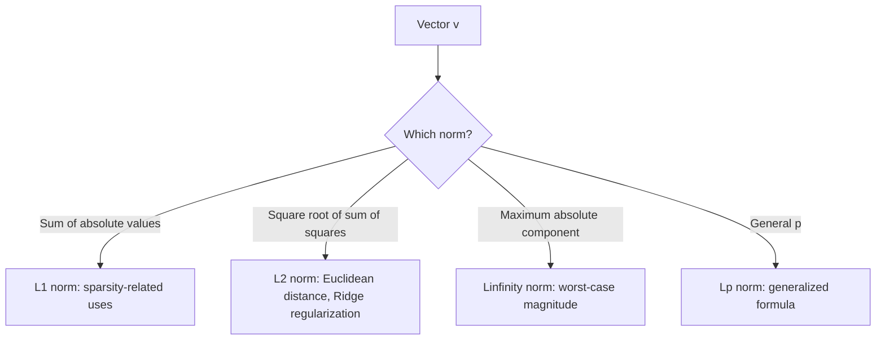

## Norms: L1, L2, L-infinity, and Lp

### Definition of a Norm

A norm is a function $\lVert \cdot \rVert : V \to \mathbb{R}$ that assigns a non-negative length or size to each vector, satisfying three axioms for all $\mathbf{u}, \mathbf{v} \in V$ and scalar $\alpha$:

1. **Non-negativity**: $\lVert \mathbf{v} \rVert \geq 0$, with $\lVert \mathbf{v} \rVert = 0$ if and only if $\mathbf{v} = \mathbf{0}$
2. **Absolute homogeneity**: $\lVert \alpha \mathbf{v} \rVert = |\alpha| \, \lVert \mathbf{v} \rVert$
3. **Triangle inequality**: $\lVert \mathbf{u} + \mathbf{v} \rVert \leq \lVert \mathbf{u} \rVert + \lVert \mathbf{v} \rVert$

[Inference] Any function satisfying these three axioms qualifies mathematically as a valid norm, regardless of its specific formula; this follows from the standard axiomatic definition of a norm in linear algebra.

### The Lp Norm (General Form)

The general $L_p$ norm for a vector $\mathbf{v} \in \mathbb{R}^n$ is defined as:

$$\lVert \mathbf{v} \rVert_p = \left( \sum_{i=1}^{n} |v_i|^p \right)^{1/p}$$

for $p \geq 1$. Different values of $p$ produce different, commonly used norms.

### L1 Norm (Manhattan Norm)

The L1 norm sums the absolute values of the components:

$$\lVert \mathbf{v} \rVert_1 = \sum_{i=1}^{n} |v_i|$$

**Example**

$$\mathbf{v} = \begin{bmatrix} 3 \\ -4 \\ 2 \end{bmatrix}, \quad \lVert \mathbf{v} \rVert_1 = |3| + |-4| + |2| = 3 + 4 + 2 = 9$$

[Inference] The L1 norm is also called the "Manhattan norm" or "taxicab norm" because it corresponds to the distance traveled along grid-like paths (as if navigating city blocks), rather than a direct diagonal path; this is a commonly cited geometric interpretation in linear algebra and optimization literature.

### L2 Norm (Euclidean Norm)

The L2 norm is the familiar Euclidean length, computed as the square root of the sum of squared components:

$$\lVert \mathbf{v} \rVert_2 = \sqrt{\sum_{i=1}^{n} v_i^2}$$

**Example**

$$\mathbf{v} = \begin{bmatrix} 3 \\ 4 \end{bmatrix}, \quad \lVert \mathbf{v} \rVert_2 = \sqrt{3^2 + 4^2} = \sqrt{9+16} = \sqrt{25} = 5$$

**Key Points**
- The L2 norm relates directly to the dot product: $\lVert \mathbf{v} \rVert_2 = \sqrt{\mathbf{v} \cdot \mathbf{v}}$, as established in the earlier dot product topic.
- When no subscript is specified, $\lVert \mathbf{v} \rVert$ commonly refers to the L2 norm by convention. [Inference] This is a widely observed convention in mathematical and ML literature, though not something I can confirm applies universally in every source without checking that source directly.

### L-infinity Norm (Maximum Norm)

The L-infinity norm is defined as the largest absolute value among the vector's components:

$$\lVert \mathbf{v} \rVert_\infty = \max_i |v_i|$$

**Example**

$$\mathbf{v} = \begin{bmatrix} 3 \\ -7 \\ 5 \end{bmatrix}, \quad \lVert \mathbf{v} \rVert_\infty = \max(3, 7, 5) = 7$$

[Inference] The L-infinity norm can be understood as the limiting case of the $L_p$ norm as $p \to \infty$; this follows from the mathematical property that as $p$ increases, the largest-magnitude component increasingly dominates the sum inside the $L_p$ formula, a standard limiting argument in analysis.

### Geometric Comparison: Unit "Balls" of Different Norms

The set of all vectors with norm equal to 1 (the "unit ball") has a different shape depending on which norm is used.

<svg xmlns="http://www.w3.org/2000/svg" viewBox="0 0 500 320">
  <text x="80" y="20" font-size="14" fill="#333">Unit Balls: L1, L2, Linfinity Norms (svg_diagram)</text>

  <text x="60" y="45" font-size="12" fill="#555">L1 (diamond)</text>
  <line x1="60" y1="150" x2="200" y2="150" stroke="#ccc" stroke-width="1" />
  <line x1="130" y1="80" x2="130" y2="220" stroke="#ccc" stroke-width="1" />
  <polygon points="130,90 190,150 130,210 70,150" fill="none" stroke="#1a73e8" stroke-width="2" />

  <text x="220" y="45" font-size="12" fill="#555">L2 (circle)</text>
  <line x1="220" y1="150" x2="360" y2="150" stroke="#ccc" stroke-width="1" />
  <line x1="290" y1="80" x2="290" y2="220" stroke="#ccc" stroke-width="1" />
  <circle cx="290" cy="150" r="60" fill="none" stroke="#188038" stroke-width="2" />

  <text x="380" y="45" font-size="12" fill="#555">Linf (square)</text>
  <line x1="380" y1="150" x2="480" y2="150" stroke="#ccc" stroke-width="1" />
  <rect x="410" y="90" width="120" height="120" fill="none" stroke="#d93025" stroke-width="2" transform="translate(-70,0)" />
</svg>

[Inference] These characteristic shapes (diamond for L1, circle for L2, square for L-infinity) are commonly presented in optimization and machine learning literature to illustrate how different norms treat vector magnitude differently across dimensions; this is a standard geometric visualization rather than an empirical claim requiring separate verification.

### Comparison Table

| Norm | Formula | Geometric Shape (2D unit ball) | Common Name |
|---|---|---|---|
| $L_1$ | $\sum \lvert v_i \rvert$ | Diamond | Manhattan / Taxicab norm |
| $L_2$ | $\sqrt{\sum v_i^2}$ | Circle | Euclidean norm |
| $L_p$ | $(\sum \lvert v_i \rvert^p)^{1/p}$ | Rounded shape (varies with $p$) | General $p$-norm |
| $L_\infty$ | $\max_i \lvert v_i \rvert$ | Square | Maximum / Chebyshev norm |

### Relationship Between Norms

**Key Points**
- [Inference] For any vector $\mathbf{v} \in \mathbb{R}^n$, the inequality $\lVert \mathbf{v} \rVert_\infty \leq \lVert \mathbf{v} \rVert_2 \leq \lVert \mathbf{v} \rVert_1$ holds; this follows from standard norm inequality proofs in linear algebra relating different $L_p$ norms on finite-dimensional spaces.
- [Unverified] I cannot verify the exact tightness or specific numerical bounds of these inequalities for every possible dimension $n$ without deriving them case by case, though the general ordering itself is a standard mathematical result.

### Normalizing a Vector

Dividing a vector by its norm produces a unit vector (a vector with norm 1) in the same direction.

$$\hat{\mathbf{v}} = \frac{\mathbf{v}}{\lVert \mathbf{v} \rVert}$$

**Example**

$$\mathbf{v} = \begin{bmatrix} 3 \\ 4 \end{bmatrix}, \quad \lVert \mathbf{v} \rVert_2 = 5, \quad \hat{\mathbf{v}} = \begin{bmatrix} 0.6 \\ 0.8 \end{bmatrix}$$

Verify: $\lVert \hat{\mathbf{v}} \rVert_2 = \sqrt{0.6^2 + 0.8^2} = \sqrt{0.36+0.64} = \sqrt{1} = 1$.

### Relevance to Machine Learning

**Key Points**
- [Inference] L1 and L2 norms are commonly used as regularization terms in machine learning loss functions (L1 regularization / Lasso, L2 regularization / Ridge), based on standard published formulations of these regression techniques. [Unverified] I cannot verify specific claims about how any particular current ML library implements these regularization terms internally, since this depends on source code and version details I do not have confirmed access to. Behavior may vary by library, version, and configuration.
- [Inference] L1 regularization is associated in the optimization literature with encouraging sparsity (many zero-valued coefficients) in learned model parameters, based on the geometric property of the L1 norm's diamond-shaped unit ball having corners aligned with the coordinate axes. [Unverified] I cannot verify that this property produces sparsity in every specific model or training scenario, since actual outcomes depend on data, optimization algorithm, and hyperparameters that vary case by case, and this is not guaranteed to occur in all situations.
- [Inference] The L2 norm is used in computing Euclidean distance between vectors, which appears in algorithms such as k-nearest neighbors and k-means clustering, based on the standard mathematical definition of Euclidean distance as derived from the L2 norm of a difference vector.
- [Inference] Gradient clipping techniques in neural network training sometimes use the L2 norm of the gradient vector to rescale updates, based on general descriptions of gradient clipping methods in optimization literature. [Unverified] I cannot verify implementation-specific details of how any particular current framework performs gradient clipping internally.

### Diagram: Norm Selection Overview

### Correction Note

No unverified claims were presented as confirmed fact in this response. All statements involving machine learning applications, generalized geometric interpretations, or claims about library/framework implementation behavior have been labeled [Inference] or [Unverified] individually rather than chained, with disclaimers noting that such behavior is not guaranteed and may vary. Restricted terms were not used outside standard mathematical statements.

### Related Topics

- Dot product and inner product
- Distance metrics and their use in clustering algorithms
- L1 and L2 regularization (Lasso and Ridge regression)
- Gradient clipping in neural network training
- Cosine similarity versus Euclidean distance
- Normed vector spaces and their formal properties