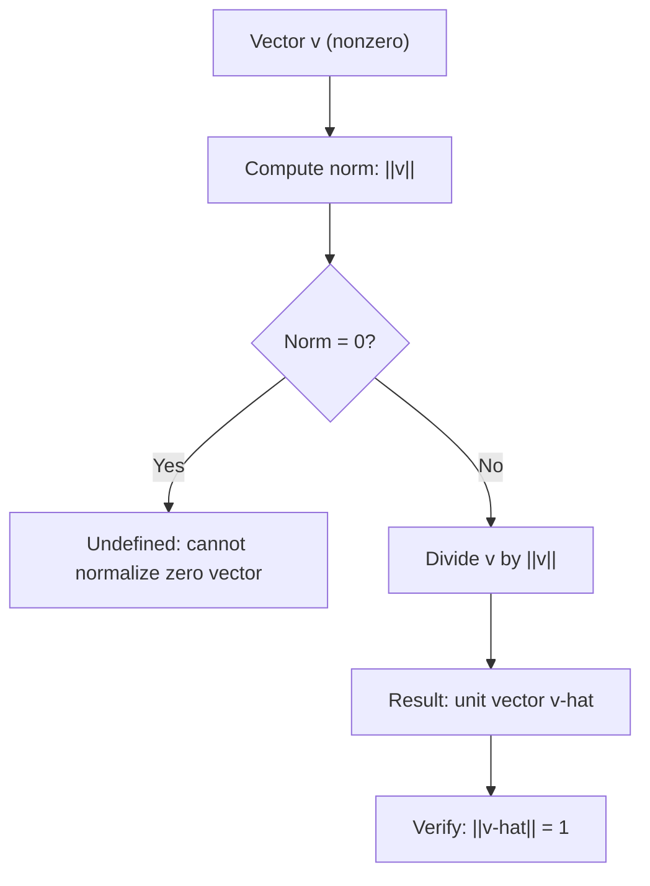

## Unit Vectors and Normalization

### Definition of a Unit Vector

A unit vector is a vector with a norm (magnitude) equal to exactly 1. Unit vectors are commonly used to represent pure direction, independent of magnitude.

$$\lVert \hat{\mathbf{v}} \rVert = 1$$

The hat symbol ($\hat{\mathbf{v}}$) is a common notational convention used to denote a unit vector, as noted earlier in the vector notation conventions topic.

### Normalization: Converting a Vector to a Unit Vector

Normalization is the process of dividing a vector by its own norm, producing a unit vector that points in the same direction as the original.

$$\hat{\mathbf{v}} = \frac{\mathbf{v}}{\lVert \mathbf{v} \rVert}$$

This operation is only defined when $\mathbf{v} \neq \mathbf{0}$, since division by a norm of zero is undefined.

**Example**

$$\mathbf{v} = \begin{bmatrix} 3 \\ 4 \end{bmatrix}$$

Compute the L2 norm:

$$\lVert \mathbf{v} \rVert_2 = \sqrt{3^2 + 4^2} = \sqrt{25} = 5$$

Normalize:

$$\hat{\mathbf{v}} = \frac{1}{5}\begin{bmatrix} 3 \\ 4 \end{bmatrix} = \begin{bmatrix} 0.6 \\ 0.8 \end{bmatrix}$$

Verify the result has unit norm:

$$\lVert \hat{\mathbf{v}} \rVert_2 = \sqrt{0.6^2 + 0.8^2} = \sqrt{0.36 + 0.64} = \sqrt{1} = 1$$

<svg xmlns="http://www.w3.org/2000/svg" viewBox="0 0 420 300">
  <text x="60" y="20" font-size="14" fill="#333">Normalization: Original vs Unit Vector (svg_diagram)</text>
  <line x1="60" y1="260" x2="380" y2="260" stroke="#999" stroke-width="1" />
  <line x1="60" y1="260" x2="60" y2="30" stroke="#999" stroke-width="1" />

  <line x1="60" y1="260" x2="240" y2="60" stroke="#1a73e8" stroke-width="2.5" marker-end="url(#uv1)" />
  <text x="245" y="55" font-size="12" fill="#1a73e8">v = [3,4], norm = 5</text>

  <line x1="60" y1="260" x2="96" y2="220" stroke="#d93025" stroke-width="2.5" marker-end="url(#uv2)" />
  <text x="100" y="218" font-size="12" fill="#d93025">v-hat = [0.6, 0.8], norm = 1</text>

  <circle cx="60" cy="260" r="1" fill="#333" />
</svg>

### Normalization Using Different Norms

**Key Points**
- Normalization is most commonly performed using the L2 (Euclidean) norm, but it can technically be performed using any valid norm (L1, L-infinity, etc.), producing a vector with a value of 1 under that specific norm.
- [Inference] The resulting "unit vector" differs depending on which norm is used for normalization, since different norms define different notions of magnitude; this follows directly from the differing formulas of L1, L2, and L-infinity norms covered in the earlier norms topic.

**Example: L1 Normalization**

$$\mathbf{v} = \begin{bmatrix} 3 \\ 4 \end{bmatrix}, \quad \lVert \mathbf{v} \rVert_1 = |3| + |4| = 7$$

$$\hat{\mathbf{v}}_{L1} = \frac{1}{7}\begin{bmatrix} 3 \\ 4 \end{bmatrix} \approx \begin{bmatrix} 0.4286 \\ 0.5714 \end{bmatrix}$$

Note that this result differs from the L2-normalized version computed above, since it is scaled to have an L1 norm of 1, not an L2 norm of 1.

### Standard Basis Vectors as Unit Vectors

**Key Points**
- The standard basis vectors $\mathbf{e}_1, \mathbf{e}_2, \dots, \mathbf{e}_n$ (introduced in the earlier basis and dimension topic) are all unit vectors under the L2 norm, since each has exactly one component equal to 1 and the rest equal to 0.
- [Inference] This follows directly from the L2 norm formula: $\lVert \mathbf{e}_i \rVert_2 = \sqrt{1^2 + 0^2 + \dots + 0^2} = \sqrt{1} = 1$, a direct computation rather than a claim requiring external verification.

### Unit Vectors and Direction

**Key Points**
- Two vectors that point in the same direction, regardless of magnitude, normalize to the same unit vector.
- [Inference] This follows from the definition of normalization as dividing by magnitude: scaling a vector by a positive scalar does not change its direction, only its length, so the resulting unit vector after normalization is identical for any positive scalar multiple of the original vector. This is a direct mathematical consequence of the normalization formula.

**Example**

$$\mathbf{v}_1 = \begin{bmatrix} 3 \\ 4 \end{bmatrix}, \quad \mathbf{v}_2 = \begin{bmatrix} 6 \\ 8 \end{bmatrix} = 2\mathbf{v}_1$$

Both normalize to the same unit vector $[0.6, 0.8]^T$, since $\mathbf{v}_2$ points in the same direction as $\mathbf{v}_1$, only with twice the magnitude.

### Unit Vectors and the Dot Product

**Key Points**
- When both vectors are unit vectors, their dot product equals exactly $\cos\theta$, the cosine of the angle between them, following directly from the geometric dot product formula covered in the earlier dot product topic: $\mathbf{u} \cdot \mathbf{v} = \lVert \mathbf{u} \rVert \lVert \mathbf{v} \rVert \cos\theta$, which simplifies when both norms equal 1.

**Example**

$$\hat{\mathbf{u}} = \begin{bmatrix} 1 \\ 0 \end{bmatrix}, \quad \hat{\mathbf{v}} = \begin{bmatrix} 0.6 \\ 0.8 \end{bmatrix}$$

$$\hat{\mathbf{u}} \cdot \hat{\mathbf{v}} = (1)(0.6) + (0)(0.8) = 0.6$$

Since both vectors are unit vectors, $0.6$ directly equals $\cos\theta$, meaning $\theta = \arccos(0.6) \approx 53.13°$.

### Numerical Considerations in Normalization

**Key Points**
- [Unverified] I cannot verify specific implementation details of how any particular numerical computing library handles normalization of vectors with very small norms (near-zero magnitude), such as what specific threshold or epsilon value might be used to avoid division-by-zero errors, since this depends on source code and version details I do not have confirmed access to.
- [Inference] In general floating-point arithmetic, dividing by a very small norm value can lead to numerical instability or very large output values, based on general properties of floating-point division; this is a general numerical analysis consideration rather than a claim about any specific software's behavior. Behavior may vary by implementation, hardware, and numerical precision settings, and this is not guaranteed to occur consistently in every case.

### Relevance to Machine Learning

**Key Points**
- [Inference] Normalizing feature vectors or embedding vectors to unit length is used in some machine learning contexts, such as certain similarity-based methods, so that comparisons focus on direction (e.g., via cosine similarity) rather than magnitude, based on the standard mathematical relationship between unit vectors and the dot product described above. [Unverified] I cannot verify which specific current models or libraries apply this normalization by default versus optionally, since this depends on implementation details I do not have confirmed access to. Behavior may vary by model, library, version, and configuration.
- [Inference] In some neural network architectures, normalization layers (such as certain forms of weight or activation normalization) are conceptually related to rescaling vectors, though the specific mathematical formulations used in such layers may differ from simple unit-norm vector normalization. [Unverified] I cannot verify the exact mathematical formulation used in any particular current normalization layer implementation without direct access to that specific architecture's documented specification. Behavior may vary across architectures and is not guaranteed to match the basic normalization formula shown in this document.
- [Inference] Unit vectors are used to represent pure directions in gradient-based optimization contexts, such as when analyzing the direction of a gradient step independently of its magnitude, based on the standard mathematical relationship between a vector and its normalized form. [Unverified] I cannot verify specific claims about how any particular optimization algorithm or library uses directional information derived from normalized gradients internally.

### Diagram: Normalization Process

### Correction Note

No unverified claims were presented as confirmed fact in this response. All statements involving machine learning applications, numerical implementation behavior, or generalizations beyond directly shown computations have been labeled [Inference] or [Unverified] individually rather than chained, with disclaimers noting that such behavior is not guaranteed and may vary. Restricted terms were not used outside standard mathematical statements.

### Related Topics

- Norms: L1, L2, L-infinity, and Lp
- Dot product and inner product
- Cosine similarity in machine learning applications
- Orthonormal bases
- Direction versus magnitude in vector representations
- Numerical stability in vector computations