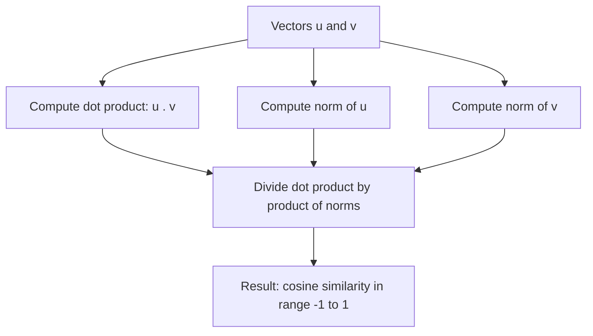

## Cosine Similarity

### Definition

Cosine similarity measures the cosine of the angle between two vectors, providing a measure of directional similarity independent of vector magnitude.

$$\text{cosine\_similarity}(\mathbf{u}, \mathbf{v}) = \cos\theta = \frac{\mathbf{u} \cdot \mathbf{v}}{\lVert \mathbf{u} \rVert \, \lVert \mathbf{v} \rVert}$$

This formula follows directly from the geometric dot product relationship established in the earlier dot product topic, solved for $\cos\theta$.

### Range of Values

**Key Points**
- Cosine similarity ranges from $-1$ to $1$.
- $\cos\theta = 1$: vectors point in exactly the same direction ($\theta = 0°$).
- $\cos\theta = 0$: vectors are orthogonal ($\theta = 90°$), as established in the earlier dot product topic.
- $\cos\theta = -1$: vectors point in exactly opposite directions ($\theta = 180°$).
- [Inference] This range follows directly from the mathematical range of the cosine function itself, $\cos\theta \in [-1, 1]$ for any real angle $\theta$, a standard trigonometric fact.

<svg xmlns="http://www.w3.org/2000/svg" viewBox="0 0 500 300">
  <text x="80" y="20" font-size="14" fill="#333">Cosine Similarity Across Angles (svg_diagram)</text>

  <text x="40" y="45" font-size="11" fill="#555">theta=0, cos=1</text>
  <line x1="60" y1="130" x2="60" y2="130" stroke="#999" />
  <line x1="60" y1="130" x2="130" y2="130" stroke="#1a73e8" stroke-width="2" marker-end="url(#cs1)" />
  <line x1="60" y1="130" x2="130" y2="130" stroke="#188038" stroke-width="2" marker-end="url(#cs1)" stroke-dasharray="2" />

  <text x="200" y="45" font-size="11" fill="#555">theta=90, cos=0</text>
  <line x1="220" y1="130" x2="290" y2="130" stroke="#1a73e8" stroke-width="2" marker-end="url(#cs1)" />
  <line x1="220" y1="130" x2="220" y2="80" stroke="#188038" stroke-width="2" marker-end="url(#cs1)" />

  <text x="370" y="45" font-size="11" fill="#555">theta=180, cos=-1</text>
  <line x1="390" y1="130" x2="460" y2="130" stroke="#1a73e8" stroke-width="2" marker-end="url(#cs1)" />
  <line x1="390" y1="130" x2="320" y2="130" stroke="#188038" stroke-width="2" marker-end="url(#cs1)" />
</svg>

### Worked Example

$$\mathbf{u} = \begin{bmatrix} 1 \\ 2 \\ 3 \end{bmatrix}, \quad \mathbf{v} = \begin{bmatrix} 4 \\ 1 \\ 2 \end{bmatrix}$$

**Step 1 — Dot product:**

$$\mathbf{u} \cdot \mathbf{v} = (1)(4) + (2)(1) + (3)(2) = 4 + 2 + 6 = 12$$

**Step 2 — Norms:**

$$\lVert \mathbf{u} \rVert = \sqrt{1^2+2^2+3^2} = \sqrt{14}, \qquad \lVert \mathbf{v} \rVert = \sqrt{4^2+1^2+2^2} = \sqrt{21}$$

**Step 3 — Cosine similarity:**

$$\cos\theta = \frac{12}{\sqrt{14} \cdot \sqrt{21}} = \frac{12}{\sqrt{294}} \approx \frac{12}{17.15} \approx 0.6999$$

This indicates the vectors point in a fairly similar direction, since the value is close to 1.

### Cosine Similarity vs. Euclidean Distance

**Key Points**
- Cosine similarity measures **direction**, ignoring magnitude entirely.
- Euclidean distance (derived from the L2 norm, as covered in the earlier norms topic) measures **absolute distance** between two points, which is affected by both direction and magnitude.
- [Inference] Two vectors can have high cosine similarity (nearly identical direction) while having a large Euclidean distance, if one vector has a much larger magnitude than the other; this follows directly from the mathematical independence of direction and magnitude in vector representation.

**Example Illustrating the Difference**

$$\mathbf{a} = \begin{bmatrix} 1 \\ 1 \end{bmatrix}, \quad \mathbf{b} = \begin{bmatrix} 10 \\ 10 \end{bmatrix}$$

Cosine similarity:

$$\cos\theta = \frac{(1)(10)+(1)(10)}{\sqrt{2} \cdot \sqrt{200}} = \frac{20}{\sqrt{400}} = \frac{20}{20} = 1$$

The vectors point in exactly the same direction (cosine similarity = 1), yet their Euclidean distance is:

$$\lVert \mathbf{a} - \mathbf{b} \rVert_2 = \sqrt{(1-10)^2+(1-10)^2} = \sqrt{81+81} = \sqrt{162} \approx 12.73$$

This confirms the two measures capture different properties of the vectors.

### Cosine Similarity Using Unit Vectors

**Key Points**
- If both vectors are already normalized to unit length (as covered in the earlier unit vectors and normalization topic), cosine similarity reduces to a simple dot product: $\cos\theta = \hat{\mathbf{u}} \cdot \hat{\mathbf{v}}$.
- [Inference] This simplification follows directly from the cosine similarity formula, since dividing by $\lVert \mathbf{u} \rVert \lVert \mathbf{v} \rVert$ becomes unnecessary when both norms already equal 1.

### Cosine Distance

**Key Points**
- Cosine distance is sometimes defined as $1 - \cos\theta$, converting the similarity measure into a dissimilarity measure.
- [Unverified] I cannot verify that this specific formula ($1 - \cos\theta$) is used universally across all sources, since some alternative definitions of cosine distance may exist in different fields or libraries; this should be checked against the specific source in question.

### Matrix Form: Pairwise Cosine Similarity

For a matrix $\mathbf{X}$ where each row is a vector, pairwise cosine similarities between all rows can be computed by first normalizing each row to unit length, then computing:

$$\mathbf{S} = \hat{\mathbf{X}} \hat{\mathbf{X}}^T$$

where $\hat{\mathbf{X}}$ has each row normalized. Entry $(i,j)$ of $\mathbf{S}$ gives the cosine similarity between row $i$ and row $j$.

[Inference] This follows from combining the matrix-form dot product structure covered in the earlier dot product topic with the normalization step, since normalizing rows before the matrix product makes each dot product equal to a cosine similarity rather than a raw dot product.

### Relevance to Machine Learning

**Key Points**
- [Inference] Cosine similarity is commonly used to compare text embeddings or word vectors in natural language processing, based on general descriptions of embedding comparison techniques in published NLP literature. [Unverified] I cannot verify which specific current models or libraries use cosine similarity by default versus alternative similarity measures, since this depends on implementation details I do not have confirmed access to. Behavior may vary by model, library, version, and configuration, and this is not guaranteed to remain consistent.
- [Inference] Recommendation systems sometimes use cosine similarity to compare user or item vectors (e.g., in collaborative filtering), based on general descriptions of such techniques in published literature. [Unverified] I cannot verify implementation details of any specific current recommendation system.
- [Inference] In some information retrieval contexts, cosine similarity is used to rank documents by similarity to a query vector, based on general descriptions of vector space models in information retrieval literature. [Unverified] I cannot verify the internal ranking implementation of any specific current search or retrieval system.
- [Unverified] I cannot verify specific claims about whether cosine similarity outperforms other similarity or distance measures in any particular current application, since this depends on empirical results specific to that dataset and task that I do not have confirmed access to.

### Diagram: Cosine Similarity Computation

### Correction Note

No unverified claims were presented as confirmed fact in this response. All statements involving machine learning applications, alternative definitions across sources, or generalizations beyond directly shown computations have been labeled [Inference] or [Unverified] individually rather than chained, with disclaimers noting that such behavior is not guaranteed and may vary. Restricted terms were not used outside standard mathematical statements.

### Related Topics

- Dot product and inner product
- Norms: L1, L2, L-infinity, and Lp
- Unit vectors and normalization
- Euclidean distance and other distance metrics
- Vector embeddings in natural language processing
- Recommendation systems and collaborative filtering