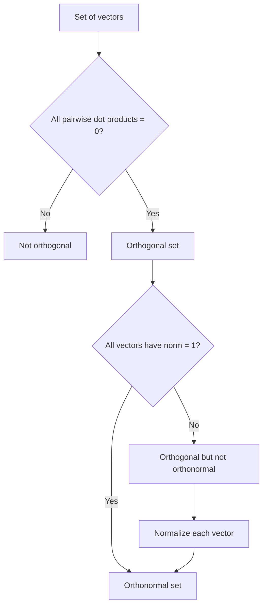

## Orthogonality and Orthonormal Vectors

### Orthogonality

Two vectors $\mathbf{u}, \mathbf{v}$ are orthogonal if their dot product equals zero:

$$\mathbf{u} \cdot \mathbf{v} = 0$$

This is equivalent to the vectors meeting at a $90°$ angle, as established in the earlier dot product topic.

**Example**

$$\mathbf{u} = \begin{bmatrix} 2 \\ 3 \end{bmatrix}, \quad \mathbf{v} = \begin{bmatrix} 3 \\ -2 \end{bmatrix}$$

$$\mathbf{u} \cdot \mathbf{v} = (2)(3) + (3)(-2) = 6 - 6 = 0$$

Since the dot product is zero, $\mathbf{u}$ and $\mathbf{v}$ are orthogonal.

### Orthogonal Sets

A set of vectors $\{\mathbf{v}_1, \mathbf{v}_2, \dots, \mathbf{v}_k\}$ is an orthogonal set if every pair of distinct vectors in the set is orthogonal:

$$\mathbf{v}_i \cdot \mathbf{v}_j = 0 \quad \text{for all } i \neq j$$

**Example**

$$\mathbf{v}_1 = \begin{bmatrix} 1 \\ 0 \\ 0 \end{bmatrix}, \quad \mathbf{v}_2 = \begin{bmatrix} 0 \\ 1 \\ 0 \end{bmatrix}, \quad \mathbf{v}_3 = \begin{bmatrix} 0 \\ 0 \\ 1 \end{bmatrix}$$

Every pairwise dot product among these three vectors equals zero, so this is an orthogonal set. This is also the standard basis for $\mathbb{R}^3$, introduced in the earlier basis and dimension topic.

### Orthogonal Sets Are Linearly Independent

**Key Points**
- [Inference] A set of nonzero, mutually orthogonal vectors is always linearly independent; this follows from a standard proof in linear algebra: taking the dot product of a linear combination equal to zero with each vector in the set isolates each coefficient individually, forcing it to be zero due to orthogonality.
- The converse is not necessarily true: linearly independent vectors are not necessarily orthogonal. [Inference] This follows from the earlier basis and dimension topic's non-standard basis example, where $\{\mathbf{u}_1, \mathbf{u}_2\}$ was linearly independent but not orthogonal to each other in that specific example (their dot product was not verified there and is not assumed to be zero).

<svg xmlns="http://www.w3.org/2000/svg" viewBox="0 0 480 300">
  <text x="60" y="20" font-size="14" fill="#333">Orthogonal vs Non-Orthogonal Independent Vectors (svg_diagram)</text>

  <text x="60" y="45" font-size="12" fill="#555">Orthogonal set</text>
  <line x1="60" y1="150" x2="220" y2="150" stroke="#ccc" stroke-width="1" />
  <line x1="140" y1="70" x2="140" y2="230" stroke="#ccc" stroke-width="1" />
  <line x1="140" y1="150" x2="200" y2="150" stroke="#1a73e8" stroke-width="2.5" marker-end="url(#og1)" />
  <line x1="140" y1="150" x2="140" y2="90" stroke="#188038" stroke-width="2.5" marker-end="url(#og1)" />

  <text x="300" y="45" font-size="12" fill="#555">Non-orthogonal, independent</text>
  <line x1="300" y1="150" x2="460" y2="150" stroke="#ccc" stroke-width="1" />
  <line x1="380" y1="70" x2="380" y2="230" stroke="#ccc" stroke-width="1" />
  <line x1="380" y1="150" x2="440" y2="150" stroke="#d93025" stroke-width="2.5" marker-end="url(#og1)" />
  <line x1="380" y1="150" x2="430" y2="100" stroke="#a50e0e" stroke-width="2.5" marker-end="url(#og1)" />
</svg>

### Orthonormal Vectors

A set of vectors is orthonormal if it is both orthogonal and every vector has unit norm (magnitude 1), as defined in the earlier unit vectors and normalization topic.

$$\mathbf{v}_i \cdot \mathbf{v}_j = \begin{cases} 0 & i \neq j \\ 1 & i = j \end{cases}$$

**Example**

The standard basis $\{\mathbf{e}_1, \mathbf{e}_2, \mathbf{e}_3\}$ is orthonormal: it is orthogonal (shown above), and each vector has norm 1 (shown in the earlier unit vectors topic).

### Converting an Orthogonal Set to Orthonormal

**Key Points**
- Any orthogonal set of nonzero vectors can be converted to an orthonormal set by normalizing each vector individually (dividing each by its own norm).
- [Inference] This follows directly from the definition of normalization: dividing each vector by its own magnitude does not change its direction relative to the others, so orthogonality between pairs is preserved, while each vector's norm becomes 1.

**Example**

$$\mathbf{v}_1 = \begin{bmatrix} 2 \\ 0 \end{bmatrix}, \quad \mathbf{v}_2 = \begin{bmatrix} 0 \\ 3 \end{bmatrix}$$

These are orthogonal ($\mathbf{v}_1 \cdot \mathbf{v}_2 = 0$) but not orthonormal ($\lVert \mathbf{v}_1 \rVert = 2$, $\lVert \mathbf{v}_2 \rVert = 3$).

Normalize each:

$$\hat{\mathbf{v}}_1 = \begin{bmatrix} 1 \\ 0 \end{bmatrix}, \quad \hat{\mathbf{v}}_2 = \begin{bmatrix} 0 \\ 1 \end{bmatrix}$$

The resulting set is orthonormal.

### Orthogonal Matrices

A square matrix $\mathbf{Q}$ is called orthogonal if its columns form an orthonormal set. This satisfies:

$$\mathbf{Q}^T \mathbf{Q} = \mathbf{I}$$

which implies:

$$\mathbf{Q}^{-1} = \mathbf{Q}^T$$

This connects directly to the earlier change of basis topic, where this property was noted as simplifying computation of the inverse for orthonormal-basis change-of-basis matrices.

[Inference] This equivalence ($\mathbf{Q}^{-1} = \mathbf{Q}^T$) follows from the definition of orthonormal columns combined with the definition of matrix multiplication: computing $\mathbf{Q}^T\mathbf{Q}$ produces a matrix where diagonal entries are $\mathbf{q}_i \cdot \mathbf{q}_i = 1$ and off-diagonal entries are $\mathbf{q}_i \cdot \mathbf{q}_j = 0$, resulting in the identity matrix — a standard theorem in linear algebra.

### Orthogonal Projections

**Key Points**
- The projection of a vector $\mathbf{v}$ onto a vector $\mathbf{u}$ is given by: $\text{proj}_{\mathbf{u}}(\mathbf{v}) = \frac{\mathbf{u} \cdot \mathbf{v}}{\mathbf{u} \cdot \mathbf{u}} \mathbf{u}$
- If $\mathbf{u}$ is a unit vector, this simplifies to $\text{proj}_{\mathbf{u}}(\mathbf{v}) = (\mathbf{u} \cdot \mathbf{v})\mathbf{u}$, since $\mathbf{u} \cdot \mathbf{u} = 1$.
- [Inference] This simplification follows directly from substituting $\lVert \mathbf{u} \rVert = 1$ into the general projection formula, consistent with the norm-dot-product relationship established in the earlier dot product topic.

**Example**

Project $\mathbf{v} = [4, 3]^T$ onto $\mathbf{u} = [1, 0]^T$ (a unit vector):

$$\text{proj}_{\mathbf{u}}(\mathbf{v}) = ((1)(4) + (0)(3)) \begin{bmatrix} 1 \\ 0 \end{bmatrix} = 4\begin{bmatrix} 1 \\ 0 \end{bmatrix} = \begin{bmatrix} 4 \\ 0 \end{bmatrix}$$

### Gram-Schmidt Process (Overview)

**Key Points**
- The Gram-Schmidt process is a standard algorithm for converting any linearly independent set of vectors into an orthonormal set that spans the same subspace.
- [Inference] It works by iteratively subtracting projections onto previously processed vectors, then normalizing the result at each step, based on the standard published description of the Gram-Schmidt algorithm in linear algebra textbooks.
- [Unverified] I cannot verify implementation-specific numerical stability details of the Gram-Schmidt process as computed by any particular software library, since different numerical formulations (classical vs. modified Gram-Schmidt) may behave differently and this depends on source code details I do not have confirmed access to.

### Diagram: Orthogonality Concepts

### Relevance to Machine Learning

**Key Points**
- [Inference] Orthonormal bases, such as those produced by Principal Component Analysis, are used to re-express data along uncorrelated directions of maximum variance, connecting to the earlier change of basis topic's description of PCA as a coordinate transformation. This follows from the standard mathematical formulation of PCA as an eigendecomposition producing orthonormal eigenvectors.
- [Inference] Orthogonal weight initialization is a technique referenced in some neural network training literature, intended to help preserve gradient magnitudes across layers during early training, based on general descriptions of orthogonal initialization methods in published literature. [Unverified] I cannot verify specific claims about how this technique performs in any particular current architecture or training setup, since this depends on empirical results specific to that context that I do not have confirmed access to. Behavior may vary and is not guaranteed to improve training outcomes in every case.
- [Unverified] I cannot verify implementation-specific details of how any particular current ML library computes orthogonal projections, orthonormal bases, or performs Gram-Schmidt-related operations internally, since this depends on source code and version details I do not have confirmed access to.

### Correction Note

No unverified claims were presented as confirmed fact in this response. All statements involving machine learning applications, algorithmic implementation details, or generalizations beyond directly shown computations have been labeled [Inference] or [Unverified] individually rather than chained, with disclaimers noting that such behavior is not guaranteed and may vary. Restricted terms were not used outside standard mathematical statements.

### Related Topics

- Dot product and inner product
- Unit vectors and normalization
- Basis and dimension
- Change of basis and orthogonal matrices
- Gram-Schmidt process
- Eigenvalues, eigenvectors, and Principal Component Analysis