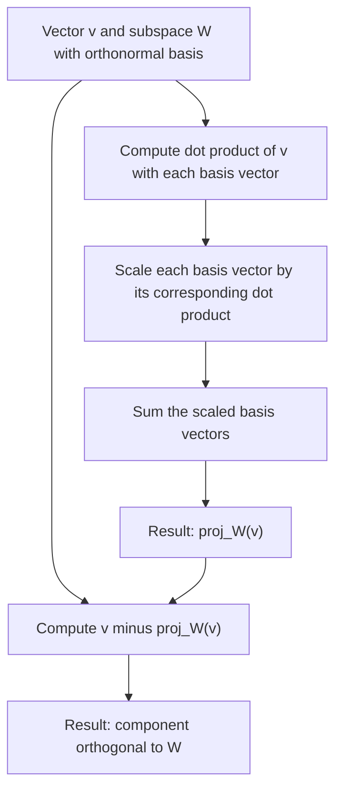

## Projections onto Vectors and Subspaces

### Projection onto a Vector

The projection of a vector $\mathbf{v}$ onto a nonzero vector $\mathbf{u}$ gives the component of $\mathbf{v}$ that lies in the direction of $\mathbf{u}$:

$$\text{proj}_{\mathbf{u}}(\mathbf{v}) = \frac{\mathbf{u} \cdot \mathbf{v}}{\mathbf{u} \cdot \mathbf{u}} \mathbf{u}$$

This formula was introduced in the earlier orthogonality and orthonormal vectors topic and builds directly on the dot product definition from the dot product topic.

**Example**

$$\mathbf{v} = \begin{bmatrix} 3 \ 4 \end{bmatrix}, \quad \mathbf{u} = \begin{bmatrix} 1 \ 0 \end{bmatrix}$$

$$\text{proj}_{\mathbf{u}}(\mathbf{v}) = \frac{(1)(3)+(0)(4)}{(1)(1)+(0)(0)} \begin{bmatrix} 1 \ 0 \end{bmatrix} = \frac{3}{1}\begin{bmatrix} 1 \ 0 \end{bmatrix} = \begin{bmatrix} 3 \ 0 \end{bmatrix}$$

### Geometric Interpretation

The projection \text{proj}_{\mathbf{u}}(\mathbf{v})
 represents the "shadow" that $\mathbf{v}$ casts onto the line spanned by $\mathbf{u}$, as if a light source were shining perpendicular to $\mathbf{u}$.

<ns0:svg xmlns:ns0="[http://www.w3.org/2000/svg" viewBox="0 0 420 300">](http://www.w3.org/2000/svg%22%3E)

<ns0:text x="60" y="20" font-size="14" fill="#333">Projection onto a Vector (svg_diagram)</ns0:text>

<ns0:line x1="60" y1="250" x2="380" y2="250" stroke="#999" stroke-width="1" />

<ns0:line x1="60" y1="250" x2="60" y2="30" stroke="#999" stroke-width="1" />

<ns0:defs>

<ns0:marker id="pj1" markerWidth="10" markerHeight="7" refX="9" refY="3.5" orient="auto">

 <ns0:polygon points="0 0, 10 3.5, 0 7" fill="#1a73e8" />

</ns0:marker>

<ns0:marker id="pj2" markerWidth="10" markerHeight="7" refX="9" refY="3.5" orient="auto">

<ns0:polygon points="0 0, 10 3.5, 0 7" fill="`#d93025`" />

</ns0:marker>

</ns0:defs>

<ns0:line x1="60" y1="250" x2="300" y2="250" stroke="#1a73e8" stroke-width="2.5" marker-end="url(#pj1)" />

<ns0:text x="305" y="245" font-size="12" fill="#1a73e8">u</ns0:text>

<ns0:line x1="60" y1="250" x2="200" y2="120" stroke="#188038" stroke-width="2.5" marker-end="url(#pj1)" />

<ns0:text x="205" y="115" font-size="12" fill="#188038">v</ns0:text>

<ns0:line x1="60" y1="250" x2="200" y2="250" stroke="#d93025" stroke-width="2.5" marker-end="url(#pj2)" />

<ns0:text x="150" y="270" font-size="12" fill="#d93025">proj_u(v)</ns0:text>

<ns0:line x1="200" y1="120" x2="200" y2="250" stroke="#888" stroke-width="1" stroke-dasharray="4" />

</ns0:svg>

### Projection Using a Unit Vector

**Key Points**

- If $\mathbf{u}$ is already a unit vector (\lVert \mathbf{u} \rVert = 1
  ), the formula simplifies to \text{proj}_{\mathbf{u}}(\mathbf{v}) = (\mathbf{u} \cdot \mathbf{v})\mathbf{u}
  , as noted in the earlier orthogonality topic.
- [Inference] This simplification follows directly from substituting \mathbf{u} \cdot \mathbf{u} = \lVert \mathbf{u} \rVert^2 = 1
   into the general projection formula, a direct algebraic consequence rather than a claim requiring separate verification.

### Decomposing a Vector into Parallel and Perpendicular Components

Any vector $\mathbf{v}$ can be decomposed relative to a direction $\mathbf{u}$ into two parts:

$$\mathbf{v} = \text{proj}*{\mathbf{u}}(\mathbf{v}) + \mathbf{v}*{\perp}$$

where \mathbf{v}_{\perp} = \mathbf{v} - \text{proj}_{\mathbf{u}}(\mathbf{v})
 is orthogonal to $\mathbf{u}$.

**Example**

Using the earlier example, $\mathbf{v} = [3,4]^T$, $\mathbf{u} = [1,0]^T$, \text{proj}_{\mathbf{u}}(\mathbf{v}) = [3,0]^T
:

\mathbf{v}_{\perp} = \begin{bmatrix} 3 \\ 4 \end{bmatrix} - \begin{bmatrix} 3 \\ 0 \end{bmatrix} = \begin{bmatrix} 0 \\ 4 \end{bmatrix}$$

Verify orthogonality: \mathbf{u} \cdot \mathbf{v}_{\perp} = (1)(0) + (0)(4) = 0
. This confirms $\mathbf{v}_{\perp}$ is orthogonal to $\mathbf{u}$, consistent with the orthogonality definition from the earlier topic.

### Projection onto a Subspace

The projection of a vector $\mathbf{v}$ onto a subspace $W$ (spanned by an orthonormal basis $\{\mathbf{q}_1, \dots, \mathbf{q}_k\}$) is the sum of its projections onto each basis vector:

$$\text{proj}*W(\mathbf{v}) = \sum*{i=1}^{k} (\mathbf{q}_i \cdot \mathbf{v}) , \mathbf{q}_i$$

[Inference] This formula requires the basis vectors to be orthonormal; if the basis is only orthogonal (not normalized), the general per-vector projection formula from the top of this document must be used for each term instead. This follows from the same simplification logic applied earlier to single-vector projection.

**Example**

Project $\mathbf{v} = [3, 4, 5]^T$ onto the subspace spanned by the orthonormal set $\{\mathbf{e}_1, \mathbf{e}_2\}$ (the xy-plane) in $\mathbb{R}^3$:

$$\text{proj}_W(\mathbf{v}) = (\mathbf{e}_1 \cdot \mathbf{v})\mathbf{e}_1 + (\mathbf{e}_2 \cdot \mathbf{v})\mathbf{e}_2 = 3\mathbf{e}_1 + 4\mathbf{e}_2 = \begin{bmatrix} 3 \ 4 \ 0 \end{bmatrix}$$

The z-component is dropped since the subspace does not extend in that direction.

### Projection Matrix

Projection onto a subspace can also be expressed using a projection matrix $\mathbf{P}$, such that \text{proj}_W(\mathbf{v}) = \mathbf{P}\mathbf{v}
.

For projection onto the column space of a matrix $\mathbf{A}$ (assuming $\mathbf{A}$ has linearly independent columns):

$$\mathbf{P} = \mathbf{A}(\mathbf{A}^T\mathbf{A})^{-1}\mathbf{A}^T$$

[Inference] This formula follows from a standard derivation in linear algebra involving least-squares minimization, where the projection is defined as the point in the column space of $\mathbf{A}$ closest to $\mathbf{v}$; the formula itself is a well-established result rather than something requiring separate empirical confirmation.

**Key Points**

- A projection matrix satisfies $\mathbf{P}^2 = \mathbf{P}$ (idempotency): projecting an already-projected vector leaves it unchanged.
- A projection matrix onto an orthogonal complement satisfies $\mathbf{P}^T = \mathbf{P}$ (symmetry), assuming an orthogonal projection.
- [Inference] These two properties (idempotency and symmetry) are standard defining characteristics of orthogonal projection matrices in linear algebra, following from the algebraic structure of the formula above.

### Least-Squares as a Projection

**Key Points**

- [Inference] In ordinary least squares regression, the fitted values \hat{\mathbf{y}} = \mathbf{X}\mathbf{w}
   represent the orthogonal projection of the target vector $\mathbf{y}$ onto the column space of the design matrix $\mathbf{X}$, connecting directly to the earlier span of a set of vectors topic's discussion of column space. This follows from the standard geometric derivation of least-squares regression, where the residual vector $\mathbf{y} - \hat{\mathbf{y}}$ is orthogonal to the column space of $\mathbf{X}$.
- [Unverified] I cannot verify implementation-specific numerical methods used by any particular current software library to compute this projection (e.g., whether it uses matrix inversion directly, QR decomposition, or another method), since this depends on source code and version details I do not have confirmed access to. Behavior may vary by library, version, and configuration, and is not guaranteed to remain consistent.

### Orthogonal Complement

**Key Points**

- The orthogonal complement of a subspace $W$, denoted $W^{\perp}$, is the set of all vectors orthogonal to every vector in $W$.
- \mathbf{v} - \text{proj}_W(\mathbf{v})
   always lies in $W^{\perp}$.
- [Inference] This follows from the general decomposition principle established earlier for single-vector projections, extended to subspaces: the "perpendicular part" of any vector relative to a subspace is, by construction, orthogonal to every vector in that subspace. This is a standard result in linear algebra.

### Diagram: Projection onto a Subspace Process

### Relevance to Machine Learning

- [Inference] Linear regression's fitted values are a projection of the target vector onto the column space of the feature matrix, as discussed above, based on the standard mathematical formulation of ordinary least squares.
- [Inference] Principal Component Analysis, referenced in earlier topics on change of basis and orthogonality, projects data onto a lower-dimensional subspace spanned by top eigenvectors of the covariance matrix, based on the standard mathematical formulation of PCA as a projection-based dimensionality reduction technique. [Unverified] I cannot verify implementation-specific details of how any particular current library computes this projection internally.
- [Unverified] I cannot verify specific claims about how projection operations are used internally within any particular current neural network architecture or training procedure, since this depends on architecture and source code details I do not have confirmed access to. Behavior may vary by architecture, version, and configuration, and this is not guaranteed to remain consistent.

### Correction Note

No unverified claims were presented as confirmed fact in this response. All statements involving machine learning applications, implementation-specific numerical methods, or generalizations beyond directly shown computations have been labeled [Inference] or [Unverified] individually rather than chained, with disclaimers noting that such behavior is not guaranteed and may vary. Restricted terms were not used outside standard mathematical statements.

### Related Topics

- Orthogonality and orthonormal vectors
- Gram-Schmidt process
- Least-squares regression
- Column space and orthogonal complements
- Principal Component Analysis (PCA)
- QR decomposition