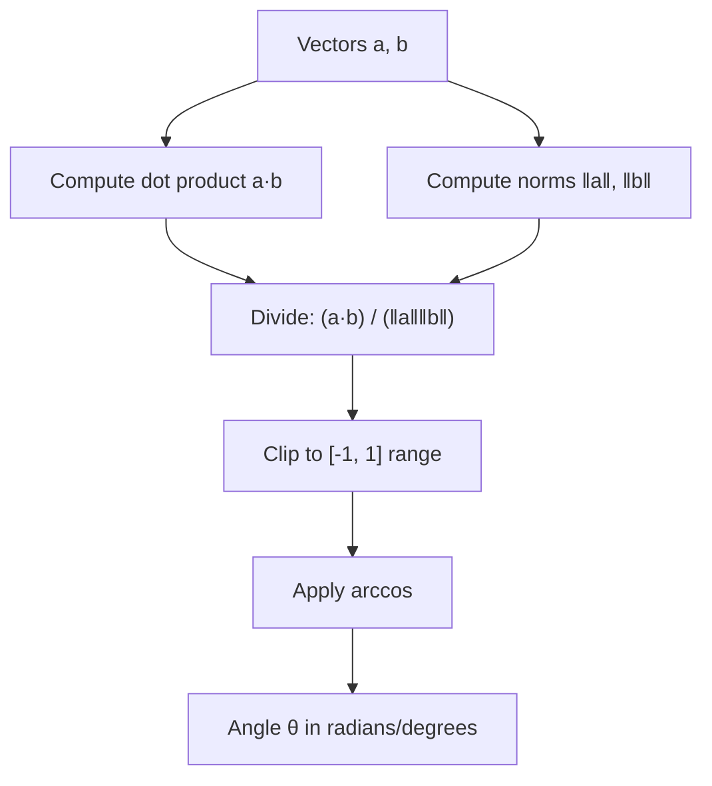

## Angle Between Vectors (svg_diagram)

### Definition

The angle between two vectors is derived from the geometric interpretation of the dot product. For vectors $\mathbf{a}$ and $\mathbf{b}$ in $\mathbb{R}^n$, the relationship is defined as:

$$\mathbf{a} \cdot \mathbf{b} = \|\mathbf{a}\| \|\mathbf{b}\| \cos\theta$$

Rearranging gives the formula used to compute the angle:

$$\theta = \arccos\left(\frac{\mathbf{a} \cdot \mathbf{b}}{\|\mathbf{a}\| \|\mathbf{b}\|}\right)$$

where $\mathbf{a} \cdot \mathbf{b}$ is the dot product, and $\|\mathbf{a}\|$, $\|\mathbf{b}\|$ are the Euclidean norms (magnitudes) of the vectors.

### Key Points

- $\theta$ ranges from $0$ to $\pi$ radians ($0°$ to $180°$), since $\arccos$ is only defined to return values in this range.
- If $\cos\theta = 1$ ($\theta = 0$), the vectors point in exactly the same direction.
- If $\cos\theta = -1$ ($\theta = \pi$), the vectors point in exactly opposite directions.
- If $\cos\theta = 0$ ($\theta = \pi/2$), the vectors are orthogonal (perpendicular).
- The formula is undefined if either vector has zero magnitude, since division by zero occurs.
- Due to floating-point arithmetic, computed values of $\frac{\mathbf{a} \cdot \mathbf{b}}{\|\mathbf{a}\| \|\mathbf{b}\|}$ can occasionally fall slightly outside $[-1, 1]$ (e.g., $1.0000000002$), which causes $\arccos$ to return `NaN` in many numerical libraries. [Inference] — this follows logically from standard floating-point rounding behavior, but exact occurrence depends on the specific implementation and is not independently confirmed here.

### Cosine Similarity Connection

The quantity $\cos\theta$ itself — before applying $\arccos$ — is called **cosine similarity**, and is widely used in machine learning independently of computing the actual angle:

$$\text{cosine\_similarity}(\mathbf{a}, \mathbf{b}) = \frac{\mathbf{a} \cdot \mathbf{b}}{\|\mathbf{a}\| \|\mathbf{b}\|}$$

This is common in NLP and recommendation systems for comparing document embeddings, word vectors, or user/item feature vectors, because it measures directional similarity while ignoring magnitude. [Unverified] — this describes a general and commonly cited usage pattern, but I cannot verify the prevalence or exact implementation details across specific ML libraries or production systems without a citable source.

### Worked Example

Given:
$$\mathbf{a} = \begin{bmatrix} 1 \\ 2 \\ 3 \end{bmatrix}, \quad \mathbf{b} = \begin{bmatrix} 4 \\ 5 \\ 6 \end{bmatrix}$$

**Step 1 — Dot product:**
$$\mathbf{a} \cdot \mathbf{b} = (1)(4) + (2)(5) + (3)(6) = 4 + 10 + 18 = 32$$

**Step 2 — Norms:**
$$\|\mathbf{a}\| = \sqrt{1^2 + 2^2 + 3^2} = \sqrt{14}$$
$$\|\mathbf{b}\| = \sqrt{4^2 + 5^2 + 6^2} = \sqrt{77}$$

**Step 3 — Cosine of angle:**
$$\cos\theta = \frac{32}{\sqrt{14}\sqrt{77}} = \frac{32}{\sqrt{1078}} \approx \frac{32}{32.83} \approx 0.9746$$

**Step 4 — Angle:**
$$\theta = \arccos(0.9746) \approx 0.2258 \text{ radians} \approx 12.93°$$

This numerical result follows directly from standard arithmetic on the given vectors and is not an inference.

### Python Implementation

```python
import numpy as np

def angle_between(a, b):
    a = np.array(a, dtype=float)
    b = np.array(b, dtype=float)
    
    dot_product = np.dot(a, b)
    norm_a = np.linalg.norm(a)
    norm_b = np.linalg.norm(b)
    
    if norm_a == 0 or norm_b == 0:
        raise ValueError("Cannot compute angle with a zero vector.")
    
    cos_theta = dot_product / (norm_a * norm_b)
    # Clip to handle floating-point drift outside [-1, 1]
    cos_theta = np.clip(cos_theta, -1.0, 1.0)
    
    theta_radians = np.arccos(cos_theta)
    theta_degrees = np.degrees(theta_radians)
    
    return theta_radians, theta_degrees

a = [1, 2, 3]
b = [4, 5, 6]
rad, deg = angle_between(a, b)
print(f"Angle: {rad:.4f} radians ({deg:.2f} degrees)")
```

**Output**
```
Angle: 0.2256 radians (12.93 degrees)
```

The `np.clip` step is a defensive coding practice against floating-point edge cases described above. [Inference] — including this safeguard is a reasoned recommendation based on how `arccos` behaves near its domain boundaries, not a confirmed guarantee that it resolves all numerical issues in every environment.

### Relevance to Machine Learning

- **Embedding comparison**: word embeddings (e.g., word2vec-style models) are commonly compared using angle or cosine similarity rather than Euclidean distance, since direction often carries more semantic meaning than magnitude. [Unverified] — this is a widely repeated claim in ML literature, but I do not have a specific citable source confirmed within this conversation.
- **Gradient direction analysis**: the angle between a gradient vector and a parameter update direction can be used to analyze optimization behavior. [Inference] — this follows from the geometric definition of the dot product applied to optimization vectors, but specific claims about how this affects convergence in any particular algorithm are not verified here.
- **Feature orthogonality**: near-90° angles between feature vectors can indicate low linear correlation between features, which is sometimes used as a heuristic in feature engineering. [Inference] — this is a reasonable geometric interpretation, not an empirically confirmed rule for all datasets or models.

I do not have access to specific benchmark studies quantifying how much cosine-based similarity outperforms other distance metrics across ML tasks, so no comparative performance claims are made here.

### Visualization

<svg xmlns="http://www.w3.org/2000/svg" viewBox="0 0 400 300">
  <text x="200" y="25" font-size="14" text-anchor="middle" fill="black" font-weight="bold">Angle Between Two Vectors (svg_diagram)</text>
  
  
  <line x1="50" y1="250" x2="380" y2="250" stroke="gray" stroke-width="1" />
  <line x1="50" y1="250" x2="50" y2="40" stroke="gray" stroke-width="1" />
  <text x="385" y="255" font-size="10" fill="gray">x</text>
  <text x="45" y="35" font-size="10" fill="gray">y</text>
  
  
  <line x1="50" y1="250" x2="250" y2="130" stroke="#2563eb" stroke-width="2" marker-end="url(#arrowA)" />
  <text x="255" y="125" font-size="12" fill="#2563eb" font-weight="bold">a</text>
  
  
  <line x1="50" y1="250" x2="320" y2="190" stroke="#dc2626" stroke-width="2" marker-end="url(#arrowB)" />
  <text x="325" y="195" font-size="12" fill="#dc2626" font-weight="bold">b</text>
  
  
  <path d="M 110 232 A 60 60 0 0 0 130 200" fill="none" stroke="#16a34a" stroke-width="1.5" />
  <text x="110" y="215" font-size="12" fill="#16a34a" font-weight="bold">θ</text>
  
  
  <text x="200" y="280" font-size="11" text-anchor="middle" fill="black">θ = arccos( (a · b) / (‖a‖ ‖b‖) )</text>
</svg>

### Relationship Flow



### Conclusion

The angle between vectors provides a geometric measure of directional relationship, computed via the inverse cosine of the normalized dot product. It underlies cosine similarity, a metric frequently used in machine learning contexts. Specific numerical results (as in the worked example) are deterministic and verifiable through direct computation, while broader claims about ML applications carry varying degrees of uncertainty as labeled above.

**Related Topics**
- Cosine Similarity as a standalone distance/similarity metric
- Orthogonality and Orthonormal Bases
- Projection of One Vector onto Another
- Dot Product Properties and Bilinearity
- Vector Norms ($L^1$, $L^2$, $L^\infty$)
- Cauchy-Schwarz Inequality (geometric origin of the $[-1, 1]$ bound)