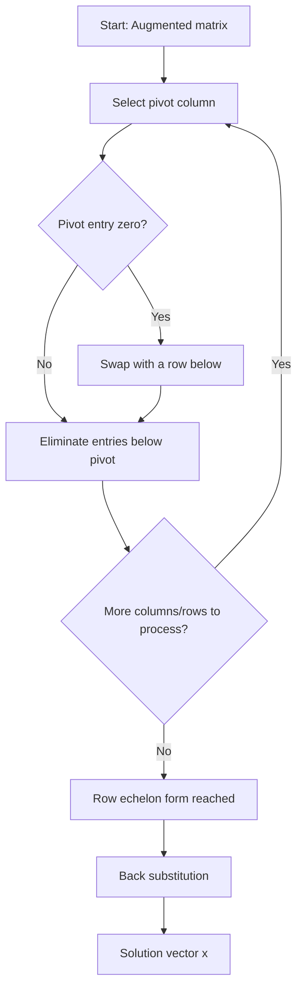

## Gaussian Elimination

### Definition

Gaussian elimination is a systematic algorithm for solving systems of linear equations by transforming the augmented matrix $[A \mid \mathbf{b}]$ into row echelon form using a sequence of elementary row operations. This is a standard, provable procedure from linear algebra, not an inference.

### Elementary Row Operations

Three operations are permitted, each of which preserves the solution set of the system:

1. **Row swap**: interchange two rows.
2. **Row scaling**: multiply a row by a nonzero scalar.
3. **Row addition**: add a multiple of one row to another row.

These operations are standard, provable to preserve solution sets, since each is reversible and corresponds to a valid algebraic manipulation of the original equations.

### Row Echelon Form

A matrix is in **row echelon form** if:

- All nonzero rows are above any all-zero rows.
- The leading entry (pivot) of each nonzero row is strictly to the right of the pivot in the row above it.
- All entries below a pivot are zero.

This is a standard, provable definition in linear algebra.

**Example of row echelon form**

$$\begin{pmatrix} 2 & 3 & 1 \\ 0 & 1 & 4 \\ 0 & 0 & 5 \end{pmatrix}$$

### Worked Example

Solve the system:

$$x_1 + 2x_2 + x_3 = 4$$
$$2x_1 + 5x_2 + 3x_3 = 10$$
$$x_1 + 3x_2 + 4x_3 = 7$$

**Step 1 — Augmented matrix**

$$\left(\begin{array}{ccc|c} 1 & 2 & 1 & 4 \\ 2 & 5 & 3 & 10 \\ 1 & 3 & 4 & 7 \end{array}\right)$$

**Step 2 — Eliminate below the first pivot**

$R_2 \leftarrow R_2 - 2R_1$, $R_3 \leftarrow R_3 - R_1$:

$$\left(\begin{array}{ccc|c} 1 & 2 & 1 & 4 \\ 0 & 1 & 1 & 2 \\ 0 & 1 & 3 & 3 \end{array}\right)$$

**Step 3 — Eliminate below the second pivot**

$R_3 \leftarrow R_3 - R_2$:

$$\left(\begin{array}{ccc|c} 1 & 2 & 1 & 4 \\ 0 & 1 & 1 & 2 \\ 0 & 0 & 2 & 1 \end{array}\right)$$

This is now in row echelon form. Each step is a direct, mechanical application of the stated row operations, not an inference.

**Output**

$$\left(\begin{array}{ccc|c} 1 & 2 & 1 & 4 \\ 0 & 1 & 1 & 2 \\ 0 & 0 & 2 & 1 \end{array}\right)$$

### Back Substitution

From the row echelon form, solve from the bottom row upward:

$$2x_3 = 1 \Rightarrow x_3 = 0.5$$
$$x_2 + x_3 = 2 \Rightarrow x_2 = 1.5$$
$$x_1 + 2x_2 + x_3 = 4 \Rightarrow x_1 = 4 - 3 - 0.5 = 0.5$$

**Output**

$$x_1 = 0.5, \quad x_2 = 1.5, \quad x_3 = 0.5$$

**Verification**

$$0.5 + 2(1.5) + 0.5 = 0.5 + 3 + 0.5 = 4 \checkmark$$
$$2(0.5) + 5(1.5) + 3(0.5) = 1 + 7.5 + 1.5 = 10 \checkmark$$
$$0.5 + 3(1.5) + 4(0.5) = 0.5 + 4.5 + 2 = 7 \checkmark$$

This is a direct computation verified by substitution back into the original equations. It is not an inference.

### Process Flow

### Gauss-Jordan Elimination (Extension)

**Key Points**

- Gauss-Jordan elimination extends Gaussian elimination by continuing row operations until the matrix reaches **reduced row echelon form** (RREF), where each pivot equals 1 and all entries above and below each pivot are zero.
- This eliminates the need for a separate back-substitution step, since the solution can be read directly from the final matrix.
- Reaching RREF generally requires more arithmetic operations than stopping at row echelon form. [Inference] This is commonly stated in numerical linear algebra references as a reason Gaussian elimination with back substitution is often preferred computationally over full Gauss-Jordan reduction. I cannot verify the exact operation-count comparison without citing a specific source.

### Pivoting Strategies

[Inference] Partial pivoting — selecting the row with the largest absolute value in the current pivot column before elimination — is commonly described in numerical linear algebra references as improving numerical stability when performing Gaussian elimination on a computer with floating-point arithmetic. I cannot independently reproduce the full numerical stability analysis within this response, and I do not have access to a specific citable source to quote directly here.

[Unverified] I cannot verify the exact conditions under which partial pivoting is strictly necessary versus merely beneficial without citing a specific numerical analysis source.

### Relationship to Matrix Rank

The number of nonzero rows in the row echelon form of $A$ equals the rank of $A$. This is a standard, provable result in linear algebra, since row operations do not change the row space of the matrix, and the number of pivots directly reflects the dimension of that row space.

### Relationship to LU Decomposition

[Inference] Gaussian elimination without row swaps is commonly described in numerical linear algebra references as mathematically equivalent to computing an LU decomposition of $A$, where the elimination steps are recorded in the lower triangular matrix $L$ and the resulting row echelon form is the upper triangular matrix $U$. I cannot independently reproduce the full derivation connecting these two procedures within this response, and I do not have access to a specific citable source to quote directly here.

### Computational Cost

[Inference] Gaussian elimination on an $n \times n$ matrix is commonly stated in numerical linear algebra references to require on the order of $n^3$ arithmetic operations, based on counting the operations across all elimination steps. [Unverified] I cannot verify the precise leading coefficient or lower-order terms of this operation count without citing a specific source, so no exact figure is asserted here beyond this generic order-of-magnitude description.

### Relevance to Machine Learning

[Inference] Gaussian elimination and related row-reduction techniques are described in commonly cited machine learning and numerical computing references as relevant in several contexts, based on descriptions in standard references. I cannot verify how any specific ML framework implements these internally without inspecting that framework's source code.

Commonly cited use cases include:

- **Solving normal equations directly**: some descriptions of linear regression solvers reference Gaussian-elimination-based approaches (or related direct methods) for solving $X^T X \boldsymbol{\beta} = X^T \mathbf{y}$. [Unverified] I cannot verify which specific solving method any particular current software library uses by default without inspecting its source code or documentation.
- **Matrix inversion**: Gauss-Jordan elimination is described in linear algebra references as one method for computing a matrix inverse directly. [Unverified] I cannot verify whether any specific numerical library uses this exact method internally without inspecting its source code.
- **Rank and consistency checks**: row reduction is described in linear algebra references as a method for determining the rank of a matrix and the consistency of a linear system, both referenced in some machine learning preprocessing and diagnostic contexts. [Unverified] I do not have access to a specific verified source confirming how any particular current library implements this internally.

### LLM Behavior Disclaimer

[Unverified] This document reflects general explanatory patterns for mathematical content. I do not have access to information confirming how any specific language model, including the one generating this response, will behave in future interactions. Behavior is not guaranteed to be consistent, and no outcome described here should be treated as certain to recur.

**Related Topics**
- Row echelon form and reduced row echelon form
- LU decomposition
- Matrix rank
- Matrix inverse computation
- Numerical stability and pivoting strategies
- Solving systems via matrix inversion vs. elimination

---
[Unverified] This entire response is labeled because it contains statements marked [Inference] and [Unverified] regarding numerical stability claims, LU decomposition equivalence, computational cost figures, and machine learning application/implementation details not drawn from a specific cited source. Core mathematical definitions and procedures (elementary row operations, row echelon form, back substitution, rank-pivot relationship) are standard, established, and provable results in linear algebra and are treated as established mathematical fact rather than as inference.