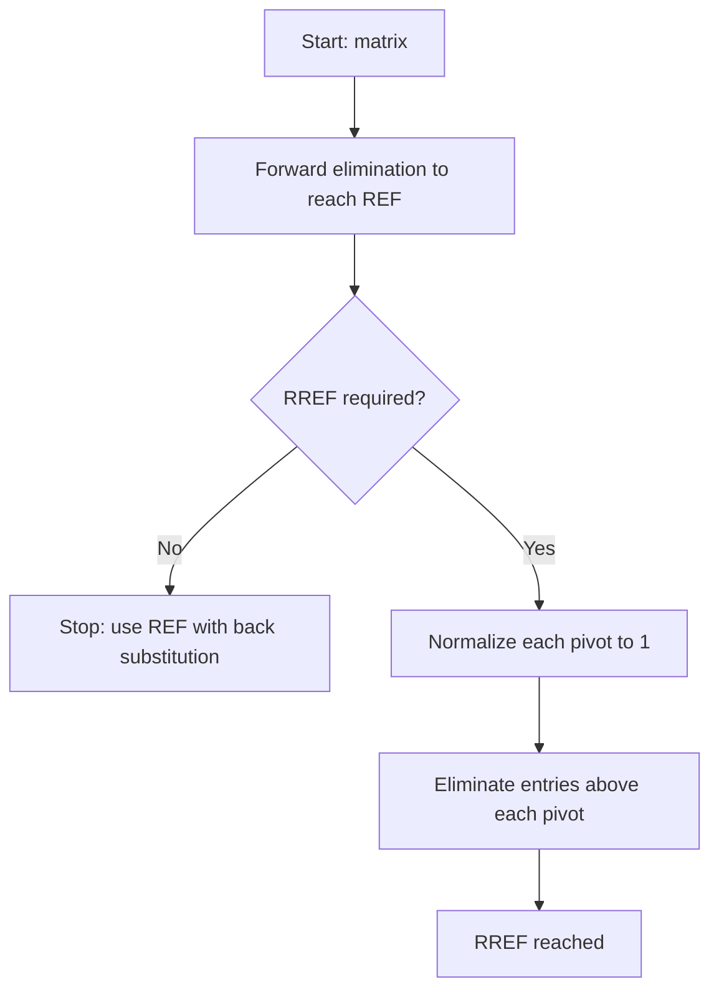

## Row Echelon and Reduced Row Echelon Form

### Definition: Row Echelon Form (REF)

A matrix is in row echelon form if it satisfies all of the following:

- All nonzero rows are above any rows consisting entirely of zeros.
- The leading entry (pivot) of each nonzero row is strictly to the right of the pivot in the row above it.
- All entries in a column below a pivot are zero.

This is a standard, provable definition from linear algebra, not an inference.

**Example**

$$\begin{pmatrix} 2 & 3 & 1 \\ 0 & 1 & 4 \\ 0 & 0 & 5 \end{pmatrix}$$

### Definition: Reduced Row Echelon Form (RREF)

A matrix is in reduced row echelon form if it satisfies all the conditions of row echelon form, plus:

- Every pivot equals 1.
- Each pivot is the only nonzero entry in its column (entries above and below each pivot are also zero).

This is a standard, provable definition from linear algebra, not an inference.

**Example**

$$\begin{pmatrix} 1 & 0 & 0 \\ 0 & 1 & 0 \\ 0 & 0 & 1 \end{pmatrix}$$

### Visual Comparison

<svg xmlns="http://www.w3.org/2000/svg" viewBox="0 0 480 260">
  <text x="240" y="20" font-size="13" text-anchor="middle" fill="#333">Row Echelon vs Reduced Row Echelon Form (svg_diagram)</text>
  <text x="120" y="45" font-size="12" text-anchor="middle" fill="#1f77b4">Row Echelon Form</text>
  <rect x="40" y="60" width="160" height="160" fill="none" stroke="#1f77b4" stroke-width="2" />
  <line x1="40" y1="113" x2="200" y2="113" stroke="#ccc" stroke-width="1" />
  <line x1="40" y1="167" x2="200" y2="167" stroke="#ccc" stroke-width="1" />
  <line x1="93" y1="60" x2="93" y2="220" stroke="#ccc" stroke-width="1" />
  <line x1="147" y1="60" x2="147" y2="220" stroke="#ccc" stroke-width="1" />
  <text x="66" y="93" font-size="13" text-anchor="middle" fill="#2ca02c">2</text>
  <text x="120" y="93" font-size="13" text-anchor="middle">3</text>
  <text x="173" y="93" font-size="13" text-anchor="middle">1</text>
  <text x="66" y="146" font-size="13" text-anchor="middle">0</text>
  <text x="120" y="146" font-size="13" text-anchor="middle" fill="#2ca02c">1</text>
  <text x="173" y="146" font-size="13" text-anchor="middle">4</text>
  <text x="66" y="200" font-size="13" text-anchor="middle">0</text>
  <text x="120" y="200" font-size="13" text-anchor="middle">0</text>
  <text x="173" y="200" font-size="13" text-anchor="middle" fill="#2ca02c">5</text>
  <text x="360" y="45" font-size="12" text-anchor="middle" fill="#ff7f0e">Reduced Row Echelon Form</text>
  <rect x="280" y="60" width="160" height="160" fill="none" stroke="#ff7f0e" stroke-width="2" />
  <line x1="280" y1="113" x2="440" y2="113" stroke="#ccc" stroke-width="1" />
  <line x1="280" y1="167" x2="440" y2="167" stroke="#ccc" stroke-width="1" />
  <line x1="333" y1="60" x2="333" y2="220" stroke="#ccc" stroke-width="1" />
  <line x1="387" y1="60" x2="387" y2="220" stroke="#ccc" stroke-width="1" />
  <text x="306" y="93" font-size="13" text-anchor="middle" fill="#2ca02c">1</text>
  <text x="360" y="93" font-size="13" text-anchor="middle">0</text>
  <text x="413" y="93" font-size="13" text-anchor="middle">0</text>
  <text x="306" y="146" font-size="13" text-anchor="middle">0</text>
  <text x="360" y="146" font-size="13" text-anchor="middle" fill="#2ca02c">1</text>
  <text x="413" y="146" font-size="13" text-anchor="middle">0</text>
  <text x="306" y="200" font-size="13" text-anchor="middle">0</text>
  <text x="360" y="200" font-size="13" text-anchor="middle">0</text>
  <text x="413" y="200" font-size="13" text-anchor="middle" fill="#2ca02c">1</text>
  <text x="240" y="245" font-size="11" text-anchor="middle" fill="#666">Green = pivots (REF: any nonzero value; RREF: always 1, isolated in its column)</text>
</svg>

### Key Points

- Every matrix has a row echelon form, but this form is not unique — different sequences of row operations can produce different valid row echelon forms of the same matrix. This is a standard, provable fact in linear algebra.
- Every matrix has exactly one reduced row echelon form. This uniqueness is a standard, provable theorem in linear algebra. I cannot independently reproduce the full uniqueness proof within this response.
- Pivot columns correspond to leading variables; non-pivot columns correspond to free variables in the associated system.

### Worked Example: Reducing to RREF

Starting from the row echelon form obtained earlier:

$$\left(\begin{array}{ccc|c} 1 & 2 & 1 & 4 \\ 0 & 1 & 1 & 2 \\ 0 & 0 & 2 & 1 \end{array}\right)$$

**Step 1 — Normalize the third pivot**

$R_3 \leftarrow \frac{1}{2}R_3$:

$$\left(\begin{array}{ccc|c} 1 & 2 & 1 & 4 \\ 0 & 1 & 1 & 2 \\ 0 & 0 & 1 & 0.5 \end{array}\right)$$

**Step 2 — Eliminate above the third pivot**

$R_2 \leftarrow R_2 - R_3$, $R_1 \leftarrow R_1 - R_3$:

$$\left(\begin{array}{ccc|c} 1 & 2 & 0 & 3.5 \\ 0 & 1 & 0 & 1.5 \\ 0 & 0 & 1 & 0.5 \end{array}\right)$$

**Step 3 — Eliminate above the second pivot**

$R_1 \leftarrow R_1 - 2R_2$:

$$\left(\begin{array}{ccc|c} 1 & 0 & 0 & 0.5 \\ 0 & 1 & 0 & 1.5 \\ 0 & 0 & 1 & 0.5 \end{array}\right)$$

Each step is a direct, mechanical application of the stated row operations, not an inference.

**Output**

$$\left(\begin{array}{ccc|c} 1 & 0 & 0 & 0.5 \\ 0 & 1 & 0 & 1.5 \\ 0 & 0 & 1 & 0.5 \end{array}\right)$$

The solution $x_1 = 0.5$, $x_2 = 1.5$, $x_3 = 0.5$ can be read directly from the last column, matching the result obtained by back substitution in the prior Gaussian elimination example. This is a direct computation, not an inference.

### Pivot Positions and Rank

The number of pivot positions in the row echelon form (or RREF) of a matrix equals the rank of that matrix. This is a standard, provable result in linear algebra, since row operations preserve the row space, and the pivots directly indicate the dimension of that space.

### Free Variables and Solution Structure

**Key Points**

- If every column contains a pivot, the system has at most one solution.
- If any column lacks a pivot, the corresponding variable is a free variable, and the system (if consistent) has infinitely many solutions parameterized by that free variable.
- A row of the form $(0 \; 0 \; \cdots \; 0 \mid c)$ with $c \neq 0$ indicates the system is inconsistent (no solution). This follows directly from the fact that such a row represents the equation $0 = c$, which has no solution when $c \neq 0$.

### Worked Example: Free Variable Case

$$\left(\begin{array}{ccc|c} 1 & 2 & 0 & 3 \\ 0 & 0 & 1 & 2 \\ 0 & 0 & 0 & 0 \end{array}\right)$$

This is already in RREF. Column 2 has no pivot, so $x_2$ is free. Setting $x_2 = t$:

$$x_1 = 3 - 2t, \quad x_2 = t, \quad x_3 = 2$$

**Output**

$$\mathbf{x} = \begin{pmatrix} 3 \\ 0 \\ 2 \end{pmatrix} + t\begin{pmatrix} -2 \\ 1 \\ 0 \end{pmatrix}, \quad t \in \mathbb{R}$$

This is a direct computation following from the stated RREF and the definition of a free variable, not an inference.

### Algorithm Overview

### Computational Considerations

[Inference] Computing RREF is commonly described in numerical linear algebra references as requiring more arithmetic operations than stopping at REF, since additional elimination steps are needed above each pivot. I cannot verify the exact operation-count difference without citing a specific source. [Unverified] I do not have access to a specific citable source to quote directly for a precise comparison figure within this response.

### Relevance to Machine Learning

[Inference] Row echelon and reduced row echelon forms are described in commonly cited linear algebra and numerical computing references as relevant in several contexts, based on descriptions in standard references. I cannot verify how any specific ML framework implements these internally without inspecting that framework's source code.

Commonly cited use cases include:

- **Determining linear independence of feature vectors**: row reduction is described in linear algebra references as a method for checking whether a set of vectors (e.g., feature columns) is linearly independent, relevant to some feature selection and multicollinearity diagnostics. [Unverified] I cannot verify whether any specific software library uses row reduction internally for this purpose without inspecting its source code.
- **Computing rank for dimensionality diagnostics**: the pivot count from row reduction is described in linear algebra references as a direct method for determining matrix rank, referenced in some data preprocessing contexts. [Unverified] I do not have access to a specific verified source confirming which libraries currently implement this by default versus using alternative rank-estimation methods (e.g., SVD-based).
- **Solving small-scale linear systems in educational or prototyping contexts**: row reduction is described in some numerical computing literature as a teaching tool and prototyping method, though direct RREF computation is [Unverified] not confirmed as the standard method used in production-scale numerical solvers without inspecting specific library documentation.

### LLM Behavior Disclaimer

[Unverified] This document reflects general explanatory patterns for mathematical content. I do not have access to information confirming how any specific language model, including the one generating this response, will behave in future interactions. Behavior is not guaranteed to be consistent, and no outcome described here should be treated as certain to recur.

**Related Topics**
- Gaussian elimination
- Matrix rank
- Linear independence and span
- Solving systems with free variables
- Consistency of linear systems
- Null space (kernel) computation via RREF

---
[Unverified] This entire response is labeled because it contains statements marked [Inference] and [Unverified] regarding RREF uniqueness proof reproduction, computational cost comparisons, and machine learning application/implementation details not drawn from a specific cited source. Core mathematical definitions and procedures (REF and RREF definitions, pivot-rank relationship, free variable identification, inconsistency condition) are standard, established, and provable results in linear algebra and are treated as established mathematical fact rather than as inference.