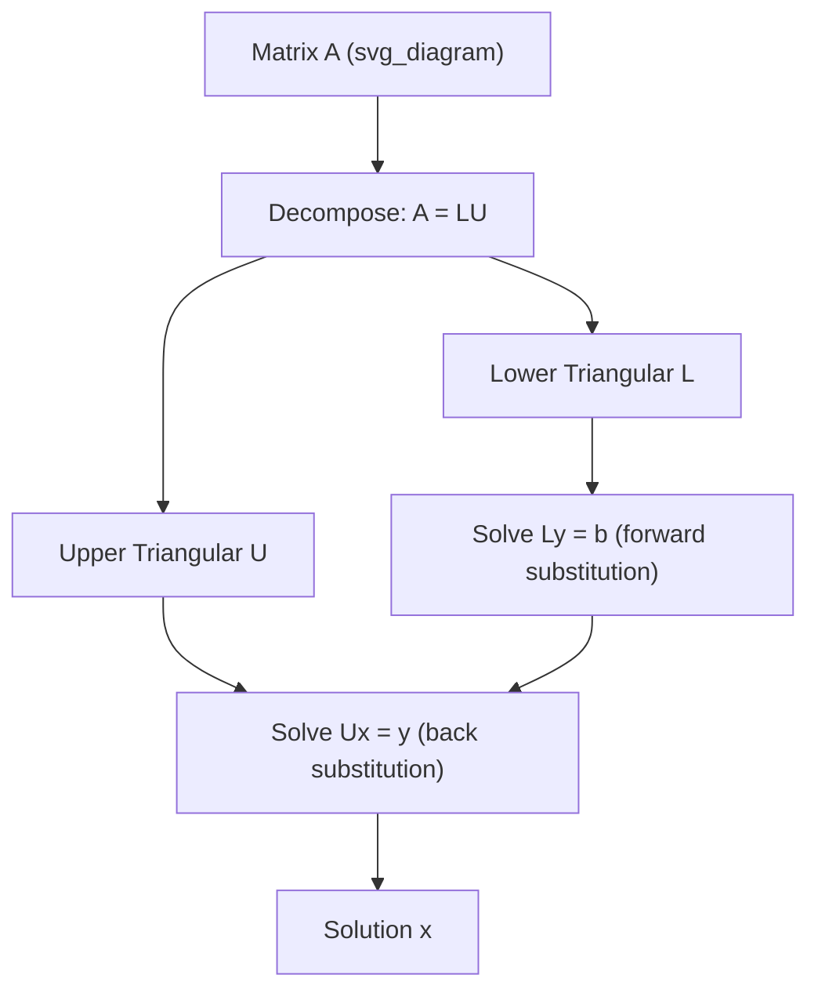

## LU Decomposition

### Definition

LU decomposition factorizes a square matrix $A$ into the product of a lower triangular matrix $L$ and an upper triangular matrix $U$, such that:

$$A = LU$$

where $L$ has ones on its diagonal (in the standard convention) and zeros above the diagonal, and $U$ has zeros below the diagonal. This factorization reorganizes Gaussian elimination into a reusable matrix form.

### Purpose in Machine Learning

LU decomposition is primarily used to solve systems of linear equations efficiently, especially when the same coefficient matrix $A$ must be solved against multiple right-hand-side vectors $b$. This arises in:

- Solving normal equations in linear regression
- Computing matrix inverses
- Evaluating determinants efficiently
- Numerical solvers embedded in optimization routines

Once $A = LU$ is computed, solving $Ax = b$ reduces to two triangular solves instead of one full elimination, which is computationally cheaper when reused across multiple $b$ vectors. [Inference] This efficiency gain is a standard justification in numerical linear algebra references, but actual speedup depends on matrix size, sparsity, and implementation.

### Mathematical Formulation

Given:

$$Ax = b$$

Substitute $A = LU$:

$$LUx = b$$

Let $y = Ux$. Then solve in two steps:

$$Ly = b \quad \text{(forward substitution)}$$

$$Ux = y \quad \text{(back substitution)}$$

### Step-by-Step Construction

**Key Points**
- $L$ is lower triangular with unit diagonal entries (by convention, not universally required)
- $U$ is upper triangular
- The decomposition is derived from Gaussian elimination, where the multipliers used to eliminate entries below the pivot become the entries of $L$

The elimination process:

1. Start with $U = A$ and $L = I$ (identity matrix)
2. For each pivot column, compute multipliers $m_{ij} = \dfrac{U_{ij}}{U_{jj}}$ for rows below the pivot
3. Subtract $m_{ij}$ times the pivot row from row $i$ in $U$
4. Store $m_{ij}$ in the corresponding position of $L$
5. Repeat until $U$ is fully upper triangular

### Worked Example

Consider:

$$A = \begin{bmatrix} 2 & 3 \\ 4 & 7 \end{bmatrix}$$

**Step 1:** Eliminate the entry below the pivot in column 1.

Multiplier: $m_{21} = \dfrac{4}{2} = 2$

Row 2 ← Row 2 − 2 × Row 1:

$$U = \begin{bmatrix} 2 & 3 \\ 0 & 1 \end{bmatrix}$$

**Step 2:** Store the multiplier in $L$:

$$L = \begin{bmatrix} 1 & 0 \\ 2 & 1 \end{bmatrix}$$

**Verification:**

$$LU = \begin{bmatrix} 1 & 0 \\ 2 & 1 \end{bmatrix} \begin{bmatrix} 2 & 3 \\ 0 & 1 \end{bmatrix} = \begin{bmatrix} 2 & 3 \\ 4 & 7 \end{bmatrix} = A$$

### Partial Pivoting (PA = LU)

Standard LU decomposition can fail or become numerically unstable when a pivot element is zero or very small. To address this, a permutation matrix $P$ is introduced to reorder rows:

$$PA = LU$$

This is known as LU decomposition with partial pivoting. It is the form most commonly implemented in numerical libraries. [Unverified] The exact pivoting strategy (e.g., partial vs. complete pivoting) and its numerical stability guarantees vary by library implementation and are not universally identical across software.

### Existence and Uniqueness Conditions

- LU decomposition without pivoting exists only if all leading principal minors of $A$ are nonzero
- With partial pivoting ($PA = LU$), decomposition exists for any nonsingular square matrix
- The decomposition is not unique unless a normalization convention (such as unit diagonal in $L$) is fixed

### Computational Complexity

Computing the LU decomposition of an $n \times n$ matrix requires approximately:

$$\frac{2n^3}{3} \text{ floating-point operations}$$

[Inference] This complexity figure is a commonly cited theoretical operation count in numerical linear algebra literature; actual runtime performance depends on hardware, memory access patterns, and library optimization, and is not something this count alone can determine.

### Relation to Other Decompositions

LU decomposition is related to but distinct from:

- **Cholesky decomposition** — applies only to symmetric positive-definite matrices, decomposing $A = LL^T$
- **QR decomposition** — decomposes $A$ into an orthogonal matrix $Q$ and upper triangular matrix $R$, used when numerical stability for least-squares problems is prioritized
- **Gaussian elimination** — LU decomposition is essentially a structured record of the elimination steps performed during Gaussian elimination

### Diagram: LU Decomposition Solve Pipeline

### Matrix Structure Illustration

<svg xmlns="http://www.w3.org/2000/svg" viewBox="0 0 420 220">
<text x="10" y="20" font-size="14" font-weight="bold">LU Decomposition Structure (svg_diagram)</text>

<text x="30" y="45" font-size="12">A</text>
<rect x="20" y="55" width="80" height="80" fill="#e8eef7" stroke="#333" />
<line x1="20" y1="55" x2="100" y2="135" stroke="#999" stroke-width="1" />

<text x="140" y="45" font-size="12">L</text>
<rect x="130" y="55" width="80" height="80" fill="#dff0d8" stroke="#333" />
<polygon points="130,55 210,55 210,135 130,135" fill="none" />
<polygon points="130,55 130,135 210,135" fill="#b8dba0" stroke="#333" />

<text x="260" y="45" font-size="12">U</text>
<rect x="250" y="55" width="80" height="80" fill="#f7e6e6" stroke="#333" />
<polygon points="250,55 330,55 330,135" fill="#e8b0b0" stroke="#333" />

<text x="30" y="160" font-size="11">Full matrix</text>
<text x="130" y="160" font-size="11">Lower triangular</text>
<text x="255" y="160" font-size="11">Upper triangular</text>

<text x="20" y="195" font-size="12">A = L × U</text>
</svg>

### Practical Considerations

- Most numerical libraries (e.g., LAPACK-based implementations) use partial pivoting by default. [Unverified] Specific default behaviors, flags, and internal algorithms differ across library versions and are not confirmed here without checking the exact library documentation in use.
- LU decomposition is generally preferred over computing a matrix inverse directly when solving $Ax = b$, since it tends to be more numerically stable and computationally cheaper. [Inference] This is a widely stated heuristic in numerical linear algebra, not a strict rule for all matrix conditions.
- For singular or near-singular matrices, LU decomposition may produce large numerical errors; alternative approaches such as SVD-based methods are often used in ill-conditioned settings.

### Conclusion

LU decomposition restructures the elimination process of solving linear systems into a reusable triangular factorization, enabling efficient repeated solves, determinant computation, and matrix inversion. Its numerical behavior depends on pivoting strategy and matrix conditioning, and implementation details vary across software libraries.

**Related Topics**
- Cholesky Decomposition
- QR Decomposition
- Singular Value Decomposition (SVD)
- Matrix Inversion via Decomposition
- Condition Number and Numerical Stability
- Eigenvalues and Eigenvectors
- Determinants via Triangular Matrices