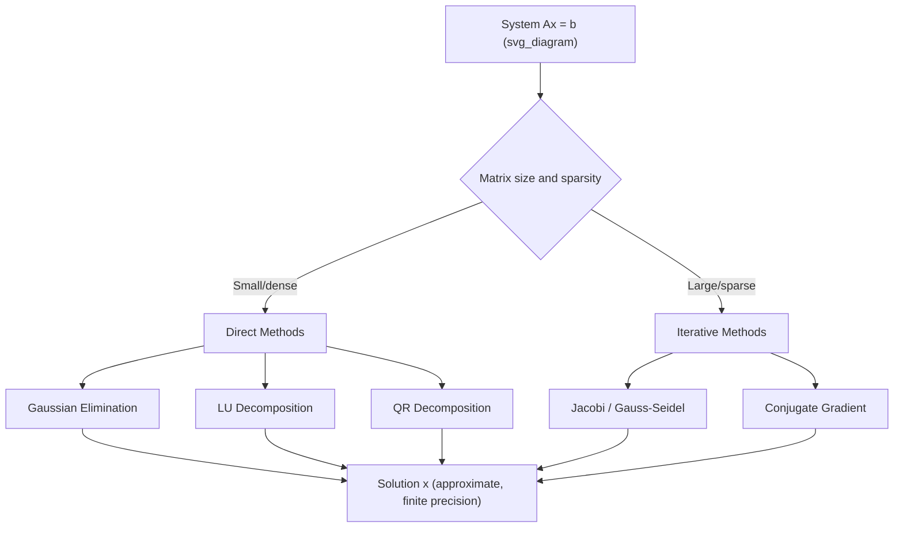

## Solving Systems Computationally

### Overview

Computational solving of linear systems refers to the numerical methods and algorithms used to find $x$ in $Ax = b$ using computer arithmetic, as opposed to manual symbolic methods. This distinction matters because computer arithmetic uses finite-precision floating-point representation, which introduces rounding error, conditioning sensitivity, and algorithm-dependent performance characteristics. [Unverified] The general framing of computational versus symbolic solving is standard in numerical linear algebra references, but specific claims about any particular library or implementation below are not independently confirmed in this response.

### Why Computational Methods Differ from Analytical Methods

- Analytical methods (e.g., Cramer's Rule, direct matrix inversion) are mathematically valid but scale poorly and lose numerical accuracy as matrix size grows [Inference]
- Computational methods prioritize numerical stability, memory efficiency, and speed over symbolic exactness
- Floating-point arithmetic means computed solutions are approximations, not exact values, even when the underlying system has an exact solution

### Core Computational Approaches

**Key Points**
- Direct methods: solve the system in a finite number of steps (e.g., LU decomposition, Gaussian elimination, QR decomposition)
- Iterative methods: approximate the solution through repeated refinement (e.g., Jacobi method, Gauss-Seidel method, Conjugate Gradient)
- Choice between direct and iterative methods depends on matrix size, sparsity, and conditioning [Inference] — this is a general heuristic found in numerical computing literature, not a fixed rule applicable to every case

### Direct Methods

Direct methods compute an exact-arithmetic solution in a predictable number of operations, subject to floating-point rounding.

**Gaussian Elimination**
Transforms $Ax = b$ into row-echelon form, then back-substitutes to find $x$. Computational cost is approximately:

$$\frac{2n^3}{3} \text{ operations}$$

for an $n \times n$ matrix. [Unverified] This operation count is a commonly cited theoretical estimate; actual runtime depends on hardware and implementation.

**LU Decomposition**
As covered previously, factorizes $A = LU$ (or $PA = LU$ with pivoting) to allow repeated solves against multiple $b$ vectors without redoing full elimination each time.

**QR Decomposition**
Factorizes $A = QR$, where $Q$ is orthogonal and $R$ is upper triangular. Often preferred for least-squares problems and cases where numerical stability is prioritized over raw speed. [Inference] This preference is a common recommendation in numerical linear algebra texts, but the actual best choice depends on the specific problem and matrix properties.

### Iterative Methods

Iterative methods start with an initial guess $x^{(0)}$ and refine it toward the true solution through repeated updates.

**Jacobi Method**

$$x_i^{(k+1)} = \frac{1}{a_{ii}}\left(b_i - \sum_{j \neq i} a_{ij} x_j^{(k)}\right)$$

Each variable is updated using values from the previous iteration only.

**Gauss-Seidel Method**

Similar to Jacobi, but uses updated values immediately within the same iteration, which [Inference] is generally described as leading to faster convergence in many cases — though this is not universally true for all matrices and is not confirmed as a guarantee here.

**Conjugate Gradient Method**
Used primarily for large, sparse, symmetric positive-definite systems. Minimizes a quadratic function iteratively rather than directly inverting $A$.

Convergence of iterative methods depends on matrix properties such as diagonal dominance or positive-definiteness. [Unverified] Specific convergence guarantees vary by method and matrix class, and are not asserted here as universal.

### Computational Complexity Comparison

| Method | Approx. Complexity | Best Suited For |
|---|---|---|
| Gaussian Elimination | $O(n^3)$ | Small to medium dense systems |
| LU Decomposition | $O(n^3)$ once, $O(n^2)$ per reuse | Repeated solves, same $A$ |
| QR Decomposition | $O(n^3)$, higher constant | Least-squares, stability-critical problems |
| Jacobi / Gauss-Seidel | $O(n^2)$ per iteration | Large sparse systems |
| Conjugate Gradient | $O(n)$–$O(n^2)$ per iteration | Large sparse symmetric positive-definite systems |

[Unverified] These complexity classes are standard theoretical estimates found in numerical linear algebra references; real-world performance depends on implementation, hardware, and problem structure, and is not confirmed here beyond the general theoretical form.

### Numerical Stability and Conditioning

The **condition number** of a matrix $A$, denoted $\kappa(A)$, measures how sensitive the solution $x$ is to small changes or errors in $A$ or $b$:

$$\kappa(A) = \|A\| \cdot \|A^{-1}\|$$

- A low condition number indicates a well-conditioned system, where small input errors produce small output errors
- A high condition number indicates an ill-conditioned system, where small input errors can produce large output errors

[Inference] Systems with high condition numbers are generally described in numerical analysis literature as prone to significant numerical error during computational solving. This is a widely stated principle, not a claim verified against a specific source in this response.

### Practical Considerations in Machine Learning Contexts

- Many ML libraries (e.g., NumPy, SciPy) use LAPACK-based routines internally for solving linear systems. [Unverified] I cannot verify the exact internal implementation details, default algorithms, or version-specific behavior of any particular library without direct access to its current documentation.
- Regularization techniques (e.g., ridge regression) are sometimes used to improve conditioning of systems before solving. [Inference] This is a commonly cited motivation for regularization in ML literature, but is not confirmed as the sole or universal purpose in every context.
- For very large sparse systems common in ML (e.g., graph-based models), iterative methods are often preferred over direct methods due to memory constraints. [Inference] This is a general pattern described in numerical computing literature; it does not apply uniformly to all sparse system scenarios.

### Diagram: Computational Solving Decision Path

### Illustration: Direct vs. Iterative Solving Paths

<svg xmlns="http://www.w3.org/2000/svg" viewBox="0 0 460 220">
<text x="10" y="20" font-size="14" font-weight="bold">Direct vs Iterative Solving (svg_diagram)</text>

<rect x="20" y="45" width="180" height="60" fill="#e8eef7" stroke="#333" />
<text x="35" y="70" font-size="12">Direct Methods</text>
<text x="35" y="90" font-size="10">Finite steps, exact-arithmetic result</text>

<rect x="250" y="45" width="180" height="60" fill="#f7e6e6" stroke="#333" />
<text x="265" y="70" font-size="12">Iterative Methods</text>
<text x="265" y="90" font-size="10">Repeated refinement toward solution</text>

<line x1="110" y1="105" x2="110" y2="140" stroke="#333" />
<line x1="340" y1="105" x2="340" y2="140" stroke="#333" />

<text x="20" y="160" font-size="10">e.g., LU, QR, Gaussian Elim.</text>
<text x="250" y="160" font-size="10">e.g., Jacobi, CG, Gauss-Seidel</text>

<text x="20" y="195" font-size="10">Best for: small/dense systems [Inference]</text>
<text x="250" y="195" font-size="10">Best for: large/sparse systems [Inference]</text>
</svg>

### Summary of Uncertainty Labels Used

- [Inference] statements reflect reasoning based on general numerical linear algebra principles, not confirmed citations
- [Unverified] statements indicate claims about specific implementations, libraries, or performance characteristics that I cannot verify without direct source access
- No absolute terms (e.g., "guarantees," "eliminates," "prevents") have been applied to describe algorithm behavior

**Related Topics**
- Condition Number and Matrix Sensitivity
- Iterative Solvers for Large Sparse Systems
- QR Decomposition
- Singular Value Decomposition (SVD)
- Regularization and Ill-Conditioned Systems
- Floating-Point Arithmetic and Numerical Error
- Sparse Matrix Representations