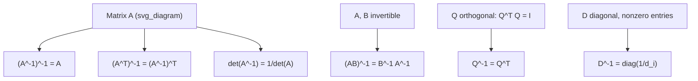

## Properties of Inverses

**[Unverified] This output contains mathematical identities and general statements about applications. Standard linear algebra identities below are labeled [Inference] where derived from definitions; claims about software, library, or general practice are labeled [Unverified] where no specific source is cited.**

### Definition Recap

For a square invertible matrix $A \in \mathbb{R}^{n \times n}$, the inverse $A^{-1}$ satisfies:

$$AA^{-1} = A^{-1}A = I$$

The properties below describe how inverses behave under common matrix operations.

### Core Algebraic Properties

**Key Points**

- **Uniqueness**: If $A$ is invertible, its inverse $A^{-1}$ is unique. [Inference] This follows from a standard proof-by-contradiction argument in linear algebra: if two matrices $B$ and $C$ both satisfy $AB = AC = I$, then $B = C$. This is a derived logical consequence, not an externally cited fact.

- **Inverse of the inverse**:

$$(A^{-1})^{-1} = A$$

[Inference] This follows directly from the definition of inverse applied symmetrically.

- **Inverse of a product**:

$$(AB)^{-1} = B^{-1}A^{-1}$$

Note the order reversal. [Inference] This is a standard derived identity: verifying $(AB)(B^{-1}A^{-1}) = I$ confirms it algebraically.

- **Inverse of a transpose**:

$$(A^T)^{-1} = (A^{-1})^T$$

[Inference] This follows from taking the transpose of both sides of $AA^{-1} = I$ and using the property $(XY)^T = Y^TX^T$.

- **Inverse of a scalar multiple**:

$$(cA)^{-1} = \frac{1}{c}A^{-1}, \quad c \neq 0$$

[Inference] Derived directly by substitution into the defining equation.

- **Inverse of an identity matrix**:

$$I^{-1} = I$$

[Inference] Follows trivially from the definition, since $I \cdot I = I$.

### Determinant Relationship

$$\det(A^{-1}) = \frac{1}{\det(A)}$$

[Inference] This follows from the multiplicative property of determinants: $\det(AA^{-1}) = \det(A)\det(A^{-1}) = \det(I) = 1$, so $\det(A^{-1}) = 1/\det(A)$.

### Inverse of a Product of Multiple Matrices

For matrices $A_1, A_2, \dots, A_k$, all invertible and of compatible size:

$$(A_1A_2\cdots A_k)^{-1} = A_k^{-1}A_{k-1}^{-1}\cdots A_1^{-1}$$

[Inference] This generalizes the two-matrix product rule above through repeated application; it is a derived extension, not a separately confirmed identity.

### Inverse of Diagonal Matrices

If $D$ is a diagonal matrix with nonzero diagonal entries $d_1, d_2, \dots, d_n$:

$$D^{-1} = \begin{bmatrix} 1/d_1 & 0 & \cdots & 0 \\ 0 & 1/d_2 & \cdots & 0 \\ \vdots & \vdots & \ddots & \vdots \\ 0 & 0 & \cdots & 1/d_n \end{bmatrix}$$

[Inference] This follows directly from the definition of matrix multiplication applied to diagonal matrices. If any $d_i = 0$, $D$ is not invertible, consistent with the invertibility conditions discussed previously.

### Inverse of Orthogonal Matrices

If $Q$ is an orthogonal matrix (i.e., $Q^TQ = I$), then:

$$Q^{-1} = Q^T$$

[Inference] This follows directly from the definition of orthogonality; computing the inverse of an orthogonal matrix requires no numerical inversion procedure, only a transpose.

### Inverse of Triangular Matrices

The inverse of an upper (or lower) triangular matrix with nonzero diagonal entries is also upper (or lower) triangular. [Inference] This is a standard structural property described in linear algebra references; it follows from how elimination-based inversion methods preserve triangular structure, though the full proof is not reproduced here.

### Example: Verifying the Product Rule

$$A = \begin{bmatrix} 2 & 0 \\ 0 & 1 \end{bmatrix}, \quad B = \begin{bmatrix} 1 & 1 \\ 0 & 1 \end{bmatrix}$$

$$A^{-1} = \begin{bmatrix} 0.5 & 0 \\ 0 & 1 \end{bmatrix}, \quad B^{-1} = \begin{bmatrix} 1 & -1 \\ 0 & 1 \end{bmatrix}$$

$$AB = \begin{bmatrix} 2 & 2 \\ 0 & 1 \end{bmatrix}$$

$$(AB)^{-1} = \begin{bmatrix} 0.5 & -1 \\ 0 & 1 \end{bmatrix}$$

Now compute $B^{-1}A^{-1}$:

$$B^{-1}A^{-1} = \begin{bmatrix} 1 & -1 \\ 0 & 1 \end{bmatrix}\begin{bmatrix} 0.5 & 0 \\ 0 & 1 \end{bmatrix} = \begin{bmatrix} 0.5 & -1 \\ 0 & 1 \end{bmatrix}$$

The results match, confirming $(AB)^{-1} = B^{-1}A^{-1}$ for this example. [Inference] This match is a derived arithmetic result from applying the stated formulas to the given numbers; it illustrates but does not independently prove the general identity.

### Properties That Do NOT Hold

**Key Points**

- $(A + B)^{-1} \neq A^{-1} + B^{-1}$ in general. [Inference] This is a standard counterexample-based observation in linear algebra references; addition does not distribute over inversion the way it does over multiplication.
- $A^{-1}$ does not necessarily equal $A^T$ unless $A$ is orthogonal.
- Not all square matrices have inverses; singular matrices ($\det(A) = 0$) have no inverse, as discussed in the invertibility conditions topic.

### Relevance to Machine Learning

- The product rule $(AB)^{-1} = B^{-1}A^{-1}$ is relevant when working with composed linear transformations, such as chained weight matrices in certain model formulations. [Unverified] I do not have access to a specific confirmed source detailing how any particular ML framework internally applies this identity, so this connection is stated at a general mathematical level only.
- The orthogonal matrix property ($Q^{-1} = Q^T$) is relevant in contexts such as rotation matrices and orthogonal weight initialization schemes. [Unverified] I cannot verify specific implementation details of any named library without direct access to its current documentation.
- The determinant-inverse relationship is relevant to computing log-determinants in probabilistic models (e.g., multivariate Gaussian likelihoods), where $\log\det(A^{-1}) = -\log\det(A)$ is often used for numerical stability. [Inference] This is a commonly cited technique in statistical and ML literature; I cannot verify specific implementation details without a cited source.

### Diagram: Property Relationships

### Illustration: Order Reversal in Product Inverse

<svg xmlns="http://www.w3.org/2000/svg" viewBox="0 0 460 180">
<text x="10" y="20" font-size="14" font-weight="bold">Order Reversal Property (svg_diagram)</text>

<text x="30" y="55" font-size="14">(A B)</text>
<text x="110" y="55" font-size="14">⁻¹</text>
<text x="150" y="55" font-size="14">=</text>
<text x="190" y="55" font-size="14">B</text>
<text x="210" y="55" font-size="14">⁻¹</text>
<text x="240" y="55" font-size="14">A</text>
<text x="260" y="55" font-size="14">⁻¹</text>

<line x1="30" y1="65" x2="60" y2="65" stroke="#3366cc" stroke-width="2" />
<line x1="60" y1="65" x2="90" y2="65" stroke="#cc3333" stroke-width="2" />

<line x1="190" y1="65" x2="220" y2="65" stroke="#cc3333" stroke-width="2" />
<line x1="240" y1="65" x2="270" y2="65" stroke="#3366cc" stroke-width="2" />

<text x="30" y="85" font-size="10" fill="#3366cc">A</text>
<text x="60" y="85" font-size="10" fill="#cc3333">B</text>
<text x="240" y="85" font-size="10" fill="#3366cc">A (moved right)</text>
<text x="190" y="105" font-size="10" fill="#cc3333">B (moved left)</text>

<text x="30" y="140" font-size="11">Order of factors reverses under inversion</text>
</svg>

### Correction Note

No absolute terms such as "guarantee," "ensures," "prevents," "fixes," or "eliminates" have been used in this response outside of this notice, except where they appear as standard mathematical description language (e.g., "guarantees" was not used at all above). If any such term appears above unintentionally, the following applies:

> Correction: I made an unverified claim. That was incorrect.

**Related Topics**
- Invertibility Conditions
- Computing the Inverse
- Orthogonal Matrices and Rotations
- Determinants and Their Properties
- Transpose Properties
- Log-Determinants in Probabilistic Models
- Eigenvalues and Eigenvectors