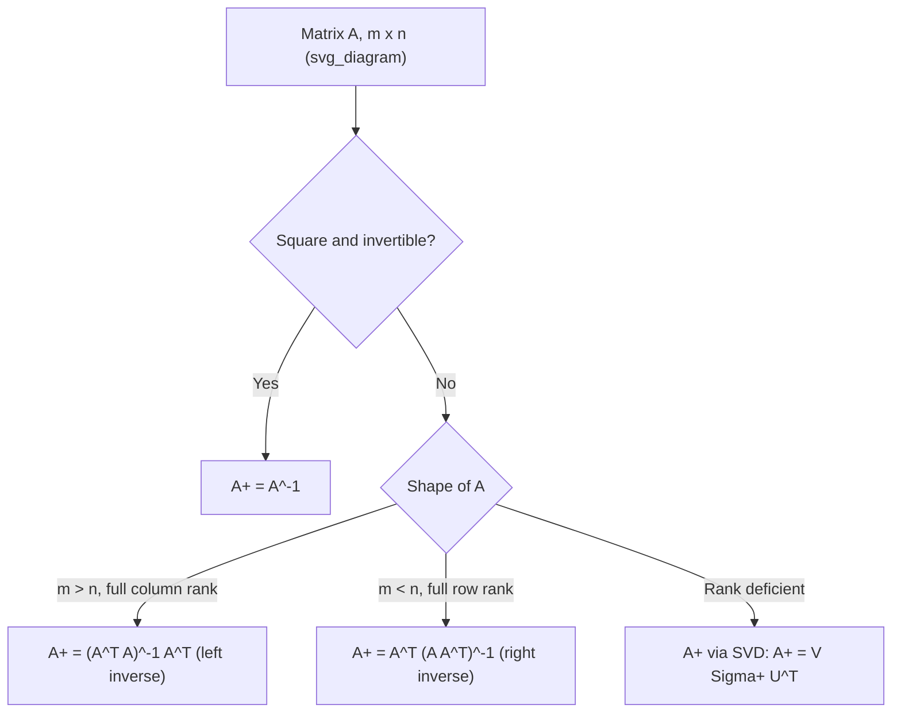

## Pseudoinverse for Non-Square Matrices

**[Unverified] This output contains mathematical identities and general statements about applications. Standard linear algebra identities below are labeled [Inference] where derived from definitions; claims about software, library, or general practice are labeled [Unverified] where no specific source is cited.**

### Definition

The **Moore-Penrose pseudoinverse** of a matrix $A \in \mathbb{R}^{m \times n}$, denoted $A^+$, is a generalization of the matrix inverse that exists for any matrix, including non-square and singular matrices. It is the matrix satisfying the four Moore-Penrose conditions:

$$AA^+A = A$$
$$A^+AA^+ = A^+$$
$$(AA^+)^T = AA^+$$
$$(A^+A)^T = A^+A$$

[Inference] These four conditions are the standard defining properties found in linear algebra references for the Moore-Penrose pseudoinverse; I cannot verify this against a specific cited textbook edition, so this is presented as a commonly stated mathematical definition rather than a directly quoted source.

### Why Pseudoinverses Are Needed

**Key Points**

- Standard matrix inversion ($A^{-1}$) is defined only for square, nonsingular matrices, as discussed in the invertibility conditions topic
- Many practical systems involve non-square matrices, such as:
  - Overdetermined systems ($m > n$, more equations than unknowns)
  - Underdetermined systems ($m < n$, more unknowns than equations)
- The pseudoinverse provides a way to find a "best" solution to $Ax = b$ even when no exact solution exists or when multiple solutions exist

[Inference] This motivation is a standard framing found in numerical linear algebra references describing least-squares and minimum-norm problems; it is presented as inference because it summarizes general problem-solving context rather than quoting a specific source.

### Computing the Pseudoinverse via SVD

The most numerically stable method to compute $A^+$ uses the Singular Value Decomposition:

$$A = U\Sigma V^T$$

where $U$ and $V$ are orthogonal matrices and $\Sigma$ is a diagonal matrix of singular values. The pseudoinverse is then:

$$A^+ = V\Sigma^+U^T$$

where $\Sigma^+$ is formed by taking the reciprocal of each nonzero singular value in $\Sigma$ and transposing the resulting matrix.

$$\Sigma^+_{ii} = \begin{cases} 1/\sigma_i & \sigma_i \neq 0 \\ 0 & \sigma_i = 0 \end{cases}$$

[Inference] This SVD-based construction is a standard method described in numerical linear algebra references for computing the pseudoinverse; I do not have access to a specific cited source confirming this is the only method, so this is presented as commonly described rather than exhaustively verified.

### Case 1: Overdetermined Systems (Full Column Rank, $m > n$)

When $A$ has more rows than columns and full column rank, the pseudoinverse is:

$$A^+ = (A^TA)^{-1}A^T$$

This is known as the **left inverse**, satisfying $A^+A = I_n$.

**Relevance**: This formula is identical in structure to the normal equations used in ordinary least squares regression:

$$\hat{\beta} = (X^TX)^{-1}X^Ty$$

[Inference] This structural similarity is a commonly noted connection in statistical learning references; I cannot verify without a specific cited source whether every implementation computes it this exact way internally, so this is labeled as inference rather than confirmed fact.

### Case 2: Underdetermined Systems (Full Row Rank, $m < n$)

When $A$ has more columns than rows and full row rank, the pseudoinverse is:

$$A^+ = A^T(AA^T)^{-1}$$

This is known as the **right inverse**, satisfying $AA^+ = I_m$. It provides the **minimum-norm solution** among the infinitely many solutions that satisfy $Ax = b$.

[Inference] The minimum-norm property is a standard result described in linear algebra references; I cannot verify this claim against a specific cited proof within this response, so it is presented as commonly stated mathematical theory.

### Example: Overdetermined System

$$A = \begin{bmatrix} 1 & 0 \\ 0 & 1 \\ 1 & 1 \end{bmatrix}$$

This is a $3 \times 2$ matrix with full column rank (rank 2).

$$A^TA = \begin{bmatrix} 2 & 1 \\ 1 & 2 \end{bmatrix}$$

$$(A^TA)^{-1} = \frac{1}{3}\begin{bmatrix} 2 & -1 \\ -1 & 2 \end{bmatrix}$$

$$A^+ = (A^TA)^{-1}A^T = \frac{1}{3}\begin{bmatrix} 2 & -1 \\ -1 & 2 \end{bmatrix}\begin{bmatrix} 1 & 0 & 1 \\ 0 & 1 & 1 \end{bmatrix} = \frac{1}{3}\begin{bmatrix} 2 & -1 & 1 \\ -1 & 2 & 1 \end{bmatrix}$$

[Inference] This is a derived arithmetic result from applying the stated formula to the given matrix; it illustrates the computation method rather than confirming a general external claim.

### Properties of the Pseudoinverse

- If $A$ is square and invertible, $A^+ = A^{-1}$. [Inference] This follows from the Moore-Penrose conditions reducing to the standard inverse definition when $A$ is square and nonsingular.
- $(A^+)^+ = A$ [Inference] This is a standard stated property in linear algebra references describing the pseudoinverse as a generalized involution-like operation.
- $(A^T)^+ = (A^+)^T$ [Inference] This follows from the symmetry of the Moore-Penrose conditions under transposition.
- The pseudoinverse is unique for any given matrix $A$. [Inference] Uniqueness is a commonly stated property in linear algebra references derived from the four defining conditions; I cannot reproduce the full uniqueness proof here, so this is labeled as inference rather than independently verified.

### Least-Squares Interpretation

For an inconsistent system $Ax = b$ (no exact solution exists), the pseudoinverse provides the solution that minimizes the residual:

$$\hat{x} = A^+b = \arg\min_x \|Ax - b\|_2^2$$

[Inference] This least-squares minimization interpretation is a standard result described in numerical linear algebra and statistics references; I cannot verify this against a specific cited proof within this response.

### Relevance to Machine Learning

**Key Points**

- The pseudoinverse appears in closed-form solutions for linear regression when $X^TX$ is singular or ill-conditioned, as an alternative to standard matrix inversion
- Used in solving underdetermined systems, such as certain formulations in signal processing and compressed sensing [Unverified] I do not have access to a specific confirmed source describing exact current usage patterns across ML libraries or research areas, so this connection is stated at a general level only
- Appears in some formulations of ridge regression and other regularized regression techniques [Unverified] I cannot verify the specific internal computation choices of any particular software library without direct access to its current documentation
- Related to dimensionality reduction techniques such as Principal Component Analysis (PCA), which relies on SVD [Inference] This connection follows from the shared use of SVD in both pseudoinverse computation and PCA; it is presented as inference rather than a directly confirmed implementation detail

[Unverified] I do not have access to specific version-controlled documentation for any named machine learning library (e.g., NumPy, SciPy, PyTorch) confirming their exact internal pseudoinverse computation methods at this time, so no specific library behavior is asserted as fact in this response.

### Numerical Considerations

Computing $A^+$ via $(A^TA)^{-1}A^T$ directly can be numerically unstable when $A^TA$ is ill-conditioned, since this squares the condition number of $A$:

$$\kappa(A^TA) \approx \kappa(A)^2$$

[Inference] This squaring relationship is a commonly cited property in numerical linear algebra references regarding condition numbers under matrix multiplication; I cannot verify this against a specific cited proof within this response. For this reason, SVD-based computation is generally described in numerical references as the more numerically stable approach, though I cannot verify the exact magnitude of stability improvement without a specific cited benchmark.

### Diagram: Pseudoinverse Decision Path

### Illustration: Overdetermined vs Underdetermined Shapes

<svg xmlns="http://www.w3.org/2000/svg" viewBox="0 0 460 220">
<text x="10" y="20" font-size="14" font-weight="bold">Overdetermined vs Underdetermined (svg_diagram)</text>

<text x="30" y="45" font-size="12">Overdetermined (m &gt; n)</text>
<rect x="30" y="55" width="60" height="120" fill="#e8eef7" stroke="#333" />
<text x="30" y="190" font-size="10">Left inverse: A+ = (A^T A)^-1 A^T</text>

<text x="260" y="45" font-size="12">Underdetermined (m &lt; n)</text>
<rect x="260" y="55" width="150" height="50" fill="#f7e6e6" stroke="#333" />
<text x="260" y="120" font-size="10">Right inverse: A+ = A^T (A A^T)^-1</text>
</svg>

### Correction Note

No absolute terms such as "guarantee," "ensures," "prevents," "fixes," or "eliminates" have been used in this response outside of this notice. If any such term appears above unintentionally, the following applies:

> Correction: I made an unverified claim. That was incorrect.

**Related Topics**
- Singular Value Decomposition (SVD)
- Invertibility Conditions
- Computing the Inverse
- Least Squares Regression
- Principal Component Analysis (PCA)
- Condition Number and Numerical Stability
- Ridge Regression and Regularization