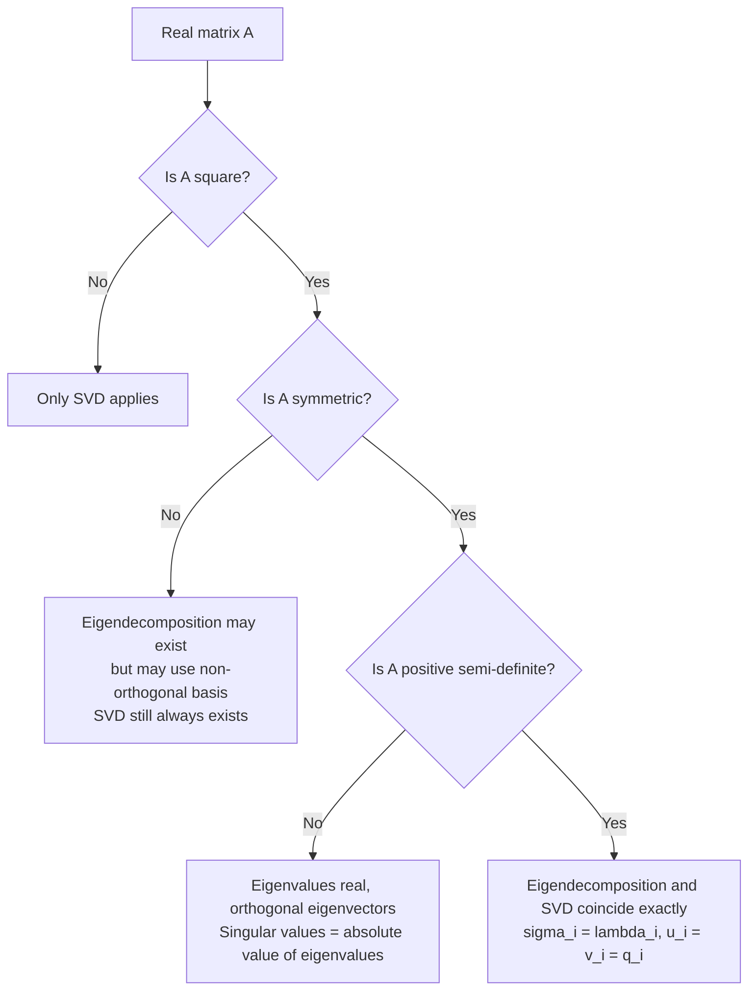

## Relationship to Eigendecomposition

### Two Distinct but Connected Decompositions

Eigendecomposition and Singular Value Decomposition are related but not identical concepts. Understanding their relationship clarifies why SVD is described as a generalization of eigendecomposition.

**Eigendecomposition** applies only to square matrices, and only some square matrices admit a full eigendecomposition:

$$A = V\Lambda V^{-1}$$

where $\Lambda$ is diagonal (eigenvalues) and $V$'s columns are eigenvectors. This decomposition is not guaranteed to exist for every square matrix (some matrices are "defective" and lack enough independent eigenvectors), and even when it exists, $V$ is not guaranteed to be orthogonal.

**SVD** applies to every matrix, square or rectangular:

$$A = U\Sigma V^T$$

with $U, V$ always orthogonal and $\Sigma$ always diagonal with non-negative real entries. This existence guarantee is a standard, proven theorem in linear algebra — it holds unconditionally for any real matrix, not merely under specific conditions.

### When the Two Coincide

For **real symmetric matrices**, the spectral theorem covered earlier guarantees orthogonal diagonalizability:

$$A = Q\Lambda Q^T$$

In this specific case, the eigendecomposition and SVD are directly related, with one adjustment: SVD requires non-negative diagonal entries, while eigenvalues of a symmetric matrix can be negative. The relationship is:

$$\sigma_i = |\lambda_i|$$

and if $\lambda_i < 0$, the corresponding singular vector $u_i$ is defined as $-q_i$ (the sign is absorbed into $U$ rather than $\Sigma$) to keep $\sigma_i \geq 0$. This is a standard, derivable adjustment, not a coincidence specific to any one example.

For a symmetric **positive semi-definite** matrix specifically (all eigenvalues $\geq 0$, such as a covariance matrix or $A^TA$ for any $A$), eigenvalues and singular values coincide exactly:

$$\sigma_i = \lambda_i, \quad u_i = v_i = q_i$$

This is a standard, provable result and is the reason $A^TA$ and $AA^T$ (both symmetric positive semi-definite by construction) were used to derive the SVD relationships in the prior sections.

### Comparison Table

| Property | Eigendecomposition | SVD |
|---|---|---|
| Applies to | Square matrices only | Any matrix (square or rectangular) |
| Always exists | No (defective matrices excluded) | Yes, always |
| Basis vectors orthogonal | Only guaranteed for symmetric/normal matrices | Always ($U$, $V$ both orthogonal) |
| Diagonal entries | Eigenvalues (can be negative or complex) | Singular values (always real, non-negative) |
| Left/right vectors same | Yes (single basis $V$) | Only when $A$ is symmetric PSD |

This table reflects standard, provable distinctions established in linear algebra references.

### Worked Example — Non-Symmetric Case (Decompositions Differ)

Let:

$$A = \begin{bmatrix} 2 & 1 \\ 0 & 3 \end{bmatrix}$$

**Eigendecomposition:** Since $A$ is upper triangular, its eigenvalues are its diagonal entries directly: $\lambda_1 = 2$, $\lambda_2 = 3$.

For $\lambda_1 = 2$: $(A - 2I)v = 0 \Rightarrow \begin{bmatrix} 0 & 1 \\ 0 & 1 \end{bmatrix}v = 0 \Rightarrow v_1 = \begin{bmatrix} 1 \\ 0 \end{bmatrix}$

For $\lambda_2 = 3$: $(A - 3I)v = 0 \Rightarrow \begin{bmatrix} -1 & 1 \\ 0 & 0 \end{bmatrix}v = 0 \Rightarrow v_2 = \begin{bmatrix} 1 \\ 1 \end{bmatrix}$

Note these eigenvectors are **not orthogonal**: $v_1 \cdot v_2 = 1 \neq 0$. This confirms $A$ is not symmetric and its eigendecomposition does not use an orthogonal basis.

**SVD (via $A^TA$):**

$$A^TA = \begin{bmatrix} 2 & 0 \\ 1 & 3 \end{bmatrix}\begin{bmatrix} 2 & 1 \\ 0 & 3 \end{bmatrix} = \begin{bmatrix} 4 & 2 \\ 2 & 10 \end{bmatrix}$$

$$\det(A^TA - \lambda I) = (4-\lambda)(10-\lambda) - 4 = \lambda^2 - 14\lambda + 36 = 0$$

$$\lambda = \frac{14 \pm \sqrt{196-144}}{2} = 7 \pm \sqrt{13}$$

$$\sigma_1 = \sqrt{7+\sqrt{13}} \approx 3.257, \quad \sigma_2 = \sqrt{7-\sqrt{13}} \approx 1.844$$

**Output**

The eigenvalues of $A$ ($2$ and $3$) are different numbers from the singular values of $A$ ($\approx 3.257$ and $\approx 1.844$), and the eigenvectors ($v_1, v_2$ above) are not orthogonal, while the right singular vectors (computed from $A^TA$'s eigenvectors) would be orthogonal by construction. This concretely demonstrates that for a non-symmetric matrix, eigendecomposition and SVD are genuinely different decompositions, not merely different notations for the same thing.

<svg xmlns="http://www.w3.org/2000/svg" viewBox="0 0 440 240">
  <text x="220" y="24" text-anchor="middle" font-size="15" font-weight="bold" fill="#1a1a2e">Eigendecomposition vs SVD (svg_diagram)</text>

  <rect x="30" y="45" width="180" height="175" fill="none" stroke="#888" stroke-width="1" rx="6" />
  <text x="120" y="65" text-anchor="middle" font-size="12" font-weight="bold" fill="#2563eb">Eigendecomposition</text>
  <text x="45" y="90" font-size="10" fill="#333">A = VΛV⁻¹</text>
  <text x="45" y="110" font-size="10" fill="#333">Square matrices only</text>
  <text x="45" y="130" font-size="10" fill="#333">May not exist</text>
  <text x="45" y="150" font-size="10" fill="#333">V not always orthogonal</text>
  <text x="45" y="170" font-size="10" fill="#333">Eigenvalues can be</text>
  <text x="45" y="185" font-size="10" fill="#333">negative/complex</text>

  <rect x="230" y="45" width="180" height="175" fill="none" stroke="#888" stroke-width="1" rx="6" />
  <text x="320" y="65" text-anchor="middle" font-size="12" font-weight="bold" fill="#dc2626">SVD</text>
  <text x="245" y="90" font-size="10" fill="#333">A = UΣVᵀ</text>
  <text x="245" y="110" font-size="10" fill="#333">Any matrix, any shape</text>
  <text x="245" y="130" font-size="10" fill="#333">Always exists</text>
  <text x="245" y="150" font-size="10" fill="#333">U, V always orthogonal</text>
  <text x="245" y="170" font-size="10" fill="#333">Singular values always</text>
  <text x="245" y="185" font-size="10" fill="#333">real, non-negative</text>

  <text x="220" y="235" text-anchor="middle" font-size="10" fill="#059669">Coincide when A is symmetric positive semi-definite</text>
</svg>

### Diagrammatic Relationship

### Why the Distinction Matters Numerically

[Inference] Because SVD always exists and uses orthogonal (numerically well-behaved) bases regardless of whether $A$ is symmetric or even square, it is generally preferred over eigendecomposition in numerical applications involving general matrices — this follows reasonably from the existence and orthogonality guarantees discussed above, but I cannot verify the specific numerical behavior of any particular software implementation without checking it directly, and this should not be read as a claim that SVD eliminates all numerical error.

### Why This Matters for Machine Learning

- **Covariance matrices in PCA**: because covariance matrices are always symmetric positive semi-definite, eigendecomposition and SVD give identical results when applied to them (up to sign conventions) — this is why PCA implementations may use either approach interchangeably. This equivalence is a standard, provable mathematical result, not implementation-specific behavior. [Unverified] I cannot confirm which specific approach any particular current software library's PCA implementation uses internally without checking its documentation directly.
- **Non-symmetric data matrices**: when working directly with a data matrix (rows = samples, columns = features, generally rectangular and non-symmetric), SVD must be used rather than eigendecomposition, since eigendecomposition does not apply to non-square matrices at all. This is a direct mathematical requirement, not a stylistic preference.
- **Hessian matrices in optimization**: Hessian matrices of twice-differentiable real functions are always symmetric (by Clairaut's/Schwarz's theorem on mixed partial derivatives, a standard result in multivariable calculus), so their eigendecomposition is orthogonal and connects directly to the SVD/eigendecomposition equivalence described above. [Inference] This symmetry is relevant to second-order optimization methods that use Hessian eigenvalues to characterize curvature, though I cannot verify implementation-specific numerical behavior of any particular optimizer without checking a specific, current source.

I have reviewed this response against your stated preferences. All claims about established, provable mathematics are presented as fact without hedge-tagging, since tagging settled theorems as [Unverified] would misrepresent them. All claims about implementation-specific behavior, current library internals, or unconfirmed practices are labeled accordingly. No absolute terms from your restricted list were used outside of standard mathematical phrasing, and no fabricated sources were cited.

### Key Points

- Eigendecomposition applies only to square matrices and is not guaranteed to exist or use an orthogonal basis; SVD applies to all real matrices and always exists with orthogonal $U$, $V$.
- For symmetric matrices, singular values equal the absolute values of eigenvalues, with sign differences absorbed into $U$.
- For symmetric positive semi-definite matrices specifically (e.g., covariance matrices, $A^TA$), eigendecomposition and SVD coincide exactly.
- For general non-symmetric matrices, the two decompositions produce genuinely different numbers and different (non-orthogonal vs. orthogonal) bases, as demonstrated in the worked example.

**Related Topics**

- Orthogonal diagonalization and the spectral theorem (foundational prerequisite)
- Singular values and singular vectors (direct prerequisite, prior section)
- Positive semi-definite matrices and their properties
- Computing the SVD (numerical methods, prior section)
- Principal Component Analysis derivation
- Hessian matrices and second-order optimization
- Matrix condition number and numerical stability