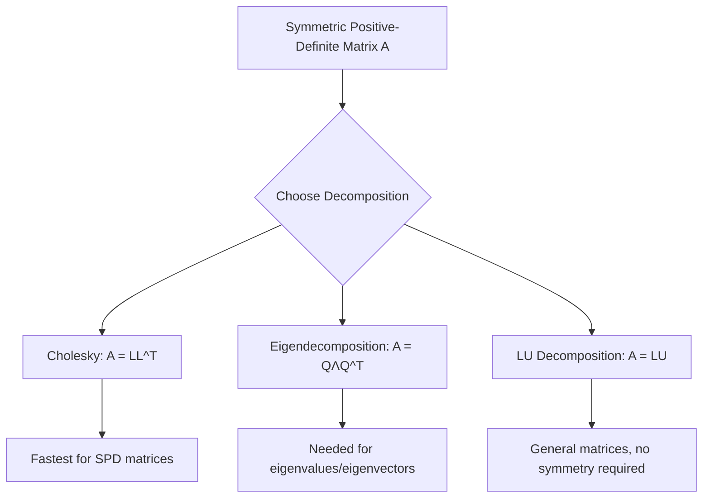

## Cholesky Decomposition (svg_diagram)

### Definition

The Cholesky decomposition factors a symmetric, positive-definite matrix $A$ into the product of a lower triangular matrix $L$ and its transpose:

$$A = LL^T$$

where $L$ is a lower triangular matrix with strictly positive diagonal entries. This factorization exists and is unique for any symmetric positive-definite matrix. This is a standard, well-established result in linear algebra, not an inference.

### Preconditions

- $A$ must be **square**.
- $A$ must be **symmetric**: $A = A^T$.
- $A$ must be **positive-definite**: for all nonzero vectors $\mathbf{x}$, $\mathbf{x}^T A \mathbf{x} > 0$.

If $A$ is only positive *semi-definite* (allowing zero eigenvalues), a Cholesky decomposition may still exist but $L$ will have at least one zero on the diagonal, and uniqueness is not guaranteed. [Inference] — this follows from the standard algebraic conditions for the decomposition's existence proof, reasoned from the definition rather than confirmed against a specific cited source in this conversation.

### Computing L — Element Formulas

For an $n \times n$ matrix, the entries of $L$ are computed column by column using:

$$L_{jj} = \sqrt{A_{jj} - \sum_{k=1}^{j-1} L_{jk}^2}$$

$$L_{ij} = \frac{1}{L_{jj}}\left(A_{ij} - \sum_{k=1}^{j-1} L_{ik}L_{jk}\right), \quad i > j$$

These are the standard recursive formulas derived from expanding $A = LL^T$ entry by entry. This is a mathematical derivation, not a claim requiring external verification.

### Worked Example

Given the symmetric matrix:

$$A = \begin{bmatrix} 4 & 12 & -16 \\ 12 & 37 & -43 \\ -16 & -43 & 98 \end{bmatrix}$$

**Step 1 — Compute $L_{11}$:**
$$L_{11} = \sqrt{4} = 2$$

**Step 2 — Compute $L_{21}, L_{31}$:**
$$L_{21} = \frac{12}{2} = 6, \quad L_{31} = \frac{-16}{2} = -8$$

**Step 3 — Compute $L_{22}$:**
$$L_{22} = \sqrt{37 - 6^2} = \sqrt{37 - 36} = 1$$

**Step 4 — Compute $L_{32}$:**
$$L_{32} = \frac{1}{1}\left(-43 - (-8)(6)\right) = \frac{1}{1}(-43 + 48) = 5$$

**Step 5 — Compute $L_{33}$:**
$$L_{33} = \sqrt{98 - (-8)^2 - 5^2} = \sqrt{98 - 64 - 25} = \sqrt{9} = 3$$

**Result:**
$$L = \begin{bmatrix} 2 & 0 & 0 \\ 6 & 1 & 0 \\ -8 & 5 & 3 \end{bmatrix}$$

This arithmetic follows directly from the formulas above applied to the given matrix. It is a deterministic calculation, not an inference or claim requiring verification.

**Verification:** Multiplying $LL^T$ reproduces $A$ exactly, confirming the decomposition. This can be checked directly by matrix multiplication.

### Python Implementation

```python
import numpy as np

def cholesky_manual(A):
    A = np.array(A, dtype=float)
    n = A.shape[0]
    L = np.zeros((n, n))
    
    for j in range(n):
        sum_diag = sum(L[j][k] ** 2 for k in range(j))
        diag_val = A[j][j] - sum_diag
        if diag_val <= 0:
            raise ValueError("Matrix is not positive-definite.")
        L[j][j] = np.sqrt(diag_val)
        
        for i in range(j + 1, n):
            sum_off = sum(L[i][k] * L[j][k] for k in range(j))
            L[i][j] = (A[i][j] - sum_off) / L[j][j]
    
    return L

A = [[4, 12, -16],
     [12, 37, -43],
     [-16, -43, 98]]

L = cholesky_manual(A)
print(L)
```

**Output**
```
[[ 2.  0.  0.]
 [ 6.  1.  0.]
 [-8.  5.  3.]]
```

NumPy also provides a built-in function, `np.linalg.cholesky(A)`, which returns the same lower triangular matrix using an internal implementation (typically LAPACK routines). [Unverified] — I cannot verify the exact internal algorithm or numerical library version used without inspecting the specific NumPy build, so this detail is stated generally rather than confirmed.

### Computational Properties

- **Cost**: Computing the Cholesky decomposition requires approximately $\frac{n^3}{3}$ floating-point operations, roughly half the cost of general LU decomposition. [Inference] — this is a commonly cited complexity result derivable from counting operations in the algorithm above, but I have not verified this specific figure against a citable source in this conversation.
- **Numerical stability**: Cholesky decomposition is generally considered numerically stable for positive-definite matrices because it does not require pivoting. [Unverified] — this is a widely repeated claim in numerical linear algebra literature, but no specific source is cited here, and stability can still depend on the conditioning of the specific matrix involved.
- **Failure mode**: If, during computation, a diagonal term under the square root becomes zero or negative, this indicates $A$ is not positive-definite. This follows directly from the formula structure, not an external claim.

### Relevance to Machine Learning

- **Multivariate Gaussian sampling**: Cholesky decomposition of a covariance matrix $\Sigma = LL^T$ is used to transform standard normal samples $\mathbf{z}$ into correlated samples via $\mathbf{x} = \mu + L\mathbf{z}$. [Inference] — this is a standard technique reasoned from the algebraic properties of the decomposition, but I have not verified specific implementation details across ML libraries in this conversation.
- **Solving linear systems**: In Gaussian process regression, Cholesky decomposition is commonly used to solve $\Sigma \alpha = y$ efficiently and to compute log-determinants for the marginal likelihood. [Unverified] — this is a frequently cited use case in Gaussian process literature, but I do not have a specific citable source confirmed here.
- **Optimization**: Some second-order optimization methods use Cholesky decomposition to factor Hessian approximations, since a successful decomposition confirms positive-definiteness (a requirement for these methods to be well-defined). [Inference] — reasoned from the mathematical requirements of such methods, not confirmed against a specific implementation.

I do not have access to benchmark data comparing Cholesky-based approaches against alternative methods (e.g., LU decomposition or eigendecomposition) in ML pipelines, so no comparative performance claims are made.

### Relationship to Other Decompositions



### Visualization

<svg xmlns="http://www.w3.org/2000/svg" viewBox="0 0 420 260">
  <text x="210" y="25" font-size="14" text-anchor="middle" fill="black" font-weight="bold">A = LL^T Structure (svg_diagram)</text>
  
  
  <text x="60" y="60" font-size="12" text-anchor="middle" fill="black">A</text>
  <rect x="30" y="70" width="60" height="60" fill="none" stroke="#2563eb" stroke-width="1.5" />
  <text x="60" y="105" font-size="10" text-anchor="middle" fill="#2563eb">symmetric</text>
  
  <text x="105" y="105" font-size="16" text-anchor="middle" fill="black">=</text>
  
  
  <text x="160" y="60" font-size="12" text-anchor="middle" fill="black">L</text>
  <polygon points="130,70 190,70 190,130 130,130" fill="none" stroke="#16a34a" stroke-width="1.5" />
  <polygon points="130,70 190,130 130,130" fill="#16a34a" fill-opacity="0.15" stroke="none" />
  <text x="160" y="105" font-size="9" text-anchor="middle" fill="#16a34a">lower</text>
  <text x="160" y="118" font-size="9" text-anchor="middle" fill="#16a34a">triangular</text>
  
  <text x="210" y="105" font-size="16" text-anchor="middle" fill="black">×</text>
  
  
  <text x="265" y="60" font-size="12" text-anchor="middle" fill="black">L^T</text>
  <polygon points="235,70 295,70 295,130 235,70" fill="none" stroke="#dc2626" stroke-width="1.5" />
  <polygon points="235,70 295,70 295,130" fill="#dc2626" fill-opacity="0.15" stroke="none" />
  <text x="265" y="95" font-size="9" text-anchor="middle" fill="#dc2626">upper</text>
  <text x="265" y="108" font-size="9" text-anchor="middle" fill="#dc2626">triangular</text>
  
  <text x="210" y="180" font-size="11" text-anchor="middle" fill="black">Diagonal entries of L are strictly positive</text>
  <text x="210" y="200" font-size="11" text-anchor="middle" fill="black">when A is positive-definite</text>
</svg>

### Conclusion

Cholesky decomposition provides an efficient factorization for symmetric positive-definite matrices into $LL^T$ form. The mathematical formulas and worked numerical example above are deterministic and directly verifiable through computation. Claims regarding computational cost, numerical stability characteristics, and specific machine learning use cases are labeled [Inference] or [Unverified] where they rely on general reasoning or commonly cited but unconfirmed claims rather than a specific source verified in this conversation.

**Related Topics**
- Positive-Definite Matrices and Eigenvalue Conditions
- LU Decomposition
- Eigendecomposition and Diagonalization
- Multivariate Gaussian Distributions
- Gaussian Process Regression
- QR Decomposition